# **Simplicity Studio AppBuilder** <!-- omit in toc -->

- [**引言**](#引言)
- [**如何使用 Simplicity Studio AppBuilder**](#如何使用-simplicity-studio-appbuilder)
- [**创建新的设备配置**](#创建新的设备配置)
    - [**General Application Configuration Tab**](#general-application-configuration-tab)
    - [**ZCL Global Configuration Tab**](#zcl-global-configuration-tab)
    - [**ZCL Cluster Configuration Tab**](#zcl-cluster-configuration-tab)
    - [**Stack Configuration Tab**](#stack-configuration-tab)
    - [**Printing and Command Line Configuration Tab**](#printing-and-command-line-configuration-tab)
    - [**HAL Configuration**](#hal-configuration)
    - [**Plugin Configuration Tab**](#plugin-configuration-tab)
    - [**Callback Configuration Tab**](#callback-configuration-tab)
    - [**ZCL Include Configuration Tab**](#zcl-include-configuration-tab)
- [**保存设备配置**](#保存设备配置)
- [**预览设备构建文件**](#预览设备构建文件)
- [**生成设备构建文件**](#生成设备构建文件)
- [**建立二进制映像**](#建立二进制映像)
- [**加载二进制映像**](#加载二进制映像)
- [**自定义簇**](#自定义簇)
- [**设置 Simplicity Studio AppBuilder 首选项**](#设置-simplicity-studio-appbuilder-首选项)

--------------------------------------------------------------------------------

# **引言**

**Document Number: 120-4035-000**

Simplicity Studio AppBuilder 是一个图形工具，用于为 Ember 应用框架创建配置和构建文件。由 Simple Studio AppBuilder 创建的配置文件指示您希望编译的二进制映像具有哪些组件和配置。通过使用 Simple Studio AppBuilder 和 Ember 应用框架，您可以快速创建符合 ZigBee 标准的应用程序，其中包括 ZigBee 一致性测试所需的所有功能。

Simplicity Studio AppBuilder 是 Ember Desktop 的组件，提供用于创建 ZigBee 应用程序的图形用户界面。它允许您为应用程序选择所需的簇，并生成构建应用程序所需的配置文件。

Simplicity Studio AppBuilder 与 Ember 应用框架密切相关。Simplicity Studio AppBuilder 文档不包含应用框架本身的文档。应用框架的文档包含在框架的栈发行版中。应用框架文档包括对应用框架架构，回调接口和应用框架 API 的更深入解释。

**Simplicity Studio AppBuilder 的目标**

Simplicity Studio AppBuilder 旨在实现以下目标：
* 允许 Silicon Labs 通过 EmberZNet PRO 为 EM250，EM260 和 EM35x 平台提供符合 ZigBee 标准的样品应用程序。
* 通过提供标准应用程序子系统的参考实现，实现快速开发并缩短产品上市时间。
* 帮助您为 ZigBee 应用程序配置栈和 HAL 设置。
* 在应用程序代码和 ZigBee 簇库的应用框架实现之间提供清晰的分离。这使您可以专注于应用程序特定的项，而无需担心 ZigBee 合规性问题。

--------------------------------------------------------------------------------

# **如何使用 Simplicity Studio AppBuilder**

**什么是 Simplicity Studio AppBuilder？**

Simplicity Studio AppBuilder 是一个配置文件生成器。它必须与 Ember 应用框架结合使用，该框架随 EmberZNet PRO 栈一起提供。所有将编译到二进制映像中的代码都包含在栈发行版中。Simplicity Studio AppBuilder 创建配置和构建文件，这些文件告诉 Ember 应用框架应包含哪些代码和排除哪些代码。

**Simplicity Studio AppBuilder 不是一个源代码生成器**

除了少数头（\.h）文件外，Simplicity Studio AppBuilder 不会为您的应用程序生成 C 源代码。最终将包含在二进制映像中的所有源代码都在 EmberZNet PRO 栈发行版附带的 Ember 应用框架中提供。

**Simplicity Studio AppBuilder 如何工作？**

Simplicity Studio AppBuilder 生成配置文件，您可以从 Ember 应用框架的源代码中为您的应用程序选择适当的代码。Ember 应用框架包含了创建任何类型的 ZigBee 兼容设备所需的所有源代码。

生成配置文件后，将它们输出到 EmberZNet PRO 栈的安装目录中。然后，您需要做的就是添加自己的应用程序特定的代码，并为您的设备编译符合 ZigBee 标准的二进制映像。Simplicity Studio AppBuilder 为编译器工具链生成项目文件。您可以选择在 Simplicity Studio 中编译应用程序，或者将生成的项目文件加载到您选择的编译器中，并在其中构建。


**如何创建符合 ZigBee 标准的应用程序？**

在创建应用程序的前两个步骤中使用 Simplicity Studio AppBuilder。

**步骤 1：使用 Simplicity Studio AppBuilder 创建应用程序配置**

打开 Simplicity Studio AppBuilder 并为您的应用程序创建新配置。您可以通过在这些选项卡中指定选项来创建应用程序：
* General Application Configuration
* ZCL General Configuration
* ZCL Cluster Configuration
* Stack configuration
* RF4CE configuration
* Printing and Command Line Interface (CLI)
* HAL configuration
* Plugins
* Callback configuration
* Includes

每个 Simplicity Studio AppBuilder 配置文件代表一个 ZigBee 设备，您可以使用该文件为单个二进制映像生成头文件和构建文件。

**步骤 2：使用 Simplicity Studio AppBuilder 为您的应用程序生成头文件和构建文件**

为所需设备选择所有适当的选项后，单击 “Generate” 按钮以创建该设备的头文件和构建文件。此操作会创建文件并将它们放到您指定的目录中。

**步骤 3：添加您自己的应用程序特定代码**

一旦指定了要包含在应用程序中的组件后，就可以向应用程序添加设备特定的逻辑。

**步骤 4：编译您的应用程序**

完成步骤 1-3 后，即可编译二进制映像。编译 ZigBee 应用程序的二进制映像。

**步骤 5：将您的应用程序加载到您的设备上**

编译二进制映像后，就可以将它加载到您的设备上了。您可以使用 Ember Desktop 或 Ember 命令行加载器来加载映像。

--------------------------------------------------------------------------------

# **创建新的设备配置**

每个 ZigBee 设备对应单个设备配置，并在单个设备配置编辑器中表示。

您可以通过选择 **File | New...** 在 Ember Desktop 内随时创建新的设备配置。

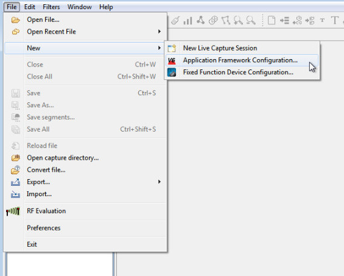

Simplicity Studio AppBuilder 支持多种不同的栈配置。创建新设备配置时，Simplicity Studio AppBuilder 会询问您希望使用哪个栈。有关此内容的更多信息，请参阅 [Simplicity Studio AppBuilder 首选项]()。


**保存设备配置**

您可以将设备配置保存为 Simplicity Studio AppBuilder 的本地 \.isc 文件格式。要将设备配置保存为 \.isc 文件，请选择 **File | Save...**

要打开现有的设备配置，请选择 **File | Open File...**

**保存时自动生成**

当您将配置到 \.isc 文件时，Simplicity Studio AppBuilder 可以自动生成配置文件。要使用此选项，请在设备配置编辑器的右下角中选中 **Auto-generate upon save** 复选框。

## **General Application Configuration Tab**

**General Application Configuration** 选项卡允许您为应用程序配置全局值，如 **Device Name** 和 **Generation Directory**。


**设备名称**

设备名称用于标识您的应用程序，并将成为任何生成文件的前缀以及生成文件的文件夹名称。

**生成文件的目录**

默认情况下，单击 “Generate” 按钮时，所有文件都将生成到栈安装位置下的子目录中。生成文件的目录显示生成位置的根。这些文件生成到 **\(root\)/app/builder/\(application name\)** 目录中。

您可以选择更改默认生成位置，但不建议这样做，因为将生成位置从栈安装目录移开可能会导致编译错误。

**描述**

应用程序描述保存在项目的 \.isc 文件中供您使用。它对应用程序或其生成没有任何影响。

**网络配置**

您可以在网络配置区域中配置应用程序将使用的网络数。应用程序只能是单个网络上的协调器或路由器（always on），因此如果您配置了多个网络，则必须确保只将单个网络配置成 “always on” 类型的网络。

要添加网络，只需单击 “New” 按钮即可。新的网络将显示在表中，然后您可以为网络提供您自己引用的名称和类型。当在 **General Application** 选项卡上创建并命名网络时，其会在相关的 stack 选项卡上被配置。例如，如果您创建两个 ZigBee Pro 网络，则必须在 **Znet stack** 选项卡上配置它们，以确保其中只有一个是 “always on” 类型的网络。

## **ZCL Global Configuration Tab**

您可以在 **ZCL Global Configuration** 选项卡中配置设备的所有 ZigBee 设备级配置元素。

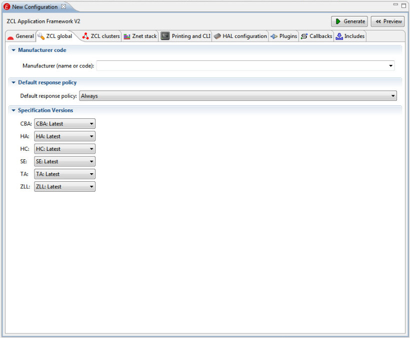

**制造商码**

制造商码用于标识您的设备，并存储在应用程序头文件中。

**默认响应策略**

默认响应策略定义应用程序将如何请求对传出消息的默认响应。

**Always**

设备将始终期望对所有传出消息进行默认响应。

**Conditional**

设备将对所有消息请求默认响应，除非在配置文件 xml 描述中指示不这样做。

**Never**

设备永远不会要求对它发送的任何消息进行默认响应。因此，对于所有发送的消息，“enable default response” 位将被设置为 “false”。

**规范版本**

规范版本区域允许您配置应用程序将针对的特定规范版本。所选规范版本中不支持的任何功能都将从您的应用程序和应用程序配置选项中删除。

## **ZCL Cluster Configuration Tab**

每个设备配置编辑器都包含一个 **ZCL Cluster Configuration** 选项卡。此选项卡允许您选择要包含在 ZigBee 设备中的特定簇组合。

有关 ZigBee 簇和 ZigBee 簇库的更多信息，请参阅文档 120-3029-000，**Application Development Fundamentals**。

**多端点配置表**

多端点配置表允许您配置设备上的端点。

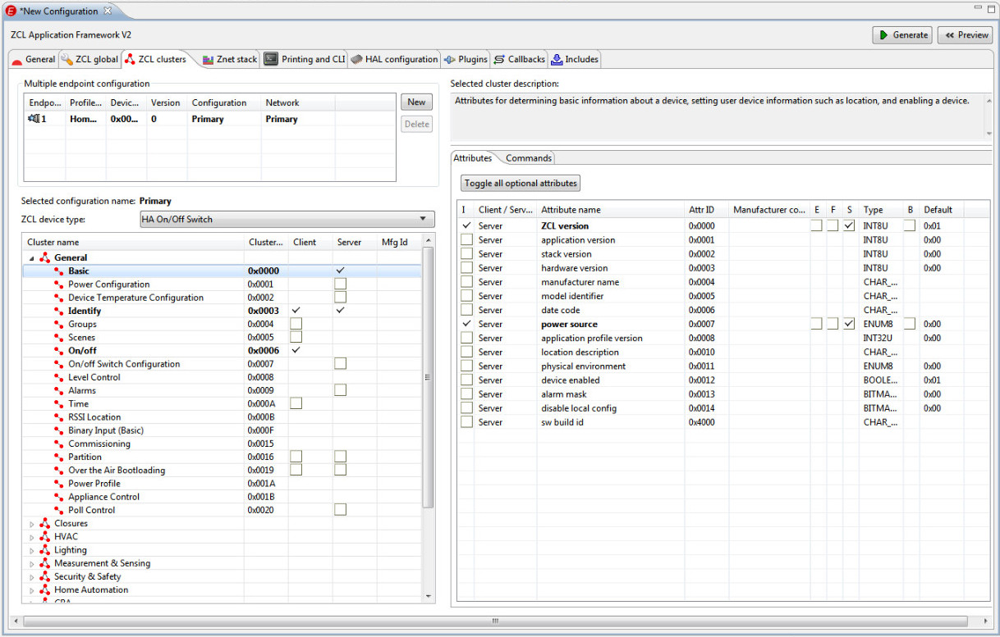

默认情况下，新设备配置仅包含单个端点。如果您希望在 “Primary” 端点之外包含多个端点，则必须通过单击 **New** 将它们添加到多端点配置表中。

**端点号**

您可以通过单击 “Endpoint” 列中的数字来更改端点（托管在设备上）。当单击端点号时，号字段将变为可编辑，您可以将端点更改为可供您使用的任何有效 ZigBee 端点。

**端点类型**

每个端点实现特定的端点类型。端点类型不是一个 ZigBee 的概念。它是为 Simplicity Studio AppBuilder 创建的名称，以便实现相同应用程序的多个端点可以共享与该应用程序关联的元数据。这节省了在设备内闪存的使用。

默认情况下，每个新端点将实现名为 “Primary” 的端点类型。

您可以通过选择端点行然后单击 “Configuration” 列来更改端点类型。按钮显示在配置名称的右侧。单击按钮以打开端点类型的对话框。

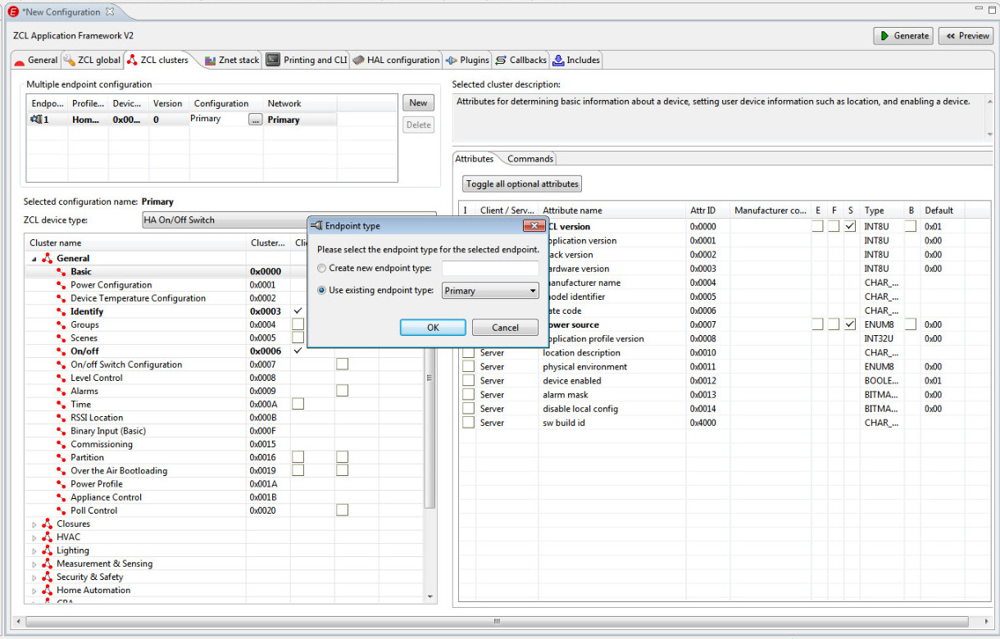

一旦创建了新的端点类型，就可以在任意数量的端点上实现该类型的应用程序，而无需在设备上使用任何更多的内存来进行元数据存储。每个端点仍需要拥有自己的属性存储来包含端点特定的值。Simplicity Studio AppBuilder 和应用框架为您解决了这个问题。

**网络**

从 EmberZNet PRO 4.7 开始，一些平台支持同时在多个网络上操作的能力。EmberZnet PRO 4.7 将这种多网络功能限制为两个网络，但其将来会扩展。在这些平台上，每个端点都属于一个特定的网络。多个端点可以属于同一网络，但每个端点只属于一个网络。

默认情况下，第一个端点将属于名为 “Primary” 的网络。当创建新端点时，它们将属于与第一个端点相同的网络。

在支持此特性的平台上，您可以通过选择要用于特定端点的网络来更改每个端点的网络。

可以在 “General” 选项卡的网络配置区域中创建和配置新网络。根据所创建的网络类型，在 stack 选项卡上配置网络。例如，如果您创建了 ZigBee Pro 网络，则可以在 **Znet Stack** 选项卡上进行配置。

**生成的设备类型下拉列表**

**Generated device type** 下拉菜单允许您从一组预定义的 ZCL 设备类型中进行选择。当您选择特定的 ZCL 设备类型时，Simplicity Studio AppBuilder 会使用 ZigBee 簇库规范定义的合适设备类型的簇来填充簇表。

除了这些预定义的设备类型外，您还可以选择创建自定义设备类型。使用此选项，您可以选择 Ember 应用框架内包含的任何可用 ZigBee 簇。

**簇表**

簇表显示哪些簇将被包含以作为每个端点类型的一部分。对于在任何端点上实现的自定义设备，您可以选择要包含的簇及其 客户端/服务端 角色。

**属性表**

属性表位于簇表的右侧。单击特定簇时，其属性将显示在属性表中。您可以通过配置此表中的属性来配置设备的行为。

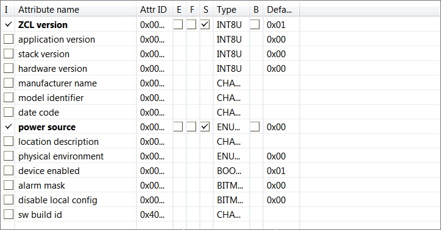

**外部属性存储**

默认情况下，所有属性都存储在应用框架提供的 RAM 缓冲区中。然而，存储某些属性可能没有意义，因为它们要么已经存储在系统中的其他位置，要么根本不存储，而是从某些外部硬件读取。在这种情况下，您可以指示该属性是外部存储的。当应用框架需要与属性交互时，它将使用外部属性回调，例如 **emberAfExternalAttributeWriteCallback** 或 **emberAfExternalAttributeReadCallback**。通过实现这些回调并将属性标记为外部存储，属性存储将从框架中移除并放到应用程序的域中。用于表示网络上属性的元数据仍然存储在框架内，以便框架可以响应 ZDO 请求等。

**持久化属性存储**

如上所述，默认情况下，所有属性都存储在 RAM 中。因此，属性数据在设备重启后将不存在。如果想在重启后维持属性的状态，则必须将该属性存储在设备的持久化内存中。要在持久化内存中存储特定属性，请选中 F 列中的复选框。

**单件属性存储**

大多数属性都作为一个单独的值存储在实现它们的每个端点上。这对于某些属性没有意义，因为其可能存在于端点之间。例如，存储 Basic Cluster 的 ZCL 版本的多个副本没有多大意义，因为该版本属于整个应用程序而不是每个单独的端点。通过指示属性是 “单件（singleton）”，可以跨端点共享属性值。

**限定属性的最小值和最大值**

默认情况下，Ember 应用框架允许您将任何值（在属性大小的限制范围内）写入属性表。然而，您可以请求应用框架拒绝 ZigBee 规范定义的最小值和最大值之外的任何属性值。通过选择属性表上的 B 列中的复选框。然后，应用框架将所选属性的最小值和最大值存储在属性表中，并拒绝任何来自 CLI 或外部设备的写入请求（该请求的属性值在范围之外）。

## **Stack Configuration Tab**


**Stack Configuration** 选项卡允许您为设备配置所有栈特定的设置。此选项卡下包括：
* Network configuration
* Security
* Radio configuration
* ZDO settings
* Other settings

要展开和折叠此选项卡下的部分，请单击每个部分标题左侧的箭头。

**网络配置**

此处配置了网络的 ZigBee 设备类型和安全配置文件。从 EmberZNet PRO 4.7 开始，一些平台支持同时在多个网络上操作的能力。EmberZNet PRO 4.7 版本将这种多网络行为限制在两个网络中，但这将在未来扩展。在这些平台上，可以按网络配置 ZigBee 设备类型和安全配置文件。

**ZigBee 设备类型**

* Coordinator or Router
* Router
* End Device
* Mobile End Device
* Sleepy End Device

**安全类型**

选择您希望用于网络的安全配置。本部分允许您根据 HA 或 SE 安全标准为设备选择预配置的安全设置。您还可以选择为网络设置自定义安全。

**No Security**

关闭设备的安全。这意味着设备不会使用网络或链路层安全。

**Home Automation Security**

在设备上打开 ZigBee HA 规范定义的家庭自动化安全。

**Smart Energy Security (Full)**

打开 ZigBee SE 规范定义的（完整的）SE 安全。此安全要求您设置在网络上运行的预定义链路密钥。网络的协调器需要为每个设备设置单独的链路密钥。

**Smart Energy Security (Test)**

打开 SE 安全的测试版本。此设置应仅用于开发。在这种情况下，协调器为每个设备使用一个众所周知的全局默认链路密钥。

**Custom Security**

在 EmberZNet PRO 4.7 之前，设备能够在 Simplicity Studio AppBuilder 中配置自定义安全。

**链路和网络密钥**

允许您为设备设置自定义网络和链路密钥。如果设备是协调器，您可以为网络设置网络和链路密钥。如果设备是路由器或终端设备，您可以设置网络中使用的链路密钥。

**网络密钥切换**

为了增加安全性，您可以配置 ZigBee 信任中心定期或手动更改网络上使用的网络密钥。为此，请选中 “Enable network key switch” 复选框。然后通过使用复选框右侧的下拉菜单配置密钥切换机制。

应用框架提供了两种切换策略，即随机（Random）和来回（Ping-Pong）。如果选择来回方法，则协调器会定期在两个预配置网络密钥之间（在安全设置中提供的）切换要使用的网络密钥。

**安全**

**ECC 库路径**

如果您在 Ember SoC 上使用带有 ECC 的智慧能源安全，则必须提供要包含在二进制映像中的 ECC 库的路径。

**无线电配置**

在 EmberZNet PRO 4.7 之前，您可以选择设备的信道和功率设置。从 4.7 开始，这些选项在其插件中设置。

从 EmberZNet PRO 4.6 开始，您可以为您的设备选择电源模式。

**ZDO 设置**

在此处为您的应用程序选择 ZDO 设置。

**Inter-PAN 设置**

在 EmberZNet PRO 4.5 之前，您可以在此处为您的应用选择 inter-PAN 设置。从 4.5 开始，这些选项在其插件中设置。

**其他设置**

本部分包括启用绑定、启用接收统计信息、启用终端设备绑定的属性。

**启用绑定**

使用此设置允许您的设备维护与网络中其他设备的绑定。有关栈绑定的更多信息，请参阅文档 120-3029-000，**Application Development Fundamentals**。

**地址表大小**

从 EmberZNet PRO 4.3 开始，您可以在此处为您的应用程序设置地址表大小和信任中心缓存大小。

**启用终端设备绑定**

打开协调器的终端设备绑定。

**启用接收统计**

打开应用程序中接收统计信息的记录。接收统计信息包括：＃传入消息处理程序中收到的包，＃传递给 ZCL 处理的包，＃由于长度错误而丢弃的包。可以使用命令行上的 “stats” 命令访问这些统计信息。

**使用分片**

在 EmberZNet PRO 4.6 之前，您可以打开对分片消息的传输和接收的支持。分片消息是超过最大消息大小的消息，由 Ember 栈分解和重装。必须在应用程序上分配缓冲区才能接收该消息。您还可以设置此缓冲区的最大消息大小。从 4.6 开始，这些选项在其插件中设置。

**集中器支持**

在 EmberZNet PRO 4.7 之前，您可以打开与源路由相关的代码并跟踪源路由。如果此设备是集中器，它将定期发送多对一路由请求，以便它可以记录将与其通信的设备的路由。当您打开集中器支持时，您还可以选择设备的集中器类型 - 低 RAM 或高 RAM 集中器。从 4.7 开始，这些选项在其插件中设置。有关源路由和数据聚合的更多信息，请参阅文档 120-3029-000，**Application Development Fundamentals**。

## **Printing and Command Line Configuration Tab**

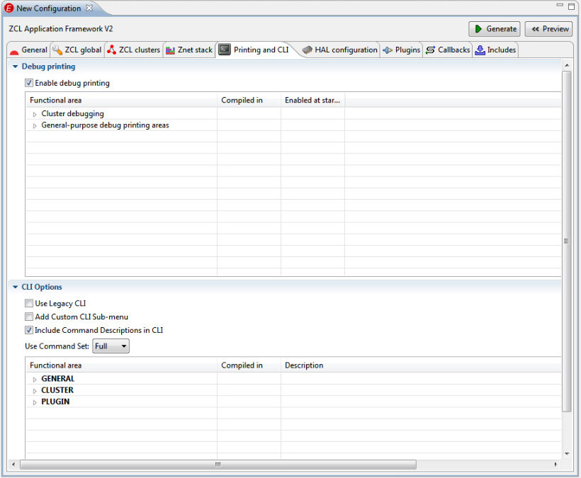

**调试打印**

Ember 应用框架可以通过串行端口输出应用程序和栈调试信息。要选择要包含在调试输出中的信息，请从串行打印复选框中进行选择。

如果您不关心调试输出，和/或 更希望节省与调试相关的闪存和 RAM，请通过取消选择来关闭串行打印选项。

**命令行接口（CLI）选项**

Simplicity Studio AppBuilder 能够输出到 “Legacy” 或 “Generated” 命令行接口。

**使用 Legacy CLI**

选中此复选框后，Simplicity Studio AppBuilder 将恢复使用应用框架中包含的硬编码 CLI 接口。如果未选中，AppBuilder 将根据 CLI 配置窗口中选择的 CLI 接口选项生成命令行接口以及其他生成的文件。

**添加自定义 CLI 子菜单**

添加将用户定义的 CLI 命令包含在命令行接口中的能力。

**在 CLI 中包含命令描述**

在命令行接口中包含每个命令的说明。启用此选项将增加应用程序的大小，但将可以更容易地使用命令行接口，因为当应用程序无法识别命令时，将自我描述所有命令。

**使用命令集**

使您能够打开和关闭命令行接口，并选择在应用程序中使用的 CLI 的预定义子集。

**CLI 配置窗口**

CLI 配置窗口允许用户准确选择应用程序中支持的 CLI 命令。默认情况下，完整的命令行接口命令集选择所有常规命令和在应用程序中包含的簇和插件所支持的所有簇和插件命令。

## **HAL Configuration**

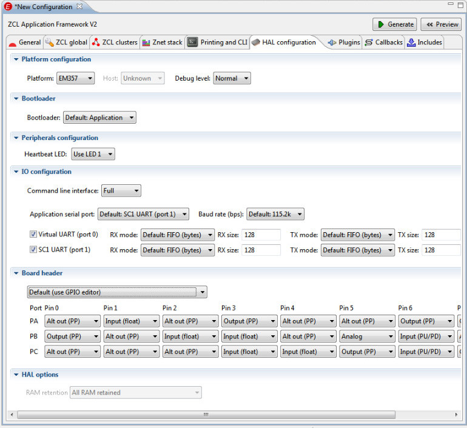

**HAL configuration** 选项卡允许您为设备配置特定于硬件的选项。您需要确保您创建的二进制映像不仅可用作 ZigBee 设备，还可用于您自己的硬件。硬件配置过程可能有点令人困惑。HAL 选项卡可以解决这个问题，其提供许多最常用的设置作为默认设置。

> Note：Board Header 文件中有许多选项可以根据您的板需求以不同方式配置 GPIO。Silicon Labs 建议您查看生成的 **xxx\_board.h** 文件，并根据目标硬件的需要进行更改。

HAL 选项卡提供以下选项：
* Platform configuration
* Peripherals configuration
* IO configuration
* GPIO register configuration

要展开和折叠每个选项的部分，请单击每个部分标题左侧的箭头。

**平台配置**

指定二进制映像将加载到的芯片类型，以及将加载它的库。

**平台**

输入要为其构建二进制映像的 Ember 芯片类型。

**Bootloader**

如果您希望将 bootloader 与二进制映像一起包含在芯片上，请选择要使用的 bootloader 类型。如果您不需要在芯片上使用 bootloader，请选择 **None**。

**调试级别**

EmberZNet PRO 栈包括多个级别的调试。栈中包含的调试越多，栈就越大。

在开发过程中，您可能希望包含完整的调试，然后在应用程序准备好部署后降低级别。

**外设配置**

**心跳 LED**

此配置选项允许您设置或禁用应用程序的心跳执行。心跳是应用程序正在运行的周期性指示，可用于调试目的。

**第一个应用程序按钮**

此配置选项允许您设置或禁用与应用框架中定义的第一个应用程序全局关联的开发板按钮。目前，应用框架有两个众所周知的应用程序按钮值，第一个和第二个应用程序按钮。如果您希望将板的按钮用于其他目的，可以在此处禁用它们并在您的应用程序中随意使用它们。

**第二个应用程序按钮**

> PS：基本同上

**IO 配置**

使用 IO 配置部分配置您将在您选择的 Ember 芯片上使用的输入和输出。

如果您使用的是像 EM260 这样的 NCP，则此部分将显示为灰色，因为您的应用程序无需为该芯片定义 IO 配置。

**应用程序串行端口**

指定应用程序将从 **emberSerialPrintf()** 和所有应用框架打印（如 **emberAfCorePrintln()**）输出数据的串行端口和波特率。

命令行接口下拉菜单允许您配置将包含在应用程序中的 CLI 类型。有三种不同类型的 CLI：Full，Minimal 和 Tiny。
* Full CLI 提供了通过应用程序配置启用的一个完整 CLI 命令集。此选项对用户最友好，但占用的应用程序空间最大。
* Minimal CLI 提供了 Full CLI 中可用的常用 CLI 命令子集，以节省 CONST 和 RAM。
* Tiny CLI 提供了一个特殊的单字符命令集，用于在 PanId 0x00ab 的预定信道 11 上形成和设置网络。这可用于测试内存高度受限的设备。

有关应用框架 CLI 的文档包含在文档 120-3023-0000，**Application Framework API Reference Guide** 中。

**虚拟 UART 端口 0 模式**

在端口 0 上启用 UART，并为其配置 RX 和 TX 队列大小。对于 FIFO 缓冲区，队列大小是为缓冲区分配的字节数。对于消息缓冲，它是分配给缓冲区的消息数。此端口也可以标记为未使用，以便节省为其缓冲区分配的 RAM。

**SC1 UART 端口 1 模式**

在端口 1 上启用 UART，并为其配置 RX 和 TX 队列大小。对于 FIFO 缓冲区，队列大小是为缓冲区分配的字节数。对于消息缓冲，它是分配给缓冲区的消息数。此端口也可以标记为未使用，以便节省为其缓冲区分配的 RAM。

**GPIO 寄存器配置**

使用交互式界面设置用于配置设备的 GPIO 位掩码。

如果您使用的是 EM250，您将看到两个选项卡，它们提供两种不同的方式来配置相同的信息。第一个选项卡提供友好的界面，而第二个选项卡为用户提供了更高级的界面，用户可以手动编辑 GPIO 位掩码。

如果您使用的是 EM35x 系列芯片，则提供一组简单的下拉式菜单。这些允许您为每个引脚和每个端口设置值。默认情况下提供 Ember 35x 开发板的设置。在更改任何这些设置之前，请参考 35x 数据表，因为必须考虑它们之间的复杂关系。

有关您选择的 Ember 芯片的 GPIO 设置的更多信息，请通过 Silicon Labs 网站的 ZigBee 部分获取您的芯片的数据表，网址为 http://www.silabs.com/zigbee 。

## **Plugin Configuration Tab**


应用框架允许您包含或排除插件。插件是 Silicon Labs 创建的簇或某些其他功能的特定实现，可能对您的应用程序有用。

如果应用程序中包含了一个插件，那么它将使用它所关心的回调接口。插件使用的回调将在回调名称的左侧有一个小插件图标。插件使用的回调对于应用程序是不可用的。因此，如果您使用一个插件，则必须接受其对回调的使用。

**插件表**

**Plugin** 选项卡右侧的插件表显示了可用于您的应用程序的所有插件。

默认情况下，许多插件都已打开。如果您希望实现自己的功能，可以取消选择插件并在 **Callbacks** 选项卡中选择相关的回调。

**插件选项**

许多插件都包含可配置选项。您可以通过从 **Plugin** 选项卡右侧的选项菜单中进行选择来为插件选择默认值。

**插件源文件**

每个插件的源文件位于 Ember 应用框架下的 **\<stack install loc\>/app/framework/plugin/\<plugin name\>** 中。被包含的源文件在插件信息区域中列出。

**实现的回调**

每个插件所使用的回调都列在信息区域的 “Implemented callbacks” 中。如上所述，由插件实现的回调对于应用程序是不可用的。如果您希望实现其中的一个回调，则必须取消选择该插件并在应用程序中实现该功能。

## **Callback Configuration Tab**

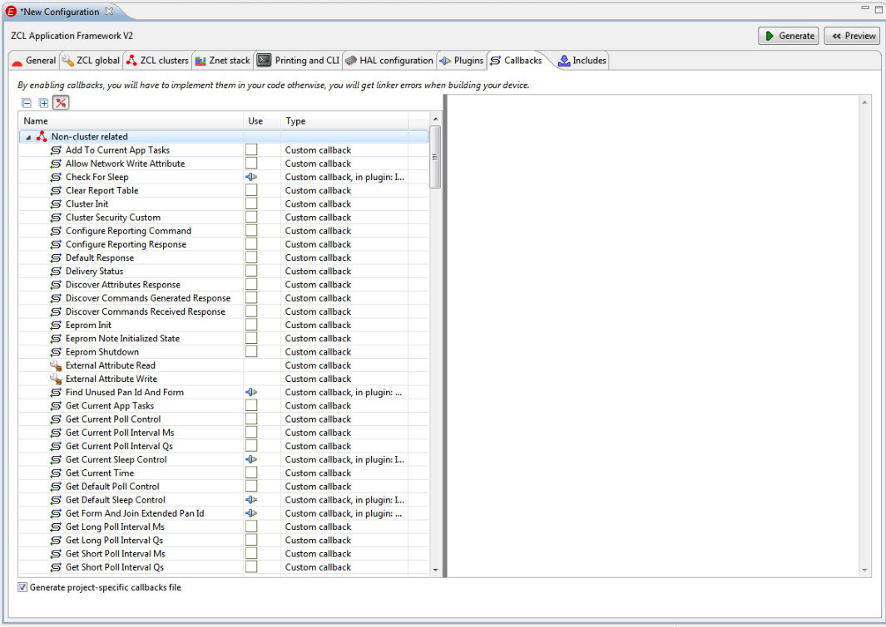

应用框架为您提供了为预定义回调集实现处理程序的选项。回调接口在代码和应用框架之间提供了清晰的分离。

每个回调都记录在回调原型顶部的注释中。

**回调分组**

回调被分组到 **Callbacks** 选项卡中的逻辑部分，以便于导航。所有自定义应用框架回调都包含在 “Non-cluster related” 部分中。所有其他回调都按簇分组，通常用于簇命令处理。

**簇回调**

许多簇特定的回调用于命令处理。当命令进入时，它将被传递给簇特定的回调以进行处理。如果回调返回 TRUE，则不会调用该命令的内部处理程序。包含默认 Ember 实现的命令标有加号（+），表示应用框架关注该特定命令，并将处理它和返回必要的默认响应。与簇相关的回调也仅针对应用程序中包含的客户端和服务端簇实现。如果未包含簇，则不期望应用程序解析该簇的命令。应用框架返回 **UNSUPPORTED\_COMMAND** 的默认响应。

**回调生成**

第一次从 Simplicity Studio AppBuilder 生成应用程序时，它会自动生成一个名为 **\<appname\>\_callbacks.c** 的 **callbacks.c** 文件。

当您将来重新生成文件时，Simplicity Studio AppBuilder 会通过询问您是否要覆盖它来保护生成的回调文件不会被覆盖。默认情况下，Simplicity Studio AppBuilder 不会覆盖任何以前创建的回调文件。如果您选择覆盖该文件，Simplicity Studio AppBuilder 会将以前的版本备份到文件 **\<appname\>\_callbacks.bak**。

## **ZCL Include Configuration Tab**

**Include Configuration** 选项卡使用户有机会将任何外部文件包含到生成的项目中。

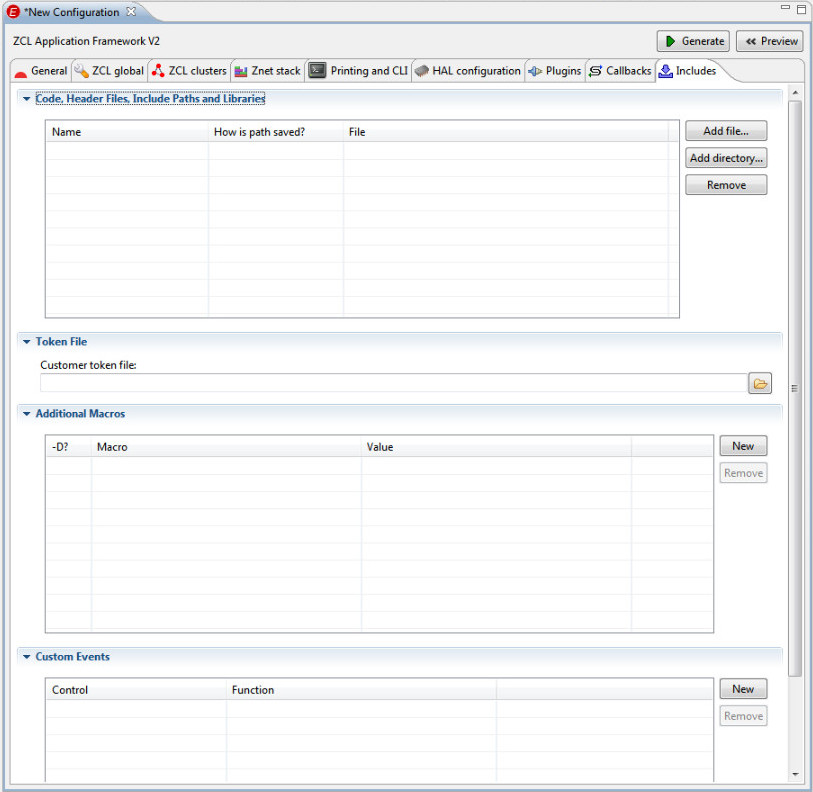

**文件包含**

从 Simplicity Studio AppBuilder 生成项目文件时，通常需要修改项目以将自己的源文件包含到应用程序映像中。如果需要重新生成项目文件，则会出现问题，因为新生成的项目文件将覆盖旧文件，从而删除已包含的任何文件。

您希望与应用程序一起编译的任何文件都可以包含在文件包含表中。要包含新文件，请单击 “New” 按钮。此按钮可打开文件选择器对话框。导航到要包含的文件的位置，然后单击 OK。该文件将包含在生成的项目文件中，并具有到文件位置的绝对路径。

**令牌文件**

为了在令牌中实现属性，Ember 应用框架将其自己的令牌文件放到生成项目文件内生成的 **APPLICATION\_TOKEN\_HEADER** #define 中。

应用框架的令牌头文件，位于 **app/framework/util/tokens.h** 中，包含一个位置，您可以在其中放置一个相对路径到您自己的令牌头文件。令牌头文件与位于链顶的应用框架的令牌头彼此链接。要在应用程序中包含您自己的令牌头文件，请在令牌文件文本框中提供相对于 **app/framework/util** 的路径。

**额外的宏**

应用框架和栈的大部分配置都是使用 API 中记录的宏来完成的。此处应提供您希望为编译时或运行时定义的任何其他宏。

编译时宏应包含 “-D” 选项。这些宏将包含在生成的项目文件的编译器和链接器定义部分中。任何不包含 “-D” 选项的宏都将包含在生成的应用程序头文件中。

**自定义事件**

您可以将自定义应用程序事件包含到应用框架的事件系统中。这些事件的运行方式与应用框架自身的事件以及簇插件实现的所有簇事件的运行方式相同。

要包含自定义事件，请单击 “New” 按钮。您的自定义事件将自动包含在生成的 **endpoint_configuration.c** 文件的事件配置部分中。事件函数和事件控制的存根将生成到 **callbacks.c** 文件中。您还可以将生成的事件控制值和函数的名称更改为您想要的任何值。

有关事件如何工作的更多信息，请参阅文档 120-3028-000，**Application Framework Developer Guide**，该文档随栈安装文档以及 Silicon Labs 网站提供。

--------------------------------------------------------------------------------

# **保存设备配置**

一旦您创建了一个设备配置，您可以通过选择在任何时候保存它：

**File | Save...** 

**.isc** 文件格式是 AppBuilder 的本地格式。您为配置选择的所有设置都保存到此文件中，并在将来打开 AppBuilder 中的文件时加载。

要打开以前保存的 **.isc** 文件，请选择：

**File | Open...**

--------------------------------------------------------------------------------

# **预览设备构建文件**

Simplicity Studio AppBuilder 配备了一个名为预览窗口（Preview Pane）的工具。打开预览窗口时，对输出文件的任何更改都会以黄色突出显示。此突出显示对于检查您的设置是否反映在最终生成的用于构建应用程序的配置文件中非常有用。预览窗口对于帮助您了解应用框架的内部结构以及常规的 ZigBee 非常有用。


--------------------------------------------------------------------------------

# **生成设备构建文件**

在 ZCL、Stack、HAL、Plugins、Callback 和 Includes 选项卡中完成设备配置后，您就可以生成设备构建文件。只需单击 **Generate** 按钮即可完成此操作。

**生成目录**

生成目录需要与栈目录相同。这是因为生成的项目文件希望在特定位置找到包含的栈库和框架文件相对于它们自己的位置。因此，虽然 Simplicity Studio AppBuilder 允许您指示生成文件的位置，但您无法在任何您喜欢的地方生成文件，并无法保证项目文件将正确编译。

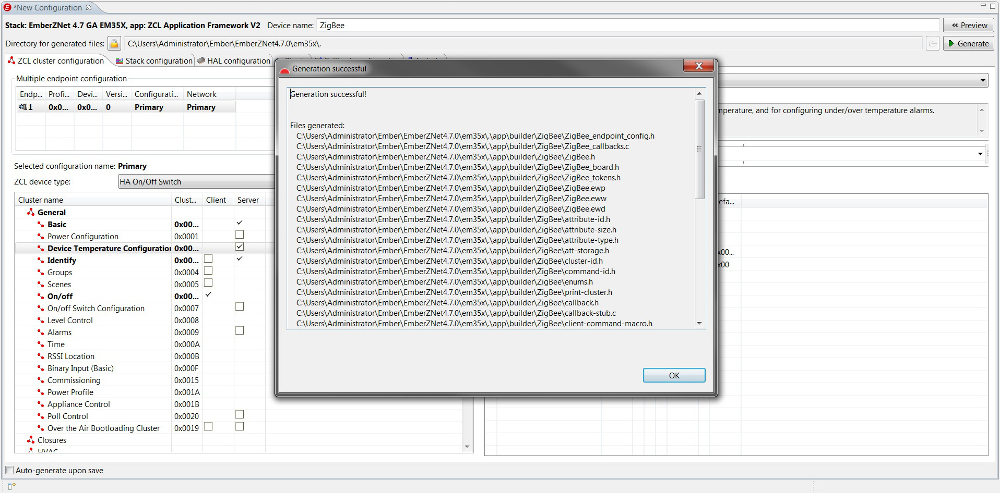

**Simplicity Studio AppBuilder 生成的文件**

当您单击 **Generate** 按钮时，Simplicity Studio AppBuilder 会生成设备配置文件，其中一些在此表中描述。这些文件在构建时配置 Ember 应用框架，以便在编译的二进制图像中包含相应的代码和设置。

| File Name | Generation Directory | Description |
| :-------- | :------------------- | :---------- |
| \<device name\>.h | \<generation directory\>/app/builder/\<device name\>/ | Application configuration header file. This is the main applicationconfiguration header file for your device. This file includes allof the #defines required to configure your device. |
| \<device name\>\_endpoint\_config.h | \<generation directory\>/app/builder/\<device name\>/ | Endpoint configuration header file. This file specifies the structure ofthe attribute metadata and value storage table. This file essentiallymakes multiple endpoints possible by constructing the attribute table insuch a way as to limit the amount of flash used. |
| \<device name\>\_callbacks.c | \<generation directory\>/app/builder/\<device name\>/ | This is the only .c file created by Simplicity Studio AppBuilder. It is only created in the casewhere you want Simplicity Studio AppBuilder to create a stub file for handling callbacks you haveactivated in the callbacks tab. |
| \<device name\>\_board.h | \<generation directory\>/app/builder/\<device name\>/ | This is the board header file for your device. This file includes allthe #defines required to configurethe hardware abstraction layer to work with your device. |
| \<device name\>\_tokens.h | \<generation directory\>/app/builder/\<device name\>/\<device name\>\_tokens.h | This is a token header file used to configure storing data intokens (SIMEEPROM). If you have chosen to have any attributes persistacross reboots, the configuration data for these settings arestored in this file. |

--------------------------------------------------------------------------------

# **建立二进制映像**

通过单击 **Generate** 按钮生成构建和配置文件后，即可构建二进制映像。Simplicity Studio AppBuilder 支持多种编译器，包括：

* IAR Embedded Workbench for the Cortex (EM35x, stm32f, stm32w)
* GCC ARM Embedded

您可以选择在 Simplicity Studio 中编译应用程序，方法是单击锤子图标以在工具栏中构建，或者在您选择的编译器中打开生成的项目文件并在那里构建。

--------------------------------------------------------------------------------

# **加载二进制映像**

创建二进制映像后，下一步是将其加载到您的设备上。Silicon Labs 提供了四种可用于此目的的工具：

* em2xx_load.exe
* EM2USBLoad.exe
* EM2ISALoad.exe
* em3xx_load.exe

您还可以使用 Simplicity Studio 将二进制映像加载到您的设备上。Simplicity Studio 使用代理的 2xx 和 3xx 系列工具在您的设备上加载映像。有关详细信息，请参阅 **Simplicity Studio User's guide** 和在线帮助。

有关使用四种工具之一将映像加载到设备上的信息，请参阅以下文档：

* em2xx_load.exe: 120_4020_000_2xx_Utilities_Guide.pdf - Used to load images onto 2xx devices connected to an EmberInSight Adapter from the command line. 
* EM2USBLoad.exe: 120_4022_000USB_Link_Users_Guide.pdf - Used to load images onto devices connected to an InSightUSBLink from the command line. Note: InSightUSB Link is legacy software. While it is stillmaintained and supported, it is not being activelydeveloped. It is highly recommended that customerswork with InSight Adapter or with one of our gangprogramming partners for improved reliability. 
* EM2ISALoad.exe: 120_4022_000USB_Link_Users_Guide.pdf - Used to load images onto devices connected to InSight Adapters. Thisprogram is similar to em2xx_load, but with the addedadvantage of being able to load over the Ethernet through an Ember Debug Adapteror over USB through a USBLink. 
* em3xx_load.exe: 120_4032_3xx_Utilities_Guide.pdf - Used to load images onto 35x devices connected to an EmberDebug Adapter (ISA3) from the command line. 

您可以通过 Silicon Labs 网站的 ZigBee 部分找到这些指南，网址为 http://www.silabs.com/zigbee 。

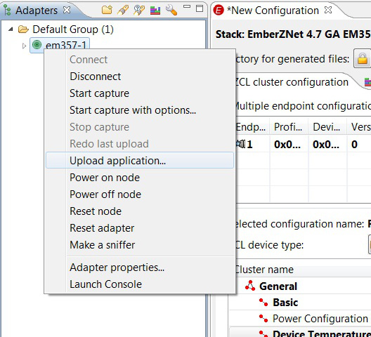

--------------------------------------------------------------------------------

# **自定义簇**

您可以将自己的自定义簇添加到任何（non-Demo）栈配置中，位于 **Simplicity Studio AppBuilder Preferences, File | Preferences | Simplicity Studio AppBuilder**。要添加自定义簇，必须在 xml 文件中描述簇，就像栈配置使用的那样。下面提供了一个示例的自定义 xml 描述文件。有关如何格式化 Simplicity Studio AppBuilder 的簇 xml 描述文件的更详细示例，请参阅位于所选栈的 **/tool/appbuilder** 目录中的文件 **ami.xml**。

> Note：应用框架期望所有属性和命令的簇 ID、属性 Id、命令 ID 和方向（客户端到服务端/服务端到客户端）是唯一的。

**示例的簇描述文件**

```xml
<?xml version="1.0"?>
<configurator> 
  <cluster>
    <name>Custom Cluster</name>
    <domain>Custom Domain</domain>
    <description>This cluster provides an example of
      how a custom cluster is created.</description>
    <code>0xfc00</code>
    <define>CUSTOM_CLUSTER</define>
    <client init="false" tick="true">true</client>
    <server init="false" tick="false">true</server>
    <attribute side="server" type="INT8U" code="0x0000"
      writable="true" default="0x1e" min="0x00" max="0xff"
      define="CUSTOM_ATTRIBUTE_1">custom attribute 1</attribute>
    <attribute side="server" type="INT8U" code="0x0001"
      writable="true" default="0x1e" min="0x00" max="0xff"
      define="CUSTOM_ATTRIBUTE_2">custom attribute 2</attribute>
    <command code="0x0" name="CustomCommand" source="server">
      <description>
        A custom command
      </description>
      <arg name="customArg1" type="INT8U"/>
      <arg name="customArg2" type="INT8U"/>
      <arg name="customArg3" type="INT8U"/>
    </command>
  </cluster>
  <!-- Custom Devices -->
  <deviceType>
    <name>Custom Device</name>
    <domain>Custom Domain</domain>
    <typeName>Custom type name</typeName>
    <zigbeeType editable="true">Coordinator</zigbeeType>
    <!-- Manufacturer specific application profiles start at 0xC000 -->
    <profileId editable="false">0xC000</profileId>
    <deviceId editable="false">0x0000</deviceId>
    <channels editable="false"><channel>11</channel><channel>14</channel>
    <channel>15</channel><channel>19</channel><channel>20</channel>
    <channel>24</channel><channel>25</channel></channels>
    <clusters lockOthers="true">
      <include client="false" server="true"
        clientLocked="true" serverLocked="true" >Basic</include>
      <include client="false" server="true" clientLocked="true"
        serverLocked="true" >Identify</include>
      <include client="false" server="true" clientLocked="true"
        serverLocked="true">Custom Cluster</include>
    </clusters> 
  </deviceType>
</configurator>
```

**安装自定义簇**

安装自定义簇数据涉及以下几个步骤：

1. 在自定义簇 xml 文件中描述您的簇，如上述提供的那样。
2. 选择要添加自定义簇的栈。注意，您无法将自定义簇添加到 Demo 栈配置文件中。
3. 选中 “Enable custom clusters” 复选框，打开所选栈配置的自定义簇。
4. 单击数据文件表右侧的 “New” 按钮，将自定义簇 xml 文件导入 Simplicity Studio AppBuilder。
5. 在 EmberZNet PRO 4.6 之前，通过单击 “Core AppFramework Data Files” 右下角的绿色箭头重新生成应用框架数据文件。注意，这一步往往被忽视，但非常重要。如果没有与自定义簇关联的正确生成的头文件，您的设备将无法编译。从 4.6 开始，此步骤不是必需的。

**配置文件信息**

在首选项对话框的底部是一个名为配置文件信息表的树形展示。此表显示所选栈版本支持的 ZigBee Cluster Library 功能的树视图。此视图不是交互式显示。它只是提供了一种查看所选栈的 ZCL 内部的便捷方式。

加载自定义栈信息后，您应该看到它包含在配置文件信息表中，如下所示。

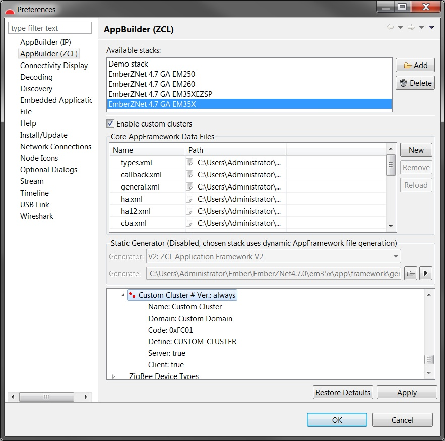

--------------------------------------------------------------------------------

# **设置 Simplicity Studio AppBuilder 首选项**

要为 Simplicity Studio AppBuilder 设置首选项，请选择 **File | Preferences | Network Applications**。

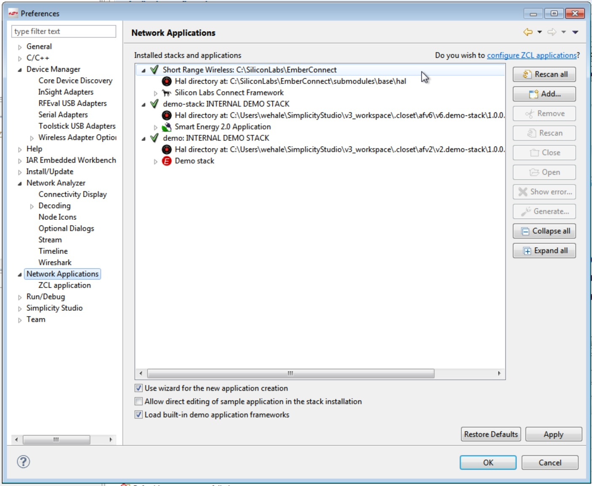

此首选项对话框允许您：

* 将新栈版本添加到 Simplicity Studio AppBuilder 已知的版本中
* 将自定义簇添加到已安装的任何栈版本
* 重新生成应用框架的生成代码
* 检查所选栈的 ZigBee 簇库的完整性

要使用 Simplicity Studio AppBuilder 生成工作应用程序，您必须拥有 EmberZNet PRO 栈的有效版本，并且必须使用 “Add Stack Version” 对话框识别 Simplicity Studio AppBuilder 的栈位置。创建配置后，其栈版本将被锁定。

> Note：您无法更改现有配置文件的栈版本。

如果您希望使用其他栈版本，则必须通过选择 **File | New** 来创建具有所选栈版本的新配置。

生成文件的默认路径位于所选栈的根目录。您可以在配置文件中更改此位置。

--------------------------------------------------------------------------------
