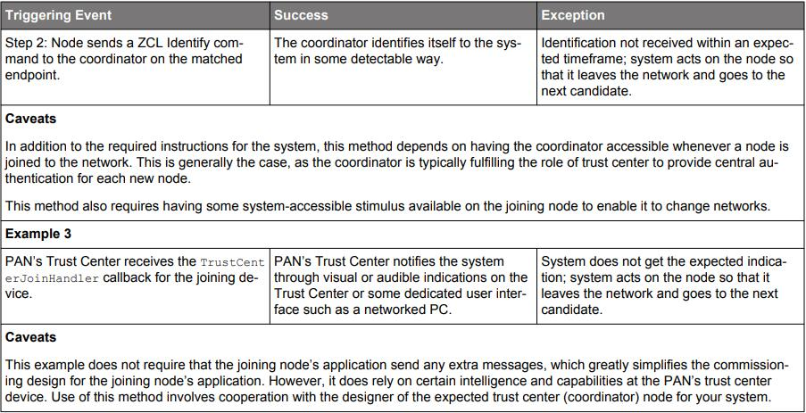
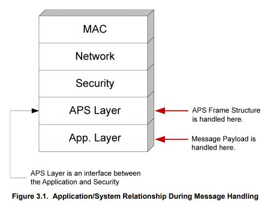
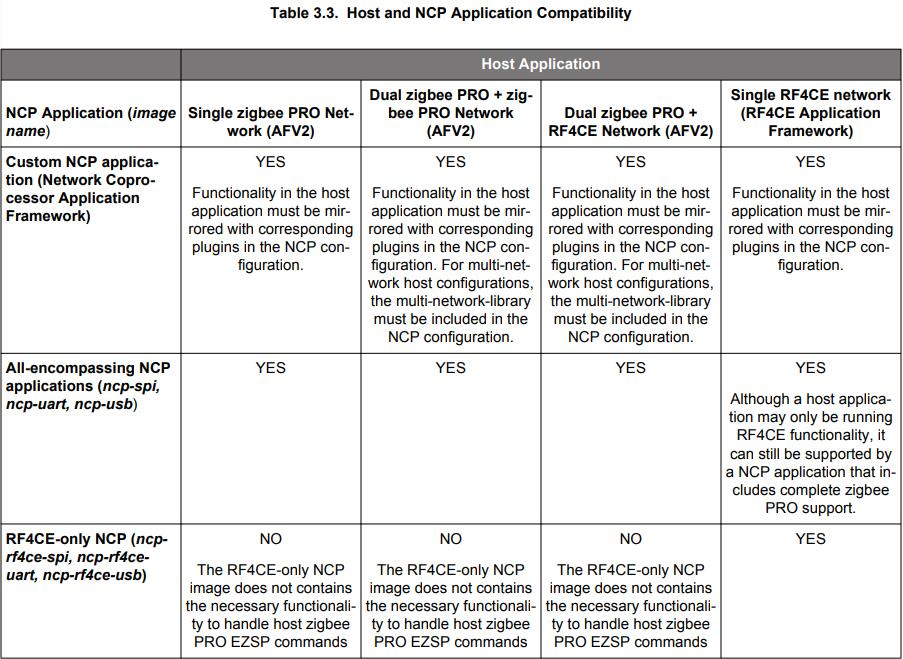

# **UG103.3：Application Development Fundamentals：Design Choices** <!-- omit in toc -->

本文档从如何构建无线网络解决方案的主要决策方面描述了应用程序设计过程。

Silicon Labs 的应用程序开发基础系列涵盖了项目经理，应用程序设计人员和开发人员在开始使用 Silicon Labs 芯片，EmberZNet PRO 或 Silicon Labs Bluetooth Smart 等网络栈以及相关开发工具的嵌入式网络解决方案之前应该了解的主题。这些文档可以作为任何需要介绍开发无线网络应用程序的人或者是 Silicon Labs 开发环境的新手的起点。

关键点：
* 使用哪个栈或应用框架？
* SoC 还是 NCP？
* Zigbee 设计选择

------------------------------------------------------------------------------------------------------------------------

- [**1. 背景**](#1-背景)
- [**2. 一般设计选择**](#2-一般设计选择)
    - [**2.1 你应该使用哪种无线协议**](#21-你应该使用哪种无线协议)
    - [**2.2 SoC 还是 NCP？**](#22-soc-还是-ncp)
        - [**2.2.1 SoC 方案**](#221-soc-方案)
        - [**2.2.2 带串行协议的 NCP 方案**](#222-带串行协议的-ncp-方案)
        - [**2.2.3 设计上的差异**](#223-设计上的差异)
- [**3. Zigbee 设计选择**](#3-zigbee-设计选择)
    - [**3.1 单网络与多网络对比**](#31-单网络与多网络对比)
        - [**3.1.1 协调器/路由器 网络 + 嗜睡终端设备网络**](#311-协调器路由器-网络--嗜睡终端设备网络)
        - [**3.1.2 多个嗜睡终端设备网络**](#312-多个嗜睡终端设备网络)
    - [**3.2 网络 发现/试运行**](#32-网络-发现试运行)
        - [**3.2.1 通过扩展 PAN ID 或信道掩码简化网络选择**](#321-通过扩展-pan-id-或信道掩码简化网络选择)
        - [**3.2.2 许可加入控制**](#322-许可加入控制)
        - [**3.2.3 避免在试运行过程中出现意外后果**](#323-避免在试运行过程中出现意外后果)
        - [**3.2.4 离开机制**](#324-离开机制)
    - [**3.3 设备发现和供给**](#33-设备发现和供给)
        - [**3.3.1 何时发现和供给**](#331-何时发现和供给)
        - [**3.3.2 识别和分组方法**](#332-识别和分组方法)
        - [**3.3.3 按钮方法**](#333-按钮方法)
        - [**3.3.4 匹配描述符请求方法**](#334-匹配描述符请求方法)
        - [**3.3.5 简单描述符请求方法**](#335-简单描述符请求方法)
        - [**3.3.6 供给工具方法**](#336-供给工具方法)
        - [**3.3.7 地址发现**](#337-地址发现)
    - [**3.4 路由建立**](#34-路由建立)
        - [**3.4.1 背景 - 多对一路由**](#341-背景---多对一路由)
        - [**3.4.2 它在 Zigbee PRO 中如何工作**](#342-它在-zigbee-pro-中如何工作)
    - [**3.5 消息传递**](#35-消息传递)
        - [**3.5.1 发送消息**](#351-发送消息)
        - [**3.5.2 接收消息**](#352-接收消息)
        - [**3.5.3 确认消息**](#353-确认消息)
    - [**3.6 NCP 和主机应用程序兼容性**](#36-ncp-和主机应用程序兼容性)
    - [**3.7 安全**](#37-安全)

------------------------------------------------------------------------------------------------------------------------

# **1. 背景**

Silicon Labs 正在开发满足客户需求的产品，因为我们正在进入一个家庭中设备一直连接的世界，通常被称为物联网（IoT）。在高层次上，Silicon Labs 物联网的目标是：
* 无论是 Zigbee PRO，Thread，Bluetooth Smart 还是其他新兴标准，都可以通过一流的网络连接家中的所有设备。
* 利用公司在节能微控制器方面的专业知识。
* 增强现有的低功耗、混合信号芯片。
* 实现云服务和与智能手机和平板电脑的连接，促进易用性和为客户提供通用的用户体验。

实现所有的这些目标将提高联网家庭中物联网设备的采用率和用户接受度。

随着应用程序设计人员可用选项的范围增加，早期设计选择的影响也会增加。本文档从如何构建无线网络解决方案的主要决策方面描述了应用程序设计过程。基本设计选择包括：
* 使用哪种 Silicon Labs 无线技术
* 是使用 SoC（片上系统）设计还是 NCP（网络协处理器）设计
* 如果使用 NCP 模型，如何选择兼容的 NCP 和主机应用程序

开发 Zigbee 解决方案时的设计选择包括：
* 如何创建网络（形成，加入或离开）
* 将使用哪些安全模型
* 在网络中采用哪种路由优化
* 如何通过网络传递消息

一旦考虑了这些选择，就可以开始实施系统设计了。

------------------------------------------------------------------------------------------------------------------------

# **2. 一般设计选择**

在开始使用 Silicon Labs 的无线微控制器进行无线设计之前，您应该首先考虑哪种可用的网络技术最适合您的项目。一旦确定了要用于设计的网络协议，请考虑您的产品最适合片上系统（SoC）范例或是网络协处理器（NCP）范例，对于 NCP，用于控制协处理器的串行通信是什么类型的。

## **2.1 你应该使用哪种无线协议**

Silicon Labs 提供以下用于 Wireless Gecko family 开发的栈：
* Silicon Labs Flex SDK，包括基于 IEEE 802.15.4 的 “Connect” 栈（在 **UG103.12：Application Development Fundamentals：Silicon Labs Connect** 中描述）以用于多跳 “星形” 网络拓扑，以及用于具有自定义 RF 配置的真正专有设计的无线电抽象接口库（RAIL）。
* EmberZNet，一个基于 Zigbee PRO 的网状网络栈，在 **UG103.2：Application Development Fundamentals：Zigbee** 中详细描述。
* Silicon Labs Thread，一个基于 Thread 1.1 的 IPv6 网状网络栈，在 **UG103.11：Application Development Fundamentals：Thread** 中详细描述。
* Silicon Labs Bluetooth SDK，一个 Bluetooth 2.3-based 的网络栈，在 **UG103.14：Application Development Fundamentals：Bluetooth Smart Technology** 中详细描述。

熟悉这些协议的详细信息后，您可以根据自身对标准合规性、网络拓扑、互操作性、频率范围和消息吞吐量的需求进行选择。

## **2.2 SoC 还是 NCP？**

无论您是否使用应用框架进行设计，选择 SoC（片上系统）模型或 NCP（串行网络协处理器）模型的设计范例都是一个关键问题。它规定了软件和硬件的要求和约束。这个选择决定了应用程序相对于核心栈功能所在的位置。在 SoC 模型中，整个系统（栈和应用程序）在一个单独的芯片上；而在 NCP 模型中，栈处理在一个单独的 “协处理器” 中完成，该协处理器通过外部串行接口与应用程序自身的微控制器交互。

下图说明了栈和应用程序的各种组件以及它们如何相对于 SoC 或 NCP 架构模型进行组织。

虽然不能轻易地在架构之间做出选择，但应用框架在某种程度上掩盖了差异，在必要时简化了从一个架构到另一个架构的更改，或支持不同产品的混合架构。

### **2.2.1 SoC 方案**

在 SoC 方案中，单个芯片（如 Wireless Gecko（EFR32™）产品组合中的一个 IC）提供了所有栈功能（包括集成 flash，RAM 和 RF 收发器）以及应用层组件（应用配置文件，簇，属性管理和栈交互）。栈功能是以预编译库文件的形式实现，然后您必须将其在最终构建过程中与您自己的应用程序相关的代码链接起来，以生成单片包含完整功能的无线应用程序所需的所有内容的二进制映像。应用框架虽然由 Silicon Labs 提供，但仍被视为应用层的一部分。

> Note：虽然 bootloader 通常用于已部署的无线网络设备，但 bootloader 固件并非此单片二进制映像的一部分。然而，Silicon Labs 确实提供了构建后（post-build）工具，可用于将应用程序固件和栈固件进一步组合到单个 HEX 记录文件中，以便于分发和制造。有关 EmberZNet PRO 应用程序的这些软件的实用程序的更多信息，请参阅文档 **UG107：EM3x Utilities Guide**，**UG162：Simplicity Commander Reference Guide** 和 **UG103.6：Application Development Fundamentals：Bootloading**。

在 SoC 开发方案中，应用程序（包括应用框架）与栈共存。应用程序调用栈库提供的 API（应用程序编程接口函数），并且栈触发应用程序代码实现的处理程序函数。当应用框架用于应用程序设计时，框架会处理调用这些 API 并实现必要的处理程序函数，然后将它们包含在更高级别的 API 和应用程序回调中，以简化设计过程并帮助确保协议合规性。

由于 SoC 模型仅需要单个芯片，因此与需要多个 IC 的 NCP 模型和传统设计架构相比，SoC 模型具有更低的功耗，更低的 BOM（物料清单）成本以及更小的可能布局。此外，当所有内容都驻留在单个芯片上时，可以实现与栈软件和无线电硬件的更紧密集成，从而允许更精确和及时地控制与栈活动相关的应用程序行为。

然而，一旦您致力于 SoC 模型，您就会受到该 SoC 系列中可用产品的约束。其中包括：
* Flash 和 RAM 存储约束
* 工具链约束，如需要为基于 Zigbee 和基于 Thread 的 SoC 使用 IAR Embedded Workbench
* HAL 约束，如某种类型的外围设备数量有限，或缺少可能与硬件设计不可或缺的专用外设
* 基于必须与栈共享 CPU 的时序约束，该栈具有自身的一组要求，以便维护 IEEE 802.15.4 和协议合规性

如果这些约束中的任何一个都对你有很大的阻碍，那么 NCP 模型可能是更具吸引力的替代方案。

### **2.2.2 带串行协议的 NCP 方案**

> Note：本节不适用于蓝牙 SoC 或 NCP 模型。有关更多信息，请参阅 **AN1042：Using the Silicon Labs Bluetooth® Stack in Network Co-Processor Mode** 和 **UG136：Silicon Labs Bluetooth® C Application Developer's Guide**。

在 NCP 方案中，带有集成 flash，RAM 和 RF 收发器的 Silicon Labs 芯片通过预加载的协处理器固件自行运行大多数的栈功能，并具有运行时可配置性，然后使用一个串行接口，如串行外设接口（SPI）或通用异步 接收/发送 器（UART）与第二个设备（称为 “主机” 处理器）通信，其中应用层功能与核心栈组件分开 “托管”。NCP 可能是一种特殊的集成电路，具有有限的 I/O 和简化的功能，目的是作为协处理器，或者它可能是一个功能齐全的微控制器，恰好将协处理器固件加载到其上，使其表现为 NCP。

为了方便应用程序主机和栈的 NCP 之间的通信，Silicon Labs 提供了两种串行命令集。第一种称为 EZSP（EmberZNet 串行协议），用于开发 Zigbee 解决方案（有关 EZSP 的更多信息，请参阅文档 **UG100：EZSP Reference Guide**）。第二种称为 Thread 管理串行协议（TMSP），用于开发 Thread 解决方案。Silicon Labs Flex SDK 中的 Silicon Labs Connect 栈也提供 NCP 解决方案，用于专有开发。

EZSP 可以在 SPI 上同步运行或在 UART 上异步运行（带或不带流量控制），其使用 EZSP 特定命令帧（有时可能与 EmberZNet 中基于 SoC 的对应部分略有不同）模拟 EmberZNet PRO API 并使用回调响应帧模拟 EmberZNet 相关的处理函数。Silicon Labs 提供了 EZSP 驱动程序源代码，将这些串行命令和响应抽象为一组 API 和处理函数，类似于 SoC 模型中使用的那些。当应用框架用于实现应用层时，它负责调用必要的 API 函数并实现所需的处理函数，从而允许设计人员专注于使用客户端 API 和框架回调进行更高级别的应用程序处理。

在 TMSP 协议中，也提供 SPI 和 UART 变体，主机端 API 不是与基于 SoC 的 Thread 应用程序使用的 API “相似” 的专用函数。相反，它们（由提供的 TMSP 驱动程序代码处理的主机端接口的抽象）实际上与基于 SoC 的系统上使用的 API 和回调相同。此外，TMSP 驱动程序包含一些功能以管理 NCP 上的底层 IP 层，以改善在 NCP 及其主机上共享的栈的上层之间的协调。

NCP 平台的主要优势在于其灵活性。主机处理器可以像 8 位微控制器一样简单，也可以像具有千兆字节的内存和 Windows 或 Linux 操作系统的 64 位计算机一样复杂。这意味着 NCP 设计非常适合在现有系统上添加或改造一个设备的场景，这样可以利用 OEM 在软件和硬件方面的专业知识和知识产权来加速设计周期和加快上市时间。NCP 方案的另一个优点是，与可用的 SoC 选项相比，主机可以为应用程序提供更多的资源（flash 和 RAM）和不同的外设集。这允许使用新特性开发更复杂的应用程序，并在应用程序中添加重要的新特性时保护应用程序不会超出 SoC 的限制。

通过将栈处理与应用程序解耦，可以在栈端安装修复程序和新特性，只需对 NCP 进行简单的固件更新，而无需对主机上的应用程序固件进行任何更改。这种解耦还消除了与栈共享处理器的 CPU 时序限制。由于 NCP 固件管理 NCP 的睡眠状态以最小化其活动和当前消耗，因此当应用程序具有不直接涉及栈的任务时，仅需要主机处理器处于活动状态。如果在没有无线电的情况下，当 CPU 处于活动状态时，主机处理器的有效电流消耗低于 SoC 的有效电流消耗，那么运行非网络应用任务时主机和 NCP 消耗的总电流实际上可能低于可比较的 SoC 场景。

NCP 方案的主要缺点是增加了第二个主机处理器，这增加了额外的成本和 PCB 空间，并可能影响设备的总体功耗。另一个权衡是解耦栈和应用程序处理意味着栈和应用程序之间的某些时间敏感的交互不再能够 “实时” 发生，而必须以通知的形式，以通知栈在事后做出决策。因此，主机应用程序在某些决策出现时确定其结果的机会变少。相反，在 NCP 上配置 “策略” 以指导这些情况下的栈行为。此外，由于 NCP 固件是 Silicon Labs 提供的预构建固件，因此应用程序设计人员会对栈的行为以及内部资源的分配失去一定程度的控制。

一旦您致力于使用 NCP 方案，您就必须决定使用哪个主机平台进行设计。该平台可能与原型和最终设计阶段不同，具体取决于材料的可用性和调试初始阶段所需的灵活性。在选择主机平台时，请考虑您在该平台上的现有专业知识、可用工具和资源，该平台的成本和功耗要求，以及可用于应用程序开发的内存量，包括未来增强所需的任何空间。在开发 Zigbee 解决方案时，还应考虑是否使用 UART 或 SPI 进行 EZSP 通信。EZSP-UART 需要一个更复杂的驱动程序，通常用于兼容 POSIX 标准的操作系统，其比 EZSP-SPI 驱动程序具有更复杂的逻辑和更大的内存占用，并且其支持的最大吞吐量不是很高。但是，EZSP-SPI 实现比 EZSP-UART 设计需要更多的接口引脚（用于 EZSP 的可移植操作系统接口（POSIX）的 SPI 驱动程序也是可用的，但在嵌入式 Linux 操作系统上的可移植性通常低于兼容 POSIX 标准的 UART 驱动程序）。由于并非所有微控制器或操作系统都支持 SPI，因此主机的架构限制可能决定了选择哪种设计。Thread 的 TMSP 对 SPI 和 UART 也有类似的权衡。有关设置 Thread 主机 SPI 驱动程序的更多讨论，请参见 **AN912：SPI Host Interfacing Guide for Thread**。

### **2.2.3 设计上的差异**

> Note：本节不适用于蓝牙 SoC 或 NCP 模型。有关更多信息，请参阅 **AN1042：Using the Silicon Labs Bluetooth® Stack in Network Co-Processor Mode** 和 **UG136：Silicon Labs Bluetooth® C Application Developer's Guide**。

下表按功能显示了 SoC 应用程序与基于 NCP 的主机应用程序之间的一些主要差异。

------------------------------------------------------------------------------------------------------------------------

# **3. Zigbee 设计选择**

尽管应用框架简化并抽象了设计过程，但无论设计是否基于应用框架，都必须将某些设计决策作为实现的一部分。在开发 Zigbee 协议的应用程序时，以下设计选择是适用的，包括 Zigbee PRO 和 Zigbee RF4CE：
* 单网络或多网络(Single Network or Multi-Network)
* 网络 发现/试运行 方法(Network Discovery/Commissioning Method)
* 设备发现和供给方法(Device Discovery and Provisioning Method)
* 路由建立方法(Route Establishment Method)
* 消息传递方法(Message Delivery Method)
* NCP 和主机应用程序兼容性(NCP and Host Application Compatibility)

## **3.1 单网络与多网络对比**

单个网络节点是一个形成或加入一个网络的节点，必须在形成或加入第二个网络之前离开该网络。EmberZNet PRO 4.7 引入了一个节点同时成为多个网络的一部分的可能性（EM351 不支持此特性）。

> Note：对于 EmberZNet PRO，多网络支持仅限于两个网络。将来可能会支持两个以上的网络。

到目前为止，任何设备都需要两个物理芯片才能成为两个网络的一部分。例如，设计为 HA（家庭自动化）PAN（个人区域网络）和 SE（智慧能源）PAN 之间的网关的设备将使用第一个芯片加入第一个网络，使用第二个芯片加入第二个网络。应用程序必须管理两个硬件，导致硬件和应用程序设计人员的工作复杂性增加。

多网络栈消除了逻辑 PAN 和物理芯片之间的 1 对 1 映射，将其扩展为 n 对 1 映射。具有单个芯片的设备的应用程序可以被设计为可能运行不同安全配置文件的多个 PAN 的一部分（例如 HA 和 SE）。使用一个而不是两个芯片可以降低硬件要求并降低硬件和应用程序代码设计的复杂性，从而节省成本。

某些应用程序仍需要双芯片配置。如果设备需要成为两个网络上的协调器或路由器（请参阅下面的详细信息），或者应用程序需要在两个不同的栈（如 EmberZNet PRO 和 Silicon Labs Thread）上运行，则需要此配置。

单个芯片上的多网络是通过对网络上芯片唯一无线电的分时实现的。换句话说，多网络的节点根据网络调度算法重置网络之间的所有无线电参数。

事实上节点在多个网络上同时活动是对应用程序完全透明的。API 允许应用程序指定引用 API 调用的网络集。类似地，API 允许应用程序了解栈回调与哪个网络相关。有关双网络 API 的更多详细信息，请参阅文档 **AN724：Designing for Multiple Networks on a Single Chip**。

AFV2 和网络协处理器应用框架都提供了双网络支持。我们强烈建议在开发双网络应用程序时使用应用框架。应用框架在降低复杂性方面提供了许多优势，主要是与框架如何无缝地管理不同的网络上下文有关。

通常，当需要在特定网络上发送传出数据包时，多网络栈切换网络或调谐无线电到不同的网络上。在非传输时间期间，无线电始终根据栈的内部网络调度算法调谐到其中一个网络上。

节点可以在网络上假定的角色存在一些限制。由于协调器或路由器节点被期望始终保持无线电以监听传入的数据包，因此多网络节点只能在一个网络上是协调器或路由器，而在其他网络上它必须是嗜睡终端设备。

> Note：节点可以在一个网络上假定为任何角色，但必须在其他网络上为一个嗜睡终端设备。

节点参与的网络可以有不同的信道，不同的 PAN ID，不同的短 ID，不同的配置文件等。然而，一个多网络节点在其参与的网络中维护相同的 EUI64 地址。下一节将更详细地讨论两种基本配置，第一种是多网络节点在一个网络上为协调器或路由器，在所有其他网络上为嗜睡终端设备；第二种是在所有网络上都为嗜睡终端设备。

### **3.1.1 协调器/路由器 网络 + 嗜睡终端设备网络**

作为一个网络上的 协调器/路由器 和其他网络上的嗜睡终端设备的多网络节点应该将大部分时间花在 协调器/路由器 网络上。网络调度算法负责无缝地从一个网络切换到另一个网络，使得节点总是在 协调器/路由器 网络上，除了短暂周期的时间。特别地，节点临时离开 协调器/路由器 网络以完成在嗜睡终端设备网络上的某些事务，例如从父节点检索 轮询/数据 和/或 发送数据到父节点。这些事务通常在应用层发起。因此，应用程序设计人员应该设计应用程序，以使节点不会离开 协调器/路由器 网络太长时间。多网络节点在嗜睡终端设备网络上过于繁忙会持续地影响节点的吞吐量，并且通常会延迟在 协调器/路由器 网络上通过该节点路由的所有流量。

在文档 **AN724：Designing for Multiple Networks on a Single Chip** 中，Silicon Labs 提供了从广泛实验中获得的数据，这些数据显示了典型的轮询和数据事务在嗜睡终端设备与其父设备之间的平均持续时间。该文档还包括了嗜睡终端设备网络上的活动如何影响 协调器/路由器 网络上的吞吐量的详细研究。利用这些数据，您可以根据多网络节点在嗜睡终端设备网络上处理的流量以及此流量如何影响 协调器/路由器 网络的性能，进行有根据的设计选择。

请注意，即使节点在大多数网络上充当嗜睡终端设备，如果它也是任何一个网络上的 协调器/路由器，它将无法通过暂时关闭无线电来节能（睡眠模式）。

### **3.1.2 多个嗜睡终端设备网络**

在所有网络上作为嗜睡终端设备的多网络节点不需要始终保持打开其无线电。节点可以在每个网络上以不同的轮询速率进行轮询。只要任何网络上没有活动，节点就能够睡眠。

## **3.2 网络 发现/试运行**

试运行（Commissioning）是指使设备进入网络的过程。如果您已阅读文档 **UG103.2：Application Development Fundamentals：Zigbee** 中有关网络加入过程的讨论，您可能还记得，除非设备充当 PAN 的协调器，否则它必须请求加入现有的网络，并且加入设备必须扫描一个或多个信道以定位可用的网络。然而，由于网络协调器有多个无线电信道可供选择，以形成其 PAN，并且由于网络的 PAN ID 和 扩展 PAN 通常是随机的，因此您的应用程序通常需要一些智力或外部机制来协助网络发现和试运行。这任务包括帮助确保设备可以加入合适的网络或从某些外部源接收所需的网络设置，并确保当错误地加入到错误的网络或设备正在迁移到新的安装时可以从网络中移除设备。同样，如果您正在设计一个可充当 Zigbee PAN 协调器的设备，则必须重点考虑如何为希望进入您的协调器网络的设备简化网络选择的过程。

> Note：如果您正在设计一个用于官方公共 Zigbee PRO 应用程序配置文件（如家庭自动化）的应用程序，Silicon Labs 建议您查看您所设计的目标的相应 Zigbee 应用程序配置文件规范的最新发布版本（从 http://www.zigbee.org 中获取），以确保其符合任何配置文件特定的要求或试运行的最佳实践。

### **3.2.1 通过扩展 PAN ID 或信道掩码简化网络选择**

虽然 PAN 协调器选择的扩展 PAN ID 通常是随机的，但是专有网络的部署可以使用扩展 PAN ID 的特定位掩码作为加入设备的增强网络选择的一种方式。在该模型中，协调器在该商定的扩展 PAN ID 掩码内形成网络，这样加入设备就可以扫描信道以打开 PAN 并限制那些超出所配置的扩展 PAN ID 范围的信道。然而，对于希望在公共 Zigbee PRO 配置文件上与众多制造商的设备进行互操作的设备来说，这种增强网络选择的方法是并不可行。由于公共 Zigbee PRO 应用程序配置文件通常不限制其扩展 PAN ID 选择，因此另一个供应商的设备可能会占用您所选择的限制位掩码之外的扩展 PAN ID。

类似地，尽管 2.4GHz Zigbee 网络可以占用 16 个不同信道中的任何一个，但是加入设备可能能够限制其信道掩码以扫描。预期的网络可能是一个专有的设计，该设计中协调器选择将其信道选择限制在预配置的掩码中的几个信道。或者，所包括设备的一个或多个端点所基于的应用配置文件可能需要将网络的信道选择约束到特定的一组信道上。例如，Zigbee PRO SE 和 HA 应用配置文件都要求在形成网络时优先考虑在最常用的 Wi-Fi 信道（IEEE802.11 范围内的信道 1, 6 和 11）之外的信道，其允许加入设备将其信道扫描限制在 Zigbee 信道 11, 14, 15, 19, 20, 24 和 25 上。注意，AFV2 使用 Network Find 插件（如果启用）在设备加入或形成一个网络时配置设备的信道掩码。如果使用 Application Builder 配置应用程序，请确保在 Network Find 插件的配置对话框中查看 Channel Mask 和其他无线电参数设置。如果您没有使用 Network Find 插件或您的应用程序不是基于 AFV2，那么您的应用程序代码需要使用自己的方法来确保在扫描，加入或形成网络期间强制执行首选信道掩码和任何其他首选网络参数。

### **3.2.2 许可加入控制**

希望加入网络的设备通常只考虑那些对新设备开放的 PAN（换句话说，它们许可加入），设备不得永久地竖立 **permitJoining** 标志，否则可能会导致公共配置文件和制造商特定的配置文件（MSPs）的 Zigbee PRO 合规性测试失败。因此，当需要将新设备添加到网络时，设备（尤其是 PAN 协调器）必须确保它们能够在本地启用 **permitJoining** 标志至少一段有限的时间。这种启用通常必须来自某些外部刺激，这取决于设备的物理能力。设备可以使用按钮或串行接口，这通常是启用 **permitJoining** 的一个适当刺激。然而，如果设备没有外部输入作为此刺激，则必须考虑其他方法。一种可能性是在首次启动时让设备启用 **permitJoining** 一段有限的时间。另一种选择是当节点通过无线接收到特定消息时启用 **permitJoining**。

关于后一种方法，应用程序可以通过本地调用 **emberPermitJoining()** API 或 **permitJoining** EZSP 命令来对其自身的 **permitJoining** 状态进行本地更改；也可以通过 ZDO（Zigbee 设备对象，本质上由栈实现）发送一个标准请求到 Zigbee 节点以请求其更改其 **permitJoining** 状态。

当应用程序配置文件 0x0000（Zigbee 设备配置文件）上的端点 0（ZDO）通过无线方式接收的 ZDO 许可加入请求时，栈会自动更改设备上的 **permitJoining** 状态。该请求的单播或广播提供了一种标准方式，以分别远程更改一些或所有设备的网络加入许可。有关实现此请求的示例代码，请参阅您的 EmberZNet PRO 安装中的 “**app/util/zigbee-framework/zigbee-device-common.h**” 文件中的 **emberPermitJoiningRequest()** API。

一旦网络包含许可加入的加入设备范围内的至少一个节点，加入设备应该能够通过栈原生的 **emberNetworkFoundHandler()/ezspNetworkFoundHandler()** 回调或通过其他在 **app/util/common/form-and-join.h** 中找到的 form-and-join 实用工具提供的 **emberJoinableNetworkFoundHandler()** 回调（通过 AFV2 架构使用）将其检测为可加入。（有关建议的实施，请参阅 AFV2 的 “Network Find” 插件或 “Network Steering” 插件）

### **3.2.3 避免在试运行过程中出现意外后果**

一旦您的加入设备找到可加入的网络并尝试加入它，应用程序或安装程序必须确定它是否是 “正确的” 网络，这意味着是预期的网络而不是恰好在范围内并许可加入的其他任意 PAN。加入和随后的身份验证过程，涉及到获取 PAN 的当前 NWK（网络）层加密密钥，可能会以各种方式失败，甚至在加入预期网络时也是如此。因此，永久地不包括尝试加入但 加入/验证 失败的网络并不一定是最佳做法。同样，依赖加入设备的安全预期，它可能会成功加入一个实际上不正确的网络，因此永久地只是因为栈发送 **EMBER_NETWORK_UP** 信号而进入网络，以表明设备已成功加入并验证到网络中，可能是不够的。确定尝试的网络是否正确的适当标准因您的设计要求而异，特别是在涉及安全性的情况下。

如果您正在设计用于 Zigbee PRO SE（智慧能源）网络的设备，则在设备成功进入网络之前，需要进行一个复杂的预授权过程。有关更多信息，请参阅文档 **UG103.5：Application Development Fundamentals：Security**。假设在目标网络中已满足预授权的要求，那么实际上不可能加入错误的网络，因为如果到达加入设备的 NWK 密钥未加密或使用不同的 APS（应用程序支持）加密，则加入设备将不接受 NWK 密钥传递。

然而，即使使用 SE 安全模型，加入节点仍可能需要考虑这样一个事实，即不可靠的链路或其他通信问题，特别是如果它涉及到 PAN 的信任中心，可能导致从信任中心传递 NWK 密钥失败，即使其在正确的网络中。因此，如果检测到一个可加入的网络但后续加入和身份验证失败并且 **EmberStatus** 为 **EMBER_NO_NETWORK_KEY_RECEIVED**（意味着 NWK 密钥未成功到达），**EMBER_JOIN_FAILED**（这可能表示未成功接收到加入的关联响应），或 **EMBER_NO_BEACONS**（意味着所选网络上的关联请求未能得到回答），您可能希望立即或稍后再次尝试在该 PAN 上的加入过程，以防第一次尝试因某些临时破坏而失败。如果在所选的 PAN 上的加入或身份验证过程仍然失败，请考虑尝试加入其他可加入的网络，前提是这些网络对于您的设备是可用的，因为失败可能表明这只是错误的网络。

在网络中利用一个 HA（家庭自动化）安全模型，该安全模型带有一个通用的、预配置的 APS 链路密钥，用于传递随机生成的 NWK 密钥。如果多个可加入网络恰好在加入设备的范围内，则存在意外加入错误网络的重大风险。因为这些网络之间的安全设置几乎对所有 HA 网络都是通用的，而不是对每个传入节点是唯一的。请注意，HA 网络可能使用不同的预配置链路密钥，但在加入网络之前，必须以某种方式将此密钥传达到新节点。因此，您应该特别注意您的应用程序设计，以确保一旦您成功进入 PAN，它就是预期的。这通常涉及到接受您的设备的每个可用网络的某种 “加入和验证” 过程，这意味着发送某种明确定义的无线消息，其具有预期响应以指示加入正确的网络；此响应可能是另一个无线消息，或者可能是系统另一部分的某种可检测行为。

从新节点加入候选网络开始，下表描述了每种方法的示例：

选择上述方法之一或其中的一些变体可能取决于您的系统中设备的能力、多厂商互操作性的重要性，试运行过程的预期延迟以及安装程序的复杂程度（即谁会试运行您的设备）。

Zigbee 在 ZCL 中提供一个试运行簇，其可以将某些试运行参数无线安装到设备中。然而，在撰写本文时，HA 和 SE 配置文件都不需要在其设备类型的客户端或服务端中实现此簇，也没有将其用作测试这些配置文件的 Zigbee 互操作性测试事件的一部分。使用试运行簇仅在这些网络中可行（在这些网络中，您可以确保加入节点具有对试运行簇的服务端支持，并且系统中至少有一个设备具有客户端支持以发送试运行命令）。此外，由于试运行簇依赖于 Zigbee 消息传递（这需要首先进入网络），因此您需要设计一种方案，使您的设备加入一个临时的试运行网络，其中存在一个可提供必要参数的试运行工具。虽然应用框架允许 ZCL 的试运行簇的使用，但如果需要，该簇的实现是应用程序开发人员的责任。

### **3.2.4 离开机制**

许多设计人员把注意力放在网络选择过程上，而忽略了为系统提供从当前网络中卸载设备然后将其安装到新网络的方法。如前面的试运行示例所示，使设备能够以某种方式手动或自动地发起一个 **emberLeaveNetwork()** 动作，并可能在离开完成后找到一个新网络，这经常是必需的，以便于 Zigbee 设备在其预期网络中成功安装和重新安装。

如果这不能在加入设备自身的硬件或软件中实现，那么由栈自动执行的 ZDO 的离开请求机制可能是一种可行的替代方案，因为它允许 PAN 中的另一个节点（如网络的控制器），指示设备离开网络。有关实现 ZDO Leave Request 命令的示例代码，请参阅您的 EmberZNet PRO 安装中的 “**app/util/zigbee-framework/zigbee-device-common.h**” 文件中的 **emberLeaveRequest()** API。

## **3.3 设备发现和供给**

一旦您将设备加入到正确的网络，它需要某种方式与 PAN 中提供相关服务的其他节点配对（换句话说，客户端设备与一个或多个服务端设备配对）。将 PAN 中的相关设备配对在一起以用于在应用级进行通信的这一过程被称为 “供给（provisioning）”。相比之下，“试运行（commissioning）” 涉及的是将设备关联在一起以在网络栈级进行通信。在设计您的设计时，请考虑如何发现 PAN 中的哪些设备和多少设备提供了感兴趣的服务（簇）以及您将提供何种方式以将这些相关设备进行关联。请注意，实际的供给过程通常以一个或多个所涉及的设备结束，每个设备将其伙伴（partner）设备注册到其绑定表、其地址表或一些旨在记住供给的伙伴的自定义存储机制中，以便将消息发送到该目的地。

> PS：供给（provisioning），可能译为 “服务开通” 会更合适；具有供给关系的称为 “伙伴（partner）”

### **3.3.1 何时发现和供给**

通常，应用程序设计人员将其应用程序设计为执行某种设备发现，并尝试在设备试运行过程完成后（即，在其上线之后）立即进行供给。然而，由于设备一次只加入一个，这意味着供给的一方通常在另一方之前在线，您可能需要有一个由软件状态机逻辑、外部中断或一些无线刺激发起的机制。以便稍后在设备的网络生命周期内发起供给。

下一节将介绍不同的供给方法，每种方法各有优缺点。

> Note：如果您正在设计一个用于官方公共 Zigbee PRO 应用程序配置文件（如 Zigbee 3.0）的应用程序，Silicon Labs 建议您查看您所设计的目标的相应 Zigbee PRO 应用程序配置文件规范的最新发布版本（从 http://www.zigbee.org 中获取），以确保其符合任何配置文件特定的要求或供给的最佳实践。

### **3.3.2 识别和分组方法**

此方法可用于在单个源设备（通常是作为供给的簇的客户端）与一个或多个目标设备（通常是作为供给的簇的服务端）之间进行一对一或一对多供给。它涉及通过接收来自某个设备的识别（Identify）命令或某些外部刺激以将每个目标节点置于识别模式。然后，源节点广播发送 “Add Group If Identify” 命令（一个 ZCL 识别簇中的所需的客户端命令），使得当前处于识别模式的所有节点通过 ZCL 分组服务端簇维护的分组表将自己添加到指定的分组。一旦目标设备属于单个分组，源设备就可以直接向分组多播发送（**EmberOutgoingMessageType** of **EMBER_OUTGOING_DIRECT**）或者可以为目标分组创建多播绑定，然后通过该绑定发送传出命令（**EMBER_OUTGOING_VIA_BINDING**）。

优点：
* 允许将单个设备同时供给到多个目标。
* 如果所有目标设备都支持将自身置于识别模式的本地方法，则只需要一条无线消息（Add Group If Identifying 命令）。
* 可以在很长或很短的时间间隔内执行，因为识别命令中使用的识别时间可以设置得非常小或很大。
* 可以使设备进入识别模式，以便在需要时可以通过这种方式无线进行供给，因此可以使用没有本地刺激的设备（按钮或其他用户界面）。
* 如果无法手动告知源节点以发送 Add Group If Identifying 命令，则可以将源节点置于识别模式并添加到组中，以便自动创建多播绑定（作为分组表逻辑的一部分），用于与目标沟通。

缺点：
* 目标设备必须支持分组服务端和识别服务端簇。
* 目标设备可能需要本地刺激（如按钮按压）才能进入识别模式，除非系统中的另一设备可以被告知以将识别命令发送到感兴趣的特定设备。

### **3.3.3 按钮方法**

此方法涉及按下一个或多个设备上的按钮以使其发出一条消息（该消息可被其他设备识别为信号，以便在适当时使用此设备进行供给），或者使其进入一种接收特定消息的状态，在特定的时间窗口内接收到特定消息会使其与发送者进行供给。例如，一个需要连接到一个或多个灯的灯开关可以使用按钮按下来进入一种状态，在接下来的 30 秒内，任何由灯发送的 “Add to switch” 消息都会导致灯开关为这些灯注册绑定条目。类似地，每个灯都可以使用按钮按压（或其他刺激）来发送 “Add to switch” 消息。

优点：
* 在按钮按下时发生的动作和某一供给状态的持续时长的实现具有很大的灵活性，这反过来又影响了供给过程允许多长时间。
* 可用于一对一或一对多供给。
* 不需要任何第三方设备（不在供给过程的任何一方）的参与。
* 允许 用户/安装人员 通过手动交互显式地控制供给过程。
* 不需要任何特殊的簇支持。
* 可以与其他涉及手动交互的供给方法结合使用，如识别和分组方法。

缺点：
* 供给的一方或双方需要本地刺激（如按钮），以参与该过程。
* 可能涉及专有的消息传递协议（例如，上面示例中讨论的专有的 “Add to switch” 消息）或特定于应用程序的行为，从而降低了供应商之间的互操作性。
* 如果同时发生多个供给过程（例如，如果多个安装人员同时在同一网络上执行按钮供给），则可能在错误的设备之间进行供给。

### **3.3.4 匹配描述符请求方法**

在此方法中，期望发现特定供给伙伴的设备通过 ZDO 匹配描述符事务查询一个或多个节点，并根据每个其他节点的端点上的描述符信息（应用程序配置文件、设备标识符、簇 ID 和 客户端/服务端 支持）找到合适的供给伙伴。在涉及此方法的典型场景中，在应用程序配置文件 Y 上配置的特定簇（簇 X）的客户端设备将向网络广播发送 ZDO 匹配描述符请求，描述符信息指定了一个带有对配置文件 Y 上的簇 X 的服务端支持的端点。接收到此请求的所有节点都会使用构建在每个标准 Zigbee PRO 栈中的代码自动地处理消息，其方法是尝试将查询的端点描述符与其自身端点上的端点描述符进行匹配。如果被查询设备上的一个或多个端点与请求的条件匹配，则被查询设备将使用包含所请求匹配的端点列表单播 ZDO 匹配描述符响应。然后，执行查询的设备可以解析响应，并决定应该为哪个（以及多少）潜在伙伴供给自己。

优点：
* 提供基于一组特定的簇支持条件的配对。
* 不需要第三方的交互来促进配对（与终端设备绑定方法相比）。
* 使用标准 ZDO 帧进行查询和响应，允许可互操作的解决方案，没有解析特殊查询和响应的要求。栈自动处理 ZDO 查询。
* 查询可以是广播或单播。

缺点：
* 通常依靠广播来查找所有节点，这不是 100％ 可靠的，并且消耗网络带宽。
* 当作为广播发送时，ZDO 匹配描述符请求只能被发送到那些 Rx-On-When-Idle 的广播地址，这意味着使用此方法无法发现嗜睡终端设备（空闲时 Rx 关闭）。
* 应用程序需要一些内部逻辑或用户界面来评估查询响应者，并决定应该为哪些设备供给自己。
* 匹配描述符响应可能不包含发送方的 EUI64，因此基于长地址（而不是动态的 16 位节点 ID）的供给可能需要额外单播 ZDO 的 IEEE Address Request 事务来查询伙伴节点的 EUI64。

### **3.3.5 简单描述符请求方法**

简单描述符请求方法类似于匹配描述符请求方法，因为它使用标准 ZDO 查询来查询目标节点的端点配置（配置文件，簇，服务端/客户端 支持，等）。然而，匹配描述符请求广播或单播发送以尝试在接收方设备上匹配簇支持条件，简单描述符请求仅单播发送到一个目标节点的一个特定端点，并生成一个目标端点上可用客户端和服务端簇支持的完整列表。可以在目标节点的每个可用端点上反复使用此请求，以发现跨端点可用的所有可能的簇支持。ZDO 活动端点请求经常被用作 ZDO 简单描述符事务的前体，以便让查询设备知道目标节点上存在多少个有效端点及其端点号。虽然这种方法比匹配描述符请求方法得到更完整的信息，但它的效率也较低的，因此在需要查询大量设备时通常不实用。当查询设备不确定应该与目标设备供给哪些簇时，此方法最有用；一旦它知道伙伴设备上有哪些簇可用，它就可以在完成供给过程时从这些簇中进行选择。

优点：
* 提供基于一组特定的簇支持条件的配对。
* 不需要第三方的互动来促进配对。
* 使用标准 ZDO 帧进行查询和响应，允许可互操作的解决方案，没有解析特殊查询和响应的要求。栈自动处理 ZDO 查询。
* 不依赖广播机制。
* 不要求查询设备知道目标设备上预期的簇。

缺点：
* 需要大量的来回（back-and-forth）事务（每个端点一个 命令/响应 事务，加上一个用于评估可行端点号的活动端点请求）以发现目标的端点数据。虽然这些事务的带宽消耗相对较低，但完成供给过程的延迟可能很大，特别是如果目标上有多个端点。
* 应用程序需要一些内部逻辑或用户界面来解码要查询的节点以及响应数据到达时如何处理。
* 简单描述符响应可能不包含发送方的 EUI64，因此基于长地址（而不是动态的 16 位节点 ID）的供给可能需要额外单播 ZDO 的 IEEE Address Request 事务来查询伙伴节点的 EUI64。 

> Note：当进行带 Source EUI64 APS 选项（启用）的单播请求时，多数设备将在 ZDO 响应中包含其 EUI64，这是 EmberZNet PRO 栈的默认行为。

### **3.3.6 供给工具方法**

在此方法中，第三方设备（不是进行供给的节点之一）获取关于网络中的一些或所有设备的信息，然后提供一个用户界面以允许网络的 安装人员/管理人员 以任何他认为合适的方式将设备彼此供给。该设备信息可以通过前面部分（简单描述符请求或匹配描述符请求）中介绍的 ZDO 发现过程之一获得，或者通过一些更专有的方法（类似于在设备广告方法中通过网络集中器提供设备信息的方式）获得。

供给工具可以是一个专用的设备角色，或者也可以是网络中其他有意义的中心角色，如网络集中器、PAN 协调器，试运行工具或网关。由于供给工具很可能会与网络中的许多不同设备进行通信，因此 Silicon Labs 建议使该节点充当网络集中器，以便可以轻松获得到其他节点的路由，而无需进行一系列的路由发现（这会加重网络负担和增加延迟）。

一旦该工具决定应该将哪些设备供给其他设备，它通常会对目标设备使用 ZDO 绑定请求来安装绑定表条目，以便与伙伴设备进行通信。

优点：
* 提供基于用户输入的配对，以最大限度地提高供给灵活性。
* 在供给设备中的栈中不需要任何超出标准 ZDO 支持的智力（intelligence），以用于信息发现。所有智力都驻留在供给工具节点中。
* 供给设备不需要保持清醒以进行自己的供给，因此供给过程可以在其中一个供给设备处于睡眠状态时发生。
* 当新节点进入网络时，设备无需担心重新发现节点以供给，因为该工具可以处理这个问题。

缺点：
* 需要一个特殊工具（现有设备上的专用设备或一组额外功能）和自定义用户界面，以帮助供给。
* 供给工具需要定期从设备中收集信息，以避免与设备自身的供给行为发生冲突。

### **3.3.7 地址发现**

由于供给通常涉及到创建绑定表或地址表条目（依赖于 EUI64 来跟踪设备），因此供给中涉及的节点应尽力获取其伙伴设备的 EUI64 以促进这些表条目的创建。例如，当使用设备广告方法时，如果接收方选择将自己供给到广告方，则包含广告方的 EUI64 是有用的，这将防止接收方以后对它进行发现。另一个示例是，当使用 ZDO 请求方法（如简单描述符请求和匹配描述符请求方法）时，该请求应该在可能的情况下包含请求设备的源 EUI64，以便接收方可以通过在响应帧中提供其 EUI64 地址来进行响应，以允许平滑地进行供给。

## **3.4 路由建立**

在许多网络中，大量数据被汇集到单个节点，该节点被指定用于存储数据或将其分流到另一个系统或网络。这种行为在大型传感器网络中最常见，信息从多个设备中收集并在某个中心点汇集。

多对一路由（MTOR）允许一个聚合点（Zigbee 术语中的 “集中器”）为网络上的每个设备提供到集中器的路由，而不需要每个节点单独发现它。此外，MTOR 还提供了一种将每个节点自己到集中器的路由传递给集中器的方法。这允许集中器自行选择收集部分或全部路由记录，这种技术称为 “源路由”。MTOR 与源路由协同工作，以允许集中器和其他节点之间的双向通信，而无需在消息传递时发现新路由或更新路由。

### **3.4.1 背景 - 多对一路由**

在 Zigbee 的早期开发中，嵌入式无线网络应用中的常见的通信模式是多对一的。在这种模式中，多达数百台设备可能与中心网关通信。在 Silicon Labs，我们有时会使用术语 “聚合” 来指代此模式，并使用术语 “聚合器” 来表示网关节点。

> Note：For more information, see the zigbee specification, document #053474. Sections of note include: 3.4.1.9 Source Route Subframe Field, 3.5.5 Route Record Command, 3.7.3.3.1 Originating a Source Routed Data Frame, and 3.7.3.3.2 Relaying a Source Routed Data Frame.

### **3.4.2 它在 Zigbee PRO 中如何工作**

本节简要介绍了如何在 Zigbee PRO 网络层中指定聚合。

集中器（如网关）通过发送多对一路由请求来建立到自身的路由。这只是发送到特殊广播地址的常规路由请求。它向接收节点的网络层发出信号以创建入站路由而不是点对点路由。没有路由回复被发送；下面描述的路由记录命令帧具有类似的概念目的。

当设备向集中器发送一个单播时，网络层（透明地）首先负责向集中器发送路由记录命令帧。当路由记录数据包被路由到集中器时，中继节点将它们的短 ID 附加到命令帧上。通过存储从路由记录有效载荷中获得的路由，集中器提供了其反方向到源路由数据包所需的信息。

通过向网络帧中添加子帧并在网络帧控制字段中设置位来完成源路由。通过中继接收时，从子帧（而不是本地路由表）读取下一跳。集中器上的应用程序回调会根据需要将源路由子帧插入到传出的单播或 APS 确认中。

路由维护通过集中器应用程序重新发送特殊的多对一路由请求来完成。

您可以在在线 API 参考指南和 Silicon Labs 支持门户上提供的许多常见问题解答文章中找到更多信息。

## **3.5 消息传递**

本节提供了此主题的概述。如果您想了解更多详细信息，请参阅文档 **UG105：Advanced Application Programming with the Stack and HAL APIs**。

消息处理根据您使用的是 SoC 还是 NCP 模型以及您是使用 AFV2 还是直接使用 EmberZNet PRO API 而有所不同。然而，无论是那种模型，消息处理中涉及的许多细节和决策都是相似的。通常，消息处理分为两个主要任务：
* 创建消息
* 处理传入消息

EmberZNet PRO 栈软件负责处理消息处理所需的大部分低级工作。下图说明了应用程序在消息处理中与系统交互的位置。然而，当 APS 层处理 APS 帧结构时，应用程序仍有责任在出站消息上设置 APS 帧头，并在入站消息上解析 APS 帧头。

### **3.5.1 发送消息**

可以发送三种基本类型的消息：
* 单播 - 发送到特定 ID 的节点，基于地址表条目（如果需要，还可以由应用程序手动提供节点 ID）
* 广播 - 发送到所有设备，所有非嗜睡的设备或所有 non-ZED（Zigbee 终端设备）
* 多播 - 发送到共享相同分组 ID 的所有设备

在发送消息之前，您必须构造一条消息。消息帧根据消息类型和安全级别而有所不同。由于大部分消息帧是在应用程序之外生成的，因此要考虑的关键因素是源于应用程序的消息的有效载荷的最大大小。

下表展示了用于发送的最常见的消息类型的详细 API。

> Note：请记住，在线 API 文档比此处显示的更为广泛。请务必参阅在线 API 文档以获取最终信息。

在上面说明的每种情况下，消息缓冲区都包含消息。通常，应用程序为此缓冲区分配内存（32 字节的倍数）。您可以动态地找出此缓冲区的大小，从而确定要发送的消息的最大大小。函数 **emberMaximumApsPayloadLength(void)** 返回应用程序支持子层将接受的有效载荷的最大大小，具体取决于所使用的安全级别。这意味着：
* 构造消息涉及到为适当的消息类型 **emberSend...** 函数提供参数。
* 使用 **emberMaximumApsPayloadLength(void)** 确定消息的大小。
* 执行 **emberSend...** 函数会导致您的消息被发送。

通常，**emberSend...** 函数返回一个值。有关详细信息，请查看在线 API 文档。

虽然发送消息的任务有点复杂，但它也非常一致。设计应用程序的难点在于保持跟踪参数值和要发送的消息。有些消息可能必须局部分段发送，而有些消息可能必须在发生错误时重新发送。您的应用程序必须处理这些可能的后果。

### **3.5.2 接收消息**

与发送消息不同，接收消息是一个更开放的过程。当收到消息时，会通知应用程序，但应用程序必须决定如何处理消息以及如何响应消息。非基于应用框架的应用程序使用栈通用的 **emberIncomingMessageHandler()** 来接收和处理消息。基于 AFV2 的应用程序使用各种不同的回调函数，其专门用于消息所代表的特定命令或响应，如 **emberAfReadAttributesResponseCallback** 或 **emberAfDemandResponseLoadControlClusterLoadControlEventCallback**。有关 AFV2 如何处理传入消息以及在应用程序中处理这些消息的可用回调的详细信息，请参阅文档 **UG102：Application Framework Developers Guide**。

同样要注意的是，栈不会检测或过滤 APS 层中的重复数据包。它也不保证按顺序传递消息。这些机制需要由应用程序实现。

在 SoC 的情况下，栈处理接收和存储消息的机制。但在 NCP 中，消息将直接传递给主机。主机除了对消息内容作出反应之外，还必须处理消息的接收和存储。

在所有情况下，应用程序必须将消息解析到其组成部分，并决定如何处理信息。请注意，作为应用程序的一部分，应用框架执行了大部分消息的解析。应用框架仍然为应用程序开发人员提供了对消息接收处理的完整的灵活性和控制。消息通常可以分为两大类：命令或数据消息。命令消息涉及将目标作为网络的功能成员的操作（包括管家命令）。数据消息对应用程序是信息性的，尽管它们可以处理节点设备接口上的功能，如温度传感器。

### **3.5.3 确认消息**

收到消息时，确认收到消息是一种好的网络协议。这是在 MAC 层的栈软件中使用链路 ACK 自动完成的，不需要应用程序执行操作。下图显示了节点 A 向节点 D 发送消息。

在传递过程完成时，应用程序收到回调。回调指示传递成功或失败，其基于 ACK 的收到或缺少（如果为请求，则是 APS \[end-to-end\] ACK；否则是 MAC \[link\] ACK）。因此，如果需要，开发人员可以读取传递过程的成功或失败，并可选地在应用级重试传递。

## **3.6 NCP 和主机应用程序兼容性**

确保 NCP 应用程序具有必要的核心功能是非常重要的，以便主机处理器可以依赖 NCP 来执行其网络功能。例如，如果主机应用程序需要能够发送 Zigbee RF4CE 消息，则 NCP 必须包含对来自主机处理器的 RF4CE EZSP 命令的支持。

兼容性的确认方式是不同的，具体取决于您是构建自定义 NCP 映像还是使用 Silicon Labs 预构建的固件映像。如果您要使用网络协处理器应用框架来构建自定义 NCP 映像，那么您需要包含库插件，以包含您的主机应用程序要执行的功能。如果主机应用程序从 NCP 中接收到大量 **EZSP_ERROR_INVALID_FRAME_ID** 错误值，则重建映像，以包含与这些命令相关的库。

如果您使用的是预先构建的固件映像，则该过程更简单。当前的预建产品包括全方位 NCP 映像和 RF4CE-only NCP 映像。全方位 NCP 映像可以正确地处理来自（使用 AFV2 或 RF4CE 框架构建的）主机发送的任何 EZSP 帧。因此，全方位 NCP 映像是用于支持在主机应用程序上运行一般 Zigbee 功能的一个安全选择。RF4CE-only NCP 映像仅用于实用 RF4CE 应用框架构建的 RF4CE-only 主机应用程序。

下表旨在帮助将主机应用程序与合适的 NCP 应用程序配对。

## **3.7 安全**

在设计 Zigbee PRO 应用程序时有许多安全注意事项，如链路密钥的使用、密钥的派生方式，身份验证策略等。有关详细信息，请参阅文档 **UG103.5：Application Development Fundamentals：Security**。

------------------------------------------------------------------------------------------------------------------------
