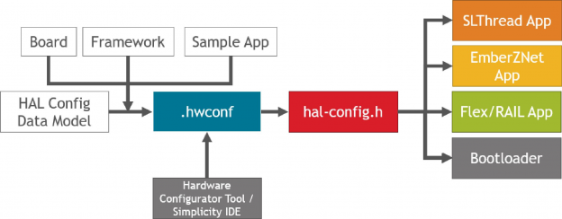
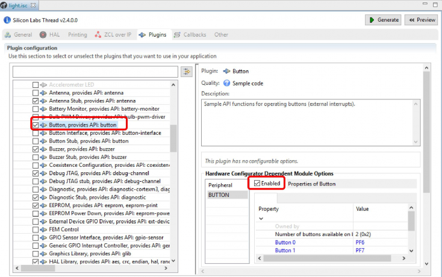
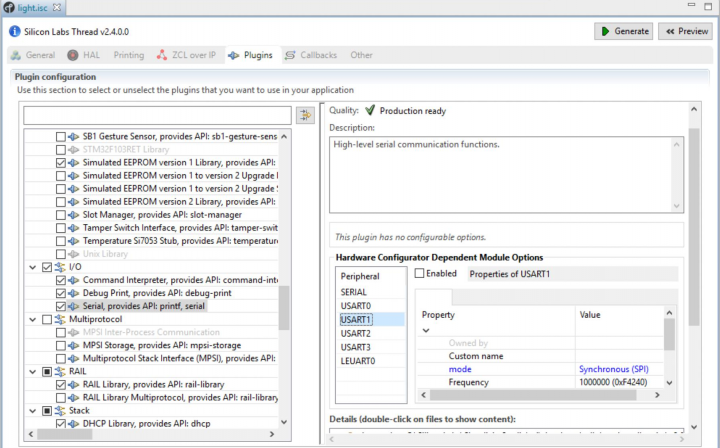
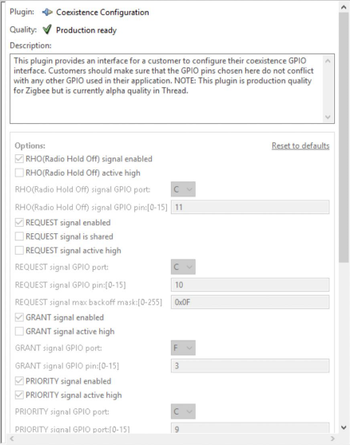
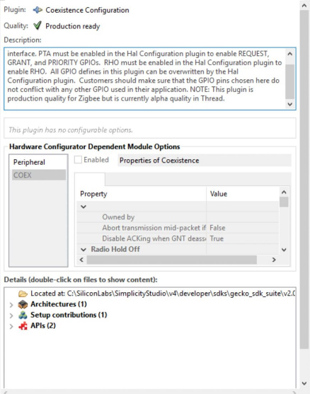
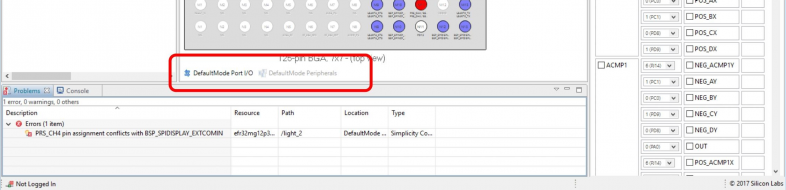
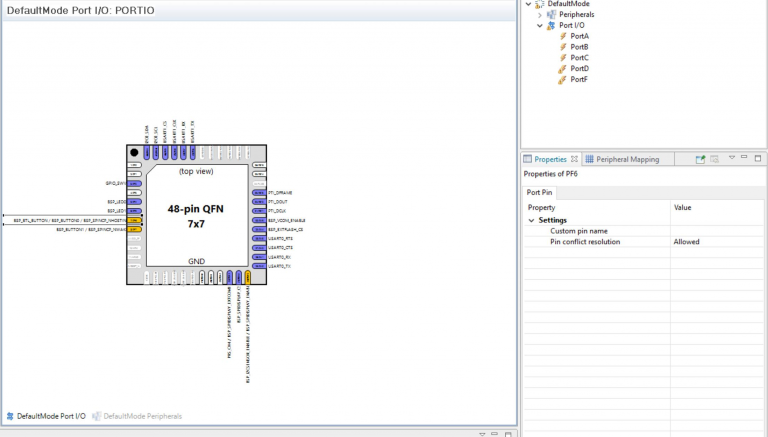
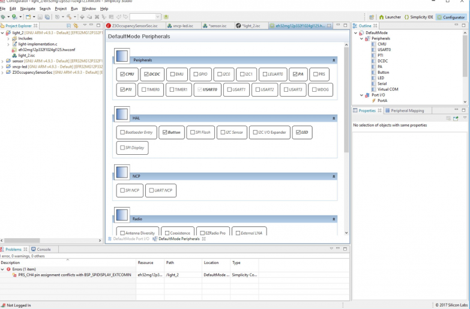

# 在 Simplicity Studio 中为 32-bit 设备配置外设 (Rev. 0.4) <!-- omit in toc -->

在 Simplicity Studio 中，外设是使用硬件配置器（Hardware Configurator）来配置的。硬件配置器通过在图形用户界面中呈现外设及其属性来简化外设配置。对于某些 SDK，一些外设还可以在 Simplicity IDE 中通过插件选项进行配置。此处描述的特性不适用于 EM3x family、Bluetooth SDK 或 32-Bit MCU SDK。

## 目录 <!-- omit in toc -->

- [1. 引言](#1-引言)
  - [1.1 文件输入和输出](#11-文件输入和输出)
  - [1.2 HAL 配置框架](#12-hal-配置框架)
- [2. 与 Simplicity IDE 以及 EmberZNet、Silicon Labs Thread、Flex SDK 一起集成](#2-与-simplicity-ide-以及-emberznetsilicon-labs-threadflex-sdk-一起集成)
  - [2.1 General 和 HAL 选项卡上的功能](#21-general-和-hal-选项卡上的功能)
    - [2.1.1 General 选项卡](#211-general-选项卡)
    - [2.1.2 HAL Configuration](#212-hal-configuration)
  - [2.2 插件配置](#22-插件配置)
    - [2.2.1 使用接口](#221-使用接口)
    - [2.2.2 从 Gecko SDK 2.0.0 之前的版本升级](#222-从-gecko-sdk-200-之前的版本升级)
- [3. 使用硬件配置器](#3-使用硬件配置器)
  - [3.1 Port I/O](#31-port-io)
  - [3.2 Peripherals](#32-peripherals)

# 1. 引言

Gecko SDK Suite（Version 2.0.0.0）对开发者在其 32-bit 设备上配置外设的方式进行了大量更改。硬件配置器（Hardware Configurator）工具得到了增强，可以生成跨 EmberZNet、Silicon Labs Thread 和 Flex SDK 的标准化配置输出。使用这些 SDK 的开发者此前需要通过编辑头文件来配置外设，而现在可以通过 Simplicity IDE 中的界面或通过硬件配置器工具来使用硬件配置器。

硬件配置器通过在图形用户界面中呈现外设及其属性，提供了配置外设的简易方法。

## 1.1 文件输入和输出

硬件配置器处理程序的输入如下图所示。特定于所选部件、协议栈应用框架和所选示例应用的文件通过 `HAL Config data model` 组合在一起，以生成一个项目特定的 `.hwconf` 文件（`<boardname>_<partname>.hwconf`）。使用任何 SDK 的开发者都可以（通过双击 `.hwconf` 文件）使用硬件配置器工具来编辑 `.hwconf` 文件。使用 EmberZNet、Silicon Labs Thread 和 Flex SDK 的开发者还可以通过编辑 Simplicity IDE 中的插件来修改一些选项。该 `.hwconf` 文件是任何项目的组成部分。如果需要将项目文件提供给 Silicon Labs Support，请提供 `.hwconf` 文件以及 `.isc` 文件和其他项目文件。

<div align=center title="hwconf"></div>

在保存 `.hwconf` 文件或生成项目文件时，硬件配置器处理程序将使用 `.hwconf` 文件来生成配置头文件 `hal-config.h`。该头文件包含一组结构化的定义，用于配置 HAL 或 BSP。该头文件是跨 SDK 标准化的。

开发者可以向该文件添加自己的定义。在此前的硬件配置方法中，`initDevice` 文件或 `board` 头文件在生成时会被完全覆盖，并且更新会丢失。而在当前的方法中，只要将自定义内容写入到 `hal-config.h` 内未使用的生成区域中，自定义内容就会被保留下来。

`hal-config.h` 文件总是位于一个固定的位置：

```
<workspace>/<projectName>/hal-config/hal-config.h
```

## 1.2 HAL 配置框架

HAL 配置框架（HAL Config framework）是一组标准化配置选项，用于初始化以及自定义硬件外设和驱动程序。这些选项由三个部分组成：

* 前缀（Prefix）：BSP 或 HAL。
* 模块（Module）：每个模块都属于一组基于底层外设和/或软件增强的硬件特性。
* 选项（Option）：可以通过定义配置选项来自定义每个模块。这些可能包括启用/禁用模块、指定外设信号路由位置或初始化模块的模式。

可以在 Simplicity Studio 的安装目录下找到当前 SDK 的完整选项列表：

```
\developer\sdks\gecko_sdk_suite\<version>\platform\halconfig\reference.html
```

以下摘录自按钮框架（Button framework）：

```C
// $[BUTTON]
#define BSP_BUTTON_PRESENT    (1)
#define BSP_BUTTON0_PIN       (6)
#define BSP_BUTTON0_PORT      (gpioPortF)
#define BSP_BUTTON1_PIN       (7)
#define BSP_BUTTON1_PORT      (gpioPortF)
#define BSP_BUTTON_COUNT      (2)
#define BSP_BUTTON_INIT       {{BSP_BUTTON0_PORT, BSP_BUTTON0_PIN}, {BSP_BUTTON1_PORT, BSP_BUTTON1_PIN}}
#define BSP_BUTTON_GPIO_DOUT  (HAL_GPIO_DOUT_LOW)
#define BSP_BUTTON_GPIO_MODE  (HAL_GPIO_MODE_INPUT)
#define HAL_BUTTON_ENABLE     { 0, 1 }
#define HAL_BUTTON_COUNT      (2)
// [BUTTON]$
```

# 2. 与 Simplicity IDE 以及 EmberZNet、Silicon Labs Thread、Flex SDK 一起集成

本节描述如何在 Simplicity IDE 中为以下 SDK 版本配置外设：

* EmberZNet SDK 6.0.0 or higher
* Silicon Labs Thread 2.6.0 or higher
* Flex 2.0.0 or higher

> 注意：由于与早期的 SDK 版本相比，硬件配置发生了重大变化，因此使用早期版本创建的项目中的自定义配置（特别是针对自定义硬件的）不会自动更新。您必须编辑硬件配置来匹配先前实现的自定义。如果您正在使用 Silicon Labs 平台并在早期版本的配置插件中进行了更改，那么在将 `.isc` 文件导入到当前 SDK 时，升级规则将进行大部分更改。[2.2.2 从 Gecko SDK 2.0.0 之前的版本升级](#222-从-gecko-sdk-200-之前的版本升级) 讨论了早期硬件配置实现与当前实现之间的一些主要区别。

> 另请注意：在为自定义硬件板创建项目时，需要使用硬件配置器手动设置与自定义板相关的任何信息（如是否存在 LFXO）。

`.hwconf` 文件的默认配置基于在创建项目时所选择的部件。除非在 `General` 选项卡上更改了部件，否则不会重新生成 `.hwconf` 文件，而只会对其进行编辑。

并非所有的硬件配置器选项都可以通过 Simplicity IDE 进行修改。硬件配置器工具则提供了对所有选项的访问。通常，Silicon Labs 建议您通过启用和禁用相关插件来配置项目，然后通过硬件配置器工具来自定义外设。由于硬件配置器工具和 Simplicity IDE 界面都在更改 `.hwconf` 文件，因此可以在一个 GUI 中看到另一个 GUI 中进行的更改。

## 2.1 General 和 HAL 选项卡上的功能

### 2.1.1 General 选项卡

架构选择器（Architecture selector）允许您修改在创建项目时选择的架构，或者在创建示例项目的一键方法中自动配置的架构。该架构展示如下：

* Board
* Part - 更改该部分将在下次点击 `Generate` 时生成一个新的 `.hwconf` 文件
* Toolchain

<div align=center title="Platform configuration"></div>

> 注意：如果您已经更改了 `.hwconf` 文件，并且更改了架构中所选的部件，那么您的 `.hwconf` 更改将不会转移到新生成 `.hwconf` 文件中。

### 2.1.2 HAL Configuration

`HAL` 选项卡（EmberZNet 中的 `HAL Configuration` 选项卡）包含到硬件配置器的钩子（hook）。`Board Header` 部分启用了 EFR32xG 应用所需的硬件配置器。其中很多选项都是灰色的，早期 SDK 版本的用户将注意到，它们使用 `hal-config.h` 文件反映了以前的架构。为了与 EM35x 兼容，保留了这些选项，并在开发目标为 EM35x 时启用这些选项。否则，该接口反映了这样一个事实，即硬件配置器现在直接使用 `.hwconf` 文件。

<div align=center title="Board header"></div>

往下看，另一个块与硬件配置器集成。

<div align=center title="Open Hardware Configurator"></div>

如果您想从基于相同目标硬件的现有项目中导入硬件配置，请选中 `Custom Hardware Configurator File` 复选框，并提供要使用的 `.hwconf` 文件的绝对路径。在选中复选框时，将绕过为项目生成 `.hwconf` 文件的代码。

单击 `Open Hardware Configurator` 以打开该工具。这与双击 `.hwconf` 文件的效果一样。参见 [3. 使用硬件配置器](#3-使用硬件配置器) 可获取硬件配置器工具的更多信息。`file block` 展示了硬件配置器处理程序的输入文件；其三个类别与 [1.1 文件输入和输出](#11-文件输入和输出) 中的图相同。

最后单击 `Reset Hardware Configurator`，这将根据输入文件返回默认值。这将删除对项目硬件配置的任何手动更改。

## 2.2 插件配置

插件（Plugin）通常是通过单击 `plugin` 选项卡并在配置选项中进行更改来配置的。修改硬件配置器设置的插件有一个 `Hardware Configurator Dependent Options` 窗口。

### 2.2.1 使用接口

下图展示了来自 Silicon Labs Thread 的 `Light` 示例的 `HAL Button plugin`。单击配置器选项来打开下拉菜单或编辑属性。`.hwconf` 文件以标准默认设置开始。硬件配置器默认设置的选项显示为黑色，显示蓝色则表示已经被示例应用或您修改过。SDK 提供的所有示例应用都修改了默认值。

<div align=center title="HAL Button plugin"></div>

每个硬件配置器相关的模块外设都有一个 `Enabled` 复选框。如果您希望通过插件来使用外设，那么您必须检查插件是否启用了外设，并且还必须启用一个或多个依赖外设。外设既可以通过插件的 `Enabled` 复选框启用，也可以通过硬件配置工具中的外设的复选框启用（参见 [3. 使用硬件配置器](#3-使用硬件配置器)）。当一个插件只有一个外设时，这似乎是多余的，但是一些插件有多个外设，比如 `Serial plugin`（如下图所示）。只需从列表中选择一个外设来查看其配置。

<div align=center title="Serial plugin"></div>

### 2.2.2 从 Gecko SDK 2.0.0 之前的版本升级

最重要的是，对 Silicon Labs 设备外设的修改不再是通过编辑 `board` 头文件，而是通过硬件配置器 GUI 来更改 `.hwconf` 文件。例如，要启用和配置 Button 或 LED（以前通过编辑 `hal-config.h` 来完成），现在可以在 `plugins`（EmberZNet 中新增的）或 `Hardware Configurator` 中的模块上修改选项。

其它增强包括：

* 在 Flex SDK `RAILTest` 示例中修改外设配置的能力。
* 更简易的时钟配置（通过硬件配置器的 CMU 模块）。
    
    <div align=center title="CMU"></div>

大量的配置选项已被重定位。将项目导入新 SDK 的开发者将看到用于处理这些更改的升级规则。变化包括：

* 串行配置（Serial Configuration）：从 HAL（EmberZNet 中的 HAL Configuration）选项卡移到 `Serial plugin` 上的 `Hardware Configurator options`。
* `HAL Configuration plugin` 已被移除。所有 `HAL Configuration` 选项都位于硬件配置器外设选项中。

    | Hal Config Plugin Option | Hardware Configurator Peripheral/Plugin              |
    | :----------------------- | :--------------------------------------------------- |
    | Antenna diversity        | Antenna peripheral/plugin                            |
    | PTA and Radio Hold Off   | Combined into COEX peripheral/plugin                 |
    | Enable GPIO RX           | Serial peripheral/plugin property                    |
    | Enable VCOM              | VCOM peripheral                                      |
    | Enable VUART             | VUART peripheral                                     |
    | Enable Watchdog          | WDOG peripheral                                      |
    | Enable LEUART0/LEUART1   | Peripherals associated with serial peripheral/plugin |
    | USART 0, 1, 2, 3         | Peripherals associated with serial peripheral/plugin |
    | UART NCP port:           | UART NCP peripheral                                  |

在某些情况下，仍然可以通过选择插件来进行配置更改，但是这些选项已经转移到硬件配置器。以 Silicon Labs Thread SDK 2.3（左）和 2.4（右）中的 `Coexistence Configuration plugin options` 为例。

<div align=center>

&emsp;&emsp;

</div>

这个类别中的插件包括：

* Antenna diversity
* Coexistence Configuration
* GPIO activation
* SPI Flash
* NCP UART

# 3. 使用硬件配置器

在 `Project Explorer` 中双击 `.hwconf` 文件，或单击 `HAL` 选项卡中的 `Open Hardware Configurator`，可以为项目打开硬件配置器。

<div align=center title=".hwconf"></div>

硬件配置器有两个视图，可以通过中央窗口底部的两个 `DefaultMode` 选项卡访问：

* Port I/O — 用于配置引脚位置和端口引脚
* Peripherals — 用于配置 Timer、USART 和 HAL 外设等模块。大多数配置更改都可以通过此选项卡来进行。

<div align=center title="DefaultMode"></div>

## 3.1 Port I/O

`Port I/O` 选项卡显示所选设备的封装图。该图会更新显示引脚分配的更改情况。

<div align=center title="Port I/O"></div>

将光标悬停在引脚上可以查看引脚的定义。

* 白色 - 未使用
* 蓝色 - 已分配
* 橙色 - 两个或多个信号到该引脚（该冲突是允许的）
* 红色 - 两个或多个信号到该引脚（该冲突不被允许）

虽然您可以使用给定的引脚来对相关的外设进行一些更改，但 Silicon Labs 建议您通过 `peripheral` 选项卡来更改外设配置。使用该选项卡可以对引脚进行自定义（如重命名引脚）。

> 注意：必须在 `Port I/O` 和 `Peripherals` 选项卡中进行一些更改。例如：
> * 可以在 `Port I/O` 中选择路由；在 `peripherals` 属性中选择 `APORT` 通道。
> * `ACMP` 输出可以在 `Port I/O` 路由选择中选择，`ACMP` 输入可以在 `peripherals` 部分配置。

可以通过右键单击引脚图并选择 `Pin Configuration Report` 来生成可打印的报告。这将在浏览器中以网页的形式打开报告，您可以对其进行保存、打印或存档。`Module Configuration Report` 选项将生成一组类似的表（这些表是按模块组织的，而不是按引脚顺序组织的）。

> 注意：为了共享设备的硬件配置信息，Silicon Labs 建议共享 `.hwconf` 文件。

## 3.2 Peripherals

`Peripherals` 选项卡包含多个框，每个框代表一个硬件外设或一个软件概念（与 HAL 相关，但不是物理地在芯片上）。外设框被组织成分组。通过单击分组右上角的箭头图标来折叠或展开分组。将光标悬停在一个框上可以查看相关外设的信息。

<div align=center title="Peripherals"></div>

单击一个框，在 `Properties` 窗口中查看其属性。属性可能是带有可用选项的下拉菜单，也可能是数字或文本字段的文本输入框。选择属性后，在远离该属性处单击或按 `Enter` 来确保属性值发生更改。如果不能禁用一个外设，那么它可能属于另一个外设。转到该外设的设置以释放任何依赖外设。

> 注意：仅当外设框上的复选框被选中时，才会生成外设的定义。例如，基于 Silicon Labs Thread 的 `Light` 示例的项目的此界面中在 HAL 分组里有一个 `Button` 外设。单击该外设以查看其属性。
> <div align=center title="Button"></div>
