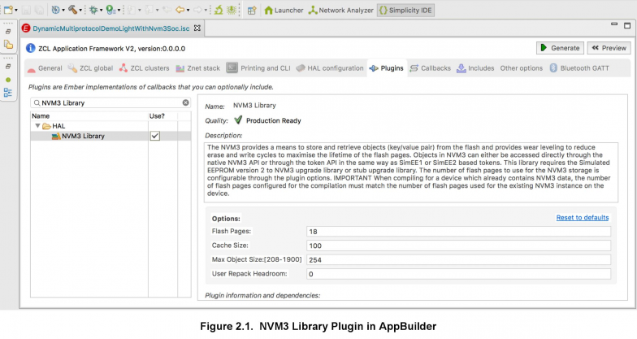

# 使用 NVM3 进行数据存储 (Rev. 0.6) <!-- omit in toc -->

NVM3（Third Generation Non-Volatile Memory，第三代非易失性存储器）驱动程序提供了一种读写存储在 Flash 中的数据对象（`key/value pair`）的方法。耗损平衡（wear-leveling）用于减少擦写周期，以最大限度地延长 Flash 的寿命。该驱动程序对断电和重启事件是可复原的，这确保从驱动程序中检索的对象总是处于有效状态。单个 NVM3 实例可以在多个无线协议栈和应用代码之间共享，这使得它非常适合多协议应用。本应用笔记解释了如何在 ZigBee 和 Thread 应用（包括使用 ZigBee 和 Bluetooth 的动态多协议应用）中使用 NVM3 进行非易失性数据存储。在 ZigBee 应用中使用 NVM3 时，NVM3 存储可以放在外部 Flash 中，以减少内部 Flash 的使用。

## 目录 <!-- omit in toc -->

- [1. 引言](#1-引言)
- [2. 使用 NVM3](#2-使用-nvm3)
  - [2.1 NVM3 重填](#21-nvm3-重填)
  - [2.2 默认 NVM3 实例](#22-默认-nvm3-实例)
    - [2.2.1 NVM3 默认实例的 Key 空间](#221-nvm3-默认实例的-key-空间)
  - [2.3 NVM3 Library Plugin](#23-nvm3-library-plugin)

# 1. 引言

NVM3（Third Generation Non-Volatile Memory，第三代非易失性存储器）数据存储驱动程序是 Simulated EEPROM（SimEE）的替代品。其与 EmberZNet 和 Silicon Labs Thread 以及持久化存储（PS Store）一起使用，或与 Silicon Labs Bluetooth 协议栈一起使用。由于 NVM3 可以与 EmberZNet 和 Bluetooth 一起使用，因此它允许在使用 Bluetooth 和 EmberZNet 的 DMP（Dynamic Multiprotocol，动态多协议）应用中共享单个数据存储实例。

NVM3 设计用于 EmberZNet、Silicon Labs Thread、Flex 和 Bluetooth 应用（在 EFR32 上运行），以及 MCU 应用（在 EFM32 上运行）。

以下是 NVM3 的一些主要特性：

* 在 Flash 中存储 `key/value pair` 数据
* 运行时创建和删除对象
* 在断电和重启事件间保持
* 耗损均衡可最大限度地延长 Flash 寿命
* 对象大小最多可配置为 4096 字节
* 可配置的 Flash 存储大小（最少 3 个 Flash 页）
* 具有可配置大小的缓存，以便快速访问对象
* 数据和计数器对象类型
* 提供了 Token 和 PS Store API 的兼容层
* 多协议应用中的单个共享存储实例
* 重填（repack）API，以允许应用在 CPU 负载较低的时段运行 clean-up 页擦除
* 可以选择将数据存储放置在外部 Flash 中（仅限 EmberZNet 应用）（BETA quality）

有关 NVM3 的详细信息，请参阅 **Gecko HAL & Driver API Reference Guide** 中的 **EMDRV->NVM3** 部分。开发 EFM32 MCU 应用或通过其 native API 访问 NVM3 的用户，请参阅此 API 参考指南。使用 EmberZNet 和 Bluetooth 开发 EmberZNet、Thread 或 DMP 应用的用户应该使用此应用笔记来了解如何在这些用例中使用 NVM3。

# 2. 使用 NVM3

本章提供了有关如何与 ZigBee、Thread 或 DMP 应用，或与 ZigBee 和 Bluetooth，一起使用 NVM3 的信息。首先提供关于 NVM3 的信息，包括：

* NVM3 重填
* 默认 NVM3 实例
* `NVM3 Library plugin`
* `Simulated EEPROM version 2 (SimEEv2) to NVM3 Upgrade plugin`
* NVM3 协议栈用法
* 最大基本存储
* `NVM3 External Flash Library Plugin`

## 2.1 NVM3 重填

当 Flash 填满时，它将达到无法再存储其它对象的点。其需要重填操作来释放过时的对象，以释放 Flash。由于擦除页面需要很长时间，因此 NVM3 驱动程序不会自动触发该过程，除非可用空间达到一个较低的临界级别。该临界级别称为强制重填界限（Forced Repack Limit），当达到该级别时，NVM3 驱动程序会在用户启动写入操作时自动运行重填。强制重填界限根据设备的页大小和 NVM3 的初始化参数来自动计算得出。

在某些应用中，在 CPU 空闲时调度重填以便不干扰其它任务的时序是有利的。在这种情况下，应用代码可以通过调用 `nvm3_repack()` 函数来触发重填过程。如果可用空间低于用户重填界限（User Repack Limit），则该函数将触发重填；如果有较多的可用空间，则该函数将立即返回。可以通过设置低于强制重填界限多少字节来相对地配置用户重填界限，用户重填界限应当置于 NVM3 初始化结构中。该默认值为 `0`，表示用户重填界限与强制重填界限相同。如果应用的时序要求较为严格，则可能需要将用户重填界限设置成远低于强制重填界限，以确保通过调用 `nvm3_repack()` 来触发的所有重填都执行，避免强制重填。在这种情况下，用户重填界限应远低于强制重填界限，以允许 `nvm3_repack()` 调用之间的最坏情况数量的对象写入（包括开销），而不会达到强制重填界限。

在 `nvm3_repack()` 调用期间，NVM3 将数据移动到新页或删除过时的页。调用将最多阻塞等于页擦除时间加上较小执行开销的时段。EFM32 和 EFR32 器件的页擦除时间可在各自的数据手册中找到。

有关更多重填的信息，请参阅 **Gecko HAL & Driver API Reference Guide** 中的 **EMDRV->NVM3** 部分。

## 2.2 默认 NVM3 实例

可以在设备上创建多个 NVM3 实例（彼此独立存在），但为了节省存储空间，通常仅使用一个 NVM3 实例，因为每个实例都会增加一些开销。对于使用 Gecko SDK 构建的 Zigbee、Thread 或 DMP 应用，使用一个通用的默认实例。在当前版本中，该 NVM3 实例设置为使用 36kB 的 Flash 空间进行数据存储。NVM3 还具有缓存（cache）来加速对 NVM3 对象的访问，该缓存的默认大小为 200 个元素（element），但可以在 AppBuilder 的 `NVM3 Library plugin` 选项中进行配置，如 [Figure 2.1](#23-nvm3-library-plugin) 所示。

> 注意：缓存大小必须设置为大于或等于所使用的 NVM3 对象数的值。这些包括通过 native NVM3 API 创建的 Token、PS Store 对象和 NVM3 对象的数量。对于 `indexed token`，为每个索引添加一个缓存项。

`nvm3_countObjects()` 函数可用于查找任何给定点的已使用 NVM3 对象数。Silicon Labs 建议在初始化 Token、PS Store 和 native NVM3 对象后检查此函数，以估计 NVM3 默认缓存大小的正确大小。

### 2.2.1 NVM3 默认实例的 Key 空间

NVM3 使用一个 20-bit key 来标识每个对象。为避免对多个对象使用相同的 key，默认 NVM3 实例的 NVM3 key 空间已划分为多个域，如下表所示。例如，在 EmberZNet 协议栈中定义的 NVM3 对象应该使用 `0x10000` 至 `0x1FFFF` 范围内的 NVM3 key，而用户应用 Token 应该使用 `0x10000` 以下的 key。

| Domain                    | NVM3 Key          |
| :------------------------ | :---------------: |
| User                      | 0x00000 - 0x0FFFF |
| EmberZNet stack           | 0x10000 - 0x1FFFF |
| Silicon Labs Thread stack | 0x20000 - 0x2FFFF |
| Connect (Flex) stack      | 0x30000 - 0x3FFFF |
| Bluetooth stack           | 0x40000 - 0x4FFFF |
| Z-Wave stack              | 0x50000 - 0x5FFFF |
| Reserved                  | 0x60000 - 0xFFFFF |

## 2.3 NVM3 Library Plugin

要将 NVM3 与 EmberZNet、Thread 或 DMP 示例应用一起使用，项目中应该包含 `NVM3 Library plugin`。所有 `PS Store` 和 `SimEE` 插件应该取消选择。

`NVM3 Library plugin` 提供四个插件选项:

* `Flash Pages`：用于 NVM3 数据存储的 Flash 页数。必须是 `3` 或以上。
* `Cache Size`：要缓存的对象数。为减少访问时间，此数值应该等于或大于 NVM3 中随时存储在 NVM3 中的对象数（包括 Token）。
* `Max Object Size`：允许的最大的 NVM3 对象的大小（以字节为单位）。必须介于 `208` 和 `4096` 之间。
* `User Repack Headroom`：`Headroom` 确定了用户重填界限少于强制重填界限多少字节数。其默认值为 `0`，表示强制重填界限与用户重填界限相同。

> 重要提示：使用当前版本的 `NVM3 library plugin` 为 Flash 中已包含 NVM3 实例的设备创建应用时，为 NVM3 实例配置的 Flash 页数必须与设备上找到的 NVM3 实例的 Flash 页数相匹配。因此，一旦将 NVM3 实例安装在设备上，就无法更改 NVM3 实例的大小，而无需先删除存储NVM3实例的Flash页面和存储在那里的NVM3对象。因此，一旦在设备上安装了 NVM3 实例，就不可能在不擦除存有 NVM3 实例及 NVM3 对象的 Flash 页的情况下，更改实例的大小。

使用 `NVM3 Library plugin` 时，必须包含 `Simulated EEPROM version 2 to NVM3 Upgrade Library` 或 `Simulated EEPROM version 2 to NVM3 Upgrade Stub Library`，如 [2.4 SimEEv2 to NVM3 Upgrade Plugin]() 中所述。

