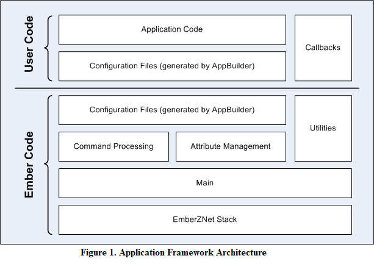

# Ember® 应用框架开发指南 <!-- omit in toc -->

Ember 应用框架是一个嵌入式 C 代码体，可以通过 Ember AppBuilder 来配置它，以实现任何 ZCL（ZigBee Cluster Library）应用。本指南涵盖了 Ember 应用框架的结构和用法。在适当的情况下，我们添加了一些信息来概括最新版本的 Ember 应用框架与先前版本之间的差异。

## 新增内容 <!-- omit in toc -->

增加第 18 章。

## 目录 <!-- omit in toc -->

- [1. 引言](#1-引言)
  - [1.1 目的](#11-目的)
  - [1.2 构建应用](#12-构建应用)
  - [1.3 移植应用](#13-移植应用)
- [2. AF 架构](#2-af-架构)
- [3. AF 目录结构](#3-af-目录结构)
- [4. 生成的应用配置文件](#4-生成的应用配置文件)
  - [4.1 AF 文件](#41-af-文件)

# 1. 引言

## 1.1 目的

Ember AF（application framework，应用框架）是一个嵌入式 C 代码体，可以通过 Ember AppBuilder 来配置它，以实现任何 ZCL 应用。该 AF 位于 `app/framework` 目录中。

本指南涵盖了 Ember AF 的结构和用法。在适当的情况下，我们添加了一些信息来概括最新版本的 Ember AF 与先前版本之间的差异。

## 1.2 构建应用

使用 Ember AF，只需通过几个步骤就能创建一个应用。

1. 使用 Ember AppBuilder 创建 Ember AF 配置文件。该配置文件及所选平台的项目文件由 Ember AppBuilder 生成。本手册的第 17 章概括了 Ember AppBuilder 的使用及其与 Ember AF 的关联。有关如何使用 Ember AppBuilder 的更多详细信息，请参阅 Ember AppBuilder 的 Help 菜单（`Help | Help Contents for indexed help and Help | Dynamic Help for context-sensitive help`）。
2. 将应用的细节写入到随配置文件一起生成的回调函数中。使用 Ember AF API 可以做一些事（如在 ZigBee 网络上，与 attribute 交互；发送、接收和响应 command）。有关 Ember AF API 的更多详细信息，请参阅 [5. AF API]()。
3. 将生成的项目文件打开到所选芯片的 IDE 中，编译应用，然后将其加载到开发套件上。
4. 运行应用并使用 Ember Desktop 控制台窗口和应用 CLI（command line interface，命令行接口）与其进行交互。有关如何使用 Ember Desktop 的更多信息，请参阅 Ember Desktop 的在线帮助（`Help | Help Contents`）。

## 1.3 移植应用

有关移植过程的信息，请参阅 stack release 中包含的 **Ember Application Framework Release Notes (document number 120-8098-000A)**。

# 2. AF 架构

Ember AF 在 Ember stack 上使用 stack "handler" 接口，并向开发者公开其自身更抽象的和应用特定的接口。

Ember AF 的主要特性之一是将用户创建的代码和 Silicon Labs 创建的代码分离。虽然 Silicon Labs 提供了 Ember AF 的所有源代码，但是用户应该在该框架外创建代码，并且应该通过框架公开的实用程序（utility）和回调（callback）与框架进行交互。Figure 1 展示了 Ember AF 架构的概览及两个代码库的分离。

`app/framework/util` 中包含的 `main` 文件使用 Ember Stack handler 接口，并将 Ember AF 结合到 EmberZNet PRO stack 中。两个 `main` 文件位于 `app/framework/util` 目录中，`af-main-soc.c` 用于 SoC（如 EM35xx 平台）和 `af-main-host.c` 用于与 NCP（Network Co-Processor，网络协处理器）搭配的 host 微处理器。

`main` 文件执行 `emberIncomingMessageHandler()`，并将所有传入消息传递给 Ember AF 以进行 command 处理。一旦传入消息被处理，它们将被传递到对应的 cluster 以进行处理，或者直接传递给 cluster-specific 回调（由 Ember AppBuilder 生成）。`Command` 处理代码的重要（significant）部分直接由 `tool/appbuilder` 中包含的 ZCL XML 文档生成。

从 ZCL XML 文档生成的所有代码和头文件与应用头文件和回调文件一起被生成到 `app/builder/<application name>/` 中。

# 3. AF 目录结构

* `tool/appbuilder`：Ember AppBuilder 使用的配置和模板文件。 当您在 stack installation 中指向 Ember AppBuilder 时，它会查看此目录以加载该 stack 版本的当前 ZCL 实现的 XML 描述。 请将您的 `custom cluster` 的 `.XML` 文件放置在此位置。有关创建 `custom cluster` 的详细信息，请参阅 Ember AppBuilder Help（`Help | Help Contents | Creating custom clusters`）。
* `app/framework`：Ember AF 的所有代码都位于 `app/framework` 中。代码的主要部分已被分解到各自的目录中。
* `app/framework/cli`：与 AF 的 CLI 实现相关的代码。 CLI 的核心代码包含在 `app/util/serial/command-interpreter2.c` 中。CLI 包含数据类型检查和命令用法反馈等。作为结果：
  1. 所有命令都需要与该命令关联的所有参数。如果缺少参数，CLI 将提供有关特定命令用法的用户反馈。
  2. 传递给 CLI 的参数必须采用以下格式之一：
     * `<int>`: 123(decimal) or 0x1ABC(hex)
     * `<string>`: "foo"(string) or {0A 1B 2C}(array of bytes)
* `app/builder`：由 Ember AppBuilder 生成的所有文件的输出位置。 当您在 Ember AppBuilder 中生成应用时，它会将生成的文件放在此目录下的其中一个目录中（目录名与 Ember AppBuilder 配置中的设备名相同）。例如，如果您的设备名为 `MyLightSwitch`，则文件将生成到 `app/builder/MyLightSwitch/` 中。在 Ember AppBuilder 中打开示例应用时也是如此，Ember AppBuilder 将会自动地将示例应用文件复制到 `app/builder` 下的相关目录中。
* `app/framework/include`：Ember AF 的所有外部 API。 此目录镜像了 stack 中 `include` 目录的使用。它是所有预期的外部应用接口的单一位置。
* `app/framework/plugin`：Silicon Labs 创建的所有 `ZCL cluster` 代码。 该目录包含所有 Silicon Labs 团队为处理 cluster command 而创建的 cluster 代码。通过从 Ember AppBuilder 的 “plugin” 选项卡中选择插件，可选地将这些代码包含在应用中。如果您选择不包含插件，则您需要负责为所有必需的 cluster command 实现回调。
* `app/framework/scenarios`：所有使用 AF 的示例应用场景（scenario）。 这些示例场景可以在 Ember AppBuilder 中打开（by choosing `File | New | Application Configuration`, selecting a framework and stack combination, and then choosing “Start from a selected sample application.” Ember AppBuilder requests a new application name for the given scenario instance and copies the sample callback code into a directory of the same name within `app/builder`.）。
* `app/framework/security`：所有与 ZigBee 安全相关的实用程序代码。 与密钥建立相关的代码位于 `app/framework/cluster` 中。
* `app/framework/util`：应用的 `main`、消息处理以及 Ember AF 使用的任何其他实用程序代码。 该目录包含 Ember AF 的核心（gut）。管理多端点支持的 attribute 的 attribute 存储文件包含在此目录中。此外，用于访问、读取和写入 attribute 的 API 包含在文件 `attribute-table.h` 和 `attribute-storage.h` 中。

# 4. 生成的应用配置文件

Ember AFV1（Version 1）使用单个头文件来配置 Ember AF、设置 attribute table、并通过预处理器指令打开和关闭部分代码。AFV2（Version 2）使用相同的预处理程序指令来配置框架中的代码。除主要的应用头文件外，Ember AppBuilder 还会生成一个带有后缀 `endpoint_configuration.h` 的 “端点配置” 头文件。

* `<DeviceName>_endpoint_configuration.h`  生成的文件，用于配置 Ember AF 的静态数据结构。这允许跨端点共享 attribute 元数据，并且每个端点都有各自用于 attribute 存储的空间。`app/framework/util/attribute-storage.c` 文件使用 `endpoint_configuration.h` 文件中的 `#define` 配置所有应用的 attribute-related 数据。 每次在 Ember AppBuilder 中修改应用配置时，都必须重新生成该文件。Silicon Labs 建议您不要手工编辑 `endpoint_configuration.h` 文件，因为文件中的每个宏定义都具有一个复杂的关系。 [9.1 ZCL Attribute 配置]() 中更详细地描述了端点配置文件的作用。
* `<DeviceName>.h`  应用的主要头文件。它包含了在框架中打开所需特性的所有 `#define`。
* `<DeviceName>_callbacks.c`  生成的存根回调（stub callback）文件，包含您选择要包含在项目中的所有回调的默认实现。您可以在此处编写您的代码。如果要将其他文件添加到生成的项目文件中，则需要包含其他文件以便编译器可以找到它们。
* `<DeviceName>_board.h`  为所选平台生成的板（board）文件。此文件假定您使用的是其中一块 Ember 开发板。它根据 “HAL configuration” 选项卡中所做的选择进行配置。

    > 注意：板头文件包含许多选项，这些选项可以根据您的需求配置各种 GPIO。Silicon Labs 建议您查看生成的 `<DeviceName>_board.h` 文件，并根据需求对目标硬件进行更改。

* `<DeviceName>_tokens.h`  如果要在平台（支持 token）的 token（persistent memory）中包含任何 attribute，则此文件将通过 Ember AppBuilder 生成，以配置 token 存储。
* `<DeviceName>.ewp, eww, .xip, .xiw, .mak`  为您的应用生成的项目文件。Ember AppBuilder 仅生成与您所选的平台相匹配的项目文件。这些文件可以加载到 IDE 中并进行编辑，以构建项目的其余部分。

## 4.1 AF 文件

从 EmberZNet PRO 4.6 起，Ember AF 和 Ember AppBuilder 已修改为将所有静态的 Ember AF 文件生成到应用构建目录中。在之前的版本中，这些文件的单个版本生成到 `app/framework/gen` 目录中；从 EmberZNet PRO 4.6 起，此目录已被移除，用以代替的是将所有这些文件生成到 `app/builder/<application name>` 目录中。这样做是为了支持来自单个 stack 的多个规范版本。生成的文件不再是静态的，它们的内容根据用户在 “Stack” 选项卡中选择的 ZigBee 规范版本而改变。

生成的文件数量根据支持的插件及这些插件所需的内容而异。生成的 Ember AF 文件包括但不限于以下内容：

* `af-structs.h`：结构的定义，被 Ember AF 用于解析 OTA（over the air）发送的数据。
* `att-storage.h`：Ember AF 内的 attribute 存储机制中使用的定义。
* `attribute-id.h`：所有由 ZCL 规范定义的 attribute id，用来加载到 Ember AF 内的所有 profile 中。
* `attribute-size.h`：ZCL 规范中使用的 attribute 类型的大小（以字节为单位）。
* `attribute-type.h`：定义在 ZCL 规范中用于表示数据类型的 OTA 值。
* `call-command-handler.c`：通过 OTA 接收的所有 non-general command 的 command 处理代码。该生成的代码将 cluster command 从它们的 OTA 格式到回调接口。如果没有实现相应的回调，处理代码也会处理这些 command。
* `call-command-handler.h`：`call-command-handler.c` 的头文件。该文件提供了所有在 `call-command-handler.c` 中实现的函数的定义。
* `callback-stub.c`：提供由 Ember AF 实现的用户回调的存根。只有在用户的应用中未单独定义回调时，才会编译该回调的存根。
* `callback.h`：提供所有可能在 Ember AF 或用户应用中实现的回调的定义。这定义了 ENTIRE 回调接口，Ember AF 主要使用该接口与用户应用交互。
* `cli.h`：此文件仅被文档引擎 doxygen 使用，以记录通用应用框架的 CLI 命令，它没有其他用途。
* `client-command-macro.h`：宏，作为 Ember AF 接口的一部分，用于填充将 OTA 发送的包缓冲区。在这里，用户应用配置中配置的 ZCL 支持的每个 command 都用一个宏表示，该宏将对 Ember AF 进行适当的调用，以填充包缓冲区，以便 OTA 发送该 command。
* `cluster-id.h`：为从 ZCL 加载到 Ember AF 中的所有 cluster id 提供了定义。
* `command-id.h`：为从 ZCL 加载到 Ember AF 中的所有 command id 提供了定义。
* `debug-printing-test.h`：用于在 Ember AF 中打开调试打印的定义。
* `debug-printing.h`：用于在 Ember AF 中进行调试打印的宏。
* `enums.h`：提供 Ember AF 中使用的所有 ZCL 相关的枚举定义。
* `print-cluster.h`：用于在 Ember AF 内的每个 cluster 上打开打印的定义。
* `stack-handler-stub.c`：所有 stack 处理程序的存根，可在 Ember AF 中覆写（overridden）。
* `stack-handlers.h`：定义可供用户应用覆写的所有 stack 处理函数。
* `<plugin>-callbacks.h`：所有插件回调函数的声明。这些文件的生成取决于为您的应用选择的插件。
