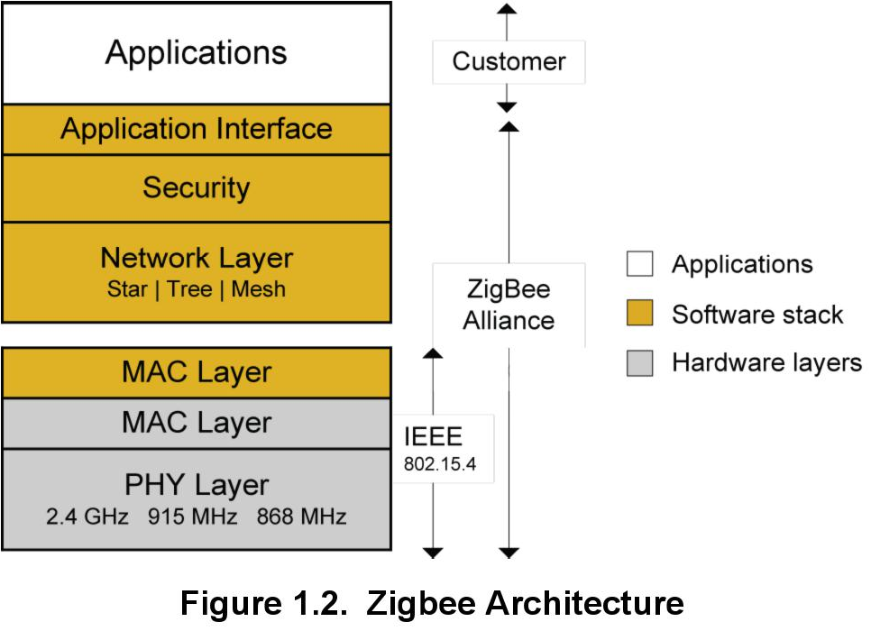
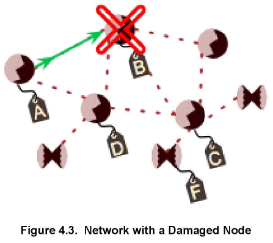
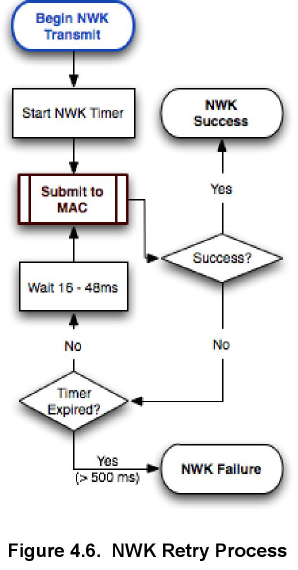
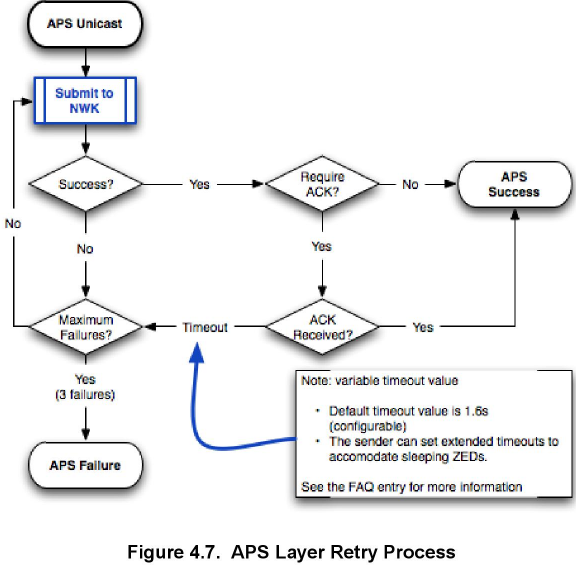
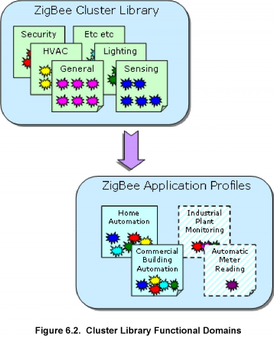

# ZigBee 基础 (Rev. 1.1) <!-- omit in toc -->

本文描述了 ZigBee 解决方案的关键特性和特征，并且还包括了一个关于 ZigBee 3.0 的部分。

## 目录 <!-- omit in toc -->

- [1. 引言](#1-引言)
  - [1.1 一般特征](#11-一般特征)
  - [1.2 IEEE 802.15.4](#12-ieee-802154)
  - [1.3 硬件和软件元素](#13-硬件和软件元素)
    - [1.3.1 关于应用框架](#131-关于应用框架)
    - [1.3.2 其他工具和实用程序](#132-其他工具和实用程序)
- [2. ZigBee Mesh 网络](#2-zigbee-mesh-网络)
  - [2.1 星形网络](#21-星形网络)
  - [2.2 全 Mesh 网络](#22-全-mesh-网络)
  - [2.3 混合 Mesh 网络](#23-混合-mesh-网络)
- [3. 网络节点类型](#3-网络节点类型)
  - [3.1 协调器](#31-协调器)
  - [3.2 路由器](#32-路由器)
  - [3.3 终端设备](#33-终端设备)
- [4. ZigBee 路由概念](#4-zigbee-路由概念)
  - [4.1 概述](#41-概述)
    - [4.1.1 表路由](#411-表路由)
    - [4.1.2 广播路由](#412-广播路由)
    - [4.1.3 多播路由](#413-多播路由)
    - [4.1.4 多对一/源路由](#414-多对一源路由)
  - [4.2 使用链路质量来援助路由](#42-使用链路质量来援助路由)
    - [4.2.1 相关邻居表字段的描述](#421-相关邻居表字段的描述)
    - [4.2.2 链路状态消息](#422-链路状态消息)
    - [4.2.3 网络层如何使用双向开销](#423-网络层如何使用双向开销)
    - [4.2.4 关键概念：快速响应](#424-关键概念快速响应)
    - [4.2.5 关键概念：连接管理](#425-关键概念连接管理)
  - [4.3 路由发现与修复](#43-路由发现与修复)
    - [4.3.1 路由发现](#431-路由发现)
    - [4.3.2 路由修复](#432-路由修复)
  - [4.4 重试与确认](#44-重试与确认)
    - [4.4.1 MAC Retries and ACKs (802.15.4)](#441-mac-retries-and-acks-802154)
    - [4.4.2 NWK Retries](#442-nwk-retries)
    - [4.4.3 APS Retries and ACKs](#443-aps-retries-and-acks)
    - [4.4.4 总结](#444-总结)
- [5. ZigBee 协议栈](#5-zigbee-协议栈)
  - [5.1 ZDO](#51-zdo)
    - [5.1.1 高级 ZDO 用法](#511-高级-zdo-用法)
  - [5.2 ZigBee 配置文件](#52-zigbee-配置文件)
  - [5.3 ZigBee 寻址方案](#53-zigbee-寻址方案)
  - [5.4 Extended PAN ID](#54-extended-pan-id)
    - [5.4.1 在扫描/形成/加入过程中的使用](#541-在扫描形成加入过程中的使用)
    - [5.4.2 选择 EPID](#542-选择-epid)
    - [5.4.3 EPID vs PID](#543-epid-vs-pid)
- [6. ZCL](#6-zcl)
  - [6.1 概述](#61-概述)
  - [6.2 簇内部](#62-簇内部)
    - [6.2.1 客户端和服务端](#621-客户端和服务端)
    - [6.2.2 属性](#622-属性)
    - [6.2.3 命令](#623-命令)
  - [6.3 示例：Temperature Measurement Sensor Cluster](#63-示例temperature-measurement-sensor-cluster)
  - [6.4 功能域](#64-功能域)
  - [6.5 制造商扩展](#65-制造商扩展)

# 1. 引言

ZigBee 指的是：

* 一个可靠、经济、低功耗、无线设备间通信的开放标准。
* 一个由 400 多家公司组成的联盟，他们共同定义并使用该标准来在各种应用（如智慧能源和商业楼宇自动化）中进行通信。

ZigBee Alliance 由一帮组成董事会的发起人（promoter）成员公司领导。Silicon Labs 是董事会成员之一。ZigBee 还拥有大量参与者（participant）和采用者（adopter）成员，他们在技术和营销工作组内工作，以创建和维护标准。联盟的活动是通过专门针对该技术特定领域的工作组（包括网络组、安全组、应用配置文件组和其他几个组）完成的。所有的 ZigBee 文档都可以在 ZigBee 网站 [www.zigbee.org](https://www.zigbee.org) 上找到。最新的规范文档只有 ZigBee Alliance 成员才能访问。要在产品中使用 ZigBee 技术，公司必须成为联盟的成员。

Silicon Labs 活跃于联盟的各个领域，并通过其 Ember® ZigBee 解决方案帮助客户采用 ZigBee 技术。Ember ZigBee 平台是迄今为止所有新标准的测试和认证的参考平台。Ember 公司于 2012 年 7 月被 Silicon Labs 收购，它是 ZigBee Alliance 的创始成员。

ZigBee Alliance 指定了三个主要项。

1. ZigBee 网络 - 网络交互的基本标准（包括可接受的 RF 行为、创建和加入网络的方法、发现路由以及使用路由来通过网络传输流量）。ZigBee Alliance 提供了其他网络规范（如 RF4CE 和 GreenPower），但本文档着重于 ZigBee PRO。
2. ZigBee 应用层 - 描述 ZigBee 应用的一组消息和网络设置。遵守这些设置的所有设备都可以互操作。在 ZigBee 3.0 之前，每个应用配置文件（无论是公共的还是私有的）都有自己的认证程序。ZigBee 3.0 是一个通用的应用层认证程序，适用于所有 ZigBee 产品。下图展示了一些（最初的）单独的 ZigBee 应用配置文件。

    <div align=center title="Figure 1.1. ZigBee Application Profiles"></div>

3. 认证 - ZigBee 应用由联盟认证以向最终用户表明设备是合规的。使用私有配置文件（profile）的应用可以通过认证来表明它正确地使用了 ZigBee 协议栈，并且在运行期间不会对其他 ZigBee 网络产生不良影响。详情请参阅 [7. ZigBee 合规性]()。

由于 ZigBee 致力于开放和可互操作的设备，因此它们存在或开发的地方（从物理层到应用层）都采用了标准，如下图所示。在物理层和 MAC（媒体访问控制）层，ZigBee 采用了 IEEE 802.15.4 标准。网络、安全和应用层都是由 ZigBee Alliance 开发的。ZigBee Alliance 还开发了一个由网关（gateway）和 commissioning 工具等支持系统组成的生态系统，以简化 ZigBee 网络的开发和部署。标准的扩展和附件还在继续开发中，Silicon Labs 致力于支持这些标准。

<div align=center title="Figure 1.2. ZigBee Architecture"></div>

后面三个小节描述了 ZigBee 网络的一般特征，讨论了 IEEE 802.15.4 标准的使用，并总结了 ZigBee 网络的硬件和软件元素。

## 1.1 一般特征

ZigBee 旨在成为一种经济高效的低功耗解决方案。它面向多个市场，包括家庭自动化、楼宇自动化、传感器网络、智慧能源和个人健康护理监测。ZigBee 网络的一般特征如下：

* 低功耗 - 设备通常可以使用合适的工作周期在 AA 型电池上运行数年。通过极其谨慎的设计和特殊的电池技术，一些 ZigBee 设备（如燃气表）可以达到 20 年的电池寿命。
* 低数据速率 - 在 2.4GHz 频段下支持 250kbps 的无线数据速率（网络中的实际持续流量速率低于该理论值）。因此，ZigBee 更适用于采样和监控应用或基本控制应用。请参阅 **AN1138: ZigBee Mesh Network Performance** 和 **AN1142: Mesh Network Performance Comparison**。
* 小型和大型网络 - ZigBee 网络规模可以从几个设备到数千个设备。网络层使用多种不同的数据传输机制（路由类型）来设计，以根据预期用途优化网络操作。
* 范围 - 一般设备提供足够的范围来覆盖普通家庭。可以使用功率放大器来大幅度地扩展了范围。在物理层上使用分布式扩频，以更好地抵抗干扰。
* 简单的网络安装、启动和操作 - ZigBee 标准支持多种网络拓扑。用于形成和加入网络的简单协议允许系统在发生路由问题时自行配置和修复。

## 1.2 IEEE 802.15.4

ZigBee 网络基于 IEEE 802.15.4 的 MAC 层和物理层。802.15.4 标准在 2.4GHz 频段下以 250kbps 运行，在 900/868MHz 频段下以 40/20kbps 运行。许多芯片公司提供 2.4GHz 频段下的解决方案，其中少数支持 900/868MHz 频段。ZigBee PRO 使用 802.15.4-2003。

802.15.4 的 MAC 层用于基本消息处理和拥塞控制。该 MAC 层包括形成和加入网络的机制、用于为设备监听空闲信道的 CSMA 机制，以及用于相邻设备间可靠通信的重试处理和消息确认的链路层。ZigBee 网络层建立在这些底层机制之上，以在网络中提供可靠的端到端通信。802.15.4 标准可从 [www.ieee.org](www.ieee.org) 中下载。

802.15.4 标准在 MAC 层中提供了 ZigBee 在任何当前协议栈配置文件中都未使用的一些选项。这种未使用的特性的一个例子是保证时隙（GTS，guaranteed time slots），其将被网络用于跨设备同步无线电活动。因此，这些项通常不包含在 ZigBee 软件栈中以节省代码空间。ZigBee 还对 ZigBee 规范附录 D 中记录的 802.15.4 MAC 进行了具体更改。

## 1.3 硬件和软件元素

ZigBee 解决方案需要实现 ZigBee 无线电和相关的微处理器（在单个芯片中或单独），并在 ZigBee 协议栈之上实现应用。EmberZNet PRO 是 Silicon Labs 的 ZigBee PRO 协议栈实现。

一般地，开发者可以购买 ZigBee 无线电和软件作为捆绑包。通常，硬件和软件供应商提供包括用于软件的示例应用和硬件的参考设计。基于这些，硬件开发者可以根据自己的特定需求定制硬件。或者，许多模块提供商可以提供紧凑且低成本的定制模块。

由于 ZigBee 应用的嵌入特性，软件应用开发通常与硬件设计相互关联，以提供最佳解决方案。Silicon Labs 提供基于 ZigBee 规范的标准网络 API 和应用框架，其为客户提供一种基于 ZigBee 应用配置文件和 ZCL 的快速开发应用方法，如下所述。另外，许多第三方软件开发公司专门开发 ZigBee 应用，并可以协助新产品开发。

### 1.3.1 关于应用框架

任何应用都可以从零构建，但这是一个缓慢且冗长的过程。另一种方法是获取工作代码并对其进行修改以满足应用的要求。适应工作设计是构建应用的一种更简单、更有效的方法，尤其是使用新技术的第一个应用。为了解决这个问题，Silicon Labs 不仅提供示例应用代码，还提供一个或多个应用框架作为其开发平台的一部分。应用框架包含存储在库和插件中的 Silicon Labs 提供的代码体，Silicon Labs 还提供 Simplicity Studio，其中包括基于 AppBuilder 的 IDE。AppBuilder 是一个交互式 GUI 工具，允许您配置应用框架中包含的库和插件，以在应用配置文件中实现设备。

应用框架目前有两种样式或版本（version 2 and version 6）。该版本决定已安装的目录结构、可用的元数据以及某些功能是硬编码还是通过插件可用。这两个版本之间的差异在 **UG102: Application Framework User Guide** 中详细描述。EmberZNet PRO 协议栈包括这两个版本的应用框架。ZigBee PRO 应用框架（也称为 ZCL Application Framework V2），是一个 version 2 框架，通常称为 AFV2。网络协处理器应用框架也随 EmberZNet PRO 协议栈一起提供，其使用 version 6 开发。

AFV2 基于 ZCL，用于开发 ZigBee PRO 应用。它提供了一组嵌入式代码，用于实现 ZCL-based 簇处理、所需的网络任务和一般的 ZigBee 应用状态机，并包含对 ZigBee 3.0 应用层的支持，以及许多传统的 ZigBee 配置文件（例如 Home Automation（HA），Smart Energy（SE）和 ZigBee Light Link（ZLL））。此代码是根据 Silicon Labs 推荐的最佳实践和不同 ZigBee 应用配置文件的规范开发的，可作为一种 “软件参考设计”，可在片上系统（如 EFR32）上运行或者在主机处理器上连接到基于 EZSP（EmberZNet 串行协议）的网络控制处理器。

Silicon Labs 正致力于将这两个版本协调为一个框架版本。与此同时，无论它们是在 v2 还是 v6 下开发的，应用框架都提供了通用的基本服务，并且当与设备特定的代码结合使用时，可为您提供设备的大部分的无线行为。然后，您的任务就是开发特定于硬件的功能，并将其与 Silicon Labs 软件连接起来。每个 Silicon Labs 协议栈版本都提供了一些基于相关应用框架的常见用例示例。

使用应用框架有以下好处：

* 帮助维护一个通用方法，并遵守协议标准和 Silicon Labs 最佳实践。
* 帮助确保协议合规性，因为 Silicon Labs 通过预合规性测试运行应用框架。
* 允许简易地合并更新，因为 Silicon Labs 维护核心组件。
* 提供在应用中包含复杂任务的能力，而无需在代码级管理这些任务。
* 提供可配置性，同时维护协议合规性以及简易地更新到未来协议栈版本的能力。
* 提供一个回调/命令接口和一组配置点，这些配置点通常更远离协议栈，因此与栈级行为相比更符合应用层行为。
* 提供一组插件来说明更高级应用逻辑的 “最佳实践” 实现，例如调试功能和 CLI 功能、ZCL 簇实现、应用状态机或复杂功能。

所有这些都有助于加快产品上市速度和更强大的解决方案。

### 1.3.2 其他工具和实用程序

除了 Simplicity Studio 和 AppBuilder，Silicon Labs 还提供了许多在开发过程中可供开发人员使用的实用程序和工具，包括：

* Over-the-air（OTA）bootloaders，允许在部署后升级系统软件
* 网关接口，以将 ZigBee 网络连接到其他系统
* 微处理器的编程工具
* 网络嗅探器和调试工具，允许查看和分析网络操作
* 与领先公司合作的处理器调试工具

# 2. ZigBee Mesh 网络

嵌入式 Mesh 网络允许无线电中继其他无线电的消息，从而使无线电系统更加可靠。例如，如果节点不能直接向另一节点发送消息，则嵌入式 Mesh 网络会通过一个或多个中间节点来中继消息。

EmberZNet PRO 支持 Mesh 网络拓扑的三种类型，如下图所示：

* 星形网络（Star Network）
* 全 Mesh 网络（Full Mesh Network）
* 混合 Mesh 网络（Hybrid Mesh Network）

<div align=center title="Figure 2.1. Star, Full Mesh, and Hybrid Mesh Networks"></div>

> 注意：上图中的蓝色设备为终端设备，其可能处于睡眠或移动状态。有关终端设备的更多信息，请参见 [3. 网络节点类型](#3-网络节点类型)。

## 2.1 星形网络

在星形网络中，一个集线器（hub）是所有通信的中心点。集线器可能会成为网络/处理带宽的瓶颈。这种拓扑结构不太像 Mesh，并且传输受到集线器的通信半径限制。外围节点可以通过电池供电。在 EmberZNet PRO 协议栈中，此拓扑由一组终端设备和一个协调器节点组成；协调器作为父节点，并节点充当网络集线器。

## 2.2 全 Mesh 网络

在全 Mesh 网络中，所有节点都是路由器节点（包括形成网络后的协调器节点）。由于所有节点都可以为所有其他节点中继信息，因此该拓扑最不容易受到链路故障的影响（不容易出现单点故障现象）。

## 2.3 混合 Mesh 网络

混合 Mesh 网络拓扑结合了星形和全 Mesh 策略。其存在几个星型网络，但它们的集线器可以作为 Mesh 网络进行通信。混合网络容许了比星形拓扑更长的通信距离和比 Mesh 拓扑更多的分层设计能力。此拓扑由 EmberZNet PRO 协议栈形成，其使用路由器设备作为星型子网络的集线器，路由器可以被终端设备附着连接。

选择拓扑时必须考虑哪些节点是线路供电还是电池供电、预期的电池寿命、所需的网络流量、延迟要求、解决方案成本以及其他因素。详情请参见 **UG103.3: Software Design Fundamentals**。

# 3. 网络节点类型

ZigBee 规范指定单个网络中最多支持一个协调器、多个路由器和多个终端设备。后面的小节将介绍这些节点类型。

## 3.1 协调器

协调器（ZC，ZigBee coordinator）负责形成一个集中式网络（centralized network）。协调器是具有一些额外功能的路由器，其使用一个硬编码网络地址（`0x0000`）。ZigBee 协调器的功能包括在扫描到可用信道后选择合适的信道和选择 Extended PAN ID（参见 [5.4 Extended PAN ID]()）。在形成网络之后，协调器充当路由器。

协调器还增加了一些职责，例如充当信任中心（trust center）或网络管理器（network manager）。信任中心管理网络的安全设置和授权。网络管理器监视和纠正网络问题，例如 PAN ID 冲突或由于干扰导致的信道变化。这些选择取决于应用开发者，并在某些情况下由使用的应用层（如 ZigBee 3.0）完成。

> 注意：在启动网络时，出于安全目的，只能将协调器指定为集中式信任中心。

## 3.2 路由器

路由器（ZR，ZigBee router）为网络设备提供路由服务。路由器也可以作为终端设备。与终端设备不同是，路由器不是专门为睡眠设备设计的，并且只要网络已建立它就应该保持开启状态。

## 3.3 终端设备

终端设备（ZED，ZigBee end devices）是叶节点（即子节点），其只能通过其父节点进行通信。与路由器设备不同是，终端设备不能中继其他节点的消息。

根据网络协议栈，终端设备可以有以下几种类型：

* 嗜睡终端设备（`EmberNodeType EMBER_SLEEPY_END_DEVICE`）。它们会在空闲时关闭自身的无线电，从而节省资源。但是，它们必须轮询它们的父节点以接收传入的消息和确认。父节点在嗜睡终端设备请求数据之前，不会向其发送数据。嗜睡终端设备有时也被称为 rx-off-when-idle 设备。这是标准的 ZigBee 设备类型。
* 非嗜睡终端设备（`EmberNodeType EMBER_END_DEVICE`）。虽然它们不会为其他设备路由消息，但是它们在运行期间保持供电。这些设备称为 rx-on-when-idle 设备。这是标准的 ZigBee 设备类型。

EmberZNet PRO 协议栈支持上述的两种终端设备。节点类型的选择必须经过仔细考虑。例如，在一个非常密集的网络中，所有线路供电的节点都为路由器不是总是有利的，因为当子节点试图找到与之通信的父节点时可能会发生干扰的问题。考虑的要点是应该尝试创建一个平衡的网络，其中所有节点都具有冗余的路径，但没有过多的路由器在附近制造干扰。

# 4. ZigBee 路由概念

## 4.1 概述

ZigBee 有多种路由机制，可以根据网络和预期流量模型来使用。在 **ZigBee Specification (document 05-3474, section 3.4, section 3.6.3)** 中描述了命令帧的帧格式和路由行为。

应用设计者应选择将哪种机制用作系统架构和设计的一部分。在实际实践中，一个应用可以使用若干个路由机制，因为一些设备可以执行一对一通信，而一些设备可以与中央监控设备通信。下面将讨论的路由类型为：

* 表路由（Table Routing）
* 广播路由（Broadcast Routing）
* 多播路由（Multicast Routing）
* 多对一/源路由（Many-to-One/Source Routing）

### 4.1.1 表路由

当一个节点发送路由请求以发现到另一个节点的路径时，将形成路由。在两个节点之间的路由被发现后，源节点将其消息发送到路由中的第一个节点（在路由表中指定）。每个中间节点使用自身的路由表将消息转发到路由的下一个节点（即 “跳”），直到消息到达目的地。如果路由失败，则将路由错误发送回消息的发起方，然后发起方可以重新发现该路由。

### 4.1.2 广播路由

广播路由是一种向网络中所有设备发送消息的机制。网络级广播选项仅用于发送到路由器和所有非嗜睡节点（包括终端设备），或者也发送到嗜睡终端设备。广播消息会被网络中所有具有路由器能力的设备重复三次，以确保消息被传递到所有设备。虽然广播是一种发送消息的可靠方式，但由于其对网络性能有影响，所以应谨慎使用广播。重复广播会限制网络中可能发生的任何其他流量。广播不是传递给嗜睡设备的可靠方式，因为父设备负责缓冲嗜睡子设备的消息，而该消息可能在终端设备唤醒接收之前被丢弃。

### 4.1.3 多播路由

多播路由提供一对多路由选项。当一个设备想要向一组设备发送消息时使用多播（例如一个灯开关向一组灯发送一个开启命令）。在此机制下，所有设备都应加入一个多播分组。只有那些属于该分组的成员设备才会收到消息，但其他设备会路由这些多播消息。多播是带过滤的限制性广播。它应仅在应用必要时使用，因为过度使用广播机制会降低网络性能。多播消息是永远不会被确认的。

### 4.1.4 多对一/源路由

多对一路由是用来允许整个网络具有一条到中央控制或监视设备的路径的一种简单的机制。在正常的表路由下，中央设备及其附近的设备将需要路由表空间来存储网络中每个设备的下一跳和中央设备自身的入口。鉴于 ZigBee 网络中经常使用存储器受限设备，这些大型表是不必要的。

在多对一路由下，称为 “集中器（concentrator）” 的中央设备发送单个路由发现，该发现在所有路由器中建立单个路由表条目以向中央设备提供下一跳。这产生了一个类似于表路由的结果，但其具有单个多对一路由请求，而不是从每个路由器向集中器的多个单独的一对一路由请求。

然后，网络中的所有设备都具有到集中器的下一跳路径，并且只使用了单个表条目。然而，中央设备通常还需要将消息发送回网络。这将导致路由表大小的显著增加，特别是对于最靠近集中器的那些节点，因为它们是集中器到网络其余部分的多个出站路由中的中继点。相反，到集中器的传入消息首先使用路由记录消息来存储沿路由使用的跳跃序列。然后，集中器以相反的顺序将这些下一跳路由存储为称作 “源路由表” 的本地保留表中的 “源路由”。传出消息在消息的网络报头中包括此源路由。然后使用网络报头中的下一跳而不是路由表来路由消息。这提供了大型可扩展网络，而不会增加所有设备的内存要求。应该注意的是，如果要存储这些源路由，则集中器需要一些额外的内存。

有关消息传递的详细信息，请参阅 [www.zigbee.org](https://www.zigbee.org) 上提供的 ZigBee 规范。

## 4.2 使用链路质量来援助路由

本节中的信息是为那些希望了解网络层操作细节的人提供的，这可以在故障排除过程中证明是有用的。另外，链路状态消息由协议栈自动处理，应用的编写者无需关心它。

由于本地底噪、接收器灵敏度和发射功率的变化，无线网络中的链路通常具有不对称的链路质量。路由层必须使用双向链路质量的知识来建立工作路由并优化这些路由的可靠性和效率。它还可以使用这些知识来通过单个发现建立可靠的双向路由。

ZigBee 路由器保持对邻居表中的入站链路质量进行跟踪，一般地以物理层作出的平均 LQI（Link Quality Indicator，链路质量指标）测量值作为参考。为了处理链路不对称，ZigBee PRO 协议栈配置文件指定路由器获取并存储由其邻居测量的传出链路开销。这是通过周期性单跳广播交换链路状态信息来实现的，称为 “链路状态” 消息。下面解释链路状态算法（如 EmberZNet PRO 中所实现）。

### 4.2.1 相关邻居表字段的描述

ZigBee 路由器在邻居表中存储有关相邻 ZigBee 设备的信息。对于每个路由器邻居，该条目包括以下字段：

* 平均传入 LQI（average incoming LQI）
* 传出开销（outgoing cost）
* 年龄（age）

传入 LQI 字段是来自邻居的所有传入数据的 LQI 的指数加权移动平均值。使用查找表（lookup table）来从该值计算出邻居的传入开销。

传出开销是邻居在其邻居交换消息中报告的传入开销。传出开销为 0 意味着开销未知。如果一个条目具有非零传出开销，则称为 “双向”，否则称为 “单向”。

年龄字段测量自收到最后一个邻居交换消息以来的时间量。新条目从 0 岁开始。每个 `EM_NEIGHBOR_AGING_PERIOD` 会增加年龄，当前为 16 秒。接收邻居交换数据包会将年龄重置为 `EM_MIN_NEIGHBOR_AGE`，前提是该年龄已经至少为 `EM_MIN_NEIGHBOR_AGE`（当前定义为 3）。这使得可以识别最近添加到表中的节点并避免驱逐它们，从而减少了密集网络中的系统颠簸。如果年龄大于 `EM_STALE_NEIGHBOR`（当前为 6），则该条目将被视为陈旧的，并且传出开销将重置为 0。

### 4.2.2 链路状态消息

路由器每 16 秒（加上或减去 2 秒的抖动）发送一个链路状态消息。如果路由器没有双向链路，则发送速度提高到八倍。数据包作为不带重试的单跳广播发送。在 EmberZNet PRO 协议栈中，它们作为 ZigBee 网络命令帧发送。

有效载荷包含所有非陈旧邻居的短 ID 列表，以及它们的传入和传出开销。传入开销始终为 1 到 7 之间的值。传出开销为 0 到 7 之间的值，值 0 表示未知的传出开销。有关帧格式的详细信息，请参阅 **ZigBee specification**。链路状态消息由 Simplicity Studio 网络分析仪自动解码，以便于参考。

在接收到链路状态消息时，要么该邻居已经存在一个邻居条目，要么如果有空间或邻居选择策略决定用它替换旧条目则会添加一个邻居条目。如果条目没有进入表中，则简单地丢弃数据包。如果条目进入到表中，则传出开销字段将与发送方的邻居交换消息中列出的接收节点的传入开销一起更新。如果消息中未列出接收方，则将传出开销字段设置为 0。年龄字段设置为 `EM_MIN_NEIGHBOR_AGE`。

### 4.2.3 网络层如何使用双向开销

如上所述，路由算法利用双向开销信息来避免创建断掉的路由，并优化已建立路由的效率和稳健性。对于熟悉 ZigBee 路由发现过程的读者，本小节详细介绍了如何使用传出开销。该机制非常简单，但提供了上述所有优点。

在接收到路由请求命令帧时，将在邻居表中搜索发送设备的对应条目。如果没有找到这样的条目，或者条目的传出开销字段的值为 0，则丢弃该帧并终止路由请求处理。

如果找到具有非零传出开销的条目，则传入和传出开销的最大值用于路径开销计算，而不是仅用于传入开销。该值还用于在重发之前增加路由请求帧的路径开销字段。

### 4.2.4 关键概念：快速响应

快速响应允许已启动或重置的节点快速获取与其邻居的双向链路，从而最大限度地缩短应用必须等待协议栈准备好参与路由的时间。此特性是 100% ZigBee 兼容的。

如果收到的链路状态消息不包含双向链路，并且接收方已将发送方添加到其邻居表中，则接收方立即发送其自己的链路状态消息，以便快速启动发送方。该消息仍然通过 2 秒抖动，以避免与其他快速响应方发生冲突。为了避免连锁反应，快速响应方必须自己至少有一个双向链路。

### 4.2.5 关键概念：连接管理

本质上 ZigBee 设备受 RAM 限制，但 ZigBee 网络通常是密集的。这意味着每个路由器都在大量的其他路由器的无线电范围内。在这种情况下，邻居的数量可以超过设备邻居表中的最大条目数。这时，错误地选择保留哪些邻居会导致路由效率低下或更糟糕（网络断开）。EmberZNet PRO 协议栈采用 100% ZigBee 兼容的算法来管理密集网络中邻居的选择，以优化网络连接。

## 4.3 路由发现与修复

ZigBee 中的路由由网络层自动处理，应用开发者通常不需要关心其行为。然而在需要发现或修复路由时，了解网络的行为是非常有用的。

### 4.3.1 路由发现

当单播消息从一个设备发送到另一个设备并且没有预先存在的路由时将启动路由发现。

我们假设没有现存的路由，因此网络软件将开始路由发现过程。为简单起见，假设所有设备的路由表都是空白的。

例如，假设设备 A 需要向设备 C 发送消息，如下图所示。设备 A 将向整个网络广播一个消息，以请求设备 C 进行应答。该广播消息还用于建立返回 A 的临时路由，因为每个中间设备将记录发送消息给它的设备。路由将在中间节点上更新（注意，这些是临时条目，其生命周期比常规条目短，并且不打算重复使用）。因为 A 是单跳邻居，所以 B 和 D 不需要存储关于它的路由信息。

<div align=center title="Figure 4.1. Example Network"></div>

C 可以使用 B 或 D 作为其下一跳。ZigBee 将此选择留给实现；Silicon Labs 使用加权算法来选择最明显可靠的下一跳。

当消息到达设备 C 时，C 使用步骤 1 中建立的临时路由将特殊的单播消息（称为路由响应消息）发回给 A，如下图所示。中间设备使用此消息建立一个（常驻）路由返回到 C。

<div align=center title="Figure 4.2. Unicast Message (Green) with Acknowledgement (Blue)"></div>

由于 C 是单跳邻居，因此 B 不需要存储有关它的路由信息。D 不参与发现过程的这一部分，因为在上述步骤中 A 没有选择它。当消息到达设备 A 时，路由发现完成，新路由可用于从 A 到 C 发送数据消息。

ZigBee PRO 网络将检测非对称 RF 链路并在路由发现期间避开它们。这提高了发现过程和结果路由的可靠性。

在特定超时期限内（EmberZNet 3.0 及更高版本中为 1 分钟）未使用的路由将被标记为重用（re-use），然后新路由可能会覆盖该内存位置。在某些情况下，可能需要一个新路由，并且一个或多个中间设备将不具有可用的路由表条目；在这种情况下，消息将被报告为 “无法传递” 到发送节点。

应用指定接收方是否应发送端到端确认（这称为 APS 确认）。如果是，则在等待确认超时的情况下，发送方将在成功传递后收到通知。在超时的情况下，可能需要修复路由。

### 4.3.2 路由修复

当发送带有请求确认的单播消息时，将在消息成功传递时通知发送设备。如果没有收到此确认，则可以采取措施来修复路由。路由修复遵循与上述路由发现完全相同的步骤，但是受损节点（下图中的 B）不参与，这将导致路由选择的不同。

<div align=center title="Figure 4.3. Network with a Damaged Node"></div>

更新 A 的路由表以反映下一跳是 D，并且消息沿新路径成功传递，如下图所示。

<div align=center title="Figure 4.4. Alternative Route"></div>

如果没有可用的替代路径，则发送方会被告知消息无法传递。在 EmberZNet PRO 中，使用 `EmberStatus` 的 `EMBER_DELIVERY_FAILED (0x66)` 来响应指示。

在执行路由修复之前，EmberZNet PRO 将尝试再次发送消息。在消息选项中设置 `EMBER_APS_OPTION_RETRY` 和 `EMBER_APS_OPTION_ENABLE_ROUTE_DISCOVERY` 时，将自动执行路由修复。

## 4.4 重试与确认

ZigBee 及其底层提供了一个重试和确认的系统，旨在有效地管理 RF 通信的不确定性。开始使用 ZigBee 时，没有必要理解这个概念，但在特定情况下，某些应用开发者可能会对此感兴趣。

本节逐层讨论重试与确认（Retrie and Acknowledgement）：

* MAC retries and ACKs (802.15.4)
* NWK retries (ZigBee NWK layer)
* APS retries and ACKs (ZigBee APS layer)

### 4.4.1 MAC Retries and ACKs (802.15.4)

下图说明了 MAC 层传输重试过程。

<div align=center title="Figure 4.5. MAC Retry and ACK Process"></div>

MAC 层将尝试传输五次。

* 如果信道非空闲（CCA fail）或未从下一跳目的地接收到 MAC 级 ACK，则将发生单播重试。
* 在 CCA 失败的情况下将发生广播重试，但是广播不使用 MAC ACK 能力。

这些重试发送得非常快 - 完全失败的最大重试时间约为 37ms。注意，MAC ACK 会立即从发送方发回，没有额外的 CCA - 有关详细信息，请参阅 802.15.4 文档。

### 4.4.2 NWK Retries

ZigBee 中的 NWK 重试是特定于供应商的。下图说明了 EmberZNet PRO 协议栈的 NWK 层传输重试过程。

<div align=center title="Figure 4.6. NWK Retry Process"></div>

仅当 MAC 层指示传输失败时才会发生 NWK 重试。NWK 重试比 MAC 重试的操作时间更长，因此在存在中期（1-500ms）干扰时，NWK 重试为网络提供了额外的鲁棒性。

Silicon Labs 的干扰研究表明，在某些情况下，NWK 层重试对于克服来自 WiFi 的临时干扰非常重要。

* 单播：单播行为如流程图所述，重试时间最长为 500ms。
* 广播：广播消息每 500ms 重发一次，共计 3 次（包含初始广播），或者直到听到所有邻居自己重新广播消息（从而确保完整传输）。

### 4.4.3 APS Retries and ACKs

下图说明了 APS 层重试过程。

<div align=center title="Figure 4.7. APS Layer Retry Process"></div>

APS 层有一个 ACK 标志，该标志控制是否使用额外的逻辑来等待确认，并且如果未听到确认则进行重试。这表示一个来自接收方设备的完整的端到端确认。

可以进一步选择性地配置 APS 层，以便在 APS 发送失败时修复到目的地的路由。

对于广播消息，没有等效的 APS 端到端确认。

### 4.4.4 总结

如果可以向目的地发送消息，则自动的 ZigBee 行为将提供 “最大努力”，通过尝试在几个不同的时间尺度（从 1 毫秒到几秒）上使用可选的端到端 ACK 和路由修复进行重试。

如果传递失败，建议应用在重试之前等待更长的时间（这会给时间以清除干扰或故障）。在极端带宽拥塞的情况下，应用重试实际上可能会助长问题。

# 5. ZigBee 协议栈

ZigBee 提供了几个独立的协议栈。这一点令人困惑，所以总结如下：

* ZigBee 2004 - 于 2004 年发布，并支持家庭控制照明配置文件。此协议栈从未广泛部署，并且不再受支持。
* ZigBee 2006 - 于 2006 年发布，支持单个称为 ZigBee 协议栈的协议栈。
* ZigBee 2007 - 于 2007 年，第四季度发布。它有两个特性集，ZigBee 和 ZigBee PRO。

ZigBee 和 ZigBee PRO 协议栈是 MAC、网络层、安全服务和应用框架的完整实现。实现 ZigBee 和 ZigBee PRO 的设备可以作为其他类型网络中的终端设备来进行互操作。例如，如果一个网络是围绕着一个 ZigBee PRO 协调器形成的，那么它只能有 ZigBee PRO 路由器，但其可以有 ZigBee 和 ZigBee PRO 终端设备。

> 注意：ZigBee 2004 协议栈无法与 ZigBee 2007 进行互操作。

ZigBee 协议栈是围绕一个中央协调器形成的，并使用树状寻址（tree addressing）来建立网络。

ZigBee PRO 协议栈是围绕一个中央协调器形成的，但使用随机寻址（stochastic addressing）方案来避免树状寻址的局限性。其始终使用表路由，并提供其他特性，例如：

* 网络级多播（Network level multicasts）
* 多对一和源路由（Many-to-one and source routing）
* 频率捷变（Frequency agility）
* 非对称链路处理（Asymmetric link handling）
* PAN ID 冲突（PAN ID Conflict）
* 分片（Fragmentation）
* 标准或更高的安全性（Standard or high security）

Silicon Labs 不建议在 ZigBee 协议栈上部署系统，因为 ZigBee PRO 协议栈具有网络长期运行稳定性和可靠性所必需的许多特性。ZigBee 协议栈通常用于小型静态网络。

> 注意：ZigBee 2007 规范包含对 ZigBee 协议栈的更新，以允许在此协议栈上使用频率捷变和分片。该协议栈仍然可以与 ZigBee 2006 协议栈互操作，因此这些特性仅限于那些具有能处理这些特性的某些设备使用，而某些设备则不能使用。

## 5.1 ZDO

ZDO（ZigBee Device Object，ZigBee 设备对象）是由 ZigBee 网络规范定义的用于网络管理和信息收集的栈级实体（其占用每个节点的端点 0）。本节介绍如何在 EmberZNet PRO 协议栈和/或 EZSP 中使用 ZDO 功能。并且还介绍了一个例子。

ZDO 是协议栈中的一个实体，它提供网络管理功能，节点可以使用它来了解彼此和网络或管理某些栈级功能。ZDO 的许多特性必须作为 ZigBee 认证平台（ZCP）的一部分实现，并因此可在所有 ZigBee/ZigBee PRO 设备上使用，这使得它们可用作 ZigBee 网络中收集和管理系统属性的可互操作方式。ZDO 通过一种称为 ZigBee 设备配置文件（ZigBee Device Profile）的 OTA 消息传递格式实现。

以下基本准则适用于使用 ZDO 进行网络管理：

* 广播请求必须转到广播掩码 `0xFFFD`。
* 请求应总是发送到目标端点 0（with application `profile ID 0x0000`），因为这指示 ZDO 应处理该消息。源端点通常对应于您的应用（请求信息感兴趣的）部分。
* 对 ZDO 请求的响应来自源端点 0，到与用于请求的源对应的目标端点。
* 如果协议栈中未实现特定的 ZDO 请求处理程序，则将在响应中返回状态 `EMBER_ZDP_NOT_SUPPORTED (0x84)`。
* 簇 ID 用于指示正在发送的请求或响应类型。
* 大多数请求可以作为单播、广播或多播发送，就像任何其他 APS 帧一样（带可选的 APS 确认），并且响应像任何其他传入的 APS 消息一样到达 `IncomingMessageHandler`。然而，某些类型的请求，如果作为广播发送，将不会产生响应（为了节省网络带宽）。还有某些无法发送广播的请求。有关这些特定命令的更多信息，请参阅 **ZigBee core specification (document 14-0392)**。
* `stack/include/zigbee-device-stack.h` 详细说明了命令和响应的帧格式，包括 EmberZNet PRO 协议栈支持的请求类型。关于帧格式的更多细节在 **ZigBee Networking Specification (ZigBee document 14-0392)** 的 **ZigBee Device Profile (ZDP) section** 中描述。
* 可以在 `app/util/zigbee-framework/zigbee-device-library.h` （对于 EZSP 主机应用，还有该文件的替代版本）中找到用于生成 ZDO 请求和解析某些类型响应的实用程序函数（作为源代码提供）。
* 所有 ZDO 请求和响应都以事务序列号作为有效载荷的第一个字节开始。这允许将请求与特定响应匹配。

以 `Permit Joining ZDO` 事务（这有助于远程控制网络中一个或多个设备的 `PermitAssociation` 标志）为例。

对于此特定事务，`zigbee-device-stack.h` 解释了以下内容：

```C
// Request:  [duration:1] [permit:1]
// Response: [status:1]
#define PERMIT_JOINING_REQUEST 0x0036
#define PERMIT_JOINING_RESPONSE 0x8036
```

因此，`Permit Joining` 请求帧将使用 `cluster ID 0x0036`，响应将以 `cluster ID 0x8036` 到达。对于请求参数，“duration” 字节通常对应于您在 EmberZNet PRO/EZSP 中为 `PermitJoining` 调用提供的参数（允许加入的秒数，`0x00` 为总是关闭加入；`0xFF` 为总是打开加入）。“permit authentication” 字节仅在请求的接收方是信任中心（TC）和控制 TC 是否应该在将来的关联请求期间对 “certain devices” 执行认证时才适用。

然而，当前的 ZigBee 网络规范要求 `permit authentication` 字节为 `0x01`，因此 `Permit Joining` 请求中的此参数不再重要。

`Permit Join` 请求通常作为广播发送到所有路由器，允许设备在处理此广播请求后加入到网络中的任何路由器。

### 5.1.1 高级 ZDO 用法

此外，从 EmberZNet 3.3.2 开始，Silicon Labs 增加了应用（host MCU）的能力，以便获知协议栈正在处理的 ZDO 请求，和/或获知协议栈无法处理的那些请求（以便它可以自己处理它们），并且如果需要的话还可以让主机有机会处理端点请求（而不是自动处理这些请求）。请参阅 EmberZNet 3.3.2 及更高版本中的 `hal/ember-configuration.c` 文件（在 SoC 平台中）或 `app/util/ezsp/ezsp-enum.h`（针对 NCP 平台的）中的注释，以获取这些可用选项的描述，这些被描述为 `EzspConfigId` 的值 `0x26 - 0x28`（在 EZSP 中）或以下配置定义（在 SoC API 中）：

```C
EMBER_APPLICATION_RECEIVES_SUPPORTED_ZDO_REQUESTS
EMBER_APPLICATION_HANDLES_UNSUPPORTED_ZDO_REQUESTS
EMBER_APPLICATION_HANDLES_ENDPOINT_ZDO_REQUESTS
EMBER_APPLICATION_HANDLES_BINDING_ZDO_REQUESTS
```

## 5.2 ZigBee 配置文件

在 ZigBee 3.0 之前，应用配置文件（profile）或简单的配置文件位于基本的 ZigBee 协议栈之上。这些是为了指定设备互操作性所需的 OTA 消息而开发的。给定的应用配置文件可以在 ZigBee 或 ZigBee PRO 协议栈上进行认证。现在，ZigBee 3.0 引入了一个包罗万象的应用层规范，用于为所有 ZigBee 应用定义 OTA 行为。

以下是 ZigBee 3.0 之前存在的应用配置文件分组：

* 家庭自动化（Home Automation, HA） - 用于典型住宅和小型商业设施的设备。
* 智慧能源（Smart Energy, SE） - 用于公用仪表读数和与家用设备的交互。
* 楼宇自动化（Commercial Building Automation, CBA） - 用于大型商业建筑和网络的设备。
* 电信应用（Telecom Application, TA） - 用于电信领域内的无线应用。
* 医疗保健（Health Care, HC） - 用于监测家庭或医院环境中的个人健康。
* 零售（Retail） - 用于零售环境中监控和信息传递。
* 智能照明（ZigBee Light Link, ZLL） - 用于 LED 照明系统的无线控制。

ZCL 构成了 ZigBee 通用应用层的一般基础。该库定义了共享的通用元素（如数据类型），并允许重用简单设备，例如不同配置文件之间的开/关切换协议。

应用配置文件定义了 ZigBee 网络中设备的角色和功能。联盟管理两种类型的应用配置文件：

* 公共应用配置文件，由 ZigBee Alliance 成员开发，以便来自不同制造商的设备可以互操作。
* 制造商特定的应用配置文件，由产品开发人员开发，为不需要互操作性的应用创建专用网络。

ZigBee Alliance 现在主张一个应用层（由 **ZigBee Base Device Behavior specification** 描述），该规范定义了设备在任何 ZigBee 网络中的角色和功能。这些应用行为可与任何其他应用互操作。

如果您基于自己的私有应用层规范开发产品，ZigBee Alliance 要求您使用唯一的私有配置文件标识符，以确保您的产品可以与其他产品共存。ZigBee Alliance 会根据要求向成员公司免费发放这些唯一的私有 profile ID。

应用还可以使用通用的 ZigBee 3.0 应用层开发，该应用层具有针对制造商的特定特性的私有扩展。

## 5.3 ZigBee 寻址方案

ZigBee PRO 协议栈使用随机地址分配机制。在这种机制下，协调器仍然用于启动网络。加入到网络的每个设备（路由器和终端设备）将从其加入到的设备中获得随机分配的地址。加入设备将使用网络级消息对此地址进行冲突检测，以确保地址是唯一的。即使父地址发生更改，设备也会保留此地址。

在 ZigBee PRO 下，规定了用于设置和配置网络的 commissioning 工具。该工具可用于手动分配地址。

## 5.4 Extended PAN ID

使用协议栈（ZigBee 2007 之前）软件的开发人员应该注意到对 PAN ID 的一个新的重要更改。ZigBee 添加了一个 8 字节的 Extended PAN ID（EPID 或 XPID）来促进供应（provisioning）和 PAN ID 冲突检测。EPID 现在包含在信标有效载荷中，在现有的 3 个字节之后。

EPID 是 ZigBee 2007 中的网络参数（EmberZNet 3.x 及更高版本），用于 ZigBee 和 ZigBee PRO 特性集。该 EPID 可以被认为是基本的 16-bit PID 的扩展。EPID 是在个域网（PAN）形成时由 ZigBee 协调器为整个网络设置的一个 64-bit 值，并且在 PAN 运行时不得更改（与 PID 不同）。跟 PID 一样，同一 PAN 内的所有节点共享一个 EPID。

除了扫描和加入过程之外，EPID 很少出现在传输的 ZigBee 包中，因为它在报头中具有较大的开销（8 字节）。然而，EPID 在 `Network Update` 事务（网络管理器节点通知 PAN 中的其他设备有 PID 冲突或信道改变）期间使用，以便迁移到新信道和/或 PID 的节点可以依赖于 EPID 作为查找已移动网络的准则。

> 注意，一旦节点关联到网络中，EPID（即使为零）将保存到非易失性存储器，因此在离开网络之前，设备在生命周期内不会对它进行更改。

### 5.4.1 在扫描/形成/加入过程中的使用

通过活跃扫描（Active Scan），EPID 将在看到的信标结果中出现（连同其他信息，如 PID），并且当发起加入时，如果加入请求中的 EPID 为非零，则 EPID 将优先作为加入者与被加入网络的主要匹配准则（16-bit PID 实际上被忽略）。然而，某些网络（特别是较旧的网络）可能不希望（或不能够）处理 EPID，因此 EPID 在信标的网络参数中将为零。如果在 JoinNetwork 操作期间请求的 EPID 全为零，则出于关联的目的，将仅使用 16-bit PID 来匹配网络。

虽然 Silicon Labs 为扫描网络和解析结果提供了一些示例实用程序以确定要加入哪一个，但此过程通常会根据应用设计和选择网络所需的严格程度而有所不同。（例如，加入设备可能只是想要任何可用的 ZigBee PRO 网络；它可能寻找专门为使用中的应用而设计的封闭网络，但可能不会关心它选择了哪个封闭网络；或者它可能寻找具有特定属性的一个特定的封闭网络，就像我希望家里的笔记本电脑不是加入其他任何的家庭 WiFi 网络，而是加入我家中的 WiFi 网络）。

以下准则适用于 EmberZNet 在确定给定的特定 EPID 的形成/加入操作的预期行为时：

* 如果在 FormNetwork 期间为 EPID 指定了全零值，则协议栈将为此字段生成随机的 64-bit 值。
* 如果在 JoinNetwork 期间为 EPID 指定了全零值，则协议栈将使用 JoinNetwork 参数中指定的 16-bit PID 作为加入过程中选择网络的主要准则。
* 如果在 JoinNetwork 期间为 EPID 指定了非零值，则协议栈将使用 JoinNetwork 参数中指定的 64-bit EPID（即使 16-bit PID 不同）作为加入过程中选择网络的主要准则。

### 5.4.2 选择 EPID

虽然 PID 是一个随机选择的 16-bit 值，对于每个网络都是唯一的，但 EPID 通常更像是 WiFi 网络的 SSID 字段，以便为用户提供友好的指定（通常不是随机的并由制造商或安装人员设定）。然而，Silicon Labs 不鼓励对所有部署使用固定的 EPID，因为（与 PID 冲突不同）EPID 冲突如果在运行时发生则无法解决（因为不存在区分 PAN 的其他唯一信息）。希望使用非随机 EPID 的客户至少应扫描网络（通过协调器或通过一些外部 commissioning 工具），并检查新 PAN 的首选 EPID 是否已被其他 PAN 使用。一种方法是在形成 PAN 时使用一小组优选的 EPID，以便如果第一选择发生冲突时协调器可以有替代方案。

创建需要用户安装（而不是经过培训的安装人员）的消费级产品的 OEM 应特别注意确保 EPID 的多样性，因为相邻居住的两个客户可能会为他们的家庭购买相同的产品，并且更愿意彼此隔离他们的网络。如果这两个相邻的家庭都使用具有相同 EPID 的 PAN，则两个用户可能会出现网络困境，因为这两个家庭将被视为一个网络，并且可能发生许多网络地址冲突。

### 5.4.3 EPID vs PID

以下是 EPID 和标准 PID 之间差异的快速概述：

* EPID 为 64-bit；PID 为 16-bit。
* EPID 通常作为匹配所请求网络的协议栈准则；当 EPID 全为 `0x00` 字节时，仅使用 PID 作为匹配准则。
* EPID 仅存在于几种数据包中（beacon, Network Update message）；PID 几乎存在于所有 802.15.4 帧中（MAC ACK 除外）。
* EPID 作为唯一标识网络和解决 PID 冲突的准则；PID 用于无线接收器上的 MAC 目标过滤。
* EPID 可以帮助在扫描结果中提供网络身份的一些指示；PID 应始终是完全随机的，因此在确定哪个 PAN 是 “正确的” 时不那么有用。
* EPID 可以是 `0x0000000000000001` 到 `0xFFFFFFFFFFFFFFFE` 范围内的任何值（全 0 和全 F 都是保留值）；PID 可以是 `0x0000 - 0xFFFE` 范围内的任何值（全 F 为保留值）。

# 6. ZCL

## 6.1 概述

在 ZCL（ZigBee Cluster Library，ZigBee 簇库）中，簇（cluster）是一组用于通过 ZigBee 网络发送和接收相关命令和数据的消息。例如，`temperature cluster` 将包含发送和接收温度信息所需的所有 OTA 消息。

为了便于学习和管理，这些簇进一步分组到功能域（例如 HVAC、安全、照明）里。如果预定义的簇不能满足特定的应用要求，那么开发人员也可以定义自己的簇。

ZigBee 通用应用层引用在某些应用中使用的簇，并指定不同设备支持哪些簇（某些簇是强制性的，其他簇是可选的）。通过这种方式，ZCL 简化了特定应用的文档，并允许开发人员快速了解设备支持的行为。

**ZigBee Cluster Library Specification (15-02017-002)** 中更详细地描述了 ZCL 的概述、簇内的消息格式以及可在任何簇中使用的一组消息。功能域的簇在单独的文档中描述（如功能域：通用、安全和安全文档）。

Silicon Labs 提供了源代码来轻松地组装和拆解 ZCL 消息（无论它们是 ZCL 预定义的消息还是由开发人员创建的自定义消息）。此外，Silicon Labs 提供了一个名为 AppBuilder 的强大工具，允许开发人员创建和配置他们的基于 ZCL 的应用。有关更多信息，请参阅文档 **UG102: Application Framework Developer Guide**。

## 6.2 簇内部

### 6.2.1 客户端和服务端

每个簇分成两个端，即客户端（client）和服务端（server）。簇的客户端发送的消息可能被服务端接收。客户端也可以接收服务端发送的消息。从这个意义上讲，簇的客户端和服务端始终是互补的。与许多其他系统（例如 HTTP）相比，两者都具有相同的发送和接收消息的能力：“客户端” 的定义并不意味着从属或仅响应状态。

由于所有命令（command）都有发送方和接收方，因此每个簇分成两个部分（服务端部分和客户端部分），如下图所示。支持簇服务端的设备将与支持同一簇的客户端的设备通信。

<div align=center title="Figure 6.1. A ZigBee Cluster"></div>

为了清晰地表达意思，本文的使用 “簇端” 来表示客户端/服务端；使用 “两簇端” 来表示客户端和客户端；使用 “簇服务端” 和 “簇客户端” 来表示特定的端。

### 6.2.2 属性

属性（attribute）是与簇端相关联的数据；簇的服务端和客户端可以各自拥有多个属性。

每个属性声明一个 16-bit 标识符、一个数据类型、一个只读或读/写指示符、一个默认值、以及一个实现指示符（表示强制支持还是可选支持）。下表列出了数据类型的一些例子。

| Data Type         | Description |
| :---------------- | :---------- |
| Binary data types | 8, 16, 24, or 32 bits in length |
| Logical data type | Boolean |
| Bitmap data type  | 8, 16, 24, or 32 bits in length |
| Unsigned Integer  | 8, 16, 24, or 32 bits in length |
| Signed Integer    | 8, 16, 24, or 32 bits in length |
| Enumeration       | 8 or 16 bits in length |
| Floating Point    | 2-byte semi-precision, 4-byte single precision, or 8 byte double precision |
| String            | binary octet string or character string; first byte is length |
| Time              | time of day, date |
| Identifier        | cluster ID, attribute ID |
| IEEE address type | 8-byte unique IEEE address of an 802.15.4 radio |

属性标识符（attribute identifier）仅在特定簇端内是唯一的：这意味着簇服务端中的 `attribute 0x0002` 不需要与簇客户端中的 `attribute 0x0002` 相同，即使在同一簇中也是如此。

ZCL 规范中详细地描述了数据类型。下表是该文档的摘录。

| Type Class       | Data Type ID | Data Type               | Length of Data <br /> (octets) | Invalid Number      | Analog <br /> /Discrete |
| :--------------- | :----------- | :---------------------- | :----------------------------: | :------------------ | :-------------: |
| Null             | 0x00         | No data                 | 0                              | -                   | -               |
|                  | 0x01 – 0x07  | Reserved                | -                              | -                   |                 |
| General Data     | 0x08         | 8-bit data              | 1                              | -                   | D               |
|                  | 0x09         | 16-bit data             | 2                              | -                   |                 |
|                  | 0x0A         | 24-bit data             | 3                              | -                   |                 |
|                  | 0x0B         | 32-bit data             | 4                              | -                   |                 |
|                  | 0x0C – 0x0F  | Reserved                | -                              | -                   |                 |
| Logical          | 0x10         | Boolean                 | 1                              | 0xFF                | D               |
|                  | 0x11 – 0x17  | Reserved                | -                              | -                   |                 |
| Bitmap           | 0x18         | 8-bit bitmap            | 1                              | -                   | D               |
|                  | 0x19         | 16-bit bitmap           | 2                              | -                   |                 |
|                  | 0x1a         | 24-bit bitmap           | 3                              | -                   |                 |
|                  | 0x1b         | 32-bit bitmap           | 4                              | -                   |                 |
|                  | 0x1C – 0x1F  | Reserved                | -                              | -                   |                 |
| Unsigned Integer | 0x20         | Unsigned <br /> 8-bit integer  | 1                              | 0xFF                | A               |
|                  | 0x21         | Unsigned <br /> 16-bit integer | 2                              | 0xFFFF              |                 |
|                  | 0x22         | Unsigned <br />  24-bit integer | 3                              | 0xFFFFFF            |                 |
|                  | 0x23         | Unsigned <br /> 32-bit integer | 4                              | 0xFFFFFFFF          |                 |
|                  | 0x24 – 0x27  | Reserved                | -                              | -                   |                 |
| Signed Integer   | 0x28         | Signed <br /> 8-bit integer    | 1                              | 0x80                | A               |
|                  | 0x29         | Signed <br /> 16-bit integer   | 2                              | 0x8000              |                 |
|                  | 0x2A         | Signed <br /> 24-bit integer   | 3                              | 0x800000            |                 |
|                  | 0x2B         | Signed <br /> 32-bit integer   | 4                              | 0x80000000          |                 |
|                  | 0x2C – 0x2F  | Reserved                | -                              | -                   |                 |
| Enumeration      | 0x30         | 8-bit enumeration       | 1                              | 0xFF                | D               |
|                  | 0x31         | 16-bit enumeration      | 2                              | 0xFFFF              |                 |
|                  | 0x32 – 0x37  | Reserved                | -                              | -                   |                 |
| Floating Point   | 0x38         | Semi-precision          | 2                              | Not a Number        | A               |
|                  | 0x39         | Single precision        | 4                              | Not a Number        |                 |
|                  | 0x3A         | Double precision        | 8                              | Not a Number        |                 |
|                  | 0x3B – 0x3F  | Reserved                | -                              | -                   |                 |
| String           | 0x40         | Reserved                | -                              | -                   | D               |
|                  | 0x41         | Octet string            | Defined in first octet         | 0xFF in first octet |                 |
|                  | 0x42         | Character string        | Defined in first octet         | 0xFF in first octet |                 |
|                  | 0x43 – 0x47  | Reserved                | -                              | -                   |                 |
| Array            | 0x48 – 0x4F  | Reserved                | -                              | -                   | -               |
| List             | 0x50 – 0x57  | Reserved                | -                              | -                   | -               |
| Reserved         | 0x58 – 0xDF  | -                       | -                              | -                   | -               |
| Time             | 0xE0         | Time of day             | 4                              | 0xFFFFFFFF          | A               |
|                  | 0xE1         | Date                    | 4                              | 0xFFFFFFFF          |                 |
|                  | 0xE2 – 0xE7  | Reserved                | -                              | -                   |                 |
| Identifier       | 0xE8         | Cluster ID              | 2                              | 0xFFFF              | D               |
|                  | 0xE9         | Attribute ID            | 2                              | 0xFFFF              |                 |
|                  | 0xEA         | BACnet OID              | 4                              | 0xFFFFFFFF          |                 |
|                  | 0xEB – 0xEF  | Reserved                | -                              | -                   |                 |
| Miscellaneous    | 0xF0         | IEEE address            | 8                              | 0xFFFFFFFFFFFFFFFF  | D               |
|                  | 0xF1 – 0xEF  | Reserved                | -                              | -                   | -               |
| Unknown          | 0xFF         | Unknown                 | 0                              | -                   | -               |

可以通过使用本文档后面描述的属性命令来 ota（over the air）访问属性。

在 ZCL 的第 6 版中引入了全局属性（Global attribute）。这些属性是为设备上的每个簇实例定义的，并且充当普通的 ZCL 属性。`Cluster Revision (attribute ID 0xFFFD)` 是全局属性的一个示例。该属性是对每个单独的簇规范进行版本化，以提高向后兼容性和允许测试特定版本的簇行为的方法。一个设备可以读取另一个设备上的 `Cluster Revision attribute`，以确定如何向它们 ota 传达某些簇行为。对于每个簇的规范的每次主要更改，都会增加此 `Cluster Revision attribute`。

### 6.2.3 命令

命令（command）由一个 8-bit 命令标识符（command identifier）和一个有效载荷格式组成。与属性类似，8-bit 标识符仅在特定簇端内是唯一的。有效载荷格式对于命令类型是任意的，仅遵循 ZCL 规范中描述的一般数据包格式准则。

命令分为两种类型：全局（global）和簇特定（cluster-specific）。全局命令在 ZCL 规范中定义，并不特定于任何簇。这些全局命令最初被称为 `Profile-Wide`，但现在已经更改名称以符合 ZigBee 3.0 通用应用层。簇特定命令在 ZCL 功能域文档内的簇定义中定义，并且在定义它们的簇中是唯一的。

#### 全局命令 <!-- omit in toc -->

全局命令不是特定簇独有的，它们在 **ZCL General Command Frame (ZCL Specification 075123r02, Chapter 7)** 中定义。下表列出了 `profile-wide command` 的示例：

| Messages Sent to the Cluster End Supporting the Attribute | Messages Sent From the Cluster End Supporting the Attribute |
| :-------------------------------------------------------- | :---------------------------------------------------------- |
| Read Attributes                                           | Read Attributes Response                                    |
| Write Attributes                                          | Write Attributes Response/No Response                       |
| Write Attributes Undivided                                | Write Attributes Response/No Response                       |
| Configure Reporting                                       | Configure Reporting Response                                |
| Read Reporting                                            | Configuration Read Reporting Configuration Response         |
| Discover Attributes                                       | Discover Attributes Response                                |
| Report Attributes                                         | Report Attributes                                           |
| Default Response                                          | Default Response                                            |

* `Read Attributes`：请求接收方返回一个或多个属性；使用 `Read Attributes Response` 来应答。
* `Write Attributes`：为接收方的一个或多个属性提供新值；应答将包含一个 `Write Attributes Response` 部分来指示已成功更新的属性，和/或包含一个 `Write Attributes No Response` 部分来指示未成功更新的属性。
* `Write Attributes Undivided`：更新所有属性，并使用 `Write Attributes Response` 来应答；如果无法更新任何单个属性，则不会更新任何属性，并且此命令将使用 `Write Attributes No Response` 来应答。
* `Configure Reporting`：配置报告间隔、触发事件和指示属性的目标。使用 `Configure Reporting Response` 来应答。
* `Read Reporting Configuration`：生成一个 `Read Reporting Configuration Response`，其包含在应答中要发送的当前报告配置。
* `Discover Attributes`：请求发送所有支持的属性；使用 `Discover Attributes Response` 来应答。
* `Report Attributes`：由 `Configure Reporting command` 配置的属性值的报告。
* `Default Response`：当没有更多特定响应可用时（并且传入消息未禁用默认响应）发送的响应。

由于属性总是与簇捆绑，因此影响属性的命令要指定其访问或修改的簇和属性。此外，每个簇定义哪些属性支持哪些命令（例如，属性可以被声明为 `READ ONLY`，在这种情况下它将不支持 `Write Attributes command`）。因此，虽然该命令格式不是簇特定的，但它描述的属性及其在接收系统上的结果都是簇特定的。

有关这些消息的格式或特定行为的更多详细信息，请参阅 **ZCL Specification (075123r02)**。

#### 簇特定命令 <!-- omit in toc -->

有效载荷格式、支持要求（强制/可选）和接收簇特定命令的行为都在簇定义中定义。通常，这些命令会影响接收设备的状态，并且可能会更改簇的属性。

例如，ZCL 定义了 `On/Off cluster` 服务端接收的三个命令（`OFF`、`ON` 和 `TOGGLE`）。它进一步地声明这些命令中的每一个都是强制的，以及每个命令的有效载荷格式（在本例中，它们都没有有效载荷）。ZCL 定义 `On/Off cluster` 客户端负责生成服务端接收的命令。

## 6.3 示例：Temperature Measurement Sensor Cluster

作为一个示例，思考 `Temperature Measurement Sensor cluster` 的一部分，该部分在 **ZigBee Cluster Library Specification, Chapter 4 (15-02017-002)** 中有详细描述。

下表列出了 ZCL 规范中的一些属性。

| Identifier | Names            | Types                   | Range                                       | Access    | Default | Mandatory/Optional |
| :--------: | :--------------- | :---------------------- | :------------------------------------------ | :-------- | :------ | :----------------: |
| 0x0000     | MeasuredValue    | Signed 16-bit Integer   | MinMeasuredValue <br /> to MaxMeasuredValue | Read only | 0       | M                  |
| 0x0001     | MinMeasuredValue | Signed 16-bit Integer   | 0x954B – 0x7FFE                             | Read only | -       | M                  |
| 0x0002     | MaxMeasuredValue | Signed 16-bit Integer   | 0x954C – 0x7FFF                             | Read only | -       | M                  |
| 0x0003     | Tolerance        | Unsigned 16-bit Integer | 0x0000 – 0x0800                             | Read only | -       | O                  |
| 0xFFFD     | ClusterRevision  | Unsigned 16-bit Integer | 0x0001 – 0xFFFE                             | Read only | 0x0001  | M                  |

1. **Overview of Attributes**：该簇服务端至少支持这五个属性，其中四个（`MeasuredValue`、`MinMeasuredValue`、`MaxMeasuredValue` 和 `ClusterRevision`）必须由任何实现支持，其中一个（`Tolerance`）可以选择支持。这些属性都是只读的，这表明对它们的任何写入尝试都将失败。(Note the ClusterRevision global attribute functions as a regular attribute.)
2. **Implications for Cluster Server, Cluster Client**：簇服务端应该由包含温度传感器的设备实现。同时，簇客户端应由希望主动（through a read attributes command）或被动地（through first a configure report attributes command and then from report attributes）接收温度传感器信息的任何设备实现。
3. **Further Information**：簇描述还提供有关数据实际格式的有用信息（for example, the range of the signed 16-bit integer for MaxMeasuredValue）和强制支持的操作（并非所有属性都支持所有基本命令。如 `MaxMeasuredValue` 是只读命令，无法写入）。
    > 注意：虽然支持传入写入属性命令，但在这种情况下，`MaxMeasuredValue` 始终生成 `Write Attributes No Response` 应答。
4. **Commands**：此簇（服务端或客户端）不支持自定义命令。有关包含自定义命令的簇的示例，请参阅 **ZCL (15-02017-002)** 中的 **Thermostat Cluster**。


## 6.4 功能域

在撰写本文时，ZCL 定义了以下功能域：

* 通用（General）
* 封闭（Closures）
* 暖通空调（HVAC）
* 照明（Lighting）
* 测量与传感（Measurement & Sensing）
* 安全与保险（Security & Safety）
* 协议接口（Protocol Interfaces）
* 智慧能源（Smart Energy）
* 无线升级（Over-the-Air Upgrading）
* 电信（Telecommunications）
* Commissioning
* 零售（Retail）
* 家电（Appliances）

每个域都定义了多个簇，然后 ZigBee 应用层使用这些簇来描述设备的 OTA 行为（请参见下图）。

<div align=center title="Figure 6.2. Cluster Library Functional Domains"></div>

## 6.5 制造商扩展

ZCL 允许以两种方式扩展现有库：用户可以向现有簇添加制造商特定的命令或属性，或者可以定义制造商特定的全新簇。

通过在 ZCL 头中设置特殊位和包含制造商代码（从 ZigBee Alliance 获取）来识别制造商特定的命令。这可以保证制造商特定的扩展不会干扰其他制造商特定的扩展或现有的 ZCL 簇、命令或属性。

制造商特定的簇必须使用范围为 `0xFC00-0xFFFE` 的簇 ID。
