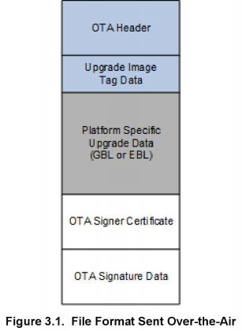

# Over-the-Air Bootload Server and Client Setup (Rev. 1.0) <!-- omit in toc -->

本应用笔记介绍了用户在 `ZCL OTA Upgrade cluster` client 设备和 server 设备之间执行 Zigbee® OTA（over-the-air）引导加载会话时应遵循的流程。本笔记中使用的硬件基于 Mighty Gecko（EFR32MG12）开发套件（有关如何配置与 EFR32MG12 配合使用的 WSTK 开发板的详细信息，请参阅 **WSTK6001 User Manual**）。在使用自定义硬件在自定义的开发环境中设置或测试 OTA 引导加载下载时，也可以参考本文档中的步骤。

## 目录 <!-- omit in toc -->

- [1. 引言](#1-引言)
- [2. 软硬件要求](#2-软硬件要求)
  - [2.1 Client 硬件](#21-client-硬件)
  - [2.2 Server 硬件](#22-server-硬件)
- [3. ZigBee OTA 映像文件格式](#3-zigbee-ota-映像文件格式)

# 1. 引言

本应用笔记介绍了在 `ZCL OTA Upgrade cluster` client 设备和 server 设备之间执行 Zigbee OTA 引导加载会话所需的步骤。演示过程使用基于 EFR32MG12 的 Mighty Gecko 开发板（有关如何配置与 EFR32MG12 配合使用的 WSTK 开发板的详细信息，请参阅 **WSTK6001 User Manual**）。

有关此引导加载程序的更多信息，请参阅文档 **UG103.6: Application Development Fundamentals: Bootloading**。有关 `ZCL OTA Upgrade cluster` 的详细信息，请参阅 **Zigbee cluster library specification** 的最新发布版本。

> 注：在 Silicon Labs AppBuilder ZCL 选项卡中，`ZCL OTA Upgrade cluster` 称为 `OTA Bootloading`。为了保持一致性，本文档中也使用该术语。如果您要搜索 Zigbee 文档，请务必搜索 “OTA Upgrade”。

在自行设置和/或测试 `Zigbee OTA bootload cluster` 时，请参阅本应用笔记。“高级” 部分介绍了如何扩展此示例以使用您自定义的硬件配置，以及如何更改软件配置以支持您自定义的制造商特定信息。

如需更进一步的参考，请参阅：

* Zigbee Document #07-5123, **Zigbee Cluster Library Specification** - “Over-the-air Upgrading” chapter; available from [http://www.zigbee.org](http://www.zigbee.org).
* Silicon Labs document **QSG106: Getting Started with EmberZNet PRO**
* Silicon Labs document **UG102: Ember Application Framework Developer Guide** – Chapter 15
* Silicon Labs document **UG266: Silicon Labs Gecko Bootloader User Guide**
* Silicon Labs document **AN1084: Using the Gecko Bootloader with EmberZNet and Silicon Labs Thread**

# 2. 软硬件要求

本文档中的许多步骤都是使用 AppBuilder（Application Builder）执行的，它是 Simplicity Studio IDE 的一个组件。有关配置应用程序的更多信息，请参阅随您的发行版提供的 **QSG106: Getting Started with EmberZNet PRO**。

许多过程使用 IAR-EWARM 作为编译器。IAR-EWARM 版本必须与 EmberZNet SDK 版本兼容。请参阅 SDK 的发行说明以确定兼容的编译器版本号。

这些过程使用两个基于 EFR32MG12 的 WSTK（Wireless Starter Kits）。其中一个用作以 SoC 模式运行的 client 设备，另一个用作 OTA Server 的 NCP 组件。作为 OTA Server 设置的一部分，还需要运行 Linux 或 Windows（带有 Cygwin）的 PC 主机。

## 2.1 Client 硬件

这些过程中使用的 client 设备是基于 EFR32MG12 的 WSTK（以 SoC 模式运行）。下载空间有两种选择：第一种是使用连接到设备的外部存储设备（如串行 dataflash 或 串行EEPROM）；第二种是仅适用于具有超过 512kB 闪存空间的设备，其使用主闪存的一部分作为下载空间。使用第二种的引导加载程序通常称为内部或本地存储引导加载程序。EFR32MG12 部件可以使用本地存储；而 EFR32MG1 部件则不能。有关 EFR32MGx 部件支持的外部存储器的完整列表，请参阅 **UG266: Silicon Labs Gecko Bootloader User Guide**。

对于使用 EFR32MG1 的 Mighty Gecko 设备，只有串行 dataflash 选项可用；目前没有提供本地存储应用引导加载程序。但是，部件号以 EFR32MG1x6 或 EFR32MG1x7 开头的 Mighty Gecko IC 包含一个集成的串行闪存，其可以像片外串行 dataflash 一样使用，但不需要任何其他组件。

基于 EFR32MG12 或 EFR32MG13 的设备（具有至少 512kB 内部闪存）支持用于本地存储应用引导加载程序设计的内部存储，以及用于基于 SPI 闪存的应用引导加载程序设计的外部存储。在本文档中描述的过程中，内部存储在 EFR32MG12（具有 1024kB 闪存）中使用。有关其他设备的存储器设计的帮助，请联系 Silicon Labs 技术支持。

`Zigbee OTA client cluster` 可与基于 EmberZNet PRO 的设备（以 SoC 或 EZSP NCP 模式运行）一起使用。本文档未介绍如何为基于 NCP 的 client 配置 EZSP 主机应用，但 client 使用 EZSP 时是与在 [2.2 Server 硬件]() 中描述的 server 硬件和设置相同的。本应用笔记展示了一个 `OTA client cluster` 如何与特定硬件配置一起使用的示例。

Client 软件基于最新版本的 EmberZNet PRO 协议栈内包含的 AFV2（ZCL Application Framework V2）。

## 2.2 Server 硬件

这些过程中使用的 NCP 设备是基于 EFR32 Mighty Gecko 的 WSTK，其中与 UART 连接的主机应用通过 EZSP（EmberZNet Serial Protocol）进行通信。在本应用笔记中，与 NCP 连接的 Linux 或 Windows（带有 Cygwin）主机需要运行主机软件。OTA 软件映像的存储是主机的本地文件系统。要避免链接问题，请不要使用虚拟机来运行主机。

OTA server 可以在基于 EFR32 Mighty Gecko 的 SoC 上运行，也可以使用与不同（non-POSIX-based）主机系统一起的 NCP。与此处介绍的配置不同的配置需要一种替代机制，用于将映像推送到 OTA server，以便可以通过 `Zigbee OTA bootload cluster` 协议将它们提供给 client。例如，软件映像可以通过实用程序回程、到本地网络的以太网连接或某些专有机制来推送。

连接到开发板（充当 UART NCP）的 Linux 系统只是提供 OTA 文件的一种可选项。它是 OTA server 最友好的选项，因为有很多机制可以将 OTA 文件推送到 server 的文件系统中。

下图展示了用于 Zigbee OTA 应用引导加载过程的硬件配置图。注意，只需要一个 client。

# 3. ZigBee OTA 映像文件格式

该文件格式在 **Zigbee document 07-5123, Zigbee Cluster Specification, in the “OTA File Format” section of the “Over-theair Upgrade” chapter** 中定义。映像由一个 Zigbee OTA 头、一个或多个专有引导加载程序数据块、以及附加到末尾的一组可选加密签名数据组成。OTA server 只需要读取 OTA 头来提供文件，因此可以为不同的制造商和/或不同的产品提供文件。下图展示了文件格式布局的样例。

Silicon Labs 创建了一个用于生成 OTA 映像的工具，其名为 `Image-builder`。non-ECC 版本的 Image-builder 包含在 EmberZNet PRO 版本的 `tool\image-builder` 子目录中。如果启用了 OTA Bootload Cluster Client Policy 插件，则 AppBuilder 中的 post-build 脚本将运行 Image-builder（作为批处理文件的一部分）来生成 OTA 文件。有关 Image-builder 的更多信息，请参阅 **AN716: Instructions for Using Image Builder**。

OTA 签名是指对 OTA 映像文件进行签名，并且独立于 OTA 包装文件内的更新映像文件中可能存在的任何签名或加密。目前，只有 Smart Energy Profile 支持映像上的签名。本应用笔记假定 OTA 映像不需要签名。
