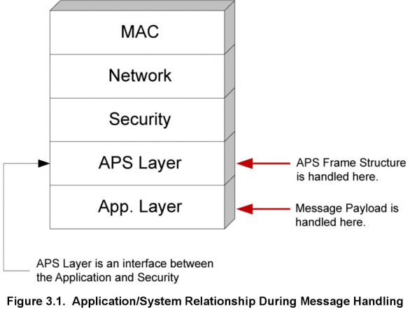
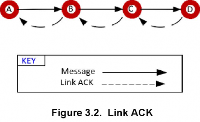

# 设计选择基础 (Rev. 2.1) <!-- omit in toc -->

本文档根据构建无线网络解决方案的主要决策点来描述应用设计过程。

## 目录 <!-- omit in toc -->

- [1. 背景](#1-背景)
- [2. 总体设计选择](#2-总体设计选择)
  - [2.1 无线协议](#21-无线协议)
  - [2.2 SoC 或 NCP](#22-soc-或-ncp)
    - [2.2.1 SoC 方案](#221-soc-方案)
    - [2.2.2 NCP 方案](#222-ncp-方案)
    - [2.2.3 设计上的差异](#223-设计上的差异)
- [3. ZigBee 设计选择](#3-zigbee-设计选择)
  - [3.1 单网络与多网络对比](#31-单网络与多网络对比)
    - [3.1.1 协调器/路由器网络 + 嗜睡终端设备网络](#311-协调器路由器网络--嗜睡终端设备网络)
    - [3.1.2 多个嗜睡终端设备网络](#312-多个嗜睡终端设备网络)
  - [3.2 网络 Discovery/Commissioning](#32-网络-discoverycommissioning)
    - [3.2.1 通过 Extended PAN ID 或信道掩码简化网络选择](#321-通过-extended-pan-id-或信道掩码简化网络选择)
    - [3.2.2 许可加入控制](#322-许可加入控制)
    - [3.2.3 避免在 Commissioning 过程中出现意外后果](#323-避免在-commissioning-过程中出现意外后果)
    - [3.2.4 离开机制](#324-离开机制)
  - [3.3 设备发现和供给](#33-设备发现和供给)
    - [3.3.1 何时发现和供给](#331-何时发现和供给)
    - [3.3.2 标识与分组方法](#332-标识与分组方法)
    - [3.3.3 按钮方法](#333-按钮方法)
    - [3.3.4 匹配描述符请求方法](#334-匹配描述符请求方法)
    - [3.3.5 简单描述符请求方法](#335-简单描述符请求方法)
    - [3.3.6 供给工具方法](#336-供给工具方法)
    - [3.3.7 地址发现](#337-地址发现)
  - [3.4 路由建立](#34-路由建立)
    - [3.4.1 多对一路由的背景](#341-多对一路由的背景)
    - [3.4.2 它在 ZigBee PRO 中如何工作](#342-它在-zigbee-pro-中如何工作)
  - [3.5 消息传递](#35-消息传递)
    - [3.5.1 发送消息](#351-发送消息)
    - [3.5.2 接收消息](#352-接收消息)
    - [3.5.3 确认消息](#353-确认消息)
  - [3.6 NCP 与 Host 应用兼容性](#36-ncp-与-host-应用兼容性)
  - [3.7 安全](#37-安全)

# 1. 背景

Silicon Labs 正在开发满足客户需求的产品，因为我们正在进入一个家庭设备互联的世界，这通常被称为物联网（IoT）。Silicon Labs 物联网的目标是：

* 通过领先的网络（ZigBee PRO、Thread、Bluetooth Smart 或其它新兴标准）连接家中的所有设备。
* 充分利用公司在节能微控制器方面的专业知识。
* 增强现有的低功耗、混合信号芯片。
* 实现云服务以及与智能手机和平板电脑的连接，促进易用性和为用户提供通用的用户体验。

实现所有的这些目标将提高联网家庭中物联网设备的采用率和用户接受度。

随着应用设计人员可选项的增加，早期设计选择的影响也会增加。本文档根据构建无线网络解决方案的主要决策点来描述应用设计过程。基本设计选择包括：

* 使用 Silicon Labs 的哪种无线技术
* 使用 SoC（片上系统）设计还是 NCP（网络协处理器）设计
* 如果使用 NCP 模型，如何选择兼容的 NCP 和 Host（主机）应用

开发 ZigBee 解决方案时的设计选择包括：

* 如何创建网络（形成、加入或离开）
* 使用哪种安全模型
* 在网络中采用哪种路由优化
* 如何通过网络传递消息

一旦考虑了这些选择，您就可以开始实施系统设计了。

# 2. 总体设计选择

在使用 Silicon Labs 的无线微控制器开始进行无线设计之前，您应该首先考虑哪种可用的网络技术最适合您的项目。一旦确定要采用的网络协议，您就需要考虑产品的设计最适合 SoC 范例还是 NCP 范例。如果采用 NCP 范例，则需要考虑使用哪种串行通信来控制协处理器。

## 2.1 无线协议

Silicon Labs 在 Wireless Gecko family 上提供以下可用于开发的协议栈：

* Silicon Labs Flex SDK：包括用于多跳星形网络拓扑的基于 IEEE 802.15.4 的 “Connect” 协议栈（在 **UG103.12: Application Development Fundamentals: Silicon Labs Connect** 中描述），以及用于带有自定义射频配置的真正专有设计的 RAIL（Radio Abstraction Interface Library，无线电抽象接口库）。
* EmberZNet：一个基于 ZigBee PRO 的网状网络协议栈（在 **UG103.2: Application Development Fundamentals: ZigBee** 中详细描述）。
* Silicon Labs Thread：一个基于 Thread 1.1 的 IPv6 网状网络协议栈（在 **UG103.11: Application Development Fundamentals: Thread** 中详细描述）。
* Silicon Labs Bluetooth SDK：一个基于 Bluetooth 2.3 的网络协议栈（在 **UG103.14: Application Development Fundamentals: Bluetooth Smart Technology** 中详细描述）。

熟悉这些协议的详细信息后，您可以根据自身对标准合规性、网络拓扑、互操作性、频率范围和消息吞吐量的需求进行选择。

## 2.2 SoC 或 NCP

无论您是否使用应用框架进行设计，选择设计范例（SoC 模型或 NCP 模型）都是一个关键问题。它规定了软硬件的要求和约束条件。该选择决定了应用相对于核心栈功能的位置。在 SoC 模型中，整个系统（协议栈和应用）在一个单独的芯片上；在 NCP 模型中，则是通过一个单独的 “协处理器” 完成协议栈的处理，该协处理器通过外部串行接口与应用独自的微控制器交互。

下图说明了协议栈和应用的各种组件以及它们如何相对于 SoC 或 NCP 架构模型进行组织。

虽然在架构之间做出选择并非易事，但应用框架在一定程度上掩盖了这些差异，在必要时简化了从一个架构到另一个架构的更改，或者支持不同产品的架构组合。

### 2.2.1 SoC 方案

在 SoC 方案中，单个芯片（如 Wireless Gecko EFR32™）提供了所有的栈功能（包括集成的 Flash、RAM 和射频收发器）以及应用层组件（应用配置文件、簇、属性管理和协议栈交互）。栈功能是以预编译库文件的形式实现，您必须在最终构建过程中将其与应用相关的代码链接起来，以生成单个包含完整功能的无线应用所需的所有内容的二进制映像。应用框架虽然由 Silicon Labs 提供，但其仍被视为应用层的一部分。

> 注意：虽然 bootloader 通常用于已部署的无线网络设备，但 bootloader 固件并非此二进制映像的一部分。然而，Silicon Labs 确实提供了 post-build 工具，可以使用该工具将应用固件和栈固件组合到单个 HEX 记录文件中，以便于分发和制造。有关 EmberZNet PRO 应用的这些实用程序的更多信息，请参阅文档 **UG107: EM3x Utilities Guide**、**UG162: Simplicity Commander Reference Guide** 和 **UG103.6: Application Development Fundamentals: Bootloading**。

在 SoC 方案中，应用（包括应用框架）与协议栈共存。应用调用协议栈库提供的 API，并且由协议栈触发应用代码实现的处理函数。当使用应用框架进行应用设计时，框架会处理这些 API 的调用并实现必要的处理函数，然后将它们封装在更高级别的 API 和应用回调中，以简化设计过程并帮助确保协议的合规性。

由于 SoC 模型仅需要单个芯片，因此与需要多个 IC 的 NCP 模型和传统设计架构相比，SoC 模型的功耗和 BOM（bill of materials）成本更低，并且布局可以更小。此外，当所有东西都驻留在单个芯片上时，可以实现与协议栈软件和无线电硬件的更紧密集成，从而能够更精确和及时地控制与协议栈活动相关的应用行为。

然而，当您使用 SoC 模型时，您就会受到该 SoC 系列中可用产品的限制。其中包括：

* Flash 和 RAM 存储的限制
* 工具链的限制，如需要为基于 ZigBee 和基于 Thread 的 SoC 使用 IAR Embedded Workbench
* HAL 限制，如某种类型的外设数量有限，或缺少一些专用外设
* 基于必须与栈共享 CPU 的时序约束，该栈具有自身的一组要求，以便维护 IEEE 802.15.4 和协议合规性

如果这些限制中的任何一个对你有很大的阻碍，那么 NCP 模型可能是更具吸引力的替代方案。

### 2.2.2 NCP 方案

> 注意：本节不适用于 Bluetooth SoC 或 NCP 模型。有关更多信息，请参阅 **AN1042: Using the Silicon Labs Bluetooth® Stack in Network Co-Processor Mode** 和 **UG136: Silicon Labs Bluetooth® C Application Developer's Guide**。

在 NCP 方案中，Silicon Labs 芯片（带有集成的 Flash、RAM 和射频收发器）通过预加载的协处理器固件（具有运行时可配置性）自行运行大多数的栈功能，然后使用一个串行接口（如 SPI 或 UART）与第二个设备（称为 “Host” 处理器）通信，其中应用层功能与核心栈组件分开 “托管”。NCP 可能是一种特殊的集成电路（具有有限的 I/O 和简化的功能），其目的是作为协处理器；或者它可能是一个功能齐全的微控制器，只是因为将协处理器固件加载到其上，所以其表现为 NCP。

为了方便应用的 Host 和栈的 NCP 之间的通信，Silicon Labs 提供了两种串行命令集。第一种称为 EZSP（EmberZNet Serial Protocol，EmberZNet 串行协议），用于开发 ZigBee 解决方案（有关 EZSP 的更多信息，请参阅文档 **UG100: EZSP Reference Guide**）；第二种称为 TMSP（Thread Management Serial Protocol，Thread 管理串行协议），用于开发 Thread 解决方案。Silicon Labs Flex SDK 中的 Silicon Labs Connect 协议栈也提供了 NCP 解决方案，用于专有开发。

EZSP 可以通过 SPI 同步运行或通过 UART（带或不带流控制）异步运行，其使用 EZSP 特定命令帧（有时可能与 EmberZNet 中基于 SoC 的对应部分略有不同）来模拟 EmberZNet PRO API 并使用回调响应帧来模拟 EmberZNet 相关的处理函数。Silicon Labs 提供了 EZSP 驱动程序源码，将这些串行命令和响应抽象为一组 API 和处理函数，类似于 SoC 模型中所使用的那样。当应用框架用于实现应用层时，它负责调用必要的 API 函数并实现所需的处理函数，从而允许设计人员专注于使用客户端 API 和框架回调进行更高级别的应用处理。

在 TMSP 协议中，也提供了 SPI 和 UART 的变体，Host 端 API 不是与基于 SoC 的 Thread 应用所使用的 API “相似” 的专用函数。相反，它们（由提供的 TMSP 驱动程序代码处理的 Host 端接口的抽象）实际上与基于 SoC 的系统上使用的 API 和回调相同。此外，TMSP 驱动程序包含一些功能来管理 NCP 上的底层 IP 层，以改善在 NCP 及其 Host 上共享的栈的上层之间的协调。

NCP 平台的主要优势在于其灵活性。Host 处理器可以像 8 位微控制器一样简单，也可以像具有千兆字节的内存和 Windows 或 Linux 操作系统的 64 位计算机一样复杂。这意味着 NCP 设计非常适合在现有系统上添加或改造一个设备的场景，这样可以利用 OEM 在软件和硬件方面的专业知识和知识产权来加速设计周期和加快上市时间。NCP 方案的另一个优点是，与可用的 SoC 选项相比，Host 可以为应用提供更多的资源（Flash 和 RAM）和不同的外设集。这允许使用新特性开发更复杂的应用，并在应用中添加重要的新特性时保护应用不会超出 SoC 的限制。

通过将栈处理与应用解耦，可以在栈端安装修复程序和新特性，只需对 NCP 进行简单的固件更新，而无需对 Host 上的应用固件进行任何更改。这种解耦还消除了与栈共享处理器的 CPU 时序限制。由于 NCP 固件管理 NCP 的睡眠状态以最小化其活动和当前消耗，因此当应用执行不直接涉及栈的任务时，仅需要 Host 处理器处于活动状态。如果在没有无线电的情况下，当 CPU 处于活动状态时，Host 处理器的有效电流消耗低于 SoC 的有效电流消耗，那么运行非网络应用任务时 Host 和 NCP 消耗的总电流实际上可能低于对等的 SoC 场景。

NCP 方案的主要缺点是增加了额外的 Host 处理器，这增加了额外的成本和 PCB 空间，并可能影响设备的总体功耗。另一个权衡是将栈处理和应用解耦意味着栈和应用之间的某些时间敏感的交互不再能够 “实时” 发生，而必须以通知的形式来通知栈在事后做出决策。因此，Host 应用在某些决策出现时确定其结果的机会变少。相反，在 NCP 上配置 “策略” 以指导这些情况下的栈行为。此外，由于 NCP 固件是 Silicon Labs 提供的预构建固件，因此应用设计人员会对栈的行为以及内部资源的分配失去一定程度的控制。

当您使用 NCP 方案时，您就必须决定使用哪个 Host 平台进行设计。该平台可能与原型和最终设计阶段不同，具体取决于材料的可用性和调试初始阶段所需的灵活性。在选择 Host 平台时，请考虑您在该平台上的现有专业知识、可用工具和资源、该平台的成本和功耗要求，以及可用于应用开发的内存量，包括未来增强所需的任何空间。在开发 ZigBee 解决方案时，还应考虑是否使用 UART 或 SPI 来进行 EZSP 通信。EZSP-UART 需要一个更复杂的驱动程序，通常用于兼容 POSIX 标准的操作系统，其比 EZSP-SPI 驱动程序具有更复杂的逻辑和更大的内存占用，并且其支持的最大吞吐量不是很高。但是，EZSP-SPI 实现比 EZSP-UART 设计需要更多的接口引脚（用于 EZSP 的可移植操作系统接口（POSIX）的 SPI 驱动程序也是可用的，但在嵌入式 Linux 操作系统上的可移植性通常低于兼容 POSIX 标准的 UART 驱动程序）。由于并非所有微控制器或操作系统都支持 SPI，因此 Host 的架构限制可能决定了选择哪种设计。Thread 的 TMSP 对 SPI 和 UART 也有类似的权衡。有关设置 Thread Host SPI 驱动程序的更多讨论，请参见 **AN912: SPI Host Interfacing Guide for Thread**。

### 2.2.3 设计上的差异

> 注意：本节不适用于 Bluetooth SoC 或 NCP 模型。有关更多信息，请参阅 **AN1042: Using the Silicon Labs Bluetooth® Stack in Network Co-Processor Mode** 和 **UG136: Silicon Labs Bluetooth® C Application Developer's Guide**。

下表按功能展示了 SoC 应用与基于 NCP 的 Host 应用之间的一些主要差异。

<table>
  <tr>
    <th>Method </th>
    <th>Difference </th>
  </tr>
  <tr>
    <td colspan="2">Managing stack parameters, such as table sizes and allocation limits, and endpoint descriptor data, such as support clusters and profiles</td>
  </tr>
  <tr>
    <td>SoC </td>
    <td>Mainly set up through compile-time definitions built statically into the application binary.</td>
  </tr>
  <tr>
    <td>NCP </td>
    <td>Managed by the NCP but configured by host at runtime after bootup of NCP and before engaging in any network activity; this interval is referred to as the “Configuration” phase and allows dynamic configuration of the NCP without rebuilding its firmware.</td>
  </tr>
  <tr>
    <td colspan="2">Application reaction to events</td>
  </tr>
  <tr>
    <td>SoC</td>
    <td>The application can react to events, such as security authentication request, an incoming data poll from a child, or a remote binding modification, in the moment and can handle events on a case-bycase basis.</td>
  </tr>
  <tr>
    <td>NCP</td>
    <td>The host application configures policies ahead of time to pre-determine the outcome; notifications are after the fact.</td>
  </tr>
  <tr>
    <td colspan="2">Polling (for sleepy end devices that need to poll the network periodically) The application framework takes care of the polling state machine, so the difference is negligible when it is used. </td>
  </tr>
  <tr>
    <td>SoC</td>
    <td>The application controls when each poll occurs and chooses how to react to the result of each poll.</td>
  </tr>
  <tr>
    <td>NCP</td>
    <td>The host application configures poll rate and failure tolerance. NCP handles polling with the configured rate, and only notifies the host when the failure rate surpasses the configured threshold. This can make the application state machine design easier on host platforms if not using an application framework.</td>
  </tr>
  <tr>
    <td colspan="2">Managing message buffers The application framework handles SoC buffer management, so the difference is negligible when it is used. </td>
  </tr>
  <tr>
    <td>SoC</td>
    <td>The application shares memory for packet data with the stack. Shared message buffers must be allocated by the application for outgoing message data, and by the stack for incoming or relayed message data. Buffer management process, including buffer allocation/deallocation and construction, can be tricky and is often the source of errors in SoC application design.</td>
  </tr>
  <tr>
    <td>NCP</td>
    <td>NCP handles the buffer management itself and accepts / delivers message payload data as a simple array and a length argument.  This makes messaging interface simpler and less error-prone if not using an application framework.</td>
  </tr>
  <tr>
    <td colspan="2">Handling zigbee source routing, where the application is expected to handle incoming Route Record notifications and preserve this data in a “source route table”</td>
  </tr>
  <tr>
    <td>SoC</td>
    <td>Source route table resides on SoC; its size is constrained by the SoC’s limited RAM resources.</td>
  </tr>
  <tr>
    <td>NCP</td>
    <td>NCP can collect the last N source routes in its own internal source route table, where N is sized by the host application during configuration. However, the host receives route record data in callbacks from the NCP and can generally buffer much more route data than the NCP, depending on the host’s RAM constraints. This makes the High RAM Concentrator operation (often used for gateways, commissioning/configuration tools, and other major aggregation points) more feasible on an NCP platform than on an SoC platform, especially those SoC platforms where RAM availability is limited.</td>
  </tr>
  <tr>
    <td colspan="2">Adding and Removing Core Networking and Radio Functionality</td>
  </tr>
  <tr>
    <td>SoC</td>
    <td>When changing the core (stack) functionality in an SoC application, you need only add or remove libraries or source code from a single application. This is easily done using the application framework by changing the plugins to be included.</td>
  </tr>
  <tr>
    <td>NCP</td>
    <td>If you want to change the core (stack) functionality in your host plus NCP application, you must make changes to both the host processor application and the NCP firmware. This can be slight hindrance to the application development process, but the Network Coprocessor Application Framework can help with this. This application framework provides an interface to build NCP applications that include only selected pieces of core networking and radio functionality.</td>
  </tr>
</table>

# 3. ZigBee 设计选择

尽管应用框架简化和抽象了设计过程，但是无论设计是否基于应用框架，都必须在实现中作出一些设计决策。在开发 ZigBee 协议（包括 ZigBee PRO 和 ZigBee RF4CE）应用时，可以使用以下设计选择：

* 单网络或多网络
* 网络 Discovery/Commissioning 方法
* 设备发现和供给（Provisioning）方法
* 路由建立方法
* 消息传递方法
* NCP 与 Host 应用兼容性

## 3.1 单网络与多网络对比

单个网络节点是一个形成或加入一个网络的节点，必须在形成或加入第二个网络之前离开该网络。EmberZNet PRO 4.7 引入了一个节点同时成为多个网络的一部分的可能性（EM351 不支持此特性）。

> 注意：对于 EmberZNet PRO，多网络支持仅限于两个网络。未来可能会支持两个以上的网络。

到目前为止，任何设备都需要两个物理芯片才能成为两个网络的一部分。例如，被设计成家庭自动化（HA，Home Automation）个域网（PAN，personal area network）和智慧能源（SE，Smart Energy）个域网之间的网关设备将使用第一个芯片加入到第一个网络，然后使用第二个芯片加入到第二个网络。应用必须管理两个硬件，这将增加硬件和应用设计人员的工作复杂性。

多网络栈消除了逻辑 PAN 和物理芯片之间的一对一映射，并将其扩展为多对一映射。可以将单芯片设备的应用设计成可能运行不同安全配置文件（例如 HA 和 SE）的多个 PAN 的一部分。使用单个芯片可以降低硬件要求并降低硬件和应用代码设计的复杂性，从而节省成本。

如果设备需要在两个网络上作为协调器或路由器，或者应用需要在两个不同的协议栈（如 EmberZNet PRO 和 Silicon Labs Thread）上运行，则应用仍需要双芯片配置。

单芯片上的多网络是通过对芯片的唯一无线电在网络上进行分时来实现的。换句话说，多网络节点根据网络调度算法来重置网络之间的所有无线电参数。

事实上节点在多个网络上同时活动是对应用完全透明的。API 允许应用指定引用一组 API 调用的网络。类似地，API 允许应用了解栈回调与哪个网络相关。有关双网络 API 的更多详细信息，请参阅文档 **AN724, Designing for Multiple Networks on a Single Chip**。

AFV2 和网络协处理器应用框架都提供了对双网络的支持。我们强烈建议在开发双网络应用时使用应用框架。应用框架在降低复杂性方面提供了许多优势，主要是与框架如何无缝地管理不同的网络上下文有关。

通常，当需要在特定网络上发送传出包时，多网络栈会切换网络或调谐无线电到不同的网络上。在非传输期间，无线电始终根据栈的内部网络调度算法调谐到其中一个网络上。

节点在网络上的角色有一定的限制。由于协调器或路由器节点被期望始终保持无线电以监听传入的数据包，因此多网络节点只能在一个网络上是协调器或路由器，而在其他网络上它必须是嗜睡终端设备。

> 注意：节点可以在一个网络上假定为任何角色，但必须在其他网络上为一个嗜睡终端设备。

节点参与的网络可以是不同的信道、不同的 PAN ID、不同的短 ID、不同的配置文件等。然而，一个多网络节点在其参与的网络中维护相同的 EUI64 地址。下一节将更详细地讨论两种基本配置，第一种是多网络节点在一个网络上为协调器或路由器，在所有其他网络上为嗜睡终端设备；第二种是在所有网络上都为嗜睡终端设备。

### 3.1.1 协调器/路由器网络 + 嗜睡终端设备网络

作为一个网络上的协调器/路由器和其他网络上的嗜睡终端设备的多网络节点应该将大部分时间花在协调器/路由器网络上。网络调度算法负责无缝地从一个网络切换到另一个网络，使得节点除了周期性的短时间外总是在协调器/路由器网络上。特别地，节点临时离开协调器/路由器网络以完成在嗜睡终端设备网络上的某些事务，例如从父节点检索轮询/数据，和/或发送数据到父节点。这些事务通常在应用层发起。因此，应用设计人员应该设计应用来使节点不会长时间地离开协调器/路由器网络。多网络节点在嗜睡终端设备网络上过于繁忙会持续地影响节点的吞吐量，并且通常会延迟在协调器/路由器网络上通过该节点路由的所有流量。

在文档 **AN724, Designing for Multiple Networks on a Single Chip** 中，Silicon Labs 提供了从广泛实验中获得的数据，这些数据显示了典型的轮询和数据事务在嗜睡终端设备与其父设备之间的平均持续时间。该文档还包括了嗜睡终端设备网络上的活动如何影响协调器/路由器网络上的吞吐量的详细研究。利用这些数据，您可以根据多网络节点在嗜睡终端设备网络上处理的流量以及此流量如何影响协调器/路由器网络的性能，进行有根据的设计选择。

请注意，即使节点在大多数网络上充当嗜睡终端设备，但是如果它在任何一个网络上作为协调器/路由器，那么它将无法通过暂时关闭无线电来节能（睡眠模式）。

### 3.1.2 多个嗜睡终端设备网络

在所有网络上作为嗜睡终端设备的多网络节点不需要始终保持打开无线电。节点可以在每个网络上以不同的轮询速率进行轮询。只要任何网络上没有活动，节点就能够睡眠。

## 3.2 网络 Discovery/Commissioning

Commissioning 是指使设备进入网络的过程。如果您已阅读文档 **UG103.2: Application Development Fundamentals: ZigBee** 中有关网络加入过程的讨论，您可能还记得，除非设备充当 PAN 的协调器，否则它必须请求加入现有的网络，并且加入设备必须扫描一个或多个信道以定位可用的网络。然而，由于网络协调器在形成 PAN 时有多个无线电信道可供选择，并且由于网络的 PAN ID 和 Extended PAN 通常是随机的，因此您的应用通常需要一些情报或外部机制来协助网络发现（discovery）和 commissioning。这些任务包括帮助确保设备可以加入到合适的网络或从某些外部源接收所需的网络设置，并确保当错误地加入到错误的网络或设备正在迁移到新的安装时可以从网络中移除设备。同样，如果您正在设计一个可充当 ZigBee PAN 协调器的设备，则必须重点考虑如何为希望进入您的协调器网络的设备简化网络选择的过程。

> 注意：如果您正在设计一个用于官方公共 ZigBee PRO 应用配置文件（如家庭自动化）的应用，Silicon Labs 建议您查看您所设计的目标的相应 ZigBee 应用配置文件规范的最新发布版本（从 [http://www.zigbee.org](http://www.zigbee.org) 中获取），以确保其符合任何配置文件特定的要求或 commissioning 的最佳实践。

### 3.2.1 通过 Extended PAN ID 或信道掩码简化网络选择

虽然 PAN 的协调器选择的 Extended PAN ID 通常是随机的，但是专有网络的部署可以使用 Extended PAN ID 的特定位掩码来增强加入设备的网络选择。在该模型中，协调器在该商定的 Extended PAN ID 掩码内形成网络，这样加入设备就可以扫描开放 PAN 的信道，并限制所配置的 Extended PAN ID 范围外的信道。然而，对于希望在公共 ZigBee PRO 配置文件上与众多制造商的设备进行互操作的设备来说，这种增强网络选择的方法并不可行。由于公共 ZigBee PRO 应用配置文件通常不限制其 Extended PAN ID 的选择，因此另一个供应商的设备可能会占用您所选择的限制位掩码之外的 Extended PAN ID。

类似地，尽管 2.4GHz ZigBee 网络可以占用 16 个不同信道中的任意一个，但是加入设备可能会限制其信道掩码来进行扫描。预期的网络可能是一个专有的设计，该设计中协调器选择将其信道选择限制在预配置的掩码中的几个信道。或者，所包括设备的一个或多个端点所基于的应用配置文件可能需要将网络的信道选择约束到特定的一组信道上。例如，ZigBee PRO SE 和 HA 应用配置文件都要求在形成网络时优先考虑在最常用的 Wi-Fi 信道（IEEE802.11 范围内的信道 1、6 和 11）之外的信道，其允许加入设备将其信道扫描限制在 ZigBee 信道 11、14、15、19、20、24 和 25 上。注意，AFV2 使用 Network Find 插件（如果启用）在设备加入或形成一个网络时配置设备的信道掩码。如果使用 Application Builder 配置应用，请确保在 Network Find 插件的配置对话框中查看 Channel Mask 和其他无线电参数设置。如果您没有使用 Network Find 插件或您的应用不是基于 AFV2，那么您的应用代码需要使用自己的方法来确保在扫描、加入或形成网络期间强制执行首选信道掩码和任何其他首选网络参数。

### 3.2.2 许可加入控制

希望加入网络的设备通常只考虑那些对新设备开放的 PAN（换句话说，它们许可加入），设备不得永久地竖立 `permitJoining` 标志，因为这可能会导致公共配置文件和制造商特定的配置文件（MSPs）的 ZigBee PRO 合规性测试失败。因此，当需要将新设备添加到网络时，设备（尤其是 PAN 协调器）必须确保它们能够在一段有限时间内本地启用 `permitJoining` 标志。通常由某些外部刺激来进行启用，这取决于设备的物理能力。设备可以使用按钮或串行接口，这通常是启用 `permitJoining` 的一个合适的刺激。然而，如果设备没有外部输入作为此刺激，则必须考虑其他方法。一种可能性是在首次启动时让设备在一段有限时间内启用 `permitJoining`；另一种选择是当节点通过无线接收到特定消息时启用 `permitJoining`。

关于后一种方法，应用可以通过本地调用 `emberPermitJoining()` API 或 `permitJoining` EZSP 命令来对其自身的 `permitJoining` 状态进行本地更改；也可以通过 ZDO（ZigBee 设备对象，本质上由协议栈实现）发送一个标准请求到 ZigBee 节点以请求其更改其 `permitJoining` 状态。当应用配置文件 0x0000（ZigBee 设备配置文件）上的端点 0（ZDO）通过无线方式接收的 ZDO 许可加入请求时，协议栈会自动更改设备上的 `permitJoining` 状态。该请求的单播或广播提供了一种标准方式，以分别远程更改一些或所有设备的网络加入许可。有关实现此请求的示例代码，请参阅您的 EmberZNet PRO 安装目录下的 `app/util/zigbee-framework/zigbee-device-common.h` 文件中的 `emberPermitJoiningRequest()` API。

一旦网络在许可加入的加入设备的范围内包含至少一个节点，加入设备应该能够通过协议栈本机的 `emberNetworkFoundHandler()`/`ezspNetworkFoundHandler()` 回调或通过其他在 `app/util/common/form-and-join.h` 中找到的 `form-and-join` 实用程序提供的 `emberJoinableNetworkFoundHandler()` 回调（通过 AFV2 架构使用）将其检测为可加入（有关建议的实施，请参阅 AFV2 的 “Network Find” 插件或 “Network Steering” 插件）。

### 3.2.3 避免在 Commissioning 过程中出现意外后果

一旦您的加入设备找到可加入的网络并尝试加入它，应用或安装程序必须确定它是否是 “正确的” 网络，这意味着是预期的网络不是恰好在范围内并许可加入的其他任意 PAN。加入和随后的身份验证过程（涉及获取 PAN 的当前 NWK（网络）层加密密钥），可能会以各种方式失败，甚至在加入预期网络时也是如此。因此，永久地排除尝试加入但加入/验证失败的网络并不一定是最佳做法。同样，根据加入设备的安全预期，它可能会成功加入一个实际上不正确的网络，因此简单地（因协议栈发送 `EMBER_NETWORK_UP` 信号，这指示设备已成功加入并验证到网络中）永久固定进入一个网络可能是不够的。确定尝试的网络是否正确的标准因您的设计要求而异，特别是在涉及安全性的情况下。

如果您正在设计用于 ZigBee PRO SE 网络的设备，则在设备成功进入网络之前，需要进行一个复杂的预授权过程。有关更多信息，请参阅文档 **UG103.5: Application Development Fundamentals: Security**。假设在目标网络中已满足预授权的要求，那么实际上不可能加入到错误的网络，因为如果到达加入设备的 NWK 密钥未加密或使用不同的 APS（Application Support）加密，则加入设备将不接受 NWK 密钥传递。

然而，即使使用 SE 安全模型，加入节点仍可能需要考虑这样一个事实，即不可靠的链路或其他通信问题，特别是如果它涉及到 PAN 的信任中心，可能导致从信任中心传递 NWK 密钥失败，即使其在正确的网络中。因此，如果检测到一个可加入的网络但后续加入和身份验证失败并且 `EmberStatus` 为 `EMBER_NO_NETWORK_KEY_RECEIVED`（意味着 NWK 密钥未成功到达）、`EMBER_JOIN_FAILED`（这可能表示未成功接收到加入的关联响应）、或 `EMBER_NO_BEACONS`（意味着所选网络上的关联请求未能得到应答），您可能希望立即或稍后再次尝试在该 PAN 上的加入过程，以防第一次尝试因某些临时破坏而失败。如果在所选的 PAN 上的加入或身份验证过程仍然失败，请考虑尝试加入其他可加入的网络，前提是这些网络对于您的设备是可用的，因为失败可能表明这只是错误的网络。

在网络中使用 HA 安全模型，该安全模型带有一个通用的、预配置的 APS 链路密钥，用于传递随机生成的 NWK 密钥。如果多个可加入网络恰好在加入设备的范围内，则存在意外加入错误网络的重大风险。因为这些网络之间的安全设置几乎对所有 HA 网络都是通用的，而不是对每个传入节点是唯一的。请注意，HA 网络可能使用不同的预配置链路密钥，但在加入网络之前，必须以某种方式将此密钥传达到新节点。因此，您应该特别注意您的应用设计，以确保一旦您成功进入 PAN，它就是预期的。这通常涉及到接受您的设备的每个可用网络的某种 “加入和验证” 过程，这意味着发送某种明确定义的无线消息，其具有预期响应以指示加入正确的网络；此响应可能是另一个无线消息，或者可能是系统另一部分的某种可检测行为。

下表描述了每种方法的示例，从一个新节点加入候选网络开始：

<table>
  <tr>
    <th>Triggering Event</th>
    <th>Success</th>
    <th>Exception</th>
  </tr>
  <tr>
    <td colspan="3">Example 1</td>
  </tr>
  <tr>
    <td>Node sends broadcast ZDO Match Descriptor Request for one or more target clusters that are important to the node’s operation.</td>
    <td>ZDO Match Descriptor Response received from one or more remote nodes.</td>
    <td>No matches found; node goes to the next network candidate.</td>
  </tr>
  <tr>
    <td colspan="3">Caveats:  As this verification process detects only devices that support the desired clusters, it can succeed when the joining node has entered a network with the same kind of security model and same kind of cluster capabilities as the intended network. For example, the garage door opener may join an arbitrary network with a garage door to control, but not the intended one. If this happens, the system must somehow detect the condition and instruct the new node to leave the current network and find a different one.  This process only succeeds when at least one other node with the matching services has already been joined to the network. This introduces a commissioning requirement for the order in which devices must be joined, which must be communicated to the installer.</td>
  </tr>
  <tr>
    <td colspan="3">Example 2</td>
  </tr>
  <tr>
    <td>Step 1: Node sends a unicast ZDO Match Descriptor Request to the network coordinator (node ID 0x0000), trying to match a device with support for ZCL Identify server cluster.</td>
    <td>Node receives a ZDO Match Descriptor Response from the coordinator.</td>
    <td>No response; node goes to the next network candidate.</td>
  </tr>
  <tr>
    <td>Step 2: Node sends a ZCL Identify command to the coordinator on the matched endpoint.</td>
    <td>The coordinator identifies itself to the system in some detectable way.</td>
    <td>Identification not received within an expected timeframe; system acts on the node so that it leaves the network and goes to the next candidate.</td>
  </tr>
  <tr>
    <td colspan="3">Caveats:  In addition to the required instructions for the system, this method depends on having the coordinator accessible whenever a node is joined to the network. This is generally the case, as the coordinator is typically fulfilling the role of trust center to provide central authentication for each new node.  This method also requires having some system-accessible stimulus available on the joining node to enable it to change networks.</td>
  </tr>
  <tr>
    <td colspan="3">Example 3</td>
  </tr>
  <tr>
    <td>PAN’s Trust Center receives the TrustCenterJoinHandler callback for the joining device.</td>
    <td>PAN’s Trust Center notifies the system through visual or audible indications on the Trust Center or some dedicated user interface such as a networked PC.</td>
    <td>System does not get the expected indication; system acts on the node so that it leaves the network and goes to the next candidate.</td>
  </tr>
  <tr>
    <td colspan="3">Caveats:  This example does not require that the joining node’s application send any extra messages, which greatly simplifies the commissioning design for the joining node’s application. However, it does rely on certain intelligence and capabilities at the PAN’s trust center device. Use of this method involves cooperation with the designer of the expected trust center (coordinator) node for your system.</td>
  </tr>
</table>

选择上述方法之一或其中的一些变体可能取决于您的系统中设备的能力、多厂商互操作性的重要性、commissioning 过程的预期延迟以及安装程序的复杂程度。

ZigBee 在 ZCL 中提供一个 `commissioning cluster`，其可以将某些 commissioning 参数无线安装到设备中。然而，在撰写本文时，HA 和 SE 配置文件都不需要在其设备类型的客户端或服务端中实现此簇（cluster），也没有将其用作测试这些配置文件的 ZigBee 互操作性测试事件的一部分。使用 `commissioning cluster` 仅在这些网络中可行（在这些网络中，您可以确保加入节点具有对 `commissioning cluster` 的服务端支持，并且系统中至少有一个设备具有客户端支持以发送 commissioning 命令）。此外，由于 `commissioning cluster` 依赖于 ZigBee 消息传递（这需要首先进入网络），因此您需要设计一种方案，使您的设备加入一个临时的 commissioning 网络，其中存在一个可提供必要参数的 commissioning 工具。虽然应用框架允许 ZCL 的 `commissioning cluster` 的使用，但如果需要，该簇的实现是应用开发人员的责任。

### 3.2.4 离开机制

许多设计人员把注意力放在网络选择过程上，而忽略了为系统提供从当前网络中卸载设备然后将其安装到新网络的方法。如前面的 commissioning 示例所示，使设备能够以某种方式手动或自动地发起一个 `emberLeaveNetwork()` 动作，并可能在离开完成后找到一个新网络通常是必需的，这便于 ZigBee 设备在其预期网络中成功安装和重新安装。

如果这不能在加入设备自身的硬件或软件中实现，那么由协议栈自动执行的 ZDO 的离开请求机制可能是一种可行的替代方案，因为它允许 PAN 中的另一个节点（如网络的控制器）指示设备离开网络。有关实现 ZDO 离开请求命令的示例代码，请参阅您的 EmberZNet PRO 安装目录下的 `app/util/zigbee-framework/zigbee-device-common.h` 文件中的 `emberLeaveRequest()` API。

## 3.3 设备发现和供给

一旦您将设备加入到正确的网络，它需要某种方式与 PAN 中提供相关服务的其他节点进行配对（即客户端设备与一个或多个服务端设备配对）。将 PAN 中的相关设备配对在一起以用于应用级通信的这一过程被称为 “供给（provisioning）”。相比之下，“commissioning” 涉及的是将设备关联在一起以在网络栈级进行通信。在设计时，请考虑如何发现 PAN 中的哪些设备和多少设备提供了感兴趣的服务（簇）以及您将提供何种方式以将这些相关设备进行关联。请注意，实际的供给过程通常以一个或多个所涉及的设备结束，每个设备将其伙伴（partner）设备注册到其绑定表、地址表或一些用于记住已供给伙伴的自定义存储机制中，以便将消息发送到该目的地。

### 3.3.1 何时发现和供给

通常，应用设计人员将其应用设计为执行某种设备发现，并尝试在设备 commissioning 过程完成后（即在其上线之后）立即进行供给。然而，由于设备一次只加入一个，这意味着供给的一方通常在另一方之前在线，您可能需要有一个由软件状态机逻辑、外部中断或一些无线刺激发起的机制。以便稍后在设备的网络生命周期内发起供给。

下一节将介绍不同的供给方法，每种方法各有优缺点。

> 注意：如果您正在设计一个用于官方公共 ZigBee PRO 应用配置文件（如 ZigBee 3.0）的应用，Silicon Labs 建议您查看您所设计的目标的相应 ZigBee 应用配置文件规范的最新发布版本（从 [http://www.zigbee.org](http://www.zigbee.org) 中获取），以确保其符合任何配置文件特定的要求或供给的最佳实践。

### 3.3.2 标识与分组方法

此方法可用于在单个源设备（通常是作为供给的簇客户端）与一个或多个目标设备（通常是作为供给的簇服务端）之间进行一对一或一对多供给。它涉及通过接收来自某个设备的标识（identify）命令或某些外部刺激以将每个目标节点置于标识模式。然后，源节点广播发送 “Add Group If Identify” 命令（所需的 ZCL 的 `Identify cluster` 中的客户端命令），使得当前处于标识模式的所有节点通过 ZCL `Groups server cluster` 维护的分组表将自己添加到指定的分组。一旦目标设备属于单个分组，源设备就可以直接向分组发送多播（`EmberOutgoingMessageType` of `EMBER_OUTGOING_DIRECT`）或者可以为目标分组创建多播绑定，然后通过该绑定发送传出命令（`EMBER_OUTGOING_VIA_BINDING`）。

优点：

* 允许将单个设备同时供给到多个目标。
* 如果所有目标设备都支持将自身置于标识模式的本地方法，则只需要一条无线消息（Add Group If Identifying 命令）。
* 可以在很长或很短的时间间隔内执行，因为标识命令中使用的标识时间可以设置成很小或很大。
* 可以使设备进入标识模式，以便在需要时可以通过这种方式无线进行供给，因此可以在没有本地刺激（按钮或其它用户界面）的设备上工作。
* 如果无法手动告知源节点以发送 Add Group If Identifying 命令，则可以将源节点置于标识模式并添加到组中，以便自动创建多播绑定（作为分组表逻辑的一部分），用于与目标沟通。

缺点：

* 目标设备必须支持 `Groups server cluster` 和 `Identify server cluster`。
* 目标设备可能需要本地刺激（如按钮按压）才能进入标识模式，除非系统中的另一设备可以被告知以将标识命令发送到感兴趣的特定设备。

### 3.3.3 按钮方法

此方法涉及按下一个或多个设备上的按钮以使其发出一条消息（该消息可被其他设备识别为信号，以便在适当时使用此设备进行供给），或者使其进入一种接收特定消息的状态，在特定的时间窗口内接收到特定消息会使其与发送者进行供给。例如，一个需要连接到一个或多个灯的灯开关可以按下按钮来进入一种状态，在接下来的 30 秒内，任何由灯发送的 “Add to switch” 消息都会导致灯开关为这些灯注册绑定条目。类似地，每个灯都可以按下按钮（或其他刺激）来发送 “Add to switch” 消息。

优点：

* 在按钮按下时发生的动作和某一供给状态的持续时长的实现具有很大的灵活性，这反过来又影响了供给过程允许的时长。
* 可用于一对一或一对多供给。
* 不需要任何第三方设备（不是供给过程的任何一方）的参与。
* 允许用户/安装人员通过手动交互显式地控制供给过程。
* 不需要任何特殊的簇支持。
* 可以与其他涉及手动交互的供给方法结合使用，如标识与分组方法。

缺点：

* 供给的一方或双方需要本地刺激（如按钮）来参与该过程。
* 可能涉及专有的消息传递协议（例如，上面示例中讨论的专有的 “Add to switch” 消息）或特定应用的行为，从而降低了供应商之间的互操作性。
* 如果同时发生多个供给过程（例如，如果多个安装人员同时在同一网络上执行按钮供给），则可能在错误的设备之间进行供给。

### 3.3.4 匹配描述符请求方法

在此方法中，期望发现特定供给伙伴的设备通过 ZDO 匹配描述符（Match Descriptor）事务来查询一个或多个节点，并根据每个其他节点的端点上的描述符信息（应用配置文件、设备标识符、簇 ID 和客户端/服务端支持）找到合适的供给伙伴。在涉及此方法的典型场景中，在应用配置文件 Y 上配置的特定簇（簇 X）的客户端设备将向网络广播发送 ZDO 匹配描述符请求，描述符信息指定了一个带有对配置文件 Y 上的簇 X 的服务端支持的端点。接收到此请求的所有节点都会使用构建在每个标准 ZigBee PRO 协议栈中的代码自动地处理消息，其方法是尝试将查询的端点描述符与其自身端点上的端点描述符进行匹配。如果被查询设备上的一个或多个端点与请求的条件匹配，则被查询设备将使用包含所请求匹配的端点列表单播 ZDO 匹配描述符响应。然后，执行查询的设备可以解析响应，并决定应该为哪个（以及多少）潜在伙伴供给自己。

优点：

* 提供基于一组特定的簇支持条件的配对。
* 不需要第三方的交互来促进配对（与终端设备绑定方法相比）。
* 使用标准 ZDO 帧进行查询和响应，允许可互操作的解决方案，没有解析特殊查询和响应的要求。协议栈自动处理 ZDO 查询。
* 查询可以是广播或单播。

缺点：

* 通常依靠广播来查找所有节点，这不是 100% 可靠的，并且消耗网络带宽。
* 当作为广播发送时，ZDO 匹配描述符请求只能被发送到那些 Rx-On-When-Idle 的广播地址，这意味着使用此方法无法发现嗜睡终端设备（空闲时 Rx 关闭）。
* 应用需要一些内部逻辑或用户界面来评估查询的响应者，并决定应该为哪些设备供给自己。
* 匹配描述符响应可能不包含发送方的 EUI64，因此基于长地址（而不是动态的 16 位节点 ID）的供给可能需要额外单播 ZDO 的 IEEE Address Request 事务来查询伙伴节点的 EUI64。

### 3.3.5 简单描述符请求方法

简单描述符请求（Simple Descriptor Request）方法类似于匹配描述符请求方法，因为它使用标准 ZDO 查询来查询目标节点的端点配置（配置文件、簇、服务端/客户端支持等）。然而，匹配描述符请求广播或单播发送以尝试在接收方设备上匹配簇支持条件，而简单描述符请求仅单播发送到一个目标节点的一个特定端点，并生成一个目标端点上可用客户端和服务端簇支持的完整列表。可以在目标节点的每个可用端点上反复使用此请求，以发现跨端点可用的所有可能的簇支持。ZDO 活动端点请求经常被用作 ZDO 简单描述符事务的前体，以便让查询设备知道目标节点上存在多少个有效端点及其端点号。虽然这种方法比匹配描述符请求方法得到更完整的信息，但它的效率也较低的，因此在需要查询大量设备时通常不实用。当查询设备不确定应该与目标设备供给哪些簇时，此方法最有用；一旦它知道伙伴设备上有哪些簇可用，它就可以在完成供给过程时从这些簇中进行选择。

优点：

* 提供基于一组特定的簇支持条件的配对。
* 不需要第三方的交互来促进配对。
* 使用标准 ZDO 帧进行查询和响应，允许可互操作的解决方案，没有解析特殊查询和响应的要求。协议栈自动处理 ZDO 查询。
* 不依赖广播机制。
* 不要求查询设备知道目标设备上预期的簇。

缺点：

* 需要大量的来回（back-and-forth）事务（每个端点一个命令/响应事务，加上一个用于评估可行端点号的活动端点请求）来发现目标的端点数据。虽然这些事务的带宽消耗相对较低，但完成供给过程的延迟可能很大，特别是如果目标上有多个端点。
* 应用需要一些内部逻辑或用户界面来解码要查询的节点以及响应数据到达时如何处理。
* 简单描述符响应可能不包含发送方的 EUI64，因此基于长地址（而不是动态的 16 位节点 ID）的供给可能需要额外单播 ZDO 的 IEEE Address Request 事务来查询伙伴节点的 EUI64。

> 注意：当进行带 Source EUI64 APS 选项（启用）的单播请求时，多数设备将在 ZDO 响应中包含其 EUI64，这是 EmberZNet PRO 协议栈的默认行为。

### 3.3.6 供给工具方法

在此方法中，第三方设备（不是进行供给的节点之一）获取关于网络中的一些或所有设备的信息，然后提供一个用户界面以允许网络的安装人员/管理人员以任何他认为合适的方式将设备彼此供给。该设备信息可以通过前面部分（简单描述符请求或匹配描述符请求）中介绍的 ZDO 发现过程之一获得，或者通过一些更专有的方法（类似于在设备广告（Device Advertisement）方法中通过网络集中器提供设备信息的方式）获得。

供给工具可以是一个专用的设备角色，或者也可以是网络中其他有意义的主要角色（如网络集中器、PAN 协调器、commissioning 工具或网关）。由于供给工具很可能会与网络中的许多不同设备进行通信，因此 Silicon Labs 建议使该节点充当网络集中器，以便可以轻松获得到其他节点的路由，而无需进行一系列的路由发现（这会加重网络负担和增加延迟）。

一旦该工具决定应该将哪些设备供给其他设备，它通常会对目标设备使用 ZDO 绑定请求来安装绑定表条目，以便与伙伴设备进行通信。

优点：

* 提供基于用户输入的配对，以最大限度地提高供给灵活性。
* 在供给设备的协议栈中不需要任何超出标准 ZDO 支持的智能（intelligence）来进行信息发现。所有智能都驻留在供给工具节点中。
* 供给设备不需要保持清醒来进行自己的供给，因此供给过程可以在其中一个供给设备处于睡眠状态时发生。
* 当新节点进入网络时，设备无需担心重新发现节点以进行供给，因为该工具可以处理这个问题。

缺点：

* 需要一个特殊工具（现有设备上的专用设备或一组额外功能）和自定义用户界面，以帮助供给。
* 供给工具需要定期从设备中收集信息，以避免与设备自身的供给行为发生冲突。

### 3.3.7 地址发现

由于供给通常涉及到创建绑定表或地址表条目（依赖于 EUI64 来跟踪设备），因此供给中涉及的节点应尽力获取其伙伴设备的 EUI64 来促进这些表条目的创建。例如，当使用设备广告方法时，如果接收方选择将自己供给到广告方，则包含广告方的 EUI64 是有用的，这将防止接收方以后对它进行发现。另一个示例是，当使用 ZDO 请求方法（如简单描述符请求和匹配描述符请求方法）时，该请求应该在可能的情况下包含请求设备的源 EUI64，以便接收方可以通过在响应帧中提供其 EUI64 地址来进行响应，以允许平滑地进行供给。

## 3.4 路由建立

在许多网络中，大量数据被汇集到单个节点，该节点被指定用于存储数据或将其分流到另一个系统或网络。这种行为在大型传感网络中最常见，信息从多个设备中收集并在某个中心点汇集。

多对一路由（MTOR，Many-to-One Routing）允许一个聚合点（ZigBee 术语中的 “集中器”）为网络上的每个设备提供到集中器的路由，而不需要每个节点单独发现它。此外，MTOR 还提供了一种将每个节点自己到集中器的路由传递给集中器的方法。这允许集中器自行选择收集部分或全部路由记录，这种技术称为 “源路由”。MTOR 与源路由协同工作，以允许集中器和其他节点之间的双向通信，而无需在消息传递时发现新路由或更新路由。

### 3.4.1 多对一路由的背景

在 ZigBee 的早期开发中，嵌入式无线网络应用中的常见通信模式是多对一的。在这种模式中，多达数百台设备可能与中心网关通信。在 Silicon Labs 里，我们有时会使用术语 “聚合（aggregation）” 来指代此模式，并使用术语 “聚合器（aggregator）” 来表示网关节点。

> Note：For more information, see the zigbee specification, document #053474. Sections of note include: 3.4.1.9 Source Route Subframe Field, 3.5.5 Route Record Command, 3.7.3.3.1 Originating a Source Routed Data Frame, and 3.7.3.3.2 Relaying a Source Routed Data Frame.

### 3.4.2 它在 ZigBee PRO 中如何工作

本节简要介绍了如何在 ZigBee PRO 网络层中指定聚合。

集中器（如网关）通过发送多对一路由请求来建立到自身的路由。这只是发送到特殊广播地址的常规路由请求。它向接收节点的网络层发出信号以创建入站路由而不是点对点路由。没有路由应答被发送；下面描述的路由记录命令帧具有类似的概念目的。

当设备向集中器发送一个单播时，网络层（透明地）首先负责向集中器发送路由记录命令帧。当路由记录数据包被路由到集中器时，中继节点将它们的短 ID 附加到命令帧上。通过存储从路由记录有效载荷中获得的路由，集中器提供了其反方向到源路由数据包所需的信息。

通过向网络帧中添加子帧并在网络帧控制字段中设置一个位来完成源路由。通过中继接收时，从子帧（而不是本地路由表）读取下一跳。集中器上的应用回调会根据需要将源路由子帧插入到传出的单播或 APS 确认中。

路由维护通过集中器应用重新发送特殊的多对一路由请求来完成。

您可以在在线 API 参考指南和 Silicon Labs 支持门户上提供的许多常见问题解答文章中找到更多信息。

## 3.5 消息传递

本节提供了此主题的概述。如果您想了解更多详细信息，请参阅文档 **UG105: Advanced Application Programming with the Stack and HAL APIs**。

消息处理根据您使用的是 SoC 还是 NCP 模型以及您是使用 AFV2 还是直接使用 EmberZNet PRO API 而有所不同。然而，无论是那种模型，消息处理中涉及的许多细节和决策都是相似的。通常，消息处理分为两个主要任务：

* 创建消息
* 处理传入消息

EmberZNet PRO 协议栈软件负责处理消息处理所需的大部分低级工作。下图说明了应用在消息处理中与系统交互的位置。然而，当 APS 层处理 APS 帧结构时，应用仍有责任在出站消息上设置 APS 帧头，并在入站消息上解析 APS 帧头。

### 3.5.1 发送消息

可发送消息的三种基本类型：

* 单播 - 发送到指定 ID 的节点，基于地址表条目（如果需要，还可以由应用手工提供节点 ID）
* 广播 - 发送到所有设备，所有非嗜睡的设备或所有 non-ZED（非 ZigBee 终端设备）
* 多播 - 发送到共享相同分组 ID 的所有设备

在发送消息之前，您必须构造一条消息。消息帧根据消息类型和安全级别而有所不同。由于大部分消息帧是在应用之外生成的，因此要考虑的关键因素是源于应用的消息的有效载荷的最大大小。

下表展示了用于发送的最常见的消息类型的详细 API。

<table>
  <tr>
    <th>EmberZNet API</th>
    <th>Application Framework API</th>
    <th>Description</th>
  </tr>
  <tr>
    <td>emberSendUnicast ( EmberOutgoingMessageType type, int16u indexOrDestination, EmberApsFrame * apsFrame, EmberMessageBuffer message )</td>
    <td>emberAfSendUnicast( EmberOutgoingMessageType type, int16u indexOrDestination, EmberApsFrame *apsFrame, int8u messageLength, int8u* message )</td>
    <td>Sends a unicast message as per the zigbee PRO specification.</td>
  </tr>
  <tr>
    <td>emberSendBroadcast ( EmberNodeId destination, EmberApsFrame * apsFrame, int8u radius, EmberMessageBuffer message )</td>
    <td>emberAfSendBroadcast ( int16u destination, EmberApsFrame *apsFrame, int8u messageLength, int8u* message )</td>
    <td>Sends a broadcast message as per the ZigBee PRO specification. The message will be delivered to all nodes within radius hops of the sender. A radius of zero is converted to EMBER_MAX_HOPS.</td>
  </tr>
  <tr>
    <td>emberSendMulticast ( EmberApsFrame * apsFrame, int8u radius, int8u nonmemberRadius, EmberMessageBuffer message )</td>
    <td>emberAfSendMulticast( int16u multicastId, EmberApsFrame * apsFrame, int8u messageLength, int8u* message )</td>
    <td>Sends a multicast message to all endpoints that share a specific multicast ID and are within a specified number of hops of the sender.</td>
  </tr>
</table>

> 注意：请记住，在线 API 文档比此处展示的更为广泛。请务必参阅在线 API 文档以获取最终信息。

在上面说明的每种情况下，消息缓冲区都包含消息。通常，应用为此缓冲区分配内存（32 字节的倍数）。您可以动态地找出此缓冲区的大小，从而确定要发送的消息的最大大小。函数 `emberMaximumApsPayloadLength(void)` 返回应用支持子层将接受的有效载荷的最大大小，具体取决于所使用的安全级别。这意味着：

* 构造消息涉及到为适当的消息类型 `emberSend...` 函数提供参数。
* 使用 `emberMaximumApsPayloadLength(void)` 来确定消息的大小。
* 执行 `emberSend...` 函数会导致您的消息被发送。

通常，`emberSend...` 函数返回一个值。有关详细信息，请查看在线 API 文档。

虽然发送消息的任务有点复杂，但它也非常一致。设计应用的难点在于保持跟踪参数值和要发送的消息。有些消息可能必须局部分段发送，而有些消息可能必须在发生错误时重新发送。您的应用必须处理这些可能的后果。

### 3.5.2 接收消息

与发送消息不同，接收消息是一个更开放的过程。当收到消息时，会通知应用，但应用必须决定如何处理消息以及如何响应消息。非基于应用框架的应用使用协议栈通用的 `emberIncomingMessageHandler()` 来接收和处理消息。基于 AFV2 的应用使用各种不同的回调函数，其专门用于消息所代表的特定命令或响应，如 `emberAfReadAttributesResponseCallback` 或 `emberAfDemandResponseLoadControlClusterLoadControlEventCallback`。有关 AFV2 如何处理传入消息以及在应用中处理这些消息的可用回调的详细信息，请参阅文档 **UG102: Application Framework Developers Guide**。

同样要注意的是，协议栈不会检测或过滤 APS 层中的重复数据包。它也不保证按顺序传递消息。这些机制需要由应用去实现。

在 SoC 的情况下，协议栈处理接收和存储消息的机制。但在 NCP 中，消息将直接传递给 Host。Host 除了对消息内容作出反应之外，还必须处理消息的接收和存储。

在所有情况下，应用必须将消息解析到其组成部分，并决定如何处理信息。请注意，作为应用的一部分，应用框架执行了大部分消息的解析。应用框架仍然为应用开发人员提供了对消息接收处理的完整的灵活性和控制。消息通常可以分为两大类：命令或数据消息。命令消息涉及将目标作为网络的功能成员的操作（包括内务（housekeeping）命令）。数据消息对应用是信息性的，尽管它们可以处理节点设备接口上的功能，如温度传感器。

### 3.5.3 确认消息

在收到消息时，确认收到消息是一种好的网络协议。这是在 MAC 层的栈软件中使用链路 ACK 自动完成的，不需要应用执行操作。下图显示了节点 A 向节点 D 发送消息。

在传递过程完成时，应用将收到回调。回调指示传递成功或失败，这基于 ACK 的收到与否（如果为请求，则是 APS \[end-to-end\] ACK；否则是 MAC \[link\] ACK）。因此，如果需要，开发人员可以读取传递过程的成功或失败，并可选地在应用级重试传递。

## 3.6 NCP 与 Host 应用兼容性

确保 NCP 应用具有必要的核心功能是非常重要的，以便 Host 处理器可以依赖 NCP 来执行其网络功能。例如，如果 Host 应用需要能够发送 ZigBee RF4CE 消息，则 NCP 必须包含对来自 Host 处理器的 RF4CE EZSP 命令的支持。

兼容性的确认方式是不同的，具体取决于您是构建自定义 NCP 映像还是使用 Silicon Labs 预构建的固件映像。如果您要使用网络协处理器应用框架来构建自定义 NCP 映像，那么您需要包含库插件，以包含您的 Host 应用要执行的功能。如果 Host 应用从 NCP 中接收到大量 `EZSP_ERROR_INVALID_FRAME_ID` 错误值，则重建映像，以包含与这些命令相关的库。

如果您使用的是预先构建的固件映像，则该过程更简单。当前的预建产品包括全方位 NCP 映像和 RF4CE-only NCP 映像。全方位 NCP 映像可以正确地处理来自（使用 AFV2 或 RF4CE 框架构建的）主机发送的任何 EZSP 帧。因此，全方位 NCP 映像是用于支持在 Host 应用上运行一般 ZigBee 功能的一个安全选择。RF4CE-only NCP 映像仅用于实用 RF4CE 应用框架构建的 RF4CE-only Host 应用。

下表旨在帮助将 Host 应用与合适的 NCP 应用配对。

<table>
  <tr>
    <th colspan="5">Host Application</th>
  </tr>
  <tr>
    <td>NCP Application (image name)</td>
    <td>Single zigbee PRO Network (AFV2)</td>
    <td>Dual zigbee PRO + zigbee PRO Network (AFV2)</td>
    <td>Dual zigbee PRO + RF4CE Network (AFV2)</td>
    <td>Single RF4CE network (RF4CE Application Framework)</td>
  </tr>
  <tr>
    <td>Custom NCP application (Network Coprocessor Application Framework)</td>
    <td>YES  Functionality in the host application must be mirrored with corresponding plugins in the NCP configuration.</td>
    <td>YES  Functionality in the host application must be mirrored with corresponding plugins in the NCP configuration. For multi-network host configurations, the multi-network-library must be included in the NCP configuration.</td>
    <td>YES  Functionality in the host application must be mirrored with corresponding plugins in the NCP configuration. For multi-network host configurations, the multi-network-library must be included in the NCP configuration.</td>
    <td>YES  Functionality in the host application must be mirrored with corresponding plugins in the NCP configuration.</td>
  </tr>
  <tr>
    <td>All-encompassing NCP applications (ncp-spi, ncp-uart, ncp-usb)</td>
    <td>YES</td>
    <td>YES</td>
    <td>YES</td>
    <td>YES  Although a host application may only be running RF4CE functionality, it can still be supported by a NCP application that includes complete zigbee PRO support.</td>
  </tr>
  <tr>
    <td>RF4CE-only NCP (ncp-rf4ce-spi, ncp-rf4ce-uart, ncp-rf4ce-usb)</td>
    <td>NO  The RF4CE-only NCP image does not contains the necessary functionality to handle host zigbee PRO EZSP commands</td>
    <td>NO  The RF4CE-only NCP image does not contains the necessary functionality to handle host zigbee PRO EZSP commands</td>
    <td>NO  The RF4CE-only NCP image does not contains the necessary functionality to handle host zigbee PRO EZSP commands</td>
    <td>YES</td>
  </tr>
</table>

## 3.7 安全

在设计 ZigBee PRO 应用时有许多安全注意事项，如链路密钥的使用、密钥的派生方式、身份验证策略等。有关详细信息，请参阅文档 **UG103.5, Application Development Fundamentals: Security**。
