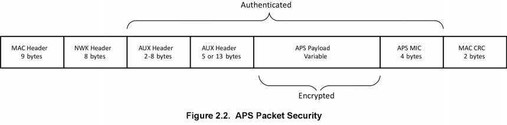
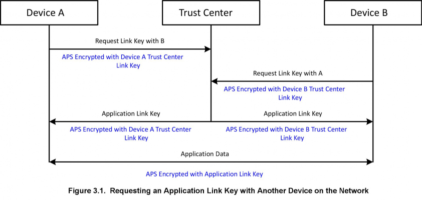
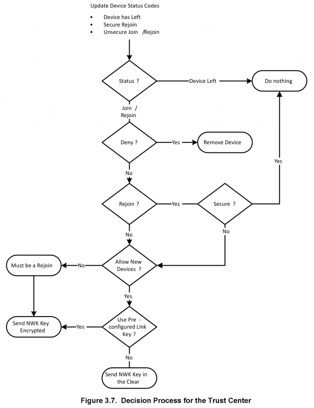
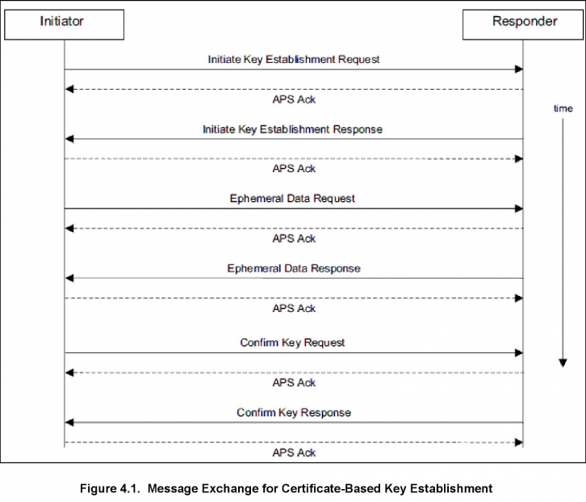

# 安全基础 (Rev. 1.0) <!-- omit in toc -->

本文档介绍了一些基本的安全概念，包括网络层安全、信任中心和应用支持层安全特性。然后讨论了 EmberZNet PRO 中可用的标准安全协议的类型。总结了对实施安全性的编码要求。最后，提供了有关实施 ZigBee 智慧能源安全的信息。

## 目录 <!-- omit in toc -->

- [1. 引言](#1-引言)
- [2. 概念](#2-概念)
  - [2.1 网络层安全](#21-网络层安全)
    - [2.1.1 网络密钥](#211-网络密钥)
    - [2.1.2 逐跳安全](#212-逐跳安全)
    - [2.1.3 包安全](#213-包安全)
    - [2.1.4 辅助报头](#214-辅助报头)
    - [2.1.5 认证和加密](#215-认证和加密)
    - [2.1.6 网络安全帧计数器](#216-网络安全帧计数器)
    - [2.1.7 未加密的网络数据](#217-未加密的网络数据)
  - [2.2 信任中心网络](#22-信任中心网络)
  - [2.3 分布式信任中心网络](#23-分布式信任中心网络)
  - [2.4 APS 层安全](#24-aps-层安全)
    - [2.4.1 端到端安全](#241-端到端安全)
    - [2.4.2 链路密钥](#242-链路密钥)
    - [2.4.3 未加密的 APS 数据](#243-未加密的-aps-数据)
- [3. 标准安全](#3-标准安全)
  - [3.1 概述](#31-概述)
  - [3.2 在标准安全中使用密钥](#32-在标准安全中使用密钥)
    - [3.2.1 网络密钥](#321-网络密钥)
    - [3.2.2 信任中心链路密钥](#322-信任中心链路密钥)
    - [3.2.3 安装码密钥](#323-安装码密钥)
    - [3.2.4 应用链路密钥](#324-应用链路密钥)
  - [3.3 加入一个网络](#33-加入一个网络)
    - [3.3.1 预配置的链路密钥](#331-预配置的链路密钥)
    - [3.3.2 使用众所周知的密钥或安装码的决策](#332-使用众所周知的密钥或安装码的决策)
    - [3.3.3 在加入后请求新的链路密钥](#333-在加入后请求新的链路密钥)
  - [3.4 网络密钥更新](#34-网络密钥更新)
    - [3.4.1 广播网络密钥更新](#341-广播网络密钥更新)
    - [3.4.2 单播网络密钥更新](#342-单播网络密钥更新)
    - [3.4.3 错过网络密钥更新](#343-错过网络密钥更新)
  - [3.5 网络重新加入](#35-网络重新加入)
    - [3.5.1 安全重新加入](#351-安全重新加入)
    - [3.5.2 信任中心重新加入](#352-信任中心重新加入)
  - [3.6 信任中心决策流程摘要](#36-信任中心决策流程摘要)
    - [3.6.1 分布式信任中心模式](#361-分布式信任中心模式)
  - [3.7 信任中心的附加要求](#37-信任中心的附加要求)
    - [3.7.1 信任中心作为集中器](#371-信任中心作为集中器)
    - [3.7.2 信任中心和源路由](#372-信任中心和源路由)
    - [3.7.3 信任中心地址缓存](#373-信任中心地址缓存)
- [4. ZigBee Smart Energy (ZSE) Security](#4-zigbee-smart-energy-zse-security)
  - [4.1 Overview](#41-overview)
    - [4.1.1 Installation Codes](#411-installation-codes)
    - [4.1.2 Certificates and Key Establishment](#412-certificates-and-key-establishment)
    - [4.1.3 Application Layer Requirements](#413-application-layer-requirements)
  - [4.2 Additional Sources of Information](#42-additional-sources-of-information)

# 1. 引言

安全性是 ZigBee 架构中的一个主要关注点。虽然 ZigBee 使用 IEEE 802.15.4 中的基本安全元素（如 AES（Advanced Encryption Standard，高级加密标准）加密和带 CBC-MAC（CCM）安全模式的计数器），并在此之上进行扩展：

* 128 位 AES 加密算法
* Strong, U.S. National Institute of Standards and Technology (NIST)-approved security
* 定义密钥类型（链路，网络）
* 定义密钥设置和维护
* 密钥可以硬连线到应用中
* CCM\*（统一/简单的操作模式）
* 信任中心（Trust center）
* 可以为应用自定义安全性

如下图所示，安全服务提供者（security services provider）限制与应用层和网络层的交互。

ZigBee 现在支持一种单一定义的安全模式，称为标准安全（Standard Security）。该模式中存在各种策略来控制设备在网络上的行为或交互方式。早期版本的 ZigBee 标准采用的是称为住宅安全（Residential Security）和高级安全（High Security）的模式。这些都已被弃用。

> 注意：ZigBee 不使用 IEEE 802.15.4 MAC 级安全，因此 EmberZNet PRO 不支持这种安全，此处不再赘述。ZigBee 在网络层和应用层实现消息安全。

本文档首先介绍了一些基本的安全概念，包括网络层安全、信任中心和应用支持层安全特性。然后讨论了 EmberZNet PRO 中可用的标准安全协议的类型。总结了对实施安全性的编码要求。最后，提供了有关实施 ZigBee 智慧能源安全的信息。详情可以在文档 **AN714, Smart Energy ECC-Enabled Device Setup** 中找到。

已经熟悉 ZigBee 安全概念的开发者可以跳到 [4. ZigBee 智慧能源安全](#4-zigbee-smart-energy-zse-security)。

# 2. 概念

## 2.1 网络层安全

本节介绍 ZigBee 如何在网络层实现安全性，这适用于标准安全。网络安全提供了独立于可能在 ZigBee 节点上运行的应用的安全性。所有经过 ZigBee 认证的设备都必须使用网络层安全。它提供了基本的访问控制，这用于控制允许哪些节点参与特定的 ZigBee 网络。有关应用控制安全，请参阅 [2.4 APS 层安全](#24-aps-层安全)。

### 2.1.1 网络密钥

网络安全使用网络范围密钥（network-wide key）进行加密和解密。所有被授权加入网络的设备都有该密钥的副本，并且这些设备使用该密钥来加密和解密所有网络消息。网络密钥还具有与之关联的序列号，以标识密钥的特定实例。当更新网络密钥时，序列号会被递增，以允许设备识别使用了哪个网络密钥实例来保护包数据。序列号的范围从 0 到 255。当序列号达到 255 时，它将绕回到 0。

> 注意：所有 ZigBee 密钥的长度均为 128 位。

所有属于安全 ZigBee 网络的设备都具有网络密钥的副本。

### 2.1.2 逐跳安全

需要注意的是，ZigBee 中的网络安全是在逐跳（hop-by-hop）基础上进行的。每个转发已加密包的路由器在执行进一步处理之前都会先验证该包是否是有效的已加密包。路由器通过执行 ZigBee 解密机制和验证包完整性来对包进行认证。然后，在将消息发送到下一跳之前，它会使用自己的网络参数（如源地址和帧计数器）重新加密包。如果没有此保护，攻击者可以将消息重播到网络中，该消息将通过多个设备进行路由，从而消耗网络资源。使用逐跳安全允许路由器阻止将错误流量注入网络的尝试。

### 2.1.3 包安全

网络层保护的包由下图所示的元素组成。

### 2.1.4 辅助报头

辅助报头（auxiliary header）包含关于包安全的数据，接收节点使用该数据来正确地认证和解密包。该数据包括所使用的密钥类型、序列号（如果是网络密钥）、保护数据的设备的 IEEE 地址及帧计数器。

### 2.1.5 认证和加密

ZigBee 使用 128 位对称密钥（AES-128）加密网络层上的所有传输。网络报头和辅助报头以明文（但已认证）的方式发送，而网络有效载荷则经过认证和加密。AES-128 用于创建消息（报头和有效载荷）的整个网络部分的散列，该散列附加到消息的末尾。此散列称为 MIC（Message Integrity Code，消息完整码），它可以确保消息未被修改。接收设备对消息进行散列处理，并根据附加到消息的值验证计算出的 MIC。对消息的更改将使 MIC 无效，接收节点将完全丢弃该消息。

> 注意：ZigBee 使用一个 4 字节的 MIC。

### 2.1.6 网络安全帧计数器

辅助报头中包含帧计数器来作为防止重播攻击的手段。所有设备都有自己的传出帧计数器，并且它们维护邻居和子系的帧计数器的列表。设备每次发送包时，都会递增其传出帧计数器。接收设备验证发送设备的帧计数器是否已从其看到的最后一个值增加。如果没有增加，数据包将被静默丢弃。如果接收设备不是最终目的地，则对包进行解密和修改以包含路由设备的帧计数器。然后重新加密数据包并将其发送到下一跳。

帧计数器为 32 位并且可能不会回零。可以在帧计数器达到其最大值之前更新网络密钥。当发生这种情况时，如果本地设备的值大于 0x80000000，则帧计数器可以重置为零。

### 2.1.7 未加密的网络数据

所有正常的网络数据报都需要具有网络安全和有效的帧计数器。唯一的例外是在加入期间，当设备还没有网络密钥时。在这种情况下，加入设备的消息将通过其父设备进行转发，直到它完全加入和认证。在没有网络层安全的情况下收到的任何其他消息都将被静默丢弃。

## 2.2 信任中心网络

可以通过称为信任中心的中央集权来控制安全网络中的认证。所有进入网络的设备将暂时地加入网络，直到联系到信任中心（决定是否允许新设备进入网络）。新加入设备的父节点充当信任中心和加入设备之间的中继。只有认证消息才能发送到设备或从设备发出，直到完全加入和认证为止。

信任中心可以选择在设备加入时执行以下三种操作之一：

* 发送当前网络密钥的副本，该副本从父节点中继到正在加入的设备。
* 向父节点发送命令以将设备从网络中移除，从而不准许其加入。
* 忽略请求。如果设备在 2 秒内没有收到网络密钥，则父节点将静默地将设备从网络中移除。

一旦节点具有网络密钥，它就被认为是完全加入和认证的，并且可以与网络上的任何设备通信。

使用信任中心进行操作的网络总是需要信任中心来认证任何新设备。两个设备之间的正常消息不需要信任中心参与。

## 2.3 分布式信任中心网络

网络可以在没有集中认证的情况下形成。这种网络称为分布式信任中心网络。在这种情况下，任何路由器都可以授权和认证希望加入的新设备。

这些网络提供了一种更简单的机制，可以将设备添加到网络中，其代价是网络的安全性较低。

在网络形成时应决定使用分布式信任中心网络还是信任中心网络，因为网络启动后无法更改此决定。

## 2.4 APS 层安全

本节介绍 ZigBee 如何在应用支持（APS，Application Support）层实现安全性。

### 2.4.1 端到端安全

APS 安全旨在提供一种在 ZigBee 网络内安全地发送消息的方法，使得除了源和目的地之外，没有其他设备可以解密数据。这与网络安全不同，后者仅提供逐跳安全。在这种情况下，每个设备都是网络的一部分，将听到包被中继到其目的地并被解密。

APS 安全使用只有源和目标知道的共享密钥（shared key），从而提供端到端安全。

APS 层和网络层加密可以同时用于加密消息的内容。在这种情况下，首先实施 APS 层安全，然后是网络层安全。

APS 层保护的包由下图所示的元素组成。

### 2.4.2 链路密钥

APS 安全使用称为链路密钥（link key）的点对点（peer-to-peer）密钥。在发送 APS 保护的数据之前，两个设备必须已相互建立了此密钥。链路密钥有两种类型：信任中心链路密钥（trust center link key）和应用链路密钥（application link key）。

#### 信任中心链路密钥 <!-- omit in toc -->

信任中心链路密钥是一种特殊链路密钥（其中一个伙伴设备是信任中心）。协议栈使用此密钥向信任中心发送和从信任中心接收 APS 命令消息。应用还可以使用此密钥发送 APS 加密的数据消息。

ZigBee 网络中的所有设备都必须具有链路密钥。在信任中心网络中，设备必须具有信任中心链路密钥。在分布式信任中心网络中，此密钥称为分布式信任中心链路密钥（Distributed Trust Center link key）。

#### 应用链路密钥 <!-- omit in toc -->

应用链路密钥是可以在网络中的任意两个节点之间建立的共享密钥（其中两个设备都不是信任中心）。该密钥可用于为发送到或从运行在节点上的应用发送的消息添加额外的安全性。设备可以为与之通信的每个设备使用不同的应用链路密钥。

设备可以预先配置应用链路密钥，也可以在自身和其他设备之间请求链路密钥。在后一种情况下，设备将向信任中心发出请求（使用其信任中心链路密钥加密）。信任中心充当两个设备的可信第三方，因此它们可以安全地建立彼此之间的通信。这将在 [3.2.4 应用链路密钥](#324-应用链路密钥) 中进一步讨论。建立应用链路密钥的过程如下图所示。

### 2.4.3 未加密的 APS 数据

APS 层安全独立于网络层安全。对于 ZigBee 协议栈发送到信任中心和从信任中心发出的某些安全消息（APS 命令），它是必需的。

与网络安全不同，应用消息的 APS 安全是可选的。应用消息不会在 APS 层自动加密，即使没有 APS 加密，接收端也不会忽略它。各个应用可以选择是接受还是拒绝没有 APS 层安全的消息。例如，智慧能源配置文件描述了 ZigBee 簇消息需要具备哪些安全。

# 3. 标准安全

## 3.1 概述

在 ZigBee 2007 规范和 ZigBee PRO 中引入的标准安全（standard security）是在所有 ZigBee 应用配置文件和 ZigBee 3.0 中使用的安全模型。它是 EmberZNet 协议栈库支持的唯一安全模型。

标准安全分别使用网络密钥和链路密钥对网络层和应用层的数据进行加密。应用支持（APS）层安全允许信任中心安全地将网络密钥传输给正在加入或重新加入的节点，并且其可选地允许应用为其消息添加额外的安全。网络（NWK）层安全用于保护在 ZigBee 网络上的所有通信（除了基本的 MAC 层通信（如关联、数据请求（轮询）和 MAC ACK））。

## 3.2 在标准安全中使用密钥

标准安全定义了不同的密钥来以不同的方式保护数据。所有密钥都是 128 位对称的，并且可以/不可以用来加密/解密包。

### 3.2.1 网络密钥

这是网络范围密钥（network-wide key），其在网络层用于保护传输。标准安全要求网络中的所有设备使用一个共享的网络密钥。信任中心可以定期更新并切换新的网络密钥。信任中心可以使用广播更新或单播更新。在广播更新下，信任中心首先会广播一个用旧的网络密钥加密的新网络密钥。在单播更新下，信任中心向每个设备发送一个新的网络密钥，该密钥使用（对应）设备的信任中心链路密钥进行加密。

在这两种情况下，信任中心随后会告知所有设备切换到新网络密钥。新网络密钥的序列号比前一个密钥的序列号高一。

### 3.2.2 信任中心链路密钥

该链路密钥用于两个节点之间的安全端到端通信（其中一个节点是信任中心）。在这些情况下使用信任中心链路密钥：

1. 将网络密钥的初始传输加密到加入节点。
2. 将更新的网络密钥副本加密到没有当前网络密钥的重新加入节点。
3. 路由器向信任中心发送或从信任中心接收 APS 安全消息。这些可能是通知信任中心加入或重新加入节点的更新，或者是信任中心发送给路由器以执行某些安全功能的命令。
4. 启用 APS 加密的应用单播消息，其中发送或接收设备是信任中心。

信任中心可以选择决定如何管理信任中心链路密钥。它可以为网络中的每个设备选择唯一的密钥（从共享数据的通用块（设备的 IEEE 地址）中派生出），或者对网络中的所有设备使用相同的全局密钥。信任中心链路密钥也可以使用密钥建立协议（如基于证书的密钥建立（CBKE，Certificate-Based Key Establishment））在应用层进行协商。

### 3.2.3 安装码密钥

ZigBee 3.0 现在有了安装码密钥（installation code key），（此前）该密钥只用于智慧能源（Smart Energy）网络上。所有经过 ZigBee 3.0 认证的设备都必须具备它们，但在网络中由信任中心决定是否使用。智慧能源网络必须始终使用它们。

安装码密钥只是一个预配置的信任中心链路密钥（preconfigured trust center link key），其用于进入 ZigBee 网络并获取当前网络密钥。在进入网络时，因为加入设备和信任中心必须知道该唯一密钥，所以使用一个称为 “安装码（installation code）” 的可共享数据块在两端派生出密钥。该码可以是 6、8、12 或 16 字节的任意值，并在末尾附加一个根据这些字节得出的 16 位 CRC（最低有效字节优先）。

该码用作 MMO（Matyas-Meyer-Oseas）散列函数的输入（如 **ZigBee Specification (ZigBee Document 053474)** 中所述），其散列长度等于 128 位。此 AES-MMO 散列函数的 128 位（16 字节）结果用作该设备的预配置信任中心链路密钥值，然后信任中心可以使用该密钥和加入设备的 EUI64 来安装一个密钥表条目（key table entry），从而允许在加入期间成功进行认证，并且加入设备可以成功地接收和解密网络密钥传输。

作为此过程的一部分，安装码和加入设备的 EUI64 必须带外（目标 ZigBee 网络之外，因为新节点尚未加入）传达给网络的信任中心，以允许创建正确的链路密钥表条目。该通信可能涉及设备安装者通过电话或因特网联系网络管理员（负责信任中心的一方，例如公用事业公司）以提供必要的信息。

### 3.2.4 应用链路密钥

标准安全支持设备与其他设备建立应用链路密钥。这些密钥独立于信任中心链路密钥，并且不是正常操作所必需的。它们用于网络中两个设备（这两个设备都不是信任中心）之间的 APS 级加密。

应用链路密钥必须与信任中心链路密钥分开建立。设备不能与信任中心建立应用链路密钥。但是，信任中心链路密钥可用于 APS 加密到信任中心（或从信任中心到网络上的设备）的应用消息。

应用链路密钥可以通过以下两种方式之一来建立：

1. 通过应用指定与目标设备关联的密钥进行手动配置。
2. 通过一个请求，该请求将使信任中心生成密钥并将密钥发送到两个设备。

应用可以通过调用栈并设置密钥来手动配置密钥。伙伴设备也必须配置该应用链路密钥，并在可以开始使用该密钥时与其他设备进行协商。

还可以使用信任中心来建立应用链路密钥。Ember 协议栈支持两种方法。第一种是 ZigBee 标准方法，在 [2.4.2 链路密钥](#242-链路密钥) 中讨论，并且如 [Figure 2.3 Establishing an Application Key](#242-链路密钥) 所示，其中一台设备通过联系信任中心来请求与另一台设备的应用密钥。然后，信任中心立即响应并将随机生成的应用链路密钥发送回请求设备和伙伴设备。只有一个设备请求密钥的缺点是另一个设备可能处于睡眠状态、离线状态或没有足够的容量来容纳密钥。

第二种方法，如下图所示，其并未在 ZigBee 中标准化，并且将无法与其他供应商的设备互操作。它还要求交换中的所有 Ember 设备（包括信任中心）都配置为使用该方法。该方法更可靠，因为它有助于确保伙伴设备在线并能够接收应用链路密钥。在这种情况下，两个设备都必须从信任中心请求应用链路密钥。信任中心在信任中心应用定义的一段时间内存储对应用链路密钥的第一个请求。在此期间，伙伴必须发送自己的应用链路密钥请求，以与第一个设备作为伙伴。在伙伴设备发送请求后，信任中心会生成随机应用链路密钥并将其发送回这两个设备。这种方法大大降低了设备或其伙伴不会收到密钥的可能性。

EmberZNet PRO 支持用于存储应用链路密钥的可配置表。

## 3.3 加入一个网络

设备首先使用 MAC 关联（association）来连接到一个合适的父设备，从而启动加入 ZigBee 标准安全网络的过程。如果关联成功，则设备已加入但未经认证，因为它不具有网络密钥。

在成功响应 MAC 关联请求之后，路由器向信任中心发送一条更新设备（Update Device）消息，以指示新节点希望加入到 ZigBee 网络。然后，信任中心可以决定是否允许设备加入。如果不允许设备加入，则会向父设备发送移除设备（Remove Device）请求，如下图所示。如果允许设备加入，则信任中心的行为取决于设备是否具有预配置的链路密钥。

### 3.3.1 预配置的链路密钥

信任中心规定了如何处理新设备的策略，并确定设备是否应该具有预配置的链路密钥。如果新设备没有预配置的链路密钥，则无法加入网络。

信任中心可以选择该密钥是众所周知的默认链路密钥（ZigBeeAlliance09）还是预共享的安装码密钥。下图演示了使用预配置密钥的加入过程。

为了允许设备进入网络，信任中心使用设备的预配置链路密钥加密要传输的网络密钥。

ZigBee 3.0 和所有 ZigBee 应用配置文件都需要预配置的链路密钥才能加入。

### 3.3.2 使用众所周知的密钥或安装码的决策

信任中心使用众所周知的密钥还是安装码的选择基于易用性与安全性之间的平衡。

使用众所周知的密钥可以使设备更容易地加入，而无需过多的用户交互。然而，使用众所周知的密钥来加密网络密钥会带来片刻的隐患。

使用安装码可以为设备的网络密钥的初始交换提供安全，但代价是增加了用户和信任中心之间的交互。用户必须以某种方式将密钥从设备传递到信任中心。这是通过 ZigBee 网络之外的机制实现的，例如将加入设备上的标签所列出的安装码输入到信任中心的 GUI。

在网络上运行的主要应用将有助于指示易用性和安全性那个更重要。ZigBee 标准允许了这两种情况。

### 3.3.3 在加入后请求新的链路密钥

ZigBee 3.0，设备在成功加入后需要请求一个更新的（updated）信任中心链路密钥。这将替换现有的预配置密钥，并在加入到该网络时使用。即使设备使用安装码密钥来加入，其密钥也会被替换。下图说明了 ZigBee 3.0 设备如何更新信任中心链路密钥。

只有在信任中心和加入设备都支持 ZigBee 3.0 时，才能替换密钥。如果其中一个不支持，则保留原始加入密钥。

## 3.4 网络密钥更新

网络密钥用来加密网络层上的所有传输。因此，本地设备不断地增加其本地网络密钥帧计数器。在网络中的任何设备的帧计数器达到全 F 之前，信任中心应该更新网络密钥。由于信任中心不可能在任何给定时刻知道网络中每个设备的帧计数器值，或者甚至不能检查传入消息的帧计数器，因此依赖于特定帧计数器阈值的方法是不实际的。因此，建议采用一种依赖于长时间间隔的定期更新的预防性维护方法，如下所述。

建议的模型是信任中心定期更新网络密钥，以帮助最小化与受损网络密钥的特定实例相关的风险。这有助于确保已离开安全 ZigBee 网络的设备以后无法重新加入。

密钥更新可以是广播或单播。信任中心决定使用哪种机制。这两种机制将在后面的章节中描述。

### 3.4.1 广播网络密钥更新

广播密钥更新时，使用当前网络密钥加密消息。听到广播的设备不会立即使用该密钥，而只是简单地存储它。稍后，信任中心将广播一个密钥切换（Key Switch）以告知所有节点开始使用新密钥。信任中心至少应该允许足够的时间（大约 9 秒）使新密钥的广播在切换之前传播到整个网络中。此外，信任中心必须注意，嗜睡终端设备可能会错过初始广播，除非他们经常轮询。

广播机制非常简单，因为它不需要知道网络上所有设备的身份。它仅涉及两条消息（更新密钥消息和切换消息）的发送。

### 3.4.2 单播网络密钥更新

对于单播更新，信任中心将向网络上的每个设备发送单独的密钥更新。信任中心必须先前已维护网络上所有授权设备的列表才能执行此操作。

更新消息将使用 APS 加密（使用设备特定的信任中心链路密钥）方式来对每个设备进行单播。稍后，信任中心将广播一个密钥切换以告知所有节点开始使用新密钥。

### 3.4.3 错过网络密钥更新

任何设备都可能错过密钥更新。这可能是因为它正在睡眠、断电或长时间离开网络。如果发生这种情况，设备可能会尝试执行信任中心重新加入。然后，信任中心可以决定是否允许节点返回网络。

EmberZNet PRO 协议栈可以在（使用较新的网络密钥加密的）数据包到达时检测到这种情况。它将自动执行信任中心重新加入到其当前网络以尝试获取最新的网络密钥。

## 3.5 网络重新加入

重新加入是节点重新连接到先前所属网络的一种方式。在三种不同的情况下重新加入是必要的：

1. 可能无法与其父系通信的移动或睡眠设备。
2. 错过网络密钥更新并需要更新网络密钥副本的设备。
3. 错过了 PAN ID 更新并需要发现网络的新 PAN ID 的设备。

当设备尝试重新加入时，它可能具有/没有当前的网络密钥。如果没有正确的网络密钥，附近的路由器会静默地忽略设备的重新加入请求。

因此，设备在重新加入时有两种选择：安全重新加入或信任中心重新加入。请注意，这些重新加入的情况都不需要在目标网络中的任何设备上设置 MAC 许可关联（也称为 “许可加入（permit joining）”）标志。路由器/协调器设备将总是临时地接受 NWK 层重新加入（Rejoin）命令，该命令可以是信任中心重新加入，也可以是使用活跃网络密钥进行的安全重新加入。对于信任中心重新加入的情况，信任中心负责在收到重新加入设备的通知后授予或拒绝访问权限。

### 3.5.1 安全重新加入

安全重新加入是较为简单的情况，试图重新加入网络的设备应首先尝试此方法。如果设备具有当前的网络密钥，则设备将能够非常快速地再次在网络上通信。只有在嗜睡或移动终端设备丢失其父设备时，才需要安全重新加入。

如下图所示，设备使用其网络密钥副本加密其发送的重新加入请求。如果路由器在附近并且使用相同的网络密钥，则重新加入响应将被发回加密设备。设备将再次在网络上加入并进行认证。回复重新加入请求的父系通知信任中心设备已重新加入，而信任中心不必采取进一步的操作。

如果安全重新加入失败并且设备使用了标准安全，则应用可以尝试非安全重新加入（unsecured rejoin）。

### 3.5.2 信任中心重新加入

当相邻设备已切换到新的网络密钥，且不再使用与重新加入设备相同的网络密钥时，信任中心重新加入是必要的。要成功地进行信任中心重新加入，设备必须具有信任中心链路密钥。设备发送未加密的重新加入请求。附近的路由器接受未加密的重新加入请求并响应设备，允许它转换到已加入但未认证的状态。

如下图所示，重新加入设备的父系将发送更新设备（Update Device）消息到信任中心，通知其非安全重新加入。信任中心有两种选择：拒绝或接受重新加入。如果它接受重新加入，则必须将更新的（updated）网络密钥发送到设备。无论如何，它将使用该设备的信任中心链路密钥来保护此消息。该消息（在网络和 APS 层上都进行了加密）被发送到重新加入设备的父系。然后，父节点将转发此消息（不进行网络加密）到重新加入设备。一旦设备拥有网络密钥，它将处于已加入和已认证状态，并可以再次在网络上进行通信。

### 关于允许信任中心重新加入的重要说明 <!-- omit in toc -->

信任中心允许信任中心重新加入（Trust Center Rejoin）的决定必须考虑请求设备是否正在使用众所周知的链路密钥。如果信任中心只有一个众所周知的链路密钥（例如 ZigBeeAlliance09），那么它应该静默地忽略重新加入请求。众所周知的链路密钥是不安全的，因此在重新加入期间不应该用于传输重要的数据（即网络密钥）。一个众所周知的链路密钥只应该用于初始加入，并且应该只允许在一个短时间内使用。

在 ZigBee 3.0 之前，网络在加入后不会更新链路密钥，因此强烈建议拒绝任何尝试使用众所周知的链路密钥的重新加入。智慧能源（Smart Energy）网络不受此特定问题的影响，因为它们在加入后会更新其链路密钥（详情请参阅 [4. ZigBee 智慧能源安全](#4-zigbee-smart-energy-zse-security)）。因此，智慧能源网络可以接受信任中心重新加入。

建议静默地拒绝信任中心重新加入，而不是明确地拒绝信任中心重新加入，这对于保持与 ZigBee 3.0 之前的设备的兼容性是必要的。ZigBee 3.0 之前的设备可以尝试信任中心重新加入，而不考虑先前是否已获得更新的链路密钥。如果明确地拒绝，则设备可能完全退出网络，而静默地拒绝将允许设备稍后尝试安全重新加入。

信任中心的行为最终将决定信任中心重新加入尝试的安全性。这可以通过 SoC 上的 `emberTrustCenterJoinHandler()` 回调或通过 `ezspSetPolicy()` API 为 NCP 配置 `EZSP_TRUST_CENTER_POLICY` 来控制。要在 SoC 设备上静默地忽略信任中心重新加入，`emberTrustCenterJoinHandler()` 必须返回 `EMBER_NO_ACTION`。要在 NCP 上静默地忽略信任中心重新加入，主机必须将 `EZSP_TRUST_CENTER_POLICY` 设置为 `EZSP_IGNORE_TRUST_CENTER_REJOINS`。

如果终端设备只有一个众所周知的链路密钥，则建议将其自身限制为仅执行安全重新加入。这是 EmberZNet 最新版本的终端设备支持插件中的默认设置。但是，如上所述，信任中心的行为最终确保了网络的安全性。

## 3.6 信任中心决策流程摘要

下图展示了设备加入网络时信任中心的决策树。加入或重新加入设备的父节点向信任中心发送更新设备（Update Device）APS 命令来指示事件已发生。信任中心应用根据该信息决定要执行的操作。该图描述了使用标准安全加入 ZigBee PRO 网络的 ZigBee PRO 设备的行为。

信任中心可以决定是否允许设备进入 ZigBee 网络以及是否发送密钥。信任中心的决策可以基于任何附加因素，如用户事件（按下按钮）、基于时间的条件、加入设备的 IEEE 地址或某些其他条件（such as, the network is being commissioned）。

当新设备加入时，信任中心决定设备是否应该具有预配置密钥。加入设备没有能力通过 ZigBee 协议通知信任中心它们是否具有预配置密钥。

### 3.6.1 分布式信任中心模式

通常，信任中心通过加入设备的父系对加入设备进行认证。这是有利的，因为它允许一个设备充当网守（gatekeeper）并认证想要加入网络的所有设备。安全消息通过其父系中继到加入设备，直到它加入并认证。

然而，这意味着所有路由器都必须具有到信任中心的路由，反之亦然。在开发应用或 commissioning 网络时，信任中心可能无法访问，因此设备将无法加入或执行信任中心重新加入。

EmberZNet PRO 协议栈允许网络使用不带信任中心的标准安全特性，这称为分布式信任中心模式。从 ZigBee 3.0 开始，该模式符合 ZigBee 标准。该模式的优点是允许设备加入，而不需要父节点向信任中心发送信息并等待响应。在此模式下，所有路由器通过将安全数据直接发送到加入节点来模拟信任中心的行为。每个路由器单独决定是否让设备进入网络。此模式对允许一个完整网络的 commissioning，然后建立一个信任中心（为了安全）是非常有用。

在此模式下，所有设备都使用单个信任中心链路密钥进行预配置。所有设备在加入时都会从其父系继承分布式信任中心设置，并且以该模式运行。因此，只需要将形成网络的设备（协调器）设置为以分布式信任中心模式运行。

## 3.7 信任中心的附加要求

要在 ZigBee PRO 网络中正常运行，信任中心还需要：

1. 信任中心应用必须充当集中器（高 RAM 或低 RAM）。
2. 信任中心应用必须支持源路由。它必须记录源路由并正确处理协议栈对特定源路由的请求。
3. 信任中心应用必须使用地址缓存来保证安全性，以便维护 IEEE 地址到短 ID 的映射。

如果无法满足上述所有要求，则可能会导致在跨多个跃点（通过既不是信任中心也不是其相邻路由器的目标节点）加入/重新加入设备到网络时出现故障。

### 3.7.1 信任中心作为集中器

信任中心必须充当集中器，因为 ZigBee PRO 安全需要到和从信任中心的双向路由，以便传输将设备转换为加入并认证状态所需的所有安全消息。

运行 EmberZNet PRO 协议栈的路由器在加入并认证后，会立即通过其父系（它们加入到的设备）自动添加到信任中心的路由。此路由假定信任中心充当低 RAM 集中器。

信任中心应定期广播多对一路由消息，以便所有路由器更新其路由表并修复到信任中心的受损路由。这也允许它通知路由器，如果它充当高 RAM 集中器，则更新默认路由。

### 3.7.2 信任中心和源路由

信任中心必须支持应用中的源路由。它应该记录传入消息的路由，并将它们存储在自己的表中。如果信任中心充当高 RAM 集中器，那么它必须跟踪所有源路由；如果信任中心充当低 RAM 集中器，那么它只须记录最后那几个源路由。应调整源路由表中的最小条目数，以支持可能发生的最大同时发生的安全事件数。这些安全事件包括重新加入、加入和离开。

除了存储源路由之外，信任中心还必须实现适当的钩子，以响应协议栈对特定源路由的请求。Silicon Labs 提供了一个源路由库，用于管理源路由表，并与信任中心协同工作。

> 注：对于 EZSP 基于主机的设计，主机上的源路由表不能用于将路由安全消息发送到加入/重新加入网络的设备。这是因为 APS 安全事务必须由协议栈（在网络协处理器中）处理，而不依赖于应用级的交互（在主机上）。

### 3.7.3 信任中心地址缓存

为了正确解密 APS 加密的消息，信任中心必须维护 IEEE 地址到短 ID 的映射。

对于高 RAM 集中器，信任中心必须跟踪网络中的所有设备。

对于低 RAM 集中器，信任中心只需要一次跟踪几个条目，并可以根据需要覆盖旧条目。缓存的大小应该等于可能同时发生的最大安全事件数。这些安全事件包括重新加入、加入和离开。

Silicon Labs 提供了在 SoC 平台上实现信任中心地址缓存机制的示例代码（参阅 `app/util/security/security-address-cache.c`）。Ember EZSP 网络协处理器二进制文件包含安全地址缓存特性（作为固件的一部分），但主机应用必须通过将信任中心地址缓存大小设置为大于 0 的值来启用此特性（参阅文档 **UG100: EZSP Reference Guide**，以了解有关如何在 EZSP 主机实现中执行此操作的详细信息）。

# 4. ZigBee Smart Energy (ZSE) Security

Due to the complexity of the security used in ZSE application development, this topic has been given its own section detailing the implementation and design requirements and considerations. Note that more detailed information about ZSE can be found in the ZigBee Smart Energy Profile Specification, available at the [http://www.zigbee.org](http://www.zigbee.org) website.

## 4.1 Overview

The following sections explain the concepts used in ZSE to provide additional security beyond the ZigBee standard security.

### 4.1.1 Installation Codes

ZSE devices are required to have and use installation code keys to join the network. Trust centers are required to use them as part of the initial joining. For more information, see section [3.2.3 Installation Code Keys](#323-安装码密钥). You can find more information about this process in the “Out of Band PreConfigured Link Key Process” section of the ZigBee Smart Energy Profile Specification.

### 4.1.2 Certificates and Key Establishment

Once a device has joined to the ZSE network and obtained the network key from the trust center, the new device must then re-negotiate its trust center link key through certificate-based key establishment (CBKE). This takes the place of the ZigBee 3.0 link key request mechanism that a standard ZigBee 3.0 device uses.

The CBKE protocol ensures that the new link key is unrelated to the preconfigured key, ensures that the key that is random and unreproducible, and provides proof of identity by validating the authenticity of the certificates at both devices. The new link key derived from this CBKE process replaces the original, preconfigured trust center link key, such that the preconfigured key is not used again unless this new ZSE device is purged from the network and later needs to re-enter. ZSE networks require that a CBKE-based link key shall be used for unicast data communications on most ZSE clusters. (Refer to the “Cluster Usage of Security Keys” section of the ZigBee Smart Energy Profile Specification for details about which clusters require only Network layer security and which require both Network and APS layer security.)

CBKE is variation of Public Key-Key Establishment (PKKE, as opposed to SKKE, Symmetric Key-Key Establishment) between a pair of devices. PKKE is a process whereby a link key is established based on each party’s shared, static, public key and ephemeral, public key. Since these keys are public, they do not require secrecy in their storage and transmission. These keys by themselves (without the non-public certificate data) aren’t enough to recreate the key, so knowledge of these public keys doesn’t compromise the established link key. In CBKE, specifically, each device’s static, public key is transported as part of a device-implicit certificate signed by the sender’s certificate authority (CA), allowing the receiver to validate the device’s identity during key establishment; this differs from traditional PKKE, where certificates are manually created.

The digital certificates used in the CBKE process are programmed into each device at manufacturing time and are issued by the CA. For the process to complete successfully, both devices must contain certificates signed by the same CA. For ZSE networks using Smart Energy 1.x protocol versions, Certicom ([www.certicom.com](www.certicom.com)) is the only ZigBee-approved certificate issuer. Certicom offers certificates signed by either of the following CAs:

* Test SE CA – A special certificate authority used exclusively for non-commercial testing purposes. Certificates signed by this CA are free to generate through Certicom’s website.
* Production CA – The normal certificate authority used by Certicom to sign certificates for production-grade devices used in commercial deployments. These certificates require paid licensing terms with Certicom to generate and will not interoperate with test certificates signed by the Test SE CA.

There are actually two different certificate formats and two different elliptic curves used by the CBKE protocol. The original Smart Energy 1.0 specification used the sect163k1 elliptic curve, which has a symmetric key equivalent length of 80 bits. The NIST standard recommends a key strength of 128 bits for all devices deployed after 2010 (see NIST sp800-57-part1, Table 4: Recommended algorithms and minimum key sizes). Therefore, the Smart Energy 1.2 standard introduced a second elliptic curve, sect283k1, which has an equivalent strength of128 bits. Smart Energy labelled the certificate format and curve for the SE 1.0 release Crypto Suite 1, and labelled the certificate format for the SE 1.2 release Crypto Suite 2. Smart Energy 1.2 supports both Crypto Suite 1 and Crypto Suite 2.

The Crypto Suite 1 certificate data stored on each device consist of the fields described in the following table.

<table>
  <tr>
    <th>Size (bytes)</th>
    <th>Name</th>
    <th>Description</th>
  </tr>
  <tr>
    <td>22</td>
    <td>CA Public Key</td>
    <td>Public key specific to the CA who signed the certificate. During CBKE, this is used to verify the authenticity of the CA.</td>
  </tr>
  <tr>
    <td>48</td>
    <td>Device-Implicit Certificate</td>
    <td>Unique data signed by the CA (using the CA’s private key) and representing the digital certificate for this specific device. This is the portion of the certificate that is shared over the air during CBKE and contains the following subfields: • Reconstruction data for the device’s public key (22 bytes) • This device’s IEEE MAC address (EUI64), also known as the Subject for the certificate (8 bytes in MSB order) • Issuer ID for the CA who created this device-implicit certificate (8 bytes in MSB order) • Profile-specific data as defined by the ZigBee application profile using the certificate. The first 2 bytes represent the 16-bit ZigBee application profile ID (in most significant byte notation), such as 0x0109 for ZSE. (10 bytes)</td>
  </tr>
  <tr>
    <td>21</td>
    <td>Device Private Key</td>
    <td>A unique, device-specific value chosen by the CA during certificate generation. During CBKE, this is used as an input (along with the Device Public Key) to an Elliptic-Curve Cryptography (ECC) algorithm.</td>
  </tr>
</table>

The Crypto Suite 2 certificate data stored on each device consist of the fields described in the following table.

<table>
  <tr>
    <th>Size (bytes)</th>
    <th>Name</th>
    <th>Description</th>
  </tr>
  <tr>
    <td>1</td>
    <td>Type</td>
    <td>Type of certificate. 0 = implicit, no extensions.</td>
  </tr>
  <tr>
    <td>8</td>
    <td>SerialNo</td>
    <td>Serial Number of the Certificate</td>
  </tr>
  <tr>
    <td>1</td>
    <td>Curve</td>
    <td>Curve identifier (sect283k1 is 0x0D)</td>
  </tr>
  <tr>
    <td>1</td>
    <td>Hash</td>
    <td>Hash identifier (AES-MMO is 0x08)</td>
  </tr>
  <tr>
    <td>8</td>
    <td>Issuer</td>
    <td>8 byte identifier, 64-bit IEEE 802.15.4 address.</td>
  </tr>
  <tr>
    <td>5</td>
    <td>ValidFrom</td>
    <td>40-bit Unix time from which the certificate is valid.</td>
  </tr>
  <tr>
    <td>4</td>
    <td>ValidTo</td>
    <td>32-bit # seconds from the ValidFrom time for which the certificate is considered valued (0xFFFFFFFF = infinite)</td>
  </tr>
  <tr>
    <td>8</td>
    <td>SubjectID</td>
    <td>8 byte identifie, 64-bit IEEE 802.15.4 address</td>
  </tr>
  <tr>
    <td>1</td>
    <td>KeyUsage</td>
    <td>Bit flag indicating key usage (0x88 = digital signature or key agreement allowed)</td>
  </tr>
  <tr>
    <td>37</td>
    <td>PublicKey</td>
    <td>37-byte compressed public key value from which the public key of the Subject is reconstructed.</td>
  </tr>
</table>

This certificate data is used at runtime to establish a shared secret (the new link key) through ECC computations along an elliptic-curve. While the computational details of the CBKE process are beyond the scope of this document, the ZigBee Cluster Library (ZCL) messages exchanged as part of this process are illustrated in the following figure. Additional details about this process can be found in Appendix C of the ZigBee Smart Energy Profile Specification. All of these messages are encrypted at the Network layer without any APS layer encryption. The Initiator in this process is typically the new device that entered the network, while the Responder is typically the trust center or Energy Services Interface (ESI) for the Home Area Network (HAN).

Once the key has been established, it can be used for future ZSE-related transactions among this pair of devices. If ZSE-related communications is desired between another pair of devices in the HAN, the two devices can request a mutual link key by requesting one from the trust center (who is a trusted party by virtue of CBKE having succeeded). For information about third-party application link key requests, refer to section [3.2.4 Application Link Keys](#324-应用链路密钥).

### 4.1.3 Application Layer Requirements

To ensure ZSE end-product compliance, ZSE devices have a number of special design requirements including the following, which make them unique from other ZigBee devices:

* Support for CBKE, including the underlying ECC algorithm used for key generation.
* Support for Elliptic-Curve Digital Signature Authentication (ECDSA), which is needed for validating firmware image data transferred in the ZSE Over-the-Air (OTA) Bootload cluster.
* Pre-installed certificates issued by the proper certificate authority.
* Pre-installed installation codes chosen by the manufacturer.
* Access to the installation code and EUI64 during network setup (to facilitate out-of-band communication of this data to the trust center).
* (Trust center only) Key table space sufficient to track the maximum number of ZSE devices that the HAN will support.
* (Trust center only) Support for inputting installation codes (for deriving link key values through an AES-MMO hash function) or link key values and EUI64 addresses (for creating key table entries for new devices).
* APS data messages for certain clusters (most ZSE clusters) require APS security with an application (or trust center) link key.

The Ember application framework can ensure that the above requirements are satisfied (where applicable) when the Ember AppBuilder tool is used to configure a ZSE device. For more information about Ember application framework-based development, refer to document **UG102, Application Framework Developer Guide**.

## 4.2 Additional Sources of Information

For more information regarding ZSE security concepts, refer to the following resources:

* **ZSE AMI Profile Specification** – ZigBee document #07-5356. This is the top-level application profile specification for ZSE and is available for public (non-member) download through the [www.zigbee.org](www.zigbee.org) website.
* **AN708, Setting Manufacturing Certificates and Installation Code**. This is an application note included in EmberZNet PRO releases supporting ZSE development (also available online through the [www.silabs.com](www.silabs.com) zigbee-docs website). It explains how to program the necessary manufacturing data (certificates and installation codes) into Ember chips using Ember programming tools and how to verify these data once they have been programmed into the device.
* **AN714, Smart Energy ECC-Enabled Device Setup Process**. This application note, included in EmberZNet PRO releases, describes how to set up a device with the security resources required to support Smart Energy (SE) security. While these security resources are not necessary for testing SE networks, any devices designed to participate in or host a ZigBee-compliant, production-grade (non-test) SE network must implement these features.
* **UG102, Application Framework Developer Guide**. This document, included in EmberZNet PRO software releases and available online through the [www.silabs.com/zigbee-docs](www.silabs.com/zigbee-docs) website, describes the command line interface (CLI) commands available for inspecting and altering the security configuration of an Ember application framework-based application at runtime. It also explains any callbacks or plugins used by Ember application framework to implement security behavior in the application.
