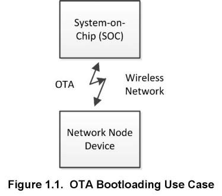
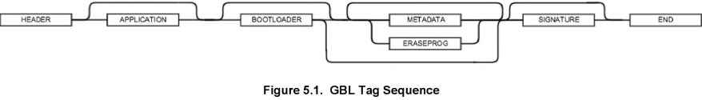

# 引导加载基础 (Rev. 1.3) <!-- omit in toc -->

本文档介绍了 Silicon Labs 网络设备的引导加载（bootloading）。总结了 Silicon Labs Gecko Bootloader 与 legacy Ember Bootloader 之间的差异，并讨论了它们对平台的适用性。描述了独立（standalone）和应用（application）引导加载的概念，并讨论了它们的相对优势和劣势。此外，还介绍了每种方法的设计和实现细节。最后，描述了引导加载程序（bootloader）的文件格式。

## 目录 <!-- omit in toc -->

- [1. 引言](#1-引言)
  - [1.1 独立引导加载](#11-独立引导加载)
  - [1.2 应用引导加载](#12-应用引导加载)
- [2. 关于 Gecko Bootloader](#2-关于-gecko-bootloader)
  - [2.1 特性](#21-特性)
    - [2.1.1 可现场更新](#211-可现场更新)
    - [2.1.2 安全启动](#212-安全启动)
    - [2.1.3 已签名的 GBL 固件更新映像文件](#213-已签名的-gbl-固件更新映像文件)
    - [2.1.4 加密的 GBL 固件更新映像文件](#214-加密的-gbl-固件更新映像文件)
  - [2.2 适用性](#22-适用性)
- [3. 用于引导加载的存储空间](#3-用于引导加载的存储空间)
  - [3.1 Gecko Bootloader](#31-gecko-bootloader)
  - [3.2 Legacy Ember Bootloaders](#32-legacy-ember-bootloaders)
- [4. 设计决策](#4-设计决策)
  - [4.1 Gecko Bootloader](#41-gecko-bootloader)
  - [4.2 Legacy Ember Bootloaders](#42-legacy-ember-bootloaders)
- [5. 引导加载文件格式](#5-引导加载文件格式)
  - [5.1 Gecko Bootload (GBL) 文件](#51-gecko-bootload-gbl-文件)
    - [5.1.1 文件格式](#511-文件格式)
      - [5.1.1.1 文件结构](#5111-文件结构)
      - [5.1.1.2 明文标签描述](#5112-明文标签描述)
      - [5.1.1.3 加密的标签描述](#5113-加密的标签描述)
    - [5.1.2 映像验证](#512-映像验证)
  - [5.2 Ember Bootload (EBL) 文件](#52-ember-bootload-ebl-文件)
    - [5.2.1 基本的文件格式](#521-基本的文件格式)
      - [5.2.1.1 非加密的标签描述](#5211-非加密的标签描述)
      - [5.2.1.2 数据验证](#5212-数据验证)
    - [5.2.2 加密的 Ember Bootload 文件格式](#522-加密的-ember-bootload-文件格式)
      - [5.2.2.1 加密的标签描述](#5221-加密的标签描述)
      - [5.2.2.2 Nonce 生成](#5222-nonce-生成)
      - [5.2.2.3 映像校验](#5223-映像校验)

# 1. 引言

引导加载程序（bootloader）是一个存储在预留闪存中的程序，它可以初始化设备、更新固件（firmware）映像，并可能执行一些完整性检查。无论是通过串行通信还是无线方式，都可以根据需要进行固件映像更新。生产级编程通常在产品制造过程中完成，但有时会希望能够在生产完成后进行重新编程。更重要的是，这能够在设备部署后更新具有新特性和错误修复的固件。这使得更新固件映像成为可能。

Silicon Labs 支持不使用引导加载程序的设备，但这需要外部硬件（如 Debug Adapter（Silicon Labs ISA3 或 WSTK）或第三方的 SerialWire/JTAG 编程设备）来更新固件。没有引导加载程序的设备在部署后无法通过无线方式更新固件，因此 Silicon Labs 强烈推荐使用引导加载程序。

在 2017 年 3 月，Silicon Labs 推出了 Gecko Bootloader，这是一个可通过 Simplicity Studio IDE 配置的代码库，用于生成可与各种 Silicon Labs 协议栈一起使用的引导加载程序。Gecko Bootloader 可以与 EFR32MG1/EFR32BG1（EFR32xG1）和 EFR32xG1 + Flash 一起使用。从 EFR32MG12/EFR32BG12/EFR32FG12（EFR32xG12）开始，所有未来的 Mighty Gecko、Flex Gecko 和 Blue Gecko 版本将仅使用 Gecko Bootloader。用于特定协议（如 EmberZNet PRO）和特定平台（EM3x）的 Legacy Ember Bootloader 将继续提供。在 2017 年 12 月，Bluetooth SDK 的 2.7.0 版本中删除了对 legacy Bluetooth Bootloader 的支持。

Gecko Bootloader 和 legacy Ember Bootloader 使用自定义的更新映像文件格式，这将在 [5. 引导加载文件格式]() 中进一步介绍。Gecko Bootloader 生成的应用（application）引导加载程序使用的更新映像文件是 GBL（Gecko BootLoader）文件，legacy Ember Bootloader 使用的是 EBL（Ember BootLoader）文件。

引导加载固件更新映像有两种方式。第一种是无线方式（OTA，Over-The-Air），即通过无线网络，如下图所示。

第二种是通过设备的硬连线链路。下图展示 SoC（使用 UART、SPI 或 USB ）和 NCP（使用 UART 或 SPI）的串行引导加载用例。

Silicon Labs 网络设备以两种不同的模式使用引导加载程序来执行固件更新：独立引导加载（standalone bootloader）和应用引导加载（application bootloader）。应用引导加载进一步地划分为使用外部存储和使用本地存储，以下载更新映像。这两种引导加载类型将在接下来的两节中讨论。

本文档中描述的固件更新情况假定为源节点（通过 serial 或 OTA 链路将固件映像发送到目标的设备）通过其他方式获取新固件。例如，如果本地 ZigBee 网络上的设备已连接到以太网网关，则该设备可以通过 Internet 获取或接收这些固件更新。固件更新过程的这一必要部分取决于系统，这超出了本文档的范围。

## 1.1 独立引导加载

独立引导加载程序（standalone bootloader）是使用外部通信接口（如 UART 或 SPI）来获取应用映像的程序。独立固件更新是一个单阶段的过程，这允许将应用映像放入闪存来覆盖现有的应用映像，而无需应用本身的参与。独立引导加载程序与在闪存中运行的应用程序之间几乎没有交互。通常，应用程序与引导加载程序交互的唯一时间是它请求 reboot 到引导加载程序。一旦引导加载程序运行，它就会通过物理连接（如 UART 或 SPI）或无线方式接收包含（新）固件映像的引导加载包。

启动固件更新过程后，新代码将覆盖现有的协议栈和应用代码。如果在此过程中发生任何错误，则无法恢复代码并且必须重新开始该过程。有关 legacy standalone bootloader 的更多信息，请参阅 **AN760: Using the Ember Standalone Bootloader**。有关将 Gecko Bootloader 配置为独立引导加载程序的信息，请参阅 **UG266: Silicon Labs Gecko Bootloader User Guide**。

## 1.2 应用引导加载

应用引导加载程序（application bootloader）在正在运行的应用程序下载完更新映像文件后开始固件更新过程。应用引导加载程序期望映像存在可访问的外部存储器中或主闪存中（如果芯片具有足够的存储空间来支持此本地存储模型）。

应用引导加载程序依赖应用程序来获取新的固件映像。应用程序可以以任何便捷的方式（UART，OTA 等）下载映像，但必须将其存储在称为下载空间（download space）的区域中。下载空间通常是外部存储器设备（如 EEPROM 或 dataflash），但在使用应用引导加载程序的本地存储变体时，它也可以是芯片内部闪存的一部分。存储新映像后，将调用应用引导加载程序来验证新映像并将其从下载空间复制到闪存中。

由于应用引导加载程序不参与映像的获取，并且映像在固件更新过程开始之前下载，因此下载错误不会对正在运行的映像产生负面影响。下载过程可以随时重新开始或暂停。可以在启动固件更新过程之前验证所下载映像的完整性，以防止损坏或无功能的映像被应用。

Legacy Ember application bootloader 提供 UART 独立引导加载能力来作为恢复机制，以防止正在运行的应用程序映像和升级映像被损坏。可以将 Gecko Bootloader 配置为接受一个多升级映像的列表，以尝试验证和应用。这允许 Gecko Bootloader 存储更新映像的备份副本，如果第一个映像损坏，它可以访问该副本。

注意，EmberZNet 和 Silicon Labs Thread NCP 平台不使用应用引导加载程序，因为应用代码驻留在主机上而不是直接驻留在 NCP 上。取而代之的是，充当串行协处理器的设备将使用独立引导加载程序，该引导加载程序旨在通过与预期的 NCP 固件使用的相同串行接口接受代码。但是，主机应用程序可以使用任何合适的引导加载方案。Silicon Labs Bluetooth NCP 可以使用 legacy OTA DFU bootloader。

有关应用引导加载程序的详情，可以参阅 **UG266: Silicon Labs Gecko Bootloader User's Guide** 和 **AN772: Using the Ember Application Bootloader**。

# 2. 关于 Gecko Bootloader

Silicon Labs Gecko Bootloader 是一个可配置的代码库，可以与所有较新的 Silicon Labs Gecko MCU 和无线 MCU 一起使用。它使用 GBL 格式的更新映像文件。Gecko Bootloader 采用二阶设计，其中最小的首阶引导加载程序（first stage bootloader）用于更新主引导加载程序（main bootloader）。这允许了主引导加载程序的现场更新（包括添加新能力、更改通信协议、添加新安全特性和修复程序等）。Gecko Bootloader 由三个组件组成：

* Core：包含两个阶段的引导加载程序的主要功能。它还包含写入内部主闪存、执行引导加载程序更新和重置到应用程序中（以标记适用的重置原因）的功能。
* Driver：不同的引导加载应用需要不同的硬件驱动程序以供引导加载程序的其他组件使用。
* Plugin：主引导加载程序的所有可选项或用于不同配置的选择被实现为 plugin。每个 plugin 都有一个通用的头文件和一个或多个实现。当前版本包含 UART 和 SPI 通信协议、SPI 闪存存储、内部闪存存储和不同的加密操作等功能插件。

## 2.1 特性

Gecko Bootloader 特性包括：

* 可现场更新（Field-updateable）
* 安全启动（Secure boot）
* 签名的 GBL 固件更新映像文件（Signed GBL firmware update image file）
* 加密的 GBL 固件更新映像文件（Encrypted GBL firmware update image file）

这些特性在随后的小节中进行了总结，并在 **UG266: Silicon Labs Gecko Bootloader User Guide** 中详细地描述。有关使用 Gecko Bootloader 的特定于协议的信息可在以下文档中找到：

* **AN1084: Using the Gecko Bootloader with EmberZNet and Silicon Labs Thread**
* **AN1085: Using the Gecko Bootloader with Silicon Labs Connect**
* **AN1086: Using the Gecko Bootloader with Silicon Labs Bluetooth Applications**

### 2.1.1 可现场更新

引导加载程序固件现场更新能力由一个二阶设计（first stage 和 main stage）提供。引导加载程序的最小首阶（不可现场更新）只能通过读写内部闪存中的固定地址来更新主引导加载程序。要执行主引导加载程序更新，正在运行的主引导加载程序将验证引导加载程序更新映像的完整性和真实性，将引导加载程序更新映像写入内部闪存中的固定位置，并发出 reboot 以进入首阶引导加载程序中。在将更新映像复制到主引导加载程序位置之前，首阶引导加载程序会验证主引导加载程序更新映像的完整性。

### 2.1.2 安全启动

安全启动旨在防止不受信任的映像在设备上运行。启用安全启动后，引导加载程序会使用非对称加密技术在每次启动时强制执行应用程序映像的加密签名验证。使用的签名算法是 ECDSA-P256-SHA256。公钥在制造期间写入设备，而私钥保密。这确保了应用程序是由可信方创建和签名的。

### 2.1.3 已签名的 GBL 固件更新映像文件

除了安全启动之外，Gecko Bootloader 还支持强制执行更新映像文件的加密签名验证。这允许引导加载程序和应用程序在开始更新过程之前验证应用程序或引导加载程序的更新是否来自受信任的源。使用的签名算法是 ECDSA-P256-SHA256。公钥与安全引导的密钥相同，在制造期间写入设备，而私钥不分发。这可确保 GBL 文件由受信任方创建和签名。

### 2.1.4 加密的 GBL 固件更新映像文件

GBL 更新文件也可以加密，以防止窃听者获取明文固件映像。使用的加密算法是 AES-CTR-128，加密密钥在制造期间写入设备。

## 2.2 适用性

下表展示了可以与不同平台一起使用的引导加载程序。

<table>
  <tr>
    <th>Platform</th>
    <th>Gecko Bootloader</th>
    <th>Legacy Ember Bootloaders</th>
    <th>Legacy Bluetooth Bootloaders</th>
  </tr>
  <tr>
    <td>EM3x</td>
    <td>No</td>
    <td>Yes</td>
    <td>*</td>
  </tr>
  <tr>
    <td>EFR32MG1, EFR32MG1+Flash</td>
    <td>Yes</td>
    <td>No**</td>
    <td>*</td>
  </tr>
  <tr>
    <td>EFR32BG1</td>
    <td>Yes</td>
    <td>No</td>
    <td>*</td>
  </tr>
  <tr>
    <td>EFR32BG1+Flash</td>
    <td>Yes</td>
    <td>No</td>
    <td>*</td>
  </tr>
  <tr>
    <td>EFR32FG1</td>
    <td>Yes</td>
    <td>No**</td>
    <td>*</td>
  </tr>
  <tr>
    <td>EFR32MG12,  EFR32BG12, EFR32FG12</td>
    <td>Yes</td>
    <td>No</td>
    <td>*</td>
  </tr>
  <tr>
    <td>Future products</td>
    <td>Yes</td>
    <td>No</td>
    <td>*</td>
  </tr>
  <tr>
    <td colspan="4">* Support for the legacy Bluetooth Bootloaders was removed in the Bluetooth SDK version 2.7.0 release. ** Support for these platforms was deprecated in EmberZNet SDK version 6.1.0 and Silicon Labs Thread version 2.5.0.</td>
  </tr>
</table>

# 3. 用于引导加载的存储空间

## 3.1 Gecko Bootloader

引导加载程序的首阶占用单个闪存页。在使用 2kB 闪存页的设备上（如 EFR32MG1），意味着首阶需要 2kB。

主引导加载程序的大小取决于所需的功能。典型的引导加载程序配置为：主引导加载程序占用 14kB 闪存，使总引导加载程序的大小达到 16kB。

Silicon Labs 建议为引导加载程序保留至少 16kB。

在 EFR32xG1 设备（Mighty Gecko、Flex Gecko 和 Blue Gecko 系列）上，引导加载程序位于主闪存中。

* 首阶引导加载程序 @ 0x0
* 主引导加载程序 @ 0x800
* 应用程序 @ 0x4000

在较新的设备（EFR32xG12 和更高版本）上，引导加载程序位于信息块的引导加载程序区中。

* 应用程序 @ 0x0
* 首阶引导加载程序 @ 0x0FE10000
* 主引导加载程序 @ 0x0FE10800

## 3.2 Legacy Ember Bootloaders

下图展示了典型 Silicon Labs 网状网络 SOC 或 NCP 的存储器映射。

对于每个 Silicon Labs 网状网络平台（在 SOC 或 NCP 使用情况下），在主闪存的起始处保留一个闪存块（通常为 8kB 或 16kB，具体取决于所使用的 IC）来保存引导加载程序，并且在闪存的末尾保留一个闪存块（在 4kB 和 36kB 之间，具体取决于实现），用于模拟 EEPROM。除了本地存储应用引导加载程序（Local Storage Application Bootloader）外，其他所有情况下剩余的存储空间都是非保留的，可用于保存网络协议栈和应用代码。

# 4. 设计决策

部署哪种类型的引导加载程序取决于许多因素。注意，平台类型和可用闪存可能会限制引导加载程序的选择。

与此相关的一些问题是：

* 设备从何处获得新的更新映像？是否通过网络协议进行的无线传输？是否使用单独的接口连接到 Internet？
* 设备是否有外部存储器芯片来存储新的更新映像？如果没有，是否有足够的内部闪存来存储最大的预期应用映像（当前的和新下载的副本）？
* 如果设备通过无线方式接收新的映像，它是否会多次跳转到持有下载映像的服务器？
* 需要什么样的映像安全性？
* 将使用哪种通信驱动程序（在单协议的情况下）？
* 用例是否需要多个协议？

## 4.1 Gecko Bootloader

Gecko Bootloader 平台的可配置设计意味着开发人员可以创建引导加载程序以适应几乎全部的设计选择。有关详细信息，请参阅 **UG266: Silicon Labs Gecko Bootloader User's Guide**。

## 4.2 Legacy Ember Bootloaders

下表展示了 legacy Ember bootloaders 的不同类型及支持的特性。

<table>
  <tr>
    <th>Features</th>
    <th>Application-bootloader</th>
    <th>Secure-application-bootloader</th>
    <th>Local-storage-bootloader</th>
    <th>Secure-local-storage-bootloader</th>
    <th>Standalone-bootloader</th>
    <th>Standalone-OTA-bootloader</th>
  </tr>
  <tr>
    <td>Serial Link Download</td>
    <td>Yes</td>
    <td>Yes</td>
    <td>Yes</td>
    <td>Yes</td>
    <td>Yes</td>
    <td>Yes</td>
  </tr>
  <tr>
    <td>Over-the-air Image Transfer without Application Running</td>
    <td></td>
    <td></td>
    <td></td>
    <td></td>
    <td></td>
    <td>Yes</td>
  </tr>
  <tr>
    <td>Application runs while downloading new image</td>
    <td>Yes</td>
    <td>Yes</td>
    <td>Yes</td>
    <td>Yes</td>
    <td></td>
    <td></td>
  </tr>
  <tr>
    <td>Can be used in a multi-hop deployment</td>
    <td>Yes</td>
    <td>Yes</td>
    <td>Yes</td>
    <td>Yes</td>
    <td></td>
    <td></td>
  </tr>
  <tr>
    <td>Supports Encrypted Ember Bootloader Files (EBL)</td>
    <td></td>
    <td>Yes</td>
    <td></td>
    <td>Yes</td>
    <td></td>
    <td></td>
  </tr>
  <tr>
    <td>Bootload Failures can be recovered by loading stored image</td>
    <td>Yes</td>
    <td>Yes</td>
    <td>Yes</td>
    <td>Yes</td>
    <td></td>
    <td></td>
  </tr>
  <tr>
    <td>Requires External Storage</td>
    <td>Yes</td>
    <td>Yes</td>
    <td></td>
    <td></td>
    <td></td>
    <td></td>
  </tr>
  <tr>
    <td>On-chip Flash Requirements</td>
    <td>EM34x/5x: 8 kB  EM358x/9x: 16 kB  EFR32: not supported**</td>
    <td>EM34x/5x: 8 kB  EM358x/9x: 16 kB  EFR32: not supported**</td>
    <td>EM34x/5x: not supported  EM358x/9x: 16 kB + 246 kB*  EFR32: not supported**</td>
    <td>EM34x/5x: not supported  EM358x/9x: 16 kB + 246 kB*  EFR32: not supported**</td>
    <td>EM34x/5x: 8 kB  EM358x/9x: 16 kB  EFR32: not supported**</td>
    <td>EM34x/5x: 8 kB  EM358x/9x: 16 kB  EFR32: not supported**</td>
  </tr>
  <tr>
    <td>EM34x, EM351</td>
    <td>Yes</td>
    <td>Yes</td>
    <td></td>
    <td></td>
    <td>Yes</td>
    <td>Yes</td>
  </tr>
  <tr>
    <td>EM357, EM3581, EM3582  (192 kB &amp; 256 kB parts)</td>
    <td>Yes</td>
    <td>Yes</td>
    <td></td>
    <td></td>
    <td>Yes</td>
    <td>Yes</td>
  </tr>
  <tr>
    <td>EM3585, EM3586, EM3587, EM3588  (512 kB parts)</td>
    <td>Yes</td>
    <td>Yes</td>
    <td>Yes</td>
    <td>Yes</td>
    <td>Yes</td>
    <td>Yes</td>
  </tr>
  <tr>
    <td>EFR32   (128 kB and 256 kB parts)</td>
    <td>Not supported**</td>
    <td>Not supported**</td>
    <td></td>
    <td></td>
    <td>Not supported**</td>
    <td></td>
  </tr>
  <tr>
    <td colspan="7">* The local storage can be configured to use more or less on-chip space for storage. 246 kB is a recommended amount based on a single, average-sized image kept on a 512 kB part. Individual application needs may vary. The actual bootloader is 16 kB.  ** Use the Gecko Bootloader to create a similar configuration for these platforms.</td>
  </tr>
</table>

# 5. 引导加载文件格式

本节中描述的引导加载文件格式由 Simplicity Commander 命令生成。有关更多信息，请参阅 **UG162: Simplicity Commander Reference Guide**。

## 5.1 Gecko Bootload (GBL) 文件

Gecko Bootloader 使用 GBL 文件格式。

### 5.1.1 文件格式

#### 5.1.1.1 文件结构

GBL 文件格式由许多标签（tag）组成，这些标签指示后续数据的格式和整个标签的长度。标签的格式如下：

|  Tag ID | Tag Length |             Tag Payload            |
|:-------:|:----------:|:----------------------------------:|
| 4 bytes |   4 bytes  | Variable (according to tag length) |

#### 5.1.1.2 明文标签描述

| Tag Name                 |            ID            | Description                                                                                                                                                                                      |
|--------------------------|:------------------------:|--------------------------------------------------------------------------------------------------------------------------------------------------------------------------------------------------|
| GBL Header Tag           |        0x03A617EB        | This must be the first tag in the file. The header tag contains the version number of the GBL file specification, and flags indicating the type of GBL file - whether it is signed or encrypted. |
| GBL Application Info Tag |        0xF40A0AF4        | This tag contains information about the application update image that is contained in this GBL file                                                                                              |
| GBL Bootloader Tag       |        0xF50909F5        | This tag contains a complete bootloader update image.                                                                                                                                            |
| GBL Program Data Tag     | 0xFE0101FE or 0xFD0303FD | This tag contains information about what application data to program at a specific address into the main flash memory.                                                                           |
| GBL Metadata Tag         |        0xF60808F6        | This tag contains metadata that the bootloader does not parse, but can be returned to the application through a callback.                                                                        |
| GBL Signature Tag        |        0xF70A0AF7        | This tag contains the ECDSA-P256 signature of all preceding data in the file.                                                                                                                    |
| GBL End Tag              |        0xFC0404FC        | This tag indicates the end of the GBL file. It contains a 32-bit CRC for the entire file as an integrity check. The CRC is a non-cryptographic check. This must be the last tag.                 |

GBL 文件中允许的 GBL 标签序列如下图所示。

#### 5.1.1.3 加密的标签描述

加密的 GBL 文件格式类似于非加密的版本。它引入了许多新标签。

| Tag Name                   |     ID     | Description                                                                                                                                                              |
|----------------------------|:----------:|--------------------------------------------------------------------------------------------------------------------------------------------------------------------------|
| GBL Header Tag             | 0x03A617EB | The GBL header is the same as for a plaintext GBL file, but the flag indicating that the GBL file is encrypted must be set.                                              |
| GBL Encryption Init Header | 0xFA0606FA | This contains information about the image encryption such as the Nonce and the amount of encrypted data.                                                                 |
| GBL Encrypted Program Data | 0xF90707F9 | This contains an encrypted payload containing a plaintext GBL tag, one of Application Info, Bootoader, Metadata or Program Data. The data is encrypted using AESCTR-128. |

加密的 GBL 文件中允许的 GBL 标签序列如下图所示。

### 5.1.2 映像验证

可选的 GBL 签名标签可用于确保 GBL 文件的真实性。Silicon Labs 强烈建议将引导加载程序配置为仅接受已签名的 GBL 文件。

## 5.2 Ember Bootload (EBL) 文件

所有 Ember bootloaders 都要求它们正在处理的映像采用 EBL 文件格式。

### 5.2.1 基本的文件格式

EBL 文件格式由许多标签组成，这些标签指示后续数据的格式和整个标签的长度。标签的格式如下：

|  Tag ID | Tag Length |             Tag Payload            |
|:-------:|:----------:|:----------------------------------:|
| 2-bytes |   2-bytes  | Variable (according to tag length) |

标签格式的详细信息可以在这些头文件中找到：

| Platform     | Header Filename                    |
|--------------|------------------------------------|
| EM3x Series  | `/micro/cortexm3/bootloader/ebl.h` |
| EFR32 Series | Not supported.                     |

#### 5.2.1.1 非加密的标签描述

下表列出了非加密的 EBL 映像的标签。

| Tag Name                     |   ID   | ID Description                                                                                                                                                                                                     |
|------------------------------|:------:|--------------------------------------------------------------------------------------------------------------------------------------------------------------------------------------------------------------------|
| EBL Header Tag               | 0x0000 | This contains information about the chip the image is intended for, the AAT (application address table), Stack Version, Customer Application Version, build date, and build timestamp. This must be the first tag. |
| EBL Program Data             | 0xFE01 | This contains information about what data to program at a specific address into the main flash memory.                                                                                                             |
| EBL Program Manufacture Data | 0x02FE | This contains information about what data to program at a specific address within the Customer Information Block (CIB) section (for EM35x devices) or UserData section (for EFR32™ devices) of the chip.           |
| EBL End                      | 0xFC04 | This tag indicates the end of the EBL file. It contains a 32-bit CRC for the entire file as an integrity check. The CRC is a non-cryptographic check. This must be the last tag.                                   |

完整的 EBL 映像如下图所示。

#### 5.2.1.2 数据验证

EBL 文件格式包括三个 32bit CRC 值，用于验证文件的完整性。这些值是使用 `halCommonCrc32()` 函数计算的，该函数可以在 `hal/micro/generic/crc.c` 中找到。计算中使用的 CRC 的初始值是 0xFFFFFFFF。

下表描述了构建到 \.EBL 下载格式中的数据完整性检查。

| Integrity Check | Description                                                                                                                                                                                                                                                                                                                                                                                                                                                                                                                                        |
|-----------------|----------------------------------------------------------------------------------------------------------------------------------------------------------------------------------------------------------------------------------------------------------------------------------------------------------------------------------------------------------------------------------------------------------------------------------------------------------------------------------------------------------------------------------------------------|
| Header CRC      | The header data contains the headerCrc field (also referred to as aatCrc in other areas of code), a 4-byte, one's complement, LSB-first CRC of the header bytes only. This is used to verify the integrity of the header. This CRC assumes that the value of the type field in the AAT is set to 0xFFFF.                                                                                                                                                                                                                                           |
| EBLTAG_END CRC  | The end tag value is the one's complement, LSB-first CRC of the data download stream, including the header the end tag and the CRC value itself. This is used as a running CRC of the download stream, and it verifies that the download file was received properly. The CRC in the tag is the one’s complement of the running CRC and when that value is add to the running calculation of the CRC algorithm it results in predefined remainder of 0xDEBB20E3.                                                                                    |
| Image CRC       | The header's imageCrc field is the one's complement, MSB-first CRC of all the flash pages to be written including any unused space in the page (initialized to 0xFF). It does not include the EBL tag data and assumes that the first 128 bytes of the AAT. This is used after the image download is complete and everything but the header has been written to flash to verify the download. The download program does this by reading each flash page written as it is defined in the header’s `pageRanges[]` array and calculating a running CRC. |

### 5.2.2 加密的 Ember Bootload 文件格式

加密的 Ember bootloader 文件格式类似于非加密的版本。它引入了许多新标签。如果引导加载程序仅接受加密的 EBL 映像，则称其为 “secure” bootloader。

#### 5.2.2.1 加密的标签描述

下表列出了加密标签及其说明。

| Tag Name                   |   ID   | Description                                                                                                                                                                                    |
|----------------------------|:------:|------------------------------------------------------------------------------------------------------------------------------------------------------------------------------------------------|
| EBL Encryption Header      | 0xFB05 | This contains basic information about the image. The header is not authenticated or encrypted.                                                                                                 |
| EBL Encryption Init Header | 0xFA06 | This contains information about the image encryption such as the Nonce, the amount of encrypted data, and an optional block of authenticated but non-encrypted data. The tag is authenticated. |
| EBL Encrypted Program Data | 0xF907 | This contains data about what to program into the flash memory. The contents are encrypted. The data is encrypted using AES-CCM.                                                               |
| EBL Encryption MAC         | 0xF709 | This contains the message authentication code used to validate the contents of the authenticated and encrypted portions of the image.                                                          |

加密的映像将把普通的、不安全的 EBL 标签包装在 EBL Encrypted Program Data 标签中。每个标签的内容都经过加密，但加密的数据标签 ID 和标签长度字段没有加密。对于存在于未加密的 EBL 中的每个标签，将创建相应的 Encrypted Program Data 标签。

加密的文件格式如下图所示：

#### 5.2.2.2 Nonce 生成

加密映像的随机数是 EBL Encryption Init 标签中包含的 12-byte 值。em3xx_convert 或 Simplicity Commander 工具将在加密期间生成随机 nonce 值，并将其存储在 EBL Encryption Init 标签中。

重要的是，一个 nonce 值不会被使用两次来（使用相同的加密密钥）加密两个不同的映像。这是因为 CCM 依赖于使用带有伪随机噪声块的 XOR 来加密文件的内容。然而，对于 12-byte 的随机数，这个机会大约是 1/(2^96)。

#### 5.2.2.3 映像校验

加密的 EBL 映像受到消息认证码（MAC，message authentication code）的保护，该消息认证码是通过每个标签的未加密内容计算的。MAC 存储在 EBL MAC 标签中，secure bootloader 将在加载映像中的任何数据之前计算并验证存储的 MAC。
