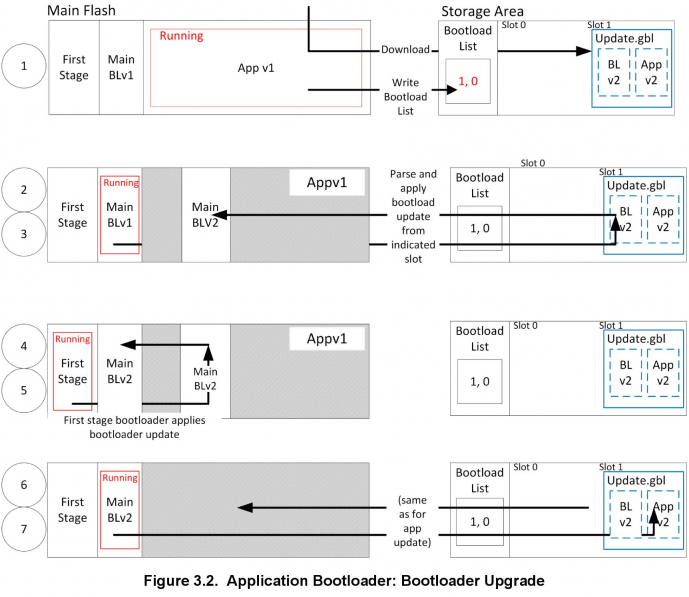
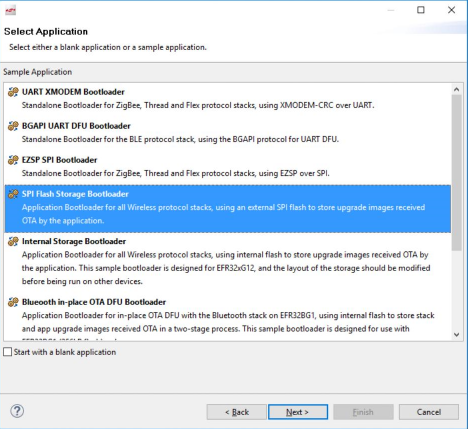
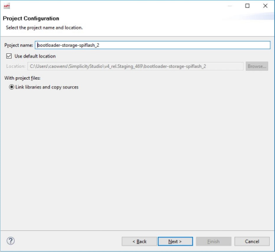
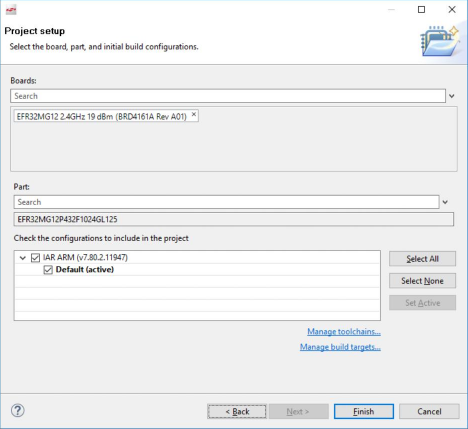
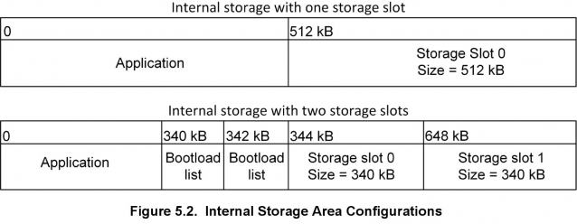
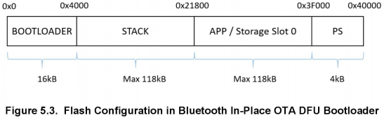
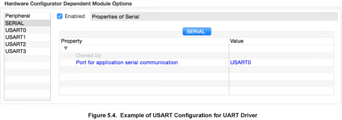

# Silicon Labs Gecko Bootloader User’s Guide (Rev. 0.6) <!-- omit in toc -->

本文档介绍了针对 EFM32 Series 1 微控制器和 EFR32 SoC 与 NCP 的 Silicon Labs Gecko Bootloader 的高级实现，并提供了有关配置 Gecko Bootloader 的各方面信息。如果您不熟悉执行固件升级的基本原则或想了解有关升级映像文件的更多信息，请参阅 **UG103.6: Bootloading Fundamentals**。有关将 Gecko Bootloader 与不同协议栈一起使用的更多信息，请参阅以下内容：

* **AN1084: Using the Gecko Bootloader with EmberZNet and Silicon Labs Thread**
* **AN1085: Using the Gecko Bootloader with Silicon Labs Connect**
* **AN1086: Using the Gecko Bootloader with Silicon Labs Bluetooth Applications**

## 目录 <!-- omit in toc -->

- [1. 引言](#1-引言)
  - [1.1 核心](#11-核心)
    - [1.1.1 共享内存](#111-共享内存)
  - [1.2 驱动程序](#12-驱动程序)
  - [1.3 插件](#13-插件)
    - [1.3.1 Communication](#131-communication)
    - [1.3.2 Compression](#132-compression)
    - [1.3.3 Debug](#133-debug)
    - [1.3.4 GPIO Activation](#134-gpio-activation)
    - [1.3.5 Security](#135-security)
    - [1.3.6 Storage](#136-storage)
- [2. Gecko Bootloader 操作 - 应用升级](#2-gecko-bootloader-操作---应用升级)
  - [2.1 独立引导加载程序操作](#21-独立引导加载程序操作)
    - [2.1.1 重新引导到引导加载程序](#211-重新引导到引导加载程序)
    - [2.1.2 下载并应用 GBL 升级文件](#212-下载并应用-gbl-升级文件)
    - [2.1.3 引导到应用](#213-引导到应用)
    - [2.1.4 错误处理](#214-错误处理)
  - [2.2 应用引导加载程序操作](#22-应用引导加载程序操作)
    - [2.2.1 下载并存储 GBL 映像升级文件](#221-下载并存储-gbl-映像升级文件)
    - [2.2.2 重启并应用 GBL 升级文件](#222-重启并应用-gbl-升级文件)
    - [2.2.3 引导到应用](#223-引导到应用)
- [3. Gecko Bootloader 操作 - 引导加载程序升级](#3-gecko-bootloader-操作---引导加载程序升级)
  - [3.1 Bootloader Upgrade on Bootloaders With Communication Interface (Standalone Bootloaders)](#31-bootloader-upgrade-on-bootloaders-with-communication-interface-standalone-bootloaders)
    - [3.1.1 下载并应用引导加载程序 GBL 升级文件](#311-下载并应用引导加载程序-gbl-升级文件)
    - [3.1.2 下载并应用应用程序 GBL 升级文件](#312-下载并应用应用程序-gbl-升级文件)
  - [3.2 Bootloader Upgrade on Bootloaders With Storage (such as SoCs)](#32-bootloader-upgrade-on-bootloaders-with-storage-such-as-socs)
- [4. 开始使用 Gecko Bootloader](#4-开始使用-gecko-bootloader)
- [5. 配置 Gecko Bootloader](#5-配置-gecko-bootloader)
  - [5.1 配置存储](#51-配置存储)
    - [5.1.1 SPI 闪存存储配置](#511-spi-闪存存储配置)
    - [5.1.2 内部存储配置](#512-内部存储配置)
  - [5.2 压缩升级映像](#52-压缩升级映像)
    - [5.2.1 LZMA 压缩设置](#521-lzma-压缩设置)
  - [5.3 引导加载程序示例配置](#53-引导加载程序示例配置)
    - [5.3.1 UART XMODEM Bootloader](#531-uart-xmodem-bootloader)
    - [5.3.2 BGAPI UART DFU Bootloader](#532-bgapi-uart-dfu-bootloader)
    - [5.3.3 EZSP SPI Bootloader](#533-ezsp-spi-bootloader)
    - [5.3.4 SPI Flash Storage Bootloader](#534-spi-flash-storage-bootloader)
    - [5.3.5 Internal Storage Bootloader](#535-internal-storage-bootloader)
    - [5.3.6 Bluetooth In-Place OTA DFU Bootloader](#536-bluetooth-in-place-ota-dfu-bootloader)
  - [5.4 为引导加载程序设置版本号](#54-为引导加载程序设置版本号)
  - [5.5 硬件配置](#55-硬件配置)
  - [5.6 不同引导加载程序配置的大小要求](#56-不同引导加载程序配置的大小要求)
- [6. Simplicity Commander 与 Gecko Bootloader](#6-simplicity-commander-与-gecko-bootloader)
  - [6.1 使用 Simplicity Commander 创建 GBL 文件](#61-使用-simplicity-commander-创建-gbl-文件)
- [7. Gecko Bootloader 安全特性](#7-gecko-bootloader-安全特性)
  - [7.1 关于安全特性](#71-关于安全特性)
    - [7.1.1 安全启动](#711-安全启动)
      - [使用 ECDSA-P256-SHA256 的安全启动](#使用-ecdsa-p256-sha256-的安全启动)
    - [7.1.2 安全固件升级](#712-安全固件升级)
  - [7.2 使用 Gecko Bootloader 安全特性](#72-使用-gecko-bootloader-安全特性)
    - [7.2.1 生成密钥](#721-生成密钥)
    - [7.2.2 为安全启动签署应用程序映像](#722-为安全启动签署应用程序映像)
    - [7.2.3 从应用程序创建签名的和加密的 GBL 升级映像文件](#723-从应用程序创建签名的和加密的-gbl-升级映像文件)
  - [7.3 系统安全的注意事项](#73-系统安全的注意事项)
- [8. 应用程序接口](#8-应用程序接口)
  - [8.1 应用程序属性](#81-应用程序属性)
  - [8.2 错误码](#82-错误码)

# 1. 引言

Silicon Labs Gecko Bootloader 是 Silicon Labs 所有新型 MCU 和无线 MCU 的通用引导加载程序（common bootloader）。Gecko Bootloader 可配置为执行各种引导加载功能（从设备初始化到固件升级）。该引导加载程序的主要特点包括：

* 可在 Silicon Labs Gecko 微控制器和无线微控制器系列中使用
* 可现场升级（In-field upgradeable）
* 可配置
* 增强的安全功能，包括：
  * 安全启动（Secure Boot）：启用安全启动后，引导加载程序会在每次启动时强制执行应用程序映像的加密签名验证（使用非对称密码）。这可确保应用程序是由受信任方创建和签名的。
  * 签名的升级映像文件（Signed upgrade image file）：Gecko Bootloader 支持强制执行升级映像文件的加密签名验证。这允许引导加载程序和应用程序在开始升级过程之前验证应用程序或引导加载程序的升级是否来自受信任的源，从而确保映像文件是由受信任方创建和签名的。
  * 加密的升级映像文件（Encrypted upgrade image file）：还可以对映像文件进行加密，以防止窃听者获取明文固件映像。

Gecko Bootloader 使用专有格式的升级映像，称为 GBL（Gecko Bootloader）。这些映像使用文件扩展名 “\.gbl”。有关 GBL 文件格式的更多信息，请参见 **UG103.6: Application Development Fundamentals: Bootloading**。

Gecko Bootloader 采用二阶（two-stage）设计，其中最小的首阶引导加载程序（first stage bootloader）用于升级主引导加载程序（main bootloader）。首阶引导加载程序仅包含在内部闪存中读取和写入固定地址的功能。要执行主引导加载程序的升级，正在运行的主引导加载程序将验证引导加载程序升级映像文件的完整性和真实性。然后，正在运行的主引导加载程序将升级映像写入到闪存中的固定位置，并重启（reboot）到首阶引导加载程序。首阶引导加载程序在将升级映像覆盖到主引导加载程序的位置之前会计算 CRC32 校验和来验证主引导加载程序固件升级映像的完整性。

主引导加载程序由一个通用核心（common core）、驱动程序（driver）和一组插件（plugin）组成，插件为引导加载程序提供了特定的能力。通用引导加载程序核心作为预编译库提供，而插件作为源代码提供。通用引导加载程序核心包含解析 GBL 文件并将其内容刷写到设备的功能。

Gecko Bootloader 可以配置为在独立（standalone）模式（也称为独立引导加载程序）或应用（application）模式（也称为应用引导加载程序）中执行固件升级，具体取决于插件配置。可以通过 Simplicity Studio IDE 启用和配置插件。

独立引导加载程序使用一个通信通道来获取固件升级映像。NCP（network co-processor，网络协处理器）设备始终使用独立引导加载程序。独立引导加载程序在一个单阶（single-stage）过程中执行固件映像升级，其允许将应用程序映像放入闪存以覆盖现有的应用程序映像，而无需应用本身的参与。通常，应用程序与独立引导加载程序交互的唯一时间是它请求重启到引导加载程序。引导加载程序运行后，它会通过物理连接（如 UART 或 SPI）接收包含固件升级映像的数据包。要使用独立引导加载程序，必须配置一个提供通信接口（如 UART 或 SPI）的插件。

应用引导加载程序依赖于应用程序来获取固件升级映像。应用引导加载程序通过使用存储在下载空间中的固件升级映像重新编程设备的闪存来执行固件映像升级。应用程序可以以任何方便的方式（UART、OTA 等）将固件升级映像传输到下载空间。下载空间可以是外部存储设备（如 EEPROM 或 dataflash），也可以是芯片内部闪存的一部分。Gecko Bootloader 可以将下载空间划分为多个存储槽，并同时存储多个固件升级映像。要使用应用引导加载程序，必须配置提供引导加载程序存储实现的插件。

Silicon Labs 提供了一些示例引导加载程序，它们带有一组预先配置的插件，可以在独立模式或应用模式下进行配置，如 [5. 配置 Gecko Bootloader](#5-配置-gecko-bootloader) 中所述。Silicon Labs Gecko SDK Suite 还包含了几个不同的 EFR32 设备的预编译引导加载程序映像。在撰写本文时，提供了下表中展示的映像。

> 注：这些预编译映像未启用引导加载程序的安全特性。

| Use |                        Wireless Stack |                            Image Name |        Mode |              Interface |
|:---:|--------------------------------------:|--------------------------------------:|------------:|-----------------------:|
| SoC | EmberZNet PRO<br>/Silicon Labs Thread |          SPI Flash Storage Bootloader | Application |       SPI Serial Flash |
| SoC |                             Bluetooth | Bluetooth In-Place OTA DFU Bootloader | Application | OTA<br>/internal flash |
| NCP | EmberZNet PRO<br>/Silicon Labs Thread |                UART XMODEM Bootloader |  Standalone |         UART<br>(EZSP) |
| NCP |                             Bluetooth |             BGAPI UART DFU Bootloader |  Standalone |        UART<br>(BGAPI) |

注意，在具有专用引导加载程序区域（EFR32xG12 和以后的 Series 1 设备）的设备上，如果设备配置为引导至引导加载程序区域（即，如果设置了 Config Lock Word 0 的第 1 位 `CLW0[1]`），则必须始终在引导加载程序区域中存在映像。该设备在出厂时已配有伪引导加载程序（dummy bootloader），可直接跳转到主闪存中的应用程序。这意味着当将引导加载程序刷写到具有专用引导加载程序区域的设备时，将替换此伪引导加载程序。如果在随后的开发期间不再需要使用引导加载程序，则必须清除 `CLW0[1]` 或重新刷写伪引导加载程序。平台特定的预构建伪引导加载程序映像位于 `./platform/bootloader/util/bin/` 中。注意，由于伪引导加载程序仅由少量指令组成，并且不会填充引导加载程序区域的其余部分，因此只会覆盖第一个闪存页面（首阶引导加载程序所在的位置），因此主阶引导加载程序可能在刷写伪引导程序之后保持不变。如果需要，可以单独擦除引导加载程序区域中的其余闪存页面。

随后的小节概述了 Gecko Bootloader 的通用核心、驱动程序和插件。有关错误代码和条件的详细信息，请参阅 `platform/bootloader/documentation` 文件夹中 SDK 附带的 **Gecko Bootloader API Reference**。

可以使用 Simplicity Commander 的 `commander device pageerase --region @bootloader` 命令来完全擦除引导加载程序区域。在此状态下，设备将无法启动，直到 `CLW0[1]` 被清零或写入伪引导加载程序。关于如何使用 Simplicity Commander 和 Gecko bootloader，请阅读 [6. Simplicity Commander 与 Gecko Bootloader](#6-simplicity-commander-与-gecko-bootloader)。

## 1.1 核心

引导加载程序核心包含引导加载程序的主要功能。它还包含写入内部闪存的功能、用于解析和处理 GBL 升级文件内容的映像解析器，以及在主闪存中引导应用程序的功能。

映像解析器还可选地支持 legacy Ember Bootloader（EBL）文件格式，但如果启用了对 EBL 文件的支持，则不支持 Gecko Bootloader 提供的任何安全特性。

它还提供不支持加密升级映像的 GBL 映像解析器版本。该版本可用于闪存空间受限的引导加载程序应用，其不需要加密升级映像。

### 1.1.1 共享内存

需要使用一部分 SRAM 来在引导加载程序和应用程序之间交换信息。SRAM 的内容通过软件复位保留（software reset），这使得 SRAM 适合作为引导加载程序和应用程序之间的通信通道。

共享内存（Shared Memory）的大小为 4 个字节，位于 SRAM 的第一个地址 0x20000000。它用于存储包含复位原因的单个字。复位原因字的结构在应用程序接口的复位信息（Reset Information）部分中，在文件 `btl_reset_info.h` 中定义为包含原因的 16 位，以及指示该字是否有效的 16 位签名。如果签名读取 0xF00F，则复位原因有效。

Silicon Labs 使用的所有 16 位复位原因都将最高有效位设置为零。如果需要自定义复位原因，建议设置最高有效位以避免定义冲突。

除了复位信息文档中定义的复位原因外，如果共享内存包含值 0x00000001，则引导加载程序将进入固件升级模式。支持此值以与某些传统蓝牙应用兼容。

## 1.2 驱动程序

不同的固件升级应用需要不同的硬件驱动程序，以供引导加载程序的其他组件使用。

驱动程序模块包括：

* Delay：简单的延迟例程，用于需要小延迟或超时的插件。
* SPI：简单阻塞的 SPI Master 实现，用于与外部设备（如 SPI 闪存）进行通信。
* SPI Slave：灵活的 SPI Slave 驱动程序实现，用于实现 SPI 协议的通信插件。此驱动程序支持阻塞和非阻塞操作，使用 DMA（Direct Memory Access，直接内存访问）来支持后台传输以支持非阻塞操作。
* UART：灵活的串行 UART 驱动程序实现，用于实现 UART 协议的通信插件。此驱动程序支持阻塞和非阻塞操作，使用 DMA 来支持后台传输以支持非阻塞操作。此外，还包括支持硬件流控制（RTS/CTS）。

## 1.3 插件

引导加载程序的所有可选部分或可以交换为不同配置的部分都实现为插件。每个插件都有一个通用头文件和一个或多个实现。插件包括：

* Communication
  * UART: XMODEM
  * UART: BGAPI
  * SPI: EZSP
* Compression
* Debug
* GPIO Activation
* Security
* Storage
  * Internal flash
  * External SPI flash

### 1.3.1 Communication

Communication 插件提供用于实现与主机（host）设备（例如计算机或微控制器）通信的接口。以下几个插件使用不同的传输协议来实现通信接口。

* BGAPI UART DFU：通过启用 BGAPI 通信插件，引导加载程序通信接口使用 BGAPI 命令来实现 UART DFU 协议。该插件使引导加载程序与先前随 Silicon Labs Bluetooth SDK versions 2.0.0-2.1.1 发布的 legacy UART bootloader 兼容。有关此内容的更多信息，请参阅 **AN1053: Bluetooth® Device Firmware Update over UART for EFR32xG1 and BGM11x Series Products**。
* EZSP-SPI：通过启用 EZSP-SPI 通信插件，引导加载程序通信接口通过 SPI 来实现 EZSP 协议。该插件使引导加载程序与先前随 EmberZNet 和 Silicon Labs Thread 无线协议栈一起发布的 legacy ezsp-spi-bootloader 兼容。有关 legacy Ember 独立引导加载程序的更多信息，请参阅 **AN760: Using the Ember Standalone Bootloader**。
* UART XMODEM：通过启用 UART XMODEM 通信插件，引导加载程序通信接口通过 UART 来实现 XMODEM-CRC 协议。该插件使引导加载程序与先前随 EmberZNet 和 Silicon Labs Thread 无线协议栈一起发布的 legacy serial-uart-bootloader 兼容。有关 legacy Ember 独立引导加载程序的更多信息，请参阅 **AN760: Using the Ember Standalone Bootloader**。

### 1.3.2 Compression

Compression 插件为引导加载程序 GBL 文件解析器提供了处理压缩的 GBL 升级映像的功能。每个压缩插件都支持一种压缩/解压算法。在撰写本文时，通过 `GBL Compression (LZ4)` 和 `GBL Compression (LZMA)` 插件来支持使用 LZ4 和 LZMA 算法压缩/解压数据。

### 1.3.3 Debug

该插件为引导加载程序提供了调试输出的支持。如果插件配置为启用调试打印，则短调试消息将通过 SWO（Serial Wire Output）打印，这可以通过多种方式访问，包括使用 Simplicity Commander，以及连接到无线入门套件 TCP/IP 接口的端口 4900。

### 1.3.4 GPIO Activation

如果在引导期间 GPIO 引脚处于活动状态，则此插件提供在复位后自动进入固件升级模式的功能。GPIO 引脚位置和极性是可配置的。

### 1.3.5 Security

Security 插件提供加密操作的实现以及计算校验和和从制造令牌（manufacturing token）中读取加密密钥的功能。

包括以下模块：

* AES: AES 加密功能
* CRC16: CRC16 功能
* CRC32: CRC32 功能
* ECDSA: ECDSA 签名验证功能
* SHA-256: SHA-256 摘要功能

### 1.3.6 Storage

这些插件为 SoC 提供了多种引导加载程序存储选项。所有存储实现都必须提供 API 来访问要升级的映像文件。此 API 基于将下载空间划分为存储槽的概念，其中每个槽在存储器中具有预定义的大小和位置，并且可用于存储单个升级映像。某些存储实现还支持原始存储 API 以访问底层存储介质。应用程序可以使用它将其他数据存储在不用于存储固件升级映像的存储介质的部分中。实现包括：

* Internal Flash：内部闪存存储实现使用设备的内部闪存进行升级映像存储。注意，此存储区域仅是一个下载空间，与用于保存活动应用代码的内部闪存部分分开。
* SPI Flash：SPI 闪存存储实现支持各种 SPI 闪存部件。支持的设备子集可以在编译时使用 AppBuilder 的 Bootloader 框架内的 SPI Flash Storage 插件的选项中进行配置（如果未选中任何复选框，则默认配置包含所有支持部件的驱动程序）。包含对多个设备的支持需要在引导加载程序中有更多的闪存空间。SPI 闪存存储实现不支持任何写保护功能。支持的 SPI 闪存部件如下表所示。

> 注：建议电池供电的应用实现为低功耗设备。使用其他列出的设备会因静态电流较高而缩短电池寿命，但如果需要，可以通过外部关断 FET 电路来减轻这种情况。

| Manufacturer Part Number                                                       | Size (kB) | Quiescent Current<br>(µA Typical)* |
|:-------------------------------------------------------------------------------|----------:|-----------------------------------:|
| Macronix MX25R8035F (low power)                                                |      1024 |                              0.007 |
| Macronix MX25R6435SF (low power)                                               |      8192 |                              0.007 |
| Spansion S25FL208K                                                             |      1024 |                                 15 |
| Winbond W25X20BVSNIG<br>(W25X20CVSNJG for high- temperature support)           |       256 |                                  1 |
| Winbond W25Q80BVSNIG<br>(W25Q80BVSNJG for high- temperature support)           |      1024 |                                  1 |
| Macronix MX25L2006EM1I-12G<br>(MX25L2006EM1R-12G for high-temperature support) |       256 |                                  2 |
| Macronix MX25L4006E                                                            |       512 |                                  2 |
| Macronix MX25L8006EM1I-12G<br>(MX25L8006EM1R-12G for high-temperature support) |      1024 |                                  2 |
| Macronix MX25L1606E                                                            |      2048 |                                  2 |
| Macronix MX25U1635E (2V)                                                       |      2048 |                                  2 |
| Atmel/Adesto AT25DF041A                                                        |       512 |                                 15 |
| Atmel/Adesto AT25DF081A                                                        |      1024 |                                  5 |
| Atmel/Adesto AT25SF041                                                         |       512 |                                  2 |
| Micron (Numonyx) M25P20                                                        |       256 |                                  1 |
| Micron (Numonyx) M25P40                                                        |       512 |                                  1 |
| Micron (Numonyx) M25P80                                                        |      1024 |                                  1 |
| Micron (Numonyx) M25P16                                                        |      2048 |                                  1 |
| ISSI IS25LQ025B                                                                |        32 |                                  8 |
| ISSI IS25LQ512B                                                                |        64 |                                  8 |
| ISSI IS25LQ010B                                                                |       126 |                                  8 |
| ISSI IS25LQ020B                                                                |       256 |                                  8 |
| ISSI IS25LQ040B                                                                |       512 |                                  8 |

\* Quiescent current values are as of December 2017; check the latest part specifications for any changes.

# 2. Gecko Bootloader 操作 - 应用升级

本节总结了用于更新应用固件的 Gecko Bootloader 操作，首先是 Gecko Bootloader 是在独立模式下配置，还是在应用模式下配置。[3. Gecko Bootloader 操作 - 引导加载程序升级](#3-gecko-bootloader-操作---引导加载程序升级) 提供了更新引导加载程序固件的信息。

## 2.1 独立引导加载程序操作

独立引导加载程序操作如下图所示：

<div align=center title="Figure 2.1. Standalone Bootloader Operation"></div>

1. 设备重启（reboot）到引导加载程序。
2. 从主机传输包含应用程序映像的 GBL 文件到设备。如果在主阶引导加载程序中启用了映像加密并且该映像已加密，则在接收和解析 GBL 文件的过程中将执行解密。
3. 引导加载程序即时应用来自 GBL 升级文件中的应用升级。如果在主阶引导加载程序中启用了映像身份验证，并且 GBL 文件包含签名，则在完成该过程之前将验证映像的真实性。
4. 设备引导到应用程序。应用升级完成。

### 2.1.1 重新引导到引导加载程序

Gecko Bootloader 支持多种触发引导加载程序的机制。如果启用了 GPIO Activation 插件，则主机设备可以通过复位将此引脚保持为低电平/高电平（取决于配置），以使设备进入引导加载程序。引导加载程序也可以通过软件进入。`bootloader_rebootAndInstall` API 首先通过向 SRAM 底部的共享内存位置写入命令来向引导加载程序发出信号，告知它应进入固件升级模式，然后执行软件复位。如果引导加载程序在引导时在共享内存中找到正确的命令，它将进入固件升级模式，而不是引导现有的应用程序。

### 2.1.2 下载并应用 GBL 升级文件

当引导加载程序进入固件升级模式时，它进入接收循环以等待来自主机设备的数据。接收循环的细节取决于协议。接收到的数据包将传递给映像解析器，映像解析器是一个状态机，用于解析数据并返回一个（包含应该对其执行操作的任何数据）回调。引导加载程序核心实现此回调，并将数据刷写到指定地址的内部闪存。如果启用了 GBL 文件身份验证或加密，则映像解析器将强制执行此操作，并中止映像升级。

引导加载程序通过抑制应用程序向量表的部分来防止新上载的映像可引导，直到验证了 GBL 文件的 CRC 和 GBL 签名（如果需要）。

### 2.1.3 引导到应用

完成应用升级后，引导加载程序会触发重启，并在 SRAM 底部的共享内存中发出信号，表明应用升级已成功完成。应用可以使用此复位信息来了解刚刚执行的应用升级。

在跳转到主应用之前，引导加载程序会验证应用是否已就绪。这包括验证应用的程序计数器是否有效，（如果启用了安全启动）以及应用是否通过签名验证。

### 2.1.4 错误处理

如果应用升级在任何时候被中断，则设备将没有可正常运行的应用。然后，引导加载程序将复位设备，并重新进入固件升级模式。主机设备可以轻松地重新开始应用升级过程，以尝试再次加载升级映像。

## 2.2 应用引导加载程序操作

下图说明了单个映像/存储槽和多个映像/存储槽的应用引导加载程序操作。

<div align=center title="Figure 2.2. Application Bootloader Operation"></div>

1. 如下所述，将 GBL 文件下载到设备的存储介质（内部闪存或外部数据闪存）上，并指示存在升级映像。
2. 设备重启到引导加载程序，引导加载程序进入固件升级模式。
3. 引导加载程序应用来自 GBL 升级文件中的应用升级。
4. 设备引导到应用程序。应用升级完成。

### 2.2.1 下载并存储 GBL 映像升级文件

要准备接收升级映像，应用将找到可用的存储槽（slot），或使用 `bootloader_eraseStorage` 擦除现有的存储槽。如果引导加载程序仅支持单个存储槽，则使用的槽 ID 为 0。

然后，应用使用适用的协议（如 Ethernet、USB、ZigBee、Thread 或 Bluetooth）接收 GBL 文件，并通过调用 `bootloader_writeStorage` 将其存储在槽中。

下载完成后，应用可以选择通过调用 `bootloader_verifyImage` 来验证 GBL 文件的完整性。这是在应用映像之前由引导加载程序完成的，但可以从应用程序中完成以避免在接收到损坏的映像时重新引导到引导加载程序。

如果支持多个存储槽，则应用应通过调用 `bootloader_setBootloadList` 来写入引导加载列表。引导加载列表是一个优先级列表，指示引导加载程序在尝试执行固件升级时应使用的顺序。引导加载程序将尝试按顺序验证这些存储槽中的映像，并应用第一个通过验证的映像。如果仅支持单个存储槽，则引导加载程序将隐式使用此槽。

### 2.2.2 重启并应用 GBL 升级文件

引导加载程序可以通过软件进入。`bootloader_rebootAndInstall` API 通过向 SRAM 底部的共享内存位置写入命令来向引导加载程序发信号以通知它应进入固件升级模式，然后执行软件复位。如果引导加载程序在引导时在共享内存中找到正确的命令，则它将进入固件升级模式，而不是引导现有的应用程序。

引导加载程序遍历为引导加载标记的存储槽列表，并尝试验证存储在每个槽中的映像。一旦找到有效的 GBL 升级文件，就会尝试执行来自该 GBL 文件中的固件升级。如果升级失败，则引导加载程序将移至列表中的下一个映像。如果没有映像通过验证，则引导加载程序将重新引导回现有的应用程序，并在 SRAM 中的共享内存位置中存放一条消息以指示未找到可用的升级映像。

### 2.2.3 引导到应用

完成应用升级后，引导加载程序会触发重启，并在 SRAM 底部的共享内存中发出信号来表明应用升级已成功完成。应用可以使用此复位信息来了解刚刚执行的应用升级。

在跳转到主应用之前，引导加载程序会验证应用是否已就绪。这包括验证应用的程序计数器是否有效，（如果启用了安全启动）以及应用是否通过签名验证。

# 3. Gecko Bootloader 操作 - 引导加载程序升级

首阶引导加载程序非常简单，只需要知道如何升级主引导加载程序。首阶引导加载程序自身不可升级。

升级主引导加载程序的要求因引导加载程序的配置而异：

* Application bootloader with storage：升级主引导加载程序需要一个包含引导加载程序和应用程序升级映像的 GBL 文件。
* Standalone bootloader with communication interface：升级引导加载程序需要两个 GBL 文件，一个只有引导加载程序升级映像，另一个只有应用程序升级映像。

通过对 GBL 文件进行签名来提供引导加载程序升级过程的安全性，如 [7.2.3 从应用程序创建签名的和加密的 GBL 升级映像文件](#723-从应用程序创建签名的和加密的-gbl-升级映像文件) 中所述。

## 3.1 Bootloader Upgrade on Bootloaders With Communication Interface (Standalone Bootloaders)

该过程如下图所示：

<div align=center title="Figure 3.1. Standalone Bootloader: Bootloader Upgrade"></div>

1. 设备重启到引导加载程序。
2. 从主机传输仅包含引导加载程序升级映像的 GBL 文件到设备。
3. GBL Bootloader 标签的内容被写入内部闪存中的固定引导加载程序升级位置。
4. 设备重启到首阶引导加载程序。
5. 首阶引导加载程序将主引导加载程序替换为固定引导加载程序升级位置中的新版本。
6. 设备引导到新的主引导加载程序。
7. 从主机传输仅包含应用程序映像的 GBL 文件到设备。
8. 引导加载程序即时应用来自 GBL 升级文件中的应用程序映像。
9. 设备引导到应用程序。引导加载程序升级完成。

引导加载程序升级的启动方式与应用程序升级相同。

### 3.1.1 下载并应用引导加载程序 GBL 升级文件

当引导加载程序进入接收循环时，包含引导加载程序升级的 GBL 升级文件将传输到引导加载程序。收到数据包后，会将其传递给映像解析器。映像解析器解析数据，并在回调中返回引导加载程序升级数据。引导加载程序核心实现此回调，并在首阶引导加载程序给出的固定引导加载程序升级地址处将数据刷写到内部闪存。

引导加载程序通过抑制引导加载程序升级向量表的部分，直到 GBL 文件的 CRC 和 GBL 签名（如果需要）已通过验证，来防止新上传的引导加载程序升级映像被解释为有效。

当收到完整的引导加载程序升级映像时，主引导加载程序通过将命令写入到 SRAM 底部的共享内存位置，然后执行软件复位，向首阶引导加载程序发出信号来告知它应进入固件升级模式。

首阶引导加载程序验证内部闪存中引导加载程序升级位置中存在的引导加载程序升级文件的 CRC，如果升级的版本号高于现有主引导加载程序的版本号，则复制该引导加载程序到主引导加载程序。有关更多信息，请参见 [5.4 为引导加载程序设置版本号](#54-为引导加载程序设置版本号)。

### 3.1.2 下载并应用应用程序 GBL 升级文件

完成引导加载程序升级后，现有的应用程序将变为无效，因为引导加载程序的升级位置与应用程序重叠。包含应用程序升级的 GBL 升级文件将传输到引导加载程序。应用程序升级过程如 [2.1 独立引导加载程序操作](#21-独立引导加载程序操作) 中所述。

## 3.2 Bootloader Upgrade on Bootloaders With Storage (such as SoCs)

该过程如下图所示：

<div align=center title="Figure 3.2. Application Bootloader: Bootloader Upgrade"></div>

1. 将包含引导加载程序升级映像和应用程序映像的单个 GBL 文件下载到设备的存储介质上（内部闪存或外部 SPI 闪存）。
2. 设备重启到引导加载程序。
3. 主引导加载程序将其升级映像复制到内部闪存中的固定引导加载程序升级位置。
4. 设备重启到首阶引导加载程序。
5. 首阶引导加载程序用新版本替换主引导加载程序。
6. 设备引导到新的主引导加载程序。
7. 引导加载程序应用 GBL 升级文件中的应用程序映像。
8. 设备引导进入应用程序。引导加载程序升级完成。

引导加载程序升级的启动方式与应用程序升级相同。包含引导加载程序和应用程序升级的单个 GBL 文件由应用程序写入到存储，并进入引导加载程序。

引导加载程序遍历为引导加载标记的存储槽列表，并尝试验证存储在其中的 GBL 文件。验证返回关于 GBL 文件是包含应用程序还是包含引导加载程序和应用程序的信息。映像解析器解析文件。如果 GBL 文件包含引导加载程序，则会在回调中返回引导加载程序升级数据。引导加载程序核心实现此回调，并根据首阶引导加载程序表（First Stage Bootloader Table）中给出的引导加载程序升级位置将数据刷写到内部闪存。

引导加载程序通过抑制引导加载程序升级向量表的部分，直到 GBL 文件的 CRC 和 GBL 签名（如果需要）已通过验证，来防止新上传的引导加载程序升级映像被解释为有效。

主引导加载程序通过将命令写入到 SRAM 底部的共享内存位置，然后执行软件复位，向首阶引导加载程序发出信号来告知它应进入固件升级模式。

首阶引导加载程序验证内部闪存中引导加载程序升级位置中存在的引导加载程序升级文件的 CRC，如果升级的版本号高于现有主引导加载程序的版本号，则复制该引导加载程序到主引导加载程序。有关更多信息，请参见 [5.4 为引导加载程序设置版本号](#54-为引导加载程序设置版本号)。

进入新的主引导加载程序，并验证为引导加载标记的存储槽列表中的映像。当映像解析器使用引导加载程序 + 应用程序升级来解析包含 GBL 文件的槽时，引导加载程序升级的版本号等于正在运行的主引导加载程序版本，因此不会执行另一个引导加载程序升级。而是在回调中返回应用程序升级数据。新应用程序的引导加载按 [2.2 应用引导加载程序操作](#22-应用引导加载程序操作) 中的说明进行。

# 4. 开始使用 Gecko Bootloader

本节介绍如何从提供的示例之一构建 Gecko Bootloader。该说明假定您已按照 SDK 的快速入门指南中所述安装了协议 SDK 和相关的实用程序，并且熟悉生成、编译和刷写示例应用程序。

* **QSG106: Getting Started with EmberZNet PRO**
* **QSG113: Getting Started with Silicon Labs Thread**
* **QSG139: Bluetooth Development with Simplicity Studio**
* **QSG138: Getting Started with the Silicon Labs Flex Software Development Kit for the Wireless Gecko (EFR32™) Portfolio**

1. 从 Launcher 视图中点击 `[New Project]`。
2. 在 Applications 对话框中，选择 Gecko Bootloader 并点击 `[Next]`。
    <div align=center></div>
3. 在 Select Application 对话框中，选择引导加载程序配置示例，然后单击 `[Next]`。
    <div align=center></div>
4. 在 Project Configuration 对话框中，为项目命名并可选地选择其他项目位置。点击 `[Next]`。
    <div align=center></div>
5. 在 Project Setup 对话框中，如果未显示 Part，请搜索并选择它。然后选择编译器。点击 `[Finish]`。将显示 Simplicity Studio IDE/AppBuilder 视图。
    <div align=center></div>
6. 在 General 选项卡上，可以可选地输入 description。
    <div align=center></div>
    Plugins 选项卡显示相关示例选择的配置。
    <div align=center></div>
7. 点击 `[Generate]`。
8. 在 Generation Successful 对话框中，点击 `[OK]`。
9. 点击构建图标（）。在构建目录中将生成两个引导加载程序映像：主引导加载程序，以及首阶引导加载程序和主引导加载程序的组合。主引导加载程序映像称为 `<projectname>.s37`，而组合的引导加载程序映像称为 `<projectname>-combined.s37`。设备第一次编程时，无论是在开发中还是在制造过程中，都需要对组合映像进行编程。对于后续编程，当设备上已经存在首阶引导加载程序时，可以使用仅包含主引导加载程序的映像。仅包含主引导加载程序的映像也是必须用来创建 GBL 文件以进行引导加载程序升级的映像。

# 5. 配置 Gecko Bootloader

## 5.1 配置存储

配置为应用引导加载程序的 Gecko Bootloader 必须包含用于存储和访问映像文件的 API。该 API 基于存储槽的概念，其中每个槽在存储器中具有预定义的大小和位置，并且可用于存储单个升级映像。这是通过在 Simplicity Studio 中的 Bootloader 应用框架中配置 Storage 插件来完成的。

配置多个存储槽时，引导加载列表用于指示引导加载程序应访问槽来查找升级映像的顺序。如果支持多个存储槽，则应用程序应在重启至引导加载程序之前调用 `bootloader_setBootloadList` 来编写引导加载列表，以启动固件升级过程。引导加载程序尝试按顺序验证这些存储槽中的映像，并应用第一个通过验证的映像。如果仅支持单个存储槽，则引导加载程序将隐式使用此槽。

### 5.1.1 SPI 闪存存储配置

要将 Gecko Bootloader 配置为从 SPI 闪存中获取映像，请修改以下内容。

应在 Common Storage 插件中配置 `base address of the storage area`。如果配置了多个存储槽，则这是引导加载程序放置引导加载列表的地址。在默认配置中，此地址设置为 0。如果仅配置了单个存储槽，则不使用引导加载列表，因此可以省略对其进行的配置。

可以在 AppBuilder 的 Storage 选项卡上配置 `location and size of the storage slots`。这里输入的地址是绝对地址（非基址的偏移量）。如果配置了多个槽，则必须在（Common Storage 插件中配置的）基址与（Storage 选项卡上配置的）第一个存储槽之间保留空间。必须保留足够的空间以容纳两个引导加载列表副本。这两个副本需要驻留在不同的闪存页上，以便在写入期间发生断电时提供冗余。因此需要保留两个完整的闪存页。在默认示例应用中，使用具有 4kB 闪存扇区的 SPI 闪存部件。这意味着必须在第一个存储槽之前保留 8kB。下图说明了如何对存储区域进行分区，其中顶行中的数字表示起始地址。

<div align=center title="Figure 5.1. SPI Flash Storage Area Configuration"></div>

### 5.1.2 内部存储配置

要将 Gecko Bootloader 配置为从内部闪存中获取映像，请修改以下内容。

应在 Common Storage 插件中配置 `base address of the storage area`。如果配置了多个存储槽，则这是引导加载程序将放置存储槽的优先级列表的地址。在默认配置中，仅配置了单个存储槽，因此该值设置为 0，并且未使用。如果配置了多个存储槽，则需要配置该值。

可以在 AppBuilder 的 Storage 选项卡上配置 `location and size of the storage slots`。这里输入的地址是绝对地址（非基址的偏移量）。如果配置了多个槽，则必须在（Common Storage 插件中配置的）基址与（Storage 选项卡上配置的）第一个存储槽之间保留空间。必须保留足够的空间以容纳两个引导加载列表副本。这两个副本需要驻留在不同的闪存页上，以便在写入期间发生断电时提供冗余。因此需要保留两个完整的闪存页。下图说明了如何对存储区域进行分区。

<div align=center title="Figure 5.2. Internal Storage Area Configurations"></div>

> 注：上述两个存储槽的示例中的存储区分区没有考虑任何 NVM 系统。如果使用像 SimEE 或 PS Store 这样的 NVM 系统，则在放置和调整存储区域的大小时，应使引导加载程序存储不与 NVM 重叠。

## 5.2 压缩升级映像

Gecko Bootloader 可选地支持压缩的 GBL 文件。在压缩的 GBL 文件中，仅压缩应用程序升级数据，任何元数据和引导加载程序升级数据（如果存在）都保持未压缩状态。这意味着除了包含应用程序升级映像的 GBL Programming Tag（如 **UG103.6: Bootloading Fundamentals** 中所述）已被 GBL LZ4 Compressed Programming Tag 或 GBL LZMA Compressed Programming Tag 替换外，压缩的 GBL 文件与普通（未压缩）GBL 文件相同。压缩的 GBL 上的签名和加密操作与未压缩的 GBL 上的操作相同。

为了能够使用压缩的升级映像，必须将相关压缩算法的解压器添加到 Gecko Bootloader 中。下表展示了 Gecko Bootloader 支持哪些压缩算法，以及应该添加哪个 AppBuilder 插件来启用该功能。该表还展示了解压器在引导加载程序中占用的空间大小，以及压缩应用程序升级映像的大小减小程度。

| Compression Algorithm | Plugin                 | Bootloader Size Requirement | Application Upgrade Size Reduction<br>(typical) |
|:----------------------|:-----------------------|----------------------------:|------------------------------------------------:|
| LZ4                   | GBL Compression (LZ4)  |                      < 1 kB |                                           ~ 10% |
| LZMA                  | GBL Compression (LZMA) |      ~5 kB flash, 18 kB RAM |                                           ~ 30% |

请务必注意，压缩的 GBL 文件在传输到设备时保持压缩状态，并且存储在升级区域中。应用升级时，它由引导加载程序解压。这意味着主闪存中运行的应用程序将与使用普通 GBL 文件安装的应用程序相同。

压缩的 GBL 文件只能在独立运行时由引导加载程序解压，而不能通过应用程序接口解压。这意味着应用程序在重启之前执行的升级映像验证不会尝试解压应用程序升级，它只会验证签名。重启到引导加载程序后，它将在升级过程中解压映像。

> 注：上述意味着无法压缩 Blutooth in-place 应用程序升级，因为其是由 Bluetooth Supervisor 或 AppLoader 通过应用程序接口使用引导加载程序中的功能来处理的。可以压缩 Supervisor/stack 和 AppLoader 更新，但不能压缩用户应用程序。

### 5.2.1 LZMA 压缩设置

LZMA 解压仅支持使用特定压缩设置压缩的映像。使用 `commander gbl create --compress lzma` 命令时，Simplicity Commander 会自动使用这些设置。

* 概率模型计数器：lp + lc <= 2。Simplicity Commander 使用 lp = 1，lc = 1。
* 字典大小不超过 8kB。Simplicity Commander 使用 8kB。

这些设置导致解压器需要 18kB 的 RAM 进行解压 - 计数器为 10kB，字典为 8kB。

GBL LZMA Compressed Programming Tag 包含一个完整的 LZMA 文件，包括 LZMA 头、原始流和结束标记。Gecko Bootloader 仅支持将结束标记作为压缩流的最后 8 个字节的有效载荷解压缩。

## 5.3 引导加载程序示例配置

以下部分描述了示例引导加载程序应用的关键配置选项。

> 注：所有示例配置都禁用了安全特性。在开发过程中，Silicon Labs 强烈建议启用安全特性，以防止未授权方上传不受信任的程序代码。请参阅 [7.2 使用 Gecko Bootloader 安全特性](#72-使用-gecko-bootloader-安全特性) 以了解如何配置 Gecko Bootloader 的安全特性。

### 5.3.1 UART XMODEM Bootloader

EFM32 和运行 EmberZNet PRO、Silicon Labs Thread 和 Silicon Labs Flex 协议栈的 EFR32 的独立引导加载程序，使用 UART 上的 XMODEM-CRC。

在此配置中，启用了 XMODEM UART 通信插件、XMODEM 解析器插件和 UART 驱动程序插件。为了使示例应用在自定义板上运行，需要配置用于 UART 的 GPIO 端口和引脚。这可以通过转到 AppBuilder 项目的 Plugins 选项卡，然后选择 UART 驱动程序插件来完成。此处，可以启用或禁用硬件流控制，并可以配置波特率和引脚。

默认情况下，GPIO Activation 插件也处于启用状态，这允许引导加载程序通过复位来激活 GPIO 以进入固件升级模式。如果不需要此功能，可以禁用此插件，或者可以在 Plugins 选项卡上的 GPIO Activation 插件下配置用于此目的的 GPIO 引脚。

### 5.3.2 BGAPI UART DFU Bootloader

Bluetooth 协议栈的独立引导加载程序，使用 UART DFU 的 BGAPI 协议。此引导加载程序应用于所有 NCP-mode Bluetooth 应用程序。

在此配置中，启用了 BGAPI UART DFU 通信插件和 UART 驱动程序插件。为了使示例应用在自定义板上运行，需要配置用于 UART 的 GPIO 端口和引脚。这可以通过转到 AppBuilder 项目的 Plugins 选项卡，然后选择 UART 驱动程序插件来完成。此处，可以启用或禁用硬件流控制，并可以配置波特率和引脚。

默认情况下，GPIO Activation 插件也处于启用状态，这允许通过复位来激活 GPIO 以进入引导加载程序。如果不需要此功能，可以禁用此插件，或者可以在 Plugins 选项卡上的 GPIO Activation 插件下配置用于此目的的 GPIO 引脚。

### 5.3.3 EZSP SPI Bootloader

使用 EZSP for SPI 的 EmberZNet PRO、Silicon Labs Thread 和 Silicon Labs Flex 协议栈的独立引导加载程序。

在此配置中，启用了 EZSP SPI 通信插件、XMODEM 解析器插件和 SPI slave 驱动程序插件。为了使示例应用在自定义板上运行，需要配置用于 SPI 和 EZSP 信令的 GPIO 端口和引脚。这可以通过转到 AppBuilder 项目的 Plugins 选项卡，然后分别选择 SPI slave 和 EZSP SPI 插件来完成。

### 5.3.4 SPI Flash Storage Bootloader

所有无线协议栈的应用引导加载程序，使用外部 SPI 闪存来存储应用通过无线方式接收的升级映像。

在此配置中，启用了 SPI flash 和 common storage 插件以及 SPI 驱动程序插件。为了使示例应用在自定义板上运行，需要在 SPI 插件中配置用于与外部闪存进行 SPI 通信的 GPIO 端口和引脚，并且需要在 SPI flash 插件中配置 SPI 闪存的类型。可以在 Common Storage 插件中配置存储区的基址。可以在 AppBuilder 的 Storage 选项卡上配置存储槽的位置和大小。

### 5.3.5 Internal Storage Bootloader

所有无线协议栈的应用引导加载程序，使用内部闪存来存储应用通过无线方式接收的升级映像。提供了多个示例，包括用于 EFR32xG13 等 512kB 闪存设备和 EFR32xG12 等 1024kB 闪存设备的配置。在任何其他设备上运行引导加载程序之前，应修改存储的布局。在此配置中，启用了 internal flash 和 common storage 插件。存储区的基地址在 Common Storage 插件中配置。可以在 AppBuilder 的 Storage 选项卡上配置存储槽的位置和大小。默认示例应用提供单个存储槽和多个存储槽的配置。

### 5.3.6 Bluetooth In-Place OTA DFU Bootloader

用于通过 Bluetooth 协议栈进行 in-place 无线设备固件升级的应用引导加载程序，使用内部闪存存储协议栈和应用程序升级映像，通过一个二阶过程进行无线接收。此示例仅适用于 EFR32BG1（256kB 闪存）。

在此配置中，256kB 内部闪存配置如下。

<div align=center title="Figure 5.3. Flash Configuration in Bluetooth In-Place OTA DFU Bootloader"></div>

最先的 16kB 保留用于引导加载程序，最后的 4kB 用于持久存储（PS，Persistent Storage），这两个大小是固定的。Bluetooth 协议栈和用户应用程序使用引导加载程序和 PS 之间的一个连续区域。该区域的大小为 `(256 - 16 - 4) = 236kB`。该区域在 Bluetooth 协议栈和用户应用程序之间平均分配，这意味着协议栈和应用程序的最大大小为 `236/2 = 118kB`。

在 Bluetooth in-place OTA DFU Bootloader 项目中，定义一个存储槽如下：

* Start at offset 0x21800 (137216)
* Size: 0x1D800 (120832 bytes)

## 5.4 为引导加载程序设置版本号

设置版本号有利于区分 Gecko Bootloader 的不同版本。要执行引导加载程序升级，引导加载程序升级映像的版本号必须高于正在运行的引导加载程序映像。可以在 Application Builder 中通过在 Other 选项卡的 Additional Macros 字段中定义宏 `BOOTLOADER_VERSION_MAIN_CUSTOMER` 来设置版本号，并选中 `-D?` 复选框以将定义添加到编译器命令行。这个宏将被配置文件 `btl_config.h` 选中，它与 Silicon Labs 提供的 Gecko Bootloader 文件的版本号相结合。

## 5.5 硬件配置

Gecko Bootloader AppBuilder 框架集成了硬件配置器（用于配置引脚和其他硬件相关设置）。当硬件配置器（Hardware Configurator）配置可用于 AppBuilder 插件时，相关设置将显示在 AppBuilder 插件配置的 Hardware Configurator 部分中。

<div align=center title="Figure 5.4. Example of USART Configuration for UART Driver"></div>

如果需要，单独的硬件配置器用户界面也可用于配置 Gecko Bootloader 的设置。

虽然硬件配置器为许多不同的外设提供配置，但 Gecko Bootloader 仅使用以下 Hardware Configurator 模块：

* SERIAL，被 UART Driver 插件用来配置波特率、流量控制模式和引脚排列。
* VCOM，被 UART Driver 插件用来在必要时启用串行接口（仅限 Silicon Labs Wireless Starter Kits）。
* EXTFLASH，被 SPI Driver 用来配置频率和引脚排列。
* SPINCP，被 SPI Slave Driver 用来配置引脚排列。
* BTL_BUTTON，被 GPIO Activation 插件使用。
* CMU HFXO 频率设置，被延迟（delay）驱动程序用来校准时序（如果核心从 HFXO 运行）。

默认引导加载程序代码不考虑其他设置，如 CMU oscillator 配置或 DCDC 配置。如果需要使用这些配置，则必须在 `btl_main.c` 中添加所需的代码。

> 注：虽然延迟驱动程序使用硬件配置器中的 HFXO 频率设置，但 HFXO 使能设置不用于在启动时初始化 HFXO。此设置仅在通过应用程序接口调用引导加载程序时使用，如 [8. 应用程序接口](#8-应用程序接口) 中所述，并且应用在调用 Bootloader 应用程序接口 API 之前已切换到 HFXO。

## 5.6 不同引导加载程序配置的大小要求

为 Gecko Bootloader 启用不同的配置选项会更改所生成映像的大小。下表显示了示例引导加载程序配置及其结果近似大小的列表（不包含首阶引导加载程序）。注意，大于 14kB 将无法放入 EFR32xG13 闪存的引导加载程序区，而大于 16kB 将无法放入 EFR32xG14 和 EFM32TG11 的闪存引导加载程序区。此表更新至 Gecko SDK Suite 2.5（Gecko Bootloader 1.8），并且不保证以下配置的大小将在未来版本中保持。

<table>
  <tr>
    <th>Base Configuration</th>
    <th>Enabled Options</th>
    <th>Size (kB)</th>
  </tr>
  <tr>
    <td rowspan="4">XMODEM UART</td>
    <td>Default configuration</td>
    <td>12.5</td>
  </tr>
  <tr>
    <td>Secure boot, signed and encrypted upgrade</td>
    <td>12.5</td>
  </tr>
  <tr>
    <td>Secure boot, signed and encrypted upgrade, LZ4 compression</td>
    <td>13.5</td>
  </tr>
  <tr>
    <td>Secure boot, signed and encrypted upgrade, LZMA compression</td>
    <td>17.5</td>
  </tr>
  <tr>
    <td rowspan="4">Internal storage, single slot</td>
    <td>Default configuration</td>
    <td>11</td>
  </tr>
  <tr>
    <td>Secure boot, signed and encrypted upgrade</td>
    <td>11</td>
  </tr>
  <tr>
    <td>Secure boot, signed and encrypted upgrade, LZ4 compression</td>
    <td>12</td>
  </tr>
  <tr>
    <td>Secure boot, signed and encrypted upgrade, LZMA compression</td>
    <td>16</td>
  </tr>
  <tr>
    <td rowspan="4">Internal storage, multiple slots</td>
    <td>Default configuration</td>
    <td>11.5</td>
  </tr>
  <tr>
    <td>Secure boot, signed and encrypted upgrade</td>
    <td>11.5</td>
  </tr>
  <tr>
    <td>Secure boot, signed and encrypted upgrade, LZ4 compression</td>
    <td>12.5</td>
  </tr>
  <tr>
    <td>Secure boot, signed and encrypted upgrade, LZMA compression</td>
    <td>16.5</td>
  </tr>
  <tr>
    <td rowspan="4">SPI flash, single slot</td>
    <td>Default configuration</td>
    <td>12</td>
  </tr>
  <tr>
    <td>Secure boot, signed and encrypted upgrade</td>
    <td>12</td>
  </tr>
  <tr>
    <td>Secure boot, signed and encrypted upgrade, LZ4 compression</td>
    <td>13</td>
  </tr>
  <tr>
    <td>Secure boot, signed and encrypted upgrade, LZMA compression</td>
    <td>17</td>
  </tr>
  <tr>
    <td rowspan="4">SPI flash, multiple slots</td>
    <td>Default configuration</td>
    <td>13</td>
  </tr>
  <tr>
    <td>Secure boot, signed and encrypted upgrade</td>
    <td>13</td>
  </tr>
  <tr>
    <td>Secure boot, signed and encrypted upgrade, LZ4 compression</td>
    <td>14</td>
  </tr>
  <tr>
    <td>Secure boot, signed and encrypted upgrade, LZMA compression</td>
    <td>18</td>
  </tr>
  <tr>
    <td rowspan="4">BGAPI UART</td>
    <td>Default configuration</td>
    <td>12</td>
  </tr>
  <tr>
    <td>Secure boot, signed and encrypted upgrade</td>
    <td>12</td>
  </tr>
  <tr>
    <td>Secure boot, signed and encrypted upgrade, LZ4 compression</td>
    <td>13</td>
  </tr>
  <tr>
    <td>Secure boot, signed and encrypted upgrade, LZMA compression</td>
    <td>17</td>
  </tr>
  <tr>
    <td rowspan="4">EZSP SPI</td>
    <td>Default configuration</td>
    <td>13</td>
  </tr>
  <tr>
    <td>Secure boot, signed and encrypted upgrade</td>
    <td>13</td>
  </tr>
  <tr>
    <td>Secure boot, signed and encrypted upgrade, LZ4 compression</td>
    <td>14</td>
  </tr>
  <tr>
    <td>Secure boot, signed and encrypted upgrade, LZMA compression</td>
    <td>18</td>
  </tr>
</table>

# 6. Simplicity Commander 与 Gecko Bootloader

Simplicity Commander 是一种用于生产环境的单一通用工具。可以使用一个简单的 CLI（Command Line Interface）调用它。您可以使用 Simplicity Commander 执行这些基本任务：

* 生成用于签名和加密的密钥文件
* 为安全启动签署应用程序映像
* 创建 GBL 映像（加密或未加密，签名或未签名）
* 解析 GBL 映像

Simplicity Commander 在以下各节的示例中使用。有关执行命令以完成这些任务的更多信息，请参阅 **UG162: Simplicity Commander Reference Guide** 参考指南。

> 注：Simplicity Commander 还提供 GUI（Graphical User Interface），可以在实验室中用于一般任务，例如刷写设备映像。本用户指南中描述的功能是从 CLI 中执行的。

## 6.1 使用 Simplicity Commander 创建 GBL 文件

要创建一个来自应用 `myapp.s37` 的未签名的 GBL 文件，请执行 `commander gbl create myapp.gbl --app myapp.s37`。

要创建一个来自主引导加载程序升级 `mybootloader.s37` 的未签名的 GBL 文件，请执行 `commander gbl create mybootloader.gbl --bootloader mybootloader.s37`。此文件可与 Gecko Bootloader 的独立引导加载程序配置一起使用。

这些命令也可以组合在一起以创建单个升级映像，适用于 Gecko Bootloader 的应用引导加载程序配置：`commander gbl create myupgrade.gbl --app myapp.s37 --bootloader mybootloader.s37`。

# 7. Gecko Bootloader 安全特性

## 7.1 关于安全特性

Gecko Bootloader 可以在两个级别上强制执行安全性：

* 安全启动（Secure Boot），指在每次启动设备时验证主闪存中应用程序映像的真实性。
* 安全固件升级（Secure Firmware Upgrade），指在执行引导加载之前验证升级映像的真实性，并可选地强制加密升级映像。

### 7.1.1 安全启动

启用安全启动后，在允许应用程序运行之前，将在每次启动时验证闪存中应用程序映像的加密签名。默认情况下，Silicon Labs 提供的示例配置中未启用安全启动，但强烈建议启用它以确保固件映像的有效性和完整性。

#### 签名算法 <!-- omit in toc -->

The Gecko Bootloader supports the ECDSA-P256-SHA256 cryptographic signature algorithm. This is the ECDSA (elliptical curve digital signature algorithm) of the SHA-256 digest of the application firmware image, using the NIST P-256 (secp256r1) curve.

#### 操作总结 <!-- omit in toc -->

1. 在启动时，引导加载程序会检查应用程序映像以获取有关是否已签名的信息。
2. 确定签名类型和签名位置。
3. 如果签名类型与引导加载程序的要求不匹配，则引导加载程序将进入设备固件升级模式并阻止应用程序运行。
4. 根据所选的签名算法，将从应用程序开始到签名位置的闪存内容的签名与签名位置处的签名进行比较。
5. 如果签名不匹配，则引导加载程序进入设备固件升级模式并阻止应用程序运行。

#### 使用 ECDSA-P256-SHA256 的安全启动

对于要为安全启动签名的映像，应用程序需要包含 `ApplicationProperties_t` 结构的副本。此结构包含有关使用哪种签名算法以及在何处查找签名的信息。

每次启动时，引导加载程序都会计算应用程序映像的 SHA-256 摘要。然后使用 ECDSA-P256 验证 SHA-256 摘要的签名。

如果签名有效，则允许应用程序启动。否则，进入引导加载程序，并尝试升级应用程序。

用于签名验证的公钥作为制造令牌（manufacturing token）存储在设备中。Simplicity Commander 可用于生成密钥对（key pair）并将公钥写入设备。有关更多信息，请参阅 **AN961: Bringing up Custom Devices for the Mighty Gecko and Flex Gecko Families**。

### 7.1.2 安全固件升级

Gecko Bootloader 支持安全固件升级过程。这是通过使用对称加密来加密升级映像和使用非对称加密来签署升级映像以确保其完整性和真实性来实现的。

#### 加密算法 <!-- omit in toc -->

The Gecko Bootloader supports the AES-CTR-128 encryption algorithm. The GBL upgrade file is encrypted using 128-bit AES in Counter mode with a random nonce as the initial counter value.

#### 签名算法 <!-- omit in toc -->

The Gecko Bootloader supports the ECDSA-P256-SHA256 cryptographic signature algorithm. This is the ECDSA signature of the SHA-256 digest of the GBL upgrade file, using the NIST P-256 (secp256r1) curve.

#### 操作总结 <!-- omit in toc -->

在开始固件升级过程之前，应用程序可以通过调用引导加载程序验证功能来验证存储器中的映像。

在固件升级期间，将解析 GBL 文件，如果加密，则即时解密。GBL 文件中的 GBL Signature Tag 向引导加载程序指示文件已签名，并且签名已经过验证。如果签名验证失败，则中止固件升级过程。

## 7.2 使用 Gecko Bootloader 安全特性

在此示例中，我们假设使用 Simplicity Studio 中的 Application Builder 构建了名为 `bootloader-uart-xmodem` 的引导加载程序。在输出目录中，生成了两个关注的文件：

* `bootloader-uart-xmodem.s37` - 该文件包含主引导加载程序。可用于引导加载程序升级。
* `bootloader-uart-xmodem-combined.s37` - 此文件在单个映像中包含首阶引导加载程序和主引导加载程序。可用于引导加载程序的制造和初始部署。

可以使用 Simplicity Studio 中的 Flash Programmer 或使用 Simplicity Commander 将相关版本刷写到 EFR32。

此示例提供了两种签名升级映像的方法。第一个选项使用 Simplicity Commander 生成密钥凭证和签名数据，这适合开发。第二个选项使用外部签名器（例如专用的硬件安全模块（HSM，Hardware Security Module））来保护私钥凭证并执行签名操作。Silicon Labs 建议使用 HSM 来保护私钥。

### 7.2.1 生成密钥

为了使用 Gecko Bootloader 的安全特性，需要生成加密密钥和签名密钥，然后必须将这些密钥写入到 EFR32。加密密钥与 GBL 文件一起使用以进行安全固件升级。签名密钥既可用于 GBL 文件，也可用于安全固件升级，还可用于为安全启动签署应用程序映像。

#### 使用 Simplicity Commander 生成签名密钥 <!-- omit in toc -->

```
commander gbl keygen --type ecc-p256 --outfile signing-key
```

这将创建一个用于签名的 ECDSA-P256 密钥对：`signed-key` 包含 PEM 格式的私钥，并且必须对第三方保密。此密钥稍后将用于签署映像和 GBL 文件。`signing-key.pub` 包含 PEM 格式的公钥，可用于使用 `commander gbl parse` 验证 GBL 文件。`signing-key-tokens. txt` 包含令牌格式的公钥，以合适地写入到 EFR32 。

#### 使用硬件安全模块生成签名密钥 <!-- omit in toc -->

使用硬件安全模块时，私钥在 HSM 内保密。根据 HSM 供应商的说明，让它生成 ECDSA-P256 密钥对，并将 PEM 格式的公钥导出到文件 `signing-key.pub`。然后使用 Simplicity Commander 将密钥转换为令牌格式，以合适地写入到 EFR32。

```
commander gbl keyconvert --type ecc-p256 signing-key.pub --outfile signing-key-tokens.txt
```

#### 生成加密密钥 <!-- omit in toc -->

```
commander gbl keygen --type aes-ccm --outfile encryption-key
```

这将在文件 `encryption-key` 中创建用于加密的 AES-128 密钥。该文件具有令牌格式，可以使用 `commander flash --tokenfile` 写入到 EFR32。

#### 向设备写入密钥  <!-- omit in toc -->

要将包含加密密钥和公钥的两个令牌文件作为制造令牌写入设备，请发出以下命令：

```
commander flash --tokengroup znet --tokenfile encryption-key --tokenfile signing-key-tokens.txt
```

### 7.2.2 为安全启动签署应用程序映像

如果引导加载程序强制执行安全启动，则需要对应用程序进行签名以通过验证。每次启动时，都会计算应用程序的 SHA-256 摘要。使用 ECDSA-P256 和 GBL 文件签名相同的公钥来验证签名。签名验证失败将会阻止应用程序启动。

#### 使用 Simplicity Commander <!-- omit in toc -->

可以使用以下命令对应用程序进行签名：

```
commander convert myapp.s37 --secureboot --keyfile signing-key --outfile myapp-signed.s37
```

#### 使用硬件安全模块 <!-- omit in toc -->

可以通过发出命令为应用程序做好准备：

```
commander convert myapp.s37 --secureboot --extsign --outfile myapp-for-signing.s37
```

使用 HSM 对输出文件 `myapp-for-signing.s37` 进行签名，并将生成的 DER 格式的签名文件 `signature.der` 提供给 Simplicity Commander：

```
commander convert myapp-for-signing.s37 --secureboot --signature signature.der --verify signing-key.pub --outfile myapp-signed.s37
```

### 7.2.3 从应用程序创建签名的和加密的 GBL 升级映像文件

要从应用程序创建 GBL 文件，请使用 `commander gbl create`。

注意，在撰写本文时，安全应用映像只能通过 Simplicity Commander 构建，而不能通过 AppBuilder 提供的配置选项构建。

#### 使用 Simplicity Commander 进行签名 <!-- omit in toc -->

对于名为 `myapp.s37` 的应用，使用：

```
commander gbl create myapp.gbl --app myapp.s37 --sign signing-key --encrypt encryption-key
```

此命令执行三个操作：

* 创建 GBL 文件
* 加密 GBL 文件
* 签名 GBL 文件

如果还需要安全启动，则必须在创建 GBL 之前使用 `commander convert --secureboot` 对应用程序进行签名。

#### 使用硬件安全模块进行签名 <!-- omit in toc -->

对于名为 `myapp-signed.s37` 的应用（先前已为安全启动签名），使用：

```
commander gbl create myapp-for-signing.gbl --app myapp-signed.s37 --extsign --encrypt encryption-key
```

此命令执行如下操作：

* 创建部分 GBL 文件（Creates a partial GBL file）
* 加密部分 GBL 文件（Encrypts the partial GBL file）
* 为外部签名器准备要签名的部分 GBL 文件（Prepares the partial GBL file for signing by an external signer）

使用 HSM 对输出文件 `myapp-for-signing.gbl` 进行签名，并将生成的 DER 格式的签名文件 `signature.der` 提供给 Simplicity Commander：

```
commander gbl sign myapp-for-signing.gbl --signature signature.der --verify signing-key.pub --outfile myapp.gbl
```

在使用 `gbl sign` 进行签名之前，GBL 文件是无效的。

## 7.3 系统安全的注意事项

Gecko bootloader 安全特性可用于创建安全设备，但不能自行创建安全系统。本节讨论了在设计一个安全系统（其中 Gecko Bootloader 作为一个组件）时需要考虑的事项。

Gecko bootloader 使用的加密和签名密钥存储在闪存中的 Lockbits 页中。为了防止恶意应用更改或擦除密钥，在制造中写入密钥后，应对 Lockbits 页进行写保护。

默认情况下，Gecko bootloader 使用的闪存区域是可读写的。该区域需要保持可读性，以便应用程序接口能够与引导加载程序交互。复位后，该区域也需要是可写的，以便首阶引导加载程序能够执行引导加载程序升级。但是，只要主引导加载程序已启动，就可以对 EFR32xG12（及更新版本）的引导加载程序区域进行写保护。这是通过在每次启动时设置一次写入（write-once）`MSC_BOOTLOADERCTRL_BLWDIS` 位来完成的。如果在 AppBuilder 的 Core 插件中启用了 `Prevent bootloader write/erase` 插件选项，则该动作由 Gecko bootloader 的主阶来完成。

在 EFR32xG1 上，引导加载程序驻留在主闪存（而不是信息块）中，BLWDIS 选项并不存在。在这些设备上，可以使用 Page Lock word 来对包含首阶引导加载程序的第一个闪存页进行写保护（使用 `commander device protect --write --range 0x0:+0x800`）。如果要支持引导加载程序升级，则包含主引导加载程序的页需要保持可写状态。

> 注：设置 `MSC_BOOTLOADERCTRL_BLWDIS` 也会阻止调试器刷写新的引导加载程序。这意味着在重新刷写之前不能完全停止并复位目标设备的调试工具可能无法刷写新的引导加载程序，因为闪存具有写保护。如果您不确定您的调试工具是否能够优雅地处理此问题，Silicon Labs 建议在开发期间禁用此设置，并在投入生产之前启用它。如果您的调试工具在刷写之前可以停止并复位目标设备，则这不是问题，Silicon Labs 建议在开发前期启用此设置。

为防止调试器访问设备，需要写入 Debug Lock word。启用 Debug Lock 后可以恢复设备，但会擦除主闪存和 Lockbits 页。这将擦除存储在 Lockbits 页中的主应用程序和密钥凭证。Userdata 页和引导加载程序区域将在 Debug Unlock 后存留，因此不应将机密存储在这些位置。要 Debug Lock 设备，请发出 `commander device lock --debug enable`。AAP Lock 可用于永久锁定调试端口。这也可以防止调试解锁。要 AAP Lock 设备，请参阅设备的参考手册以获取 AAP Lock word 的地址位置，并使用 `commander flash --patch` 将适当的值写入此地址。

# 8. 应用程序接口

引导加载程序有一个通过引导加载程序中的函数表公开的应用程序接口。应用程序接口提供 API 以使用引导加载程序函数来存储和检索升级映像，并验证其完整性。还提供了重启到引导加载程序的 API。有关详细信息，请参阅 `platform/bootloader/documentation` 文件夹中 SDK 附带的 **Gecko Bootloader API Reference**。

如果您没有使用 Silicon Labs 的协议栈，`api/btl_interface.h` 头文件将提供引导加载程序应用程序接口 API。如果您使用 Silicon Labs 的协议栈，则应使用特定协议栈推荐的引导加载程序接口 API。以下文件提供了引导加载程序接口的实现：

* `api/btl_interface.c`（通用接口）
* `api/btl_interface_storage.c`（存储功能的接口）

应用程序接口由可包含在自定义应用中的函数组成，并通过 `MainBootloaderTable_t` 与引导加载程序通信。该表包含指向引导加载程序的函数指针。引导加载程序的 10th word 包含指向此结构的指针，以允许任何应用程序轻易地定位它。应该优先选择使用引导加载程序接口 API 中提供的包装函数，这比直接访问引导加载程序表更好。模块包括：

* `Application Parser Interface`：用于与引导加载程序映像解析器联系的应用程序接口。
* `Application Storage Interface`：用于与引导加载程序存储联系的应用程序接口。存储接口仅适用于支持存储接口的引导加载程序。
* `Common Application Interface`：所有版本的引导加载程序均可使用的通用应用程序接口，独立于存在的插件。

## 8.1 应用程序属性

应用程序映像应包含 `ApplicationProperties_t` 结构来声明应用程序版本、能力和其他元数据。使用 Silicon Labs 的协议栈时，此结构已存在于应用中。Simplicity Commander 从应用程序中提取此结构中包含的元数据，并将其放入 GBL 升级文件的 GBL Application Tag 中。如果应用程序中不存在该结构，Simplicity Commander 将引发错误。使用 `--force` 可以抑制错误，在这种情况下，Simplicity Commander 会将全零的 GBL Application Tag 添加到 GBL 文件中。可以使用 Application Storage 接口通过正在运行的应用程序从 GBL 文件中提取此标签的内容。注意，仅当 GBL 文件包含应用程序映像时才会添加 GBL Application Tag。

应用程序中的结构还用于声明应用程序映像是否已签名，以及使用何种类型的签名。使用 `commander convert (--secureboot, --extsign or --signature)` 对映像进行签名时，Simplicity Commander 会添加此信息。为了使引导加载程序能够定位 `ApplicationProperties_t` 结构，如果链接器尚未完成，Simplicity Commander 会修改应用程序的 word 13，以便在为安全启动签名应用程序映像时插入指向 `ApplicationProperties_t` 结构的指针。

## 8.2 错误码

大多数 Gecko bootloader API 都会返回错误码。下表列出了可能返回的错误码集。每个组中的错误码的完整列表可以在 SDK 的 `platform/bootloader` 目录下的 `api/btl_errorcode.h` 中找到，也可以在 **API Reference** 中找到。

| ID     | Description              |
|:-------|:-------------------------|
| 0x0    | OK                       |
| 0x01xx | Initialization error     |
| 0x02xx | Image verification error |
| 0x04xx | Storage error            |
| 0x05xx | Bootload error           |
| 0x06xx | Security error           |
| 0x07xx | Communication error      |
| 0x09xx | XMODEM parser error      |
| 0x10xx | GBL file parser error    |
| 0x11xx | SPI slave driver error   |
| 0x12xx | UART driver error        |
| 0x13xx | Compression error        |
