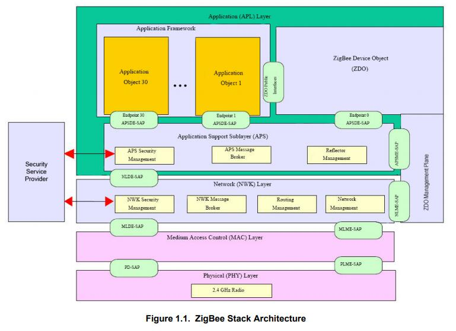
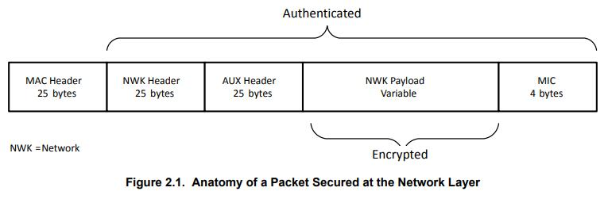
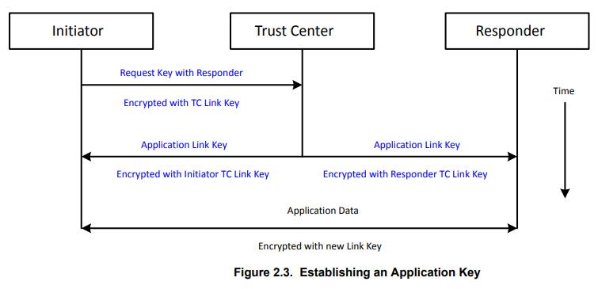
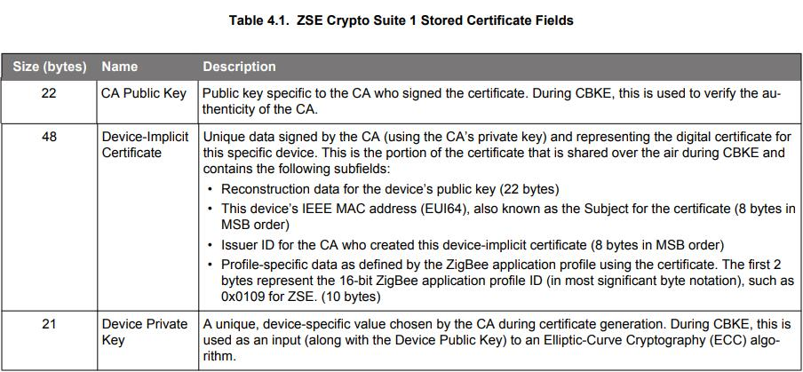
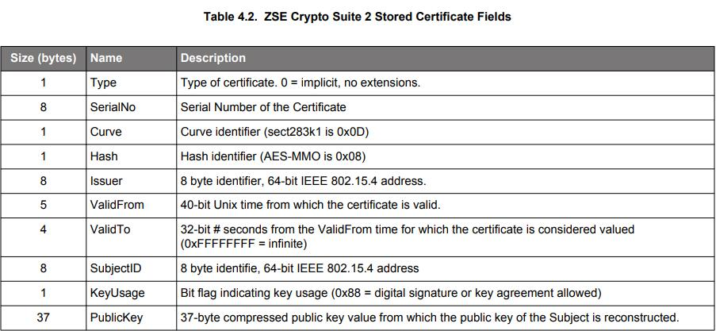

# **UG103.5：Application Development Fundamentals：Security** <!-- omit in toc -->

本文档介绍了一些基本的安全概念，包括网络层安全，信任中心和应用支持层安全特性。然后讨论了 EmberZNet PRO 中可用的标准安全协议的类型。总结了对实施安全的编码要求。最后，提供了有关实施 ZigBee 智慧能源安全的信息。

Silicon Labs 的应用程序开发基础系列涵盖了项目经理，应用程序设计人员和开发人员在开始使用 Silicon Labs 芯片，EmberZNet PRO 或 Silicon Labs Bluetooth Smart 等网络栈以及相关开发工具的嵌入式网络解决方案之前应该了解的主题。这些文档可以作为任何需要介绍开发无线网络应用程序的人或者是 Silicon Labs 开发环境的新手的起点。

关键点：
* 介绍 ZigBee 栈架构
* 介绍基本安全概念，如网络层安全，信任中心网络和 APS 层安全
* 定义用于以不同方式担保数据的不同密钥
* 描述 ZigBee 智慧能源（ZSE）安全

------------------------------------------------------------------------------------------------------------------------

- [**1. 引言**](#1-引言)
- [**2. 概念**](#2-概念)
    - [**2.1 网络层安全**](#21-网络层安全)
        - [**2.1.1 网络密钥**](#211-网络密钥)
        - [**2.1.2 逐跳安全**](#212-逐跳安全)
        - [**2.1.3 包安全**](#213-包安全)
        - [**2.1.4 辅助报头**](#214-辅助报头)
        - [**2.1.5 认证和加密**](#215-认证和加密)
        - [**2.1.7 未加密的网络数据**](#217-未加密的网络数据)
    - [**2.2 信任中心网络**](#22-信任中心网络)
    - [**2.3 分布式信任中心网络**](#23-分布式信任中心网络)
    - [**2.4 APS 层安全**](#24-aps-层安全)
        - [**2.4.1 端到端安全**](#241-端到端安全)
        - [**2.4.2 链接密钥**](#242-链接密钥)
        - [**2.4.3 未加密的 APS 数据**](#243-未加密的-aps-数据)
- [**3. 标准安全**](#3-标准安全)
    - [**3.1 概述**](#31-概述)
    - [**3.2 在标准安全中使用密钥**](#32-在标准安全中使用密钥)
        - [**3.2.1 网络密钥**](#321-网络密钥)
        - [**3.2.2 信任中心链接密钥**](#322-信任中心链接密钥)
        - [**3.2.3 安装码密钥**](#323-安装码密钥)
        - [**3.2.4 应用程序链接密钥**](#324-应用程序链接密钥)
    - [**3.3 加入一个网络**](#33-加入一个网络)
        - [**3.3.1 预配置的链接密钥**](#331-预配置的链接密钥)
        - [**3.3.2 使用众所周知的密钥或安装码的决定**](#332-使用众所周知的密钥或安装码的决定)
        - [**3.3.3 加入后请求新的链接密钥**](#333-加入后请求新的链接密钥)
    - [**3.4 网络密钥更新**](#34-网络密钥更新)
        - [**3.4.1 广播网络密钥更新**](#341-广播网络密钥更新)
        - [**3.4.2 单播网络密钥更新**](#342-单播网络密钥更新)
        - [**3.4.3 缺失网络密钥更新**](#343-缺失网络密钥更新)
    - [**3.5 网络重新加入**](#35-网络重新加入)
        - [**3.5.1 安全重新加入**](#351-安全重新加入)
        - [**3.5.2 信任中心重新加入**](#352-信任中心重新加入)
    - [**3.6 信任中心决策流程摘要**](#36-信任中心决策流程摘要)
        - [**3.6.1 分布式信任中心模式**](#361-分布式信任中心模式)
    - [**3.7 信任中心的附加要求**](#37-信任中心的附加要求)
        - [**3.7.1 信任中心作为集中器**](#371-信任中心作为集中器)
        - [**3.7.2 信任中心和源路由**](#372-信任中心和源路由)
        - [**3.7.3 信任中心地址缓存**](#373-信任中心地址缓存)
- [**4. ZigBee 智慧能源（ZSE）安全**](#4-zigbee-智慧能源zse安全)
    - [**4.1 概述**](#41-概述)
        - [**4.1.1 安装码**](#411-安装码)
        - [**4.1.2 证书和密钥建立**](#412-证书和密钥建立)
        - [**4.1.3 应用层要求**](#413-应用层要求)
    - [**4.2 额外的信息源**](#42-额外的信息源)

------------------------------------------------------------------------------------------------------------------------

# **1. 引言**

安全性是 ZigBee 架构中主要关心的。虽然 ZigBee 使用 IEEE 802.15.4 中的基本安全元素（例如，高级加密标准（AES）加密和计数器与 CBC-MAC（CCM）安全模式），但它扩展了以下内容：
* 128 位 AES 加密算法
* 美国国家标准与技术研究院（NIST）批准的安全
* 定义的密钥类型（链路，网络）
* 定义的密钥设置和维护
* 密钥可以硬连线到应用程序中
* CCM\*（统一/更简单 的操作模式）
* 信任中心
* 可以为应用程序自定义的安全

如下图所示，安全服务提供者阻止与应用层和网络层的交互。

ZigBee 现在支持一种单一定义的安全模式，称为标准安全（Standard Security）。该模式中存在各种策略来控制设备在网络上的行为或交互方式。早期版本的 ZigBee 标准采用的是称为住宅安全（Residential Security）和高级安全（High Security）的模式。这些都已被弃用。

> Note：ZigBee 不使用 IEEE 802.15.4 MAC 级安全，因此 EmberZNet PRO 不支持这种安全，此处不再赘述。ZigBee 在网络和应用层实现消息安全。

本文档首先介绍了一些基本的安全概念，包括网络层安全，信任中心和应用支持层安全特性。然后讨论了 EmberZNet PRO 中可用的标准安全协议的类型。总结了对实施安全性的编码要求。最后，提供了有关实施 ZigBee 智慧能源安全的信息。详情可以在文档 **AN714：Smart Energy ECC-Enabled Device Setup** 中找到。

那些已经熟悉 ZigBee 安全概念的人可以跳到 [4. ZigBee 智慧能源（ZSE）安全](#4-zigbee-智慧能源zse安全)。

------------------------------------------------------------------------------------------------------------------------

# **2. 概念**

## **2.1 网络层安全**

本节介绍 ZigBee 如何在网络层实现安全，这适用于标准安全。网络安全提供了独立于可能在 ZigBee 节点上运行的应用程序的安全。所有经过 ZigBee 认证的设备都必须使用网络层安全。它提供了基本的访问控制，用于控制允许哪些节点参与特定的 ZigBee 网络。有关应用控制安全，请参阅 [2.4 APS 层安全](#24-aps-层安全)。

### **2.1.1 网络密钥**

网络安全使用一个全网络的密钥进行加密和解密。所有被授权加入网络的设备都有密钥的副本，并使用它来加密和解密所有网络消息。网络密钥还具有一个与其关联的序列号，用于标识密钥的特定实例。当更新网络密钥时，序列号会递增，以允许设备识别使用哪个网络密钥实例来担保包数据。序列号的范围是 0 到 255。当序列号达到 255 时，它将回绕到 0。

> Note：所有 ZigBee 密钥的长度均为 128 位。

所有属于安全 ZigBee 网络的设备都具有网络密钥的副本。

### **2.1.2 逐跳安全**

需要注意的是，ZigBee 中的网络安全是在逐跳基础上进行的。在完成任何更多处理之前，每个中继已加密包的路由器首先验证它是否是一个有效的已加密包。路由器通过执行 ZigBee 解密机制和验证包完整性来认证包。然后，在将消息发送到下一跳之前，它会使用自己的网络参数（如源地址和帧计数器）重新加密包。如果没有此保护，攻击者可以将消息重播到网络中，该消息将通过多个设备进行路由，从而消耗网络资源。使用逐跳安全性允许路由器阻止将错误流量注入网络的尝试。

### **2.1.3 包安全**

网络层上担保的包由下图所示的元素组成。

### **2.1.4 辅助报头**

辅助报头包含关于包安全的数据，接收节点使用该数据来正确地认证和解密包。该包括所使用的密钥类型，序列号（如果为网络密钥），担保数据的设备的 IEEE 地址及帧计数器。

### **2.1.5 认证和加密**

ZigBee 使用 128 位对称密钥（AES-128）加密网络层上的所有传输。网络和辅助报头以明文（但已认证）的方式发送，而网络有效载荷则经过认证和加密。AES-128 用于创建消息的整个网络部分（报头和有效载荷）的散列，该散列附加到消息的末尾。此散列称为消息完整性代码（MIC），用于通过确保消息未被修改来对消息进行认证。接收设备对消息进行散列处理，并根据附加到消息的值验证计算出的 MIC。对消息的更改将使 MIC 无效，接收节点将完全丢弃该消息。

> Note：ZigBee 使用一个 4 字节的 MIC。

### **2.1.7 未加密的网络数据**

所有正常的网络数据报都需要具有网络安全和有效的帧计数器。唯一的例外是在加入期间，当设备还没有网络密钥时。在这种情况下，加入设备的消息将通过其父设备进行中继，直到它完全加入和认证。在没有网络层安全的情况下收到的任何其他消息都将被静默丢弃。

## **2.2 信任中心网络**

可以通过称为信任中心的中央机构来控制安全网络中的认证。所有进入网络的设备将暂时加入网络，直到联系信任中心并决定是否允许新设备进入网络。新加入的设备的父节点充当信任中心和加入设备之间的中继。只有认证消息才能发送到设备或从设备发出，直到完全加入和认证为止。

信任中心可以选择在设备加入时执行以下三种操作之一：
* 发送当前网络密钥的副本，从父节点中继到加入设备。
* 向父节点发送命令以将设备从网络中移除，从而禁止其加入。
* 忽略请求。如果设备在 2 秒内没有收到网络密钥，则父节点将静默地将设备从网络中移除。

一旦节点具有网络密钥，它就被认为是完全加入和认证的，并且可以与网络上的任何设备通信。

使用信任中心进行操作的网络总是需要信任中心来认证任何新设备。两台设备之间的正常消息不需要信任中心参与。

## **2.3 分布式信任中心网络**

网络可以在没有集中认证的情况下形成。这些网络称为分布式信任中心网络。在这种情况下，任何路由器都可以授权和认证希望加入的新设备。

这些网络提供了一种更简单的机制，可以将设备添加到网络中，其代价是网络的安全性较低。

在网络形成时决定使用分布式信任中心网络或信任中心网络。网络启动后无法更改此决定。

## **2.4 APS 层安全**

本节介绍 ZigBee 如何在应用支持（APS）层实现安全。

### **2.4.1 端到端安全**

APS 安全旨在提供一种在 ZigBee 网络内安全地发送消息的方法，使得除了源和目的地之外，没有其他设备可以解密数据。这与网络安全不同，后者仅提供逐跳安全。在这种情况下，每个设备都是网络的一部分，将听到包被中继到其目的地并对其进行解密。

APS 安全使用只有源和目标知道的共享密钥，从而提供端到端安全。

APS 层和网络层加密可以同时用于加密消息的内容。在这种情况下，首先应用 APS 层安全，然后应用网络层安全。

APS 层上担保的包由下图所示的元素组成。

### **2.4.2 链接密钥**

APS 安全使用称为链接密钥的点对点密钥。在发送 APS 担保的数据之前，两个设备必须已经相互建立了此密钥。链接密钥有两种类型：信任中心链接密钥和应用程序链接密钥。

**信任中心链接密钥**

信任中心链接密钥是一种特殊链接密钥，其中一个伙伴设备是信任中心。栈使用此密钥向信任中心发送和从信任中心接收 APS 命令消息。应用程序还可以使用此密钥发送 APS 加密的数据消息。

Zigbee 网络中的所有设备都必须具有链接密钥。在信任中心网络中，设备必须具有信任中心链接密钥。在分布式信任中心网络中，此密钥称为分布式信任中心链接密钥。

**应用程序链接密钥**

应用程序链接密钥是可以在网络中的任意两个节点之间建立的共享密钥，其中两个设备都不是信任中心。其可用于为发送到或从运行在节点上的应用程序发送的消息添加额外的安全。设备可以为每个设备使用不同的应用程序链接密钥进行通信。

设备可以预先配置应用程序链接密钥，也可以在自身和其他设备之间请求链接密钥。在后一种情况下，它向使用其信任中心链接密钥加密的信任中心发出请求。信任中心充当两个设备的可信第三方，因此它们可以安全地建立彼此之间的通信。这将在 [3.2.4 应用程序链接密钥](#324-应用程序链接密钥) 中进一步讨论。建立应用程序链接密钥的过程如下图所示。

### **2.4.3 未加密的 APS 数据**

APS 层安全操作独立于网络层安全。对于 ZigBee 栈发送到信任中心和从信任中心发出的某些安全消息（APS 命令），它是必需的。

与网络安全不同，应用程序消息的 APS 安全是可选的。应用程序消息不会在 APS 层自动加密，如果接收端没有 APS 加密，则不会被忽略。各个应用程序可以选择是接受还是拒绝没有 APS 层安全的消息。例如，智慧能源配置文件描述了 ZigBee 簇消息需要具备哪些安全。

------------------------------------------------------------------------------------------------------------------------

# **3. 标准安全**

## **3.1 概述**

在 ZigBee 2007 规范和 ZigBee PRO 中引入的标准安全是被用于所有 ZigBee 应用程序配置文件和 ZigBee 3.0 中的安全模型。它是 EmberZNet 栈库支持的唯一安全模型。

标准安全分别使用网络密钥和链接密钥对网络和应用层的数据进行加密。应用支持（APS）层安全允许信任中心安全地将网络密钥传输到加入或重新加入的节点，并且其可选地允许应用程序为其消息添加额外的安全。网络（NWK）层安全用于担保在 ZigBee 网络上发送的所有流量，但基本的 MAC 层通信除外（如关联，数据请求（轮询）和 MAC ACKs）。

## **3.2 在标准安全中使用密钥**

标准安全定义了用于以不同方式担保数据的不同密钥。所有密钥都是 128 位对称的，可能/可能不 会用于 加密/解密 包。

### **3.2.1 网络密钥**

这是全网络密钥，用于在网络层上担保传输。标准安全要求在网络中的所有设备之间使用共享网络密钥。信任中心可以定期更新并切换到新的网络密钥。信任中心可以使用广播更新或单播更新。在广播的情况下，信任中心首先会广播一个用旧网络密钥加密的新网络密钥。在单播情况下，信任中心向每个设备发送一个新的网络密钥，该密钥使用设备一致的信任中心链接密钥进行加密。

在这两种情况下，信任中心稍后都会告知所有设备切换到要使用的新网络密钥。新网络密钥的序列号比前一个的序列号高一。

### **3.2.2 信任中心链接密钥**

这个密钥（简称为链接密钥）用于两个节点之间的安全端到端通信，其中一个节点是信任中心。在这些情况下使用信任中心链接密钥：
1. 将网络密钥的初始传输加密到加入节点。
2. 将更新的网络密钥副本加密到没有当前网络密钥的重新加入节点。
3. 路由器向信任中心发送或从信任中心接收 APS 安全消息。这些可以是通知信任中心加入或重新加入节点的更新，或者是信任中心发送给路由器以执行某些安全功能的命令。
4. 启用 APS 加密的应用程序单播消息，其中发送或接收设备是信任中心。

信任中心可以选择决定如何管理信任中心链接密钥。它可以为网络中的每个设备选择唯一的密钥，从通用共享数据块（设备的 IEEE 地址）派生的密钥，或者对网络中的所有设备使用相同的全局密钥。信任中心链接密钥也可以使用密钥建立协议（如基于证书的密钥建立（CBKE））在应用层进行协商。

### **3.2.3 安装码密钥**

ZigBee 3.0 现在有了安装码密钥，该密钥以前只能用于智慧能源网络上。所有经过 ZigBee 3.0 认证的设备都必须具备它们，但在网络中的使用由信任中心决定。智慧能源网络必须始终使用它们。

安装码密钥只是一个预先配置的信任中心链接密钥，用于进入 ZigBee 网络并获取当前网络密钥。因为在网络进入时加入设备和信任中心必须知道该唯一密钥，所以使用一个称为 “安装码” 的可共享数据块在两端派生密钥。该码可以是 6、8，12 或 16 字节的任意值，然后后面跟随是这些字节的 16 位 CRC（最低有效字节优先）。

然后将该码用作 Matyas-Meyer-Oseas（MMO）散列函数的输入（如 ZigBee 文档 053474 中所述，ZigBee 规范），其摘要大小（散列长度）等于 128 位。此 AES-MMO 散列函数的 128 位（16 字节）结果用作该设备的预配置信任中心链接密钥的值，然后信任中心可以使用该密钥和加入设备的 EUI64 来安装一个密钥表条目，从而允许在加入期间成功进行认证，并且加入设备可以成功地接收和解密网络密钥交付。

作为此过程的一部分，安装码和加入设备的 EUI64 必须在带外（目标 ZigBee 网络之外，因为新节点尚未加入）传达到网络的信任中心，以允许创建正确的链接密钥表条目。该通信可能涉及设备安装者通过电话或因特网联系网络管理员（负责信任中心的一方，例如公用事业公司）以提供必要的信息。

### **3.2.4 应用程序链接密钥**

标准安全支持设备与其他设备建立应用程序链接密钥。这些密钥独立于信任中心链接密钥，并且不是正常操作所必需的。它们用于网络中两个设备之间的 APS 级加密，这两个设备都不是信任中心。

应用程序链接密钥必须与信任中心链接密钥分开建立。设备不能与信任中心建立应用程序链接密钥。但是，信任中心链路密钥可用于 APS 加密 到信任中心/从信任中心到网络上的设备 的应用程序消息。

应用程序链接密钥可以通过以下两种方式之一建立：
1. 通过应用程序指定与目标设备关联的密钥进行手动配置。
2. 通过请求信任中心生成密钥并将其发送到两个设备。

应用程序可以通过调用栈并设置一个密钥来手动配置密钥。伙伴设备也必须配置应用程序链接密钥，并在可以开始使用该密钥时与其他设备进行协商。

还可以使用信任中心建立应用程序链接密钥。Ember 栈支持两种方法。第一种是 ZigBee 标准方法，在 [2.4.2 链接密钥](#242-链接密钥) 中讨论，并且如 [Figure 2.3 Establishing an Application Key](#242-链接密钥) 所示，其中一台设备通过联系信任中心以请求与另一台设备的应用链路密钥。然后，信任中心立即响应并将随机生成的应用程序链接密钥发送回请求设备和伙伴设备。只有一个设备请求密钥的缺点是另一个设备可能处于睡眠状态，离线状态或没有足够的容量来容纳另一个密钥。

第二种方法，如下图所示，其在 ZigBee 中未标准化，并且将无法与其他供应商的设备互操作。它还要求交换中的所有 Ember 设备都配置为使用此方法，包括信任中心。它更可靠，因为它有助于确保伙伴设备在线并能够接收应用程序链接密钥。在这种情况下，两个设备都必须从信任中心请求应用程序链接密钥。信任中心在信任中心应用程序定义的一段时间内存储对应用程序链接密钥的第一个请求。在此期间，伙伴必须发送自己的应用程序链接密钥请求，以与第一个设备作为伙伴。如果发生这种情况，则信任中心会生成随机应用程序链接密钥并将其发送回两个设备。要求两个设备都请求应用程序链接密钥，这大大降低了设备或其伙伴不会收到密钥的可能性。

EmberZNet PRO 支持用于存储应用程序链接密钥的可配置表。

## **3.3 加入一个网络**

设备首先使用 MAC 关联以加入到一个合适的父设备，从而启动加入 ZigBee 标准安全网络的过程。如果关联成功，则设备已加入但未经认证，因为它不具有网络密钥。

在向 MAC 关联请求发送成功响应之后，路由器向信任中心发送一条更新设备消息，以指示新节点希望加入 ZigBee 网络。然后，信任中心可以决定是否允许设备加入。如果不允许设备加入，则会向父设备发送移除设备请求，如下图所示。如果允许设备加入，则信任中心的行为取决于设备是否具有预配置的链接密钥。

### **3.3.1 预配置的链接密钥**

信任中心规定了如何处理新设备的策略，并确定设备是否应具有预配置的链接密钥。如果新设备没有预配置的链接密钥，则无法加入网络。

信任中心可以选择该密钥是众所周知的默认链接密钥（ZigBeeAlliance09）还是预共享的安装码密钥。下图演示了使用预配置密钥的加入过程。

为了允许设备进入网络，信任中心使用设备的预配置链接密钥加密要传输的网络密钥。

ZigBee 3.0 和所有 ZigBee 应用程序配置文件都需要预配置的链接密钥才能加入。

### **3.3.2 使用众所周知的密钥或安装码的决定**

信任中心使用众所周知的密钥还是安装码的选择基于易用性和安全性之间的平衡。

使用众所周知的密钥可以使设备更容易地加入，而无需太多用户交互。然而，使用众所周知的密钥加密网络密钥会带来一些漏洞，直到用新密钥替换该众所周知的密钥。

使用安装码为设备的网络密钥的初始交换提供了安全，代价是增加了用户和信任中心之间的交互。用户必须以某种方式将密钥从设备传递到信任中心。这是通过 ZigBee 网络之外的机制实现的，例如将加入设备上的标签所列出的安装码输入到信任中心 GUI。

在网络上运行的主要应用程序将有助于指示易用性和安全性那个更重要。ZigBee 标准允许任何一种。

### **3.3.3 加入后请求新的链接密钥**

ZigBee 3.0，设备在成功加入后需要请求一个更新的信任中心链接密钥。这将替换现有的预配置密钥，并在加入到该网络时使用。即使设备使用安装码密钥来加入，其密钥也将被替换。下图说明了 ZigBee 3.0 设备如何更新信任中心链接密钥。

只有在信任中心和加入设备都支持 ZigBee 3.0 时，才能替换密钥。如果其中一个不支持，则保留原始加入密钥。

## **3.4 网络密钥更新**

网络密钥加密网络层上的所有传输。因此，本地设备不断增加其本地网络密钥帧计数器。在网络中的任何设备的帧计数器达到全 F 之前，信任中心应更新网络密钥。由于信任中心不可能在任何给定时刻知道网络中每个设备的帧计数器值，或者甚至不能检查传入消息的帧计数器，因此依赖于特定帧计数器阈值的方法是不实际的。因此，建议采用一种依赖于长时间间隔的定期更新的预防性维护方法，如下所述。

建议的模型是，信任中心定期更新网络密钥，以帮助最小化与受损网络密钥的特定实例相关的风险。这有助于确保已离开安全 ZigBee 网络的设备以后无法重新加入。

密钥更新可以是广播或单播。信任中心决定使用哪种机制。两种机制都在后面的章节中描述。

### **3.4.1 广播网络密钥更新**

当广播密钥更新时，使用当前网络密钥加密消息。听到广播的设备不会立即使用该密钥，而只是简单地存储它。稍后，信任中心将广播一个密钥切换以告知所有节点开始使用新密钥。至少，信任中心应该允许足够的时间（大约 9 秒）使新密钥的广播在切换之前传播到整个网络中。此外，信任中心必须记住，嗜睡终端设备可能会错过初始广播，除非他们经常轮询。

广播机制非常简单，因为它不需要知道网络上所有设备的身份。它还仅涉及两条消息的发送，更新密钥消息和切换消息。

### **3.4.2 单播网络密钥更新**

对于单播更新，信任中心将向网络上的每个设备发送单独的密钥更新。信任中心必须先前已维护网络上所有授权设备的列表才能执行此操作。

使用每个设备的特定信任中心链接密钥，以 APS 加密的方式对每个设备单播更新消息。稍后，信任中心将广播一个密钥切换以告知所有节点开始使用新密钥。

### **3.4.3 缺失网络密钥更新**

任何设备都可能错过密钥更新。这可能是因为它正在睡眠，断电或长时间离开网络。如果发生这种情况，设备可能会尝试执行信任中心重新加入。然后，信任中心可以决定是否允许节点返回网络。

EmberZNet PRO 栈可以在使用较新的网络安全密钥加密数据包到达时检测该情况。它将自动执行信任中心重新加入到其当前网络以尝试获取最新的网络密钥。

## **3.5 网络重新加入**

重新加入是节点重新连接到之前所属网络的一种方式。在三种不同的情况下重新加入是必要的：
1. 移动或睡眠的设备，可能无法再与其父系通信。
2. 错过网络密钥更新并需要更新网络密钥副本的设备。
3. 错过了 PAN ID 更新并需要发现网络的新 PAN ID 的设备。

当设备尝试重新加入时，它可能 具有/没有 当前的网络密钥。如果没有正确的网络密钥，附近的路由器会静默地忽略设备的重新加入请求。

因此，设备在重新加入时有两种选择：安全重新加入或信任中心重新加入。请注意，这些重新加入的情况都不需要在目标网络中的任何设备上设置 MAC 许可关联（也称为 “许可加入”）标志。路由器/协调器 设备将始终暂时接受 NWK 层重新加入命令，该命令可以是信任中心重新加入，也可以是使用活跃的网络密钥进行安全重新加入。对于信任中心重新加入的情况，信任中心负责在收到重新加入设备的通知后授予或拒绝访问权限。

### **3.5.1 安全重新加入**

安全重新加入是更简单的情况，并且试图重新加入网络的设备应首先尝试此方法。如果它具有当前网络密钥，则设备将能够非常快速地再次在网络上通信。只有在嗜睡或移动终端设备丢失其父设备时，才需要安全重新加入。

如下图所示，设备使用其网络密钥副本加密其发送的重新加入请求。如果路由器在附近并且使用相同的网络密钥，则重新加入响应将被发回加密设备。设备将再次在网络上加入并进行认证。回答重新加入请求的父系通知信任中心设备已重新加入，而信任中心不必采取进一步的操作。

如果安全重新加入失败并且设备使用标准安全，则应用程序可以尝试非安全重新加入。

### **3.5.2 信任中心重新加入**

当相邻设备已切换到新的网络密钥，且不再使用与重新加入设备相同的网络密钥时，信任中心重新加入是必要的。要成功地信任中心重新加入，设备必须具有信任中心链接密钥。设备发送未加密的重新加入请求。附近的路由器接受未加密的重新加入请求并响应设备，允许它转换到已加入和未认证的状态。

如下图所示，重新加入设备的父系将发送更新设备消息到信任中心，通知其非安全重新加入。信任中心有两种选择：拒绝或接受重新加入。如果它接受重新加入，则必须将更新的网络密钥发送到设备。然而，它使用该设备的信任中心链接密钥来担保此消息。该消息被发送到在网络和 APS 层上加密的重新加入设备的父系。然后，父节点将中继此消息（不进行网络加密）到重新加入设备。一旦设备拥有网络密钥，它将处于已加入和已认证状态，并可以再次在网络上进行通信。

**关于允许信任中心重新加入的重要说明**

信任中心允许信任中心重新加入的决定必须考虑请求设备是否正在使用众所周知的链接密钥。如果信任中心只有一个众所周知的设备链接密钥（例如 ZigBeeAlliance09 密钥），那么它应该静默地忽略重新加入请求。众所周知的链接密钥是不安全的，因此在重新加入期间不应该用于传输重要的数据（即网络密钥）。一个众所周知的链接密钥只应用于初始加入，即使这样，它也应该只允许在一个短时间内使用。

ZigBee 3.0 之前的网络在加入后不更新链接密钥，因此强烈建议拒绝任何尝试使用众所周知的链接密钥的重新加入。智慧能源网络不受此特定问题的影响，因为他们在加入后更新其链接密钥。（详情请参阅 [4. ZigBee 智慧能源（ZSE）安全](#4-zigbee-智慧能源zse安全)）。因此，智慧能源网络可能会接受信任中心重新加入。

建议静默地拒绝信任中心重新加入，而不是明确地拒绝信任中心重新加入，这对于保持与 ZigBee 3.0 之前的设备的兼容性是必要的。ZigBee 3.0 之前的设备可以尝试信任中心重新加入，而不考虑先前是否已获得更新的链接密钥。如果明确地拒绝，则设备可能完全退出网络，而静默地拒绝将允许设备稍后尝试安全重新加入和成功。

信任中心的行为最终将决定信任中心重新加入尝试的安全性。这可以通过 SoC 上的 **emberTrustCenterJoinHandler()** 回调或通过 **ezspSetPolicy()** API 为 NCP 配置 **EZSP\_TRUST\_CENTER\_POLICY**。要在 SoC 设备上静默地忽略信任中心重新加入，**emberTrustCenterJoinHandler()** 必须返回 **EMBER\_NO\_ACTION**。要在 NCP 上静默地忽略信任中心重新加入，主机必须将 **EZSP\_TRUST\_CENTER\_POLICY** 设置为 **EZSP\_IGNORE\_TRUST\_CENTER\_REJOINS**。

如果终端设备只有一个众所周知的链接密钥，则建议将其自身限制为仅执行安全重新加入。这是 EmberZNet 最新版本的终端设备支持插件中的默认设置。但是，如上所述，信任中心的行为最终确保了网络的安全性。

## **3.6 信任中心决策流程摘要**

下图展示了设备加入网络时信任中心的决策树。加入或重新加入设备的父节点向信任中心发送更新设备 APS 命令，以指示事件已发生。信任中心应用程序根据该信息决定要执行的操作。该图描述了使用标准安全加入ZigBee PRO 网络的 ZigBee PRO 设备的行为。

信任中心可以决定是否允许设备进入 ZigBee 网络以及是否发送密钥。信任中心的决策可以基于任何数量的附加因素，如用户事件（按下按钮）、基于时间的条件，加入设备的 IEEE 地址或某些其他条件（如网络正在试运行）。

当新设备加入时，信任中心决定设备是否应具有预配置密钥。加入设备没有能力通过 ZigBee 协议通知信任中心它们是否具有预配置密钥。

### **3.6.1 分布式信任中心模式**

通常，信任中心通过设备的父系对加入设备进行认证。这是有利的，因为它允许一个设备充当网守并认证想要加入网络的所有设备。安全消息通过其父系中继到加入设备，直到它加入并认证。

然而，这意味着所有路由器都必须具有到信任中心的路由，反之亦然。在开发应用程序或试运行网络时，信任中心可能无法访问，因此设备将无法加入或执行信任中心重新加入。

EmberZNet PRO 栈允许网络使用标准安全特性而没有信任中心。这称为分布式信任中心模式。从 ZigBee 3.0 开始，此模式符合 ZigBee 标准。该模式的优点是允许设备加入，而不需要父节点向信任中心发送信息并等待响应。在此模式下，所有路由器通过将安全数据直接发送到加入节点来模拟信任中心的行为。每个路由器单独决定是否让设备进入网络。此模式对允许试运行一个完整网络，然后建立一个信任中心（为了安全）是非常有用。

在此模式下，所有设备都使用单个信任中心链接密钥进行预配置。所有设备在加入时都会从其父系继承分布式信任中心设置，并且以该模式运行。因此，只需要将形成网络的设备（协调器）设置为以分布式信任中心模式运行。

## **3.7 信任中心的附加要求**

要在 ZigBee PRO 网络中正常运行，信任中心还要求：
1. 信任中心应用程序必须充当集中器（高 RAM 或低 RAM）。
2. 信任中心应用程序必须支持源路由。它必须记录源路由并正确处理栈对特定源路由的请求。
3. 信任中心应用程序必须使用地址缓存来保证安全性，以便维护 IEEE 地址到短 ID 的映射。

如果无法满足上述所有要求，则可能会导致在跨多个跃点（通过既不是信任中心也不是其相邻路由器的目标节点）加入/重新加入 设备到网络时出现故障。

### **3.7.1 信任中心作为集中器**

信任中心必须充当集中器，因为 ZigBee PRO 安全需要到和从信任中心的双向路由，以便传输将设备转换为加入和认证状态所需的所有安全消息。

运行 EmberZNet PRO 栈的路由器在加入和认证后，会立即通过其父系（他们加入到的设备）自动添加到信任中心的路由。此路由假定信任中心充当低 RAM 集中器。

信任中心应定期广播多对一路由消息，以便所有路由器更新其路由表并修复到信任中心的受损路由。这也允许它通知路由器，如果它充当高 RAM 集中器，则更新默认路由。

### **3.7.2 信任中心和源路由**

信任中心必须支持应用程序中的源路由。它应该记录传入消息的路由，并将它们存储在自己的表中。如果信任中心充当高 RAM 集中器，那么它必须跟踪所有源路由；如果信任中心充当低 RAM 集中器，那么它只须记录最后那几个源路由。应调整源路由表中的最小条目数，以支持可能发生的最大同时发生的安全事件数。这些安全事件包括重新加入，加入和离开。

除了存储源路由之外，信任中心还必须实现适当的钩子，以响应栈对特定源路由的请求。Silicon Labs 提供了一个源路由库，用于管理源路由表，并与信任中心协同工作。

> Note：对于 EZSP 基于主机的设计，主机上的源路由表不能用于将路由安全消息发送到加入或重新加入网络的设备。这是因为 APS 安全事务必须由栈（在网络协处理器中）处理，而不依赖于应用级的交互（在主机上）。

### **3.7.3 信任中心地址缓存**

为了正确解密 APS 加密的消息，信任中心必须维护 IEEE 地址到短 ID 的映射。

对于高 RAM 集中器，信任中心必须跟踪网络中的所有设备。

对于低 RAM 集中器，信任中心只需要一次跟踪几个条目，并可以根据需要覆盖旧条目。缓存的大小应该等于可能同时发生的最大安全事件数。这些安全事件包括重新加入，加入和离开。

Silicon Labs 提供了在 SoC 平台上实现信任中心地址缓存机制的示例代码（请参阅 **app/util/security/security-address-cache.c**）。Ember EZSP 网络协处理器二进制文件包含安全地址缓存特性（作为固件的一部分），但主机应用程序必须通过将信任中心地址缓存大小设置为大于 0 的值来启用此特性。（请参阅文档 **UG100：EZSP Reference Guide**，以了解有关如何在 EZSP 主机实现中执行此操作的详细信息）

------------------------------------------------------------------------------------------------------------------------

# **4. ZigBee 智慧能源（ZSE）安全**

由于 ZSE 应用程序开发中使用的安全的复杂性，本主题已经给出了独自的部分，详细说明了实现和设计要求和注意事项。请注意，有关 ZSE 的更多详情，请参阅 http://www.zigbee.org 网站上的 **ZigBee Smart Energy Profile Specification**。

## **4.1 概述**

以下部分讲述了 ZSE 中用于提供 ZigBee 标准安全之外的额外安全的概念。

### **4.1.1 安装码**

ZSE 设备必须具有并使用安装码密钥才能加入网络。信任中心必须将其作为初始加入的一部分。有关更多信息，请参阅 [3.2.3 安装码密钥](#323-安装码密钥)。您可以在 **ZigBee Smart Energy Profile Specification** 的 “**Out of Band PreConfigured Link Key Process**” 部分找到有关此过程的更多信息。

### **4.1.2 证书和密钥建立**

一旦设备加入 ZSE 网络并从信任中心获得网络密钥，新设备就必须通过基于证书的密钥建立（CBKE）重新协商其信任中心链路密钥。这取代了标准 ZigBee 3.0 设备使用的 ZigBee 3.0 链接密钥请求机制。

CBKE 协议确保新链接密钥与预配置密钥无关，确保密钥是随机且不可复制的，并通过验证两个设备上的证书的真实性来提供身份证明。从该 CBKE 过程派生的新链接密钥将替换原始的预配置信任中心链接密钥，这样将不会再次使用预配置的密钥，除非从网络中清除该新的 ZSE 设备并且以后需要重新进入。ZSE 网络要求基于 CBKE 的链路密钥应用于大多数 ZSE 簇上的单播数据通信。（有关哪些簇仅需要网络层安全以及哪些簇需要网络和 APS 层安全的详细信息，请参阅 **ZigBee Smart Energy Profile Specification** 的 “**Cluster Usage of Security Keys**” 部分）。

CBKE is variation of Public Key-Key Establishment (PKKE, as opposed to SKKE, Symmetric Key-Key Establishment) between a pair of devices. PKKE is a process whereby a link key is established based on each party’s shared, static, public key and ephemeral, public key. Since these keys are public, they do not require secrecy in their storage and transmission. These keys by themselves (without the non-public certificate data) aren’t enough to recreate the key, so knowledge of these public keys doesn’t compromise the established link key. In CBKE, specifically, each device’s static, public key is transported as part of a device-implicit certificate signed by the sender’s certificate authority (CA), allowing the receiver to validate the device’s identity during key establishment; this differs from traditional PKKE, where certificates are manually created.

The digital certificates used in the CBKE process are programmed into each device at manufacturing time and are issued by the CA. For the process to complete successfully, both devices must contain certificates signed by the same CA. For ZSE networks using Smart Energy 1.x protocol versions, Certicom (www.certicom.com) is the only ZigBee-approved certificate issuer. Certicom offers certificates signed by either of the following CAs:
* Test SE CA – A special certificate authority used exclusively for non-commercial testing purposes. Certificates signed by this CA are free to generate through Certicom’s website.
* Production CA – The normal certificate authority used by Certicom to sign certificates for production-grade devices used in commercial deployments. These certificates require paid licensing terms with Certicom to generate and will not interoperate with test certificates signed by the Test SE CA.

There are actually two different certificate formats and two different elliptic curves used by the CBKE protocol. The original Smart Energy 1.0 specification used the sect163k1 elliptic curve, which has a symmetric key equivalent length of 80 bits. The NIST standard recommends a key strength of 128 bits for all devices deployed after 2010 (see NIST sp800-57-part1, Table 4: Recommended algorithms and minimum key sizes). Therefore, the Smart Energy 1.2 standard introduced a second elliptic curve, sect283k1, which has an equivalent strength of128 bits. Smart Energy labelled the certificate format and curve for the SE 1.0 release Crypto Suite 1, and labelled the certificate format for the SE 1.2 release Crypto Suite 2. Smart Energy 1.2 supports both Crypto Suite 1 and Crypto Suite 2.

The Crypto Suite 1 certificate data stored on each device consist of the fields described in the following table.

The Crypto Suite 2 certificate data stored on each device consist of the fields described in the following table.

This certificate data is used at runtime to establish a shared secret (the new link key) through ECC computations along an elliptic-curve. While the computational details of the CBKE process are beyond the scope of this document, the ZigBee Cluster Library (ZCL) messages exchanged as part of this process are illustrated in the following figure. Additional details about this process can be found in Appendix C of the ZigBee Smart Energy Profile Specification. All of these messages are encrypted at the Network layer without any APS layer encryption. The Initiator in this process is typically the new device that entered the network, while the Responder is typically the trust center or Energy Services Interface (ESI) for the Home Area Network (HAN).

Once the key has been established, it can be used for future ZSE-related transactions among this pair of devices. If ZSE-related communications is desired between another pair of devices in the HAN, the two devices can request a mutual link key by requesting one from the trust center (who is a trusted party by virtue of CBKE having succeeded). For information about third-party application link key requests, refer to section [3.2.4 Application Link Keys](#324-应用程序链接密钥).

### **4.1.3 应用层要求**

为确保 ZSE 最终产品的合规性，ZSE 设备具有许多特殊的设计要求，包括以下内容，这些要求使其与其他 ZigBee 设备不同：
* 支持 CBKE，包括用于密钥生成的底层 ECC 算法。
* 支持椭圆曲线数字签名认证（ECDSA），这是验证在 ZSE 空中（OTA）Bootload 簇中传输的固件映像数据所需的。
* 由适当的证书颁发机构颁发的预安装证书。
* 制造商选择的预安装的安装码。
* 在网络设置期间访问安装码和 EUI64（以便于将此数据带外通信到信任中心）。
* （仅限信任中心）密钥表空间足以跟踪 HAN 将支持的最大 ZSE 设备数。
* （仅限信任中心）支持输入安装码（用于通过 AES-MMO 散列函数派生链接密钥值）或链接密钥值和 EUI64 地址（用于为新设备创建密钥表条目）。
* 某些簇（大多数 ZSE 簇）的 APS 数据消息要求 APS 安全（带 应用程序/信任中心 链接密钥）。

当使用 Ember AppBuilder 工具配置 ZSE 设备时，Ember 应用框架可以确保满足上述要求（如果适用）。有关基于 Ember 应用框架开发的详情，请参阅文档 **UG102：Application Framework Developer Guide**。

## **4.2 额外的信息源**

For more information regarding ZSE security concepts, refer to the following resources:
* ZSE AMI Profile Specification – ZigBee document #07-5356. This is the top-level application profile specification for ZSE and is available for public (non-member) download through the www.zigbee.org website.
* AN708, Setting Manufacturing Certificates and Installation Code. This is an application note included in EmberZNet PRO releases supporting ZSE development (also available online through the www.silabs.com/zigbee-docs website). It explains how to program the necessary manufacturing data (certificates and installation codes) into Ember chips using Ember programming tools and how to verify these data once they have been programmed into the device.
* AN714, Smart Energy ECC-Enabled Device Setup Process. This application note, included in EmberZNet PRO releases, describes how to set up a device with the security resources required to support Smart Energy (SE) security. While these security resources are not necessary for testing SE networks, any devices designed to participate in or host a ZigBee-compliant, production-grade (non-test) SE network must implement these features.
* UG102, Application Framework Developer Guide. This document, included in EmberZNet PRO software releases and available online through the www.silabs.com/zigbee-docs website, describes the command line interface (CLI) commands available for inspecting and altering the security configuration of an Ember application framework-based application at runtime. It also explains any callbacks or plugins used by Ember application framework to implement security behavior in the application.

------------------------------------------------------------------------------------------------------------------------
