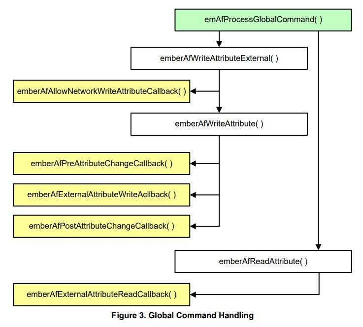
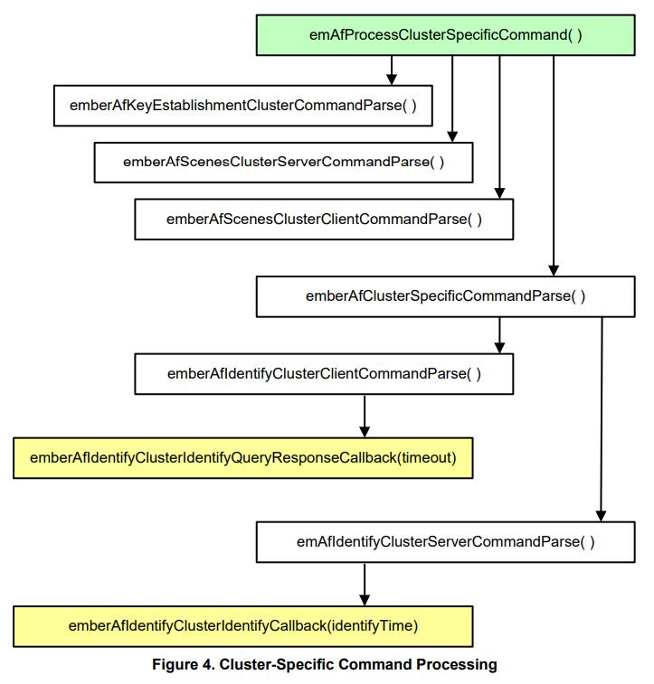
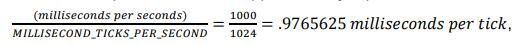
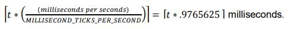
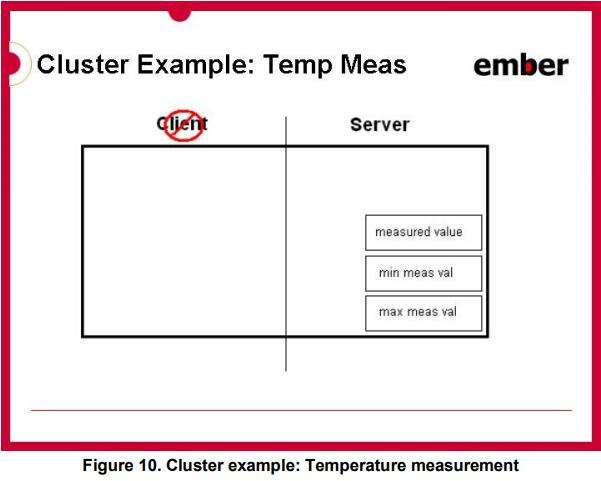
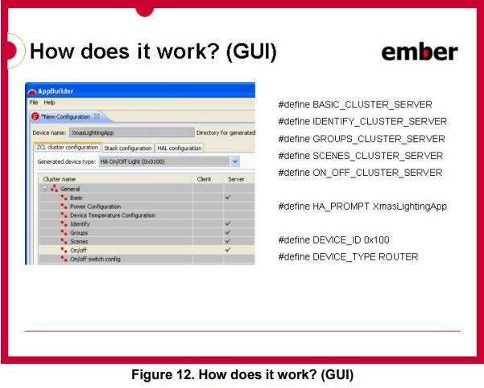

# **UG102：EMBER® APPLICATION FRAMEWORK DEVELOPER GUIDE** <!-- omit in toc -->

Ember 应用框架是一个嵌入式 C 代码体，可由 Ember AppBuilder 配置以实现任何 ZigBee 簇（ZCL）应用程序。本指南介绍了 Ember 应用框架的结构和用法。在适当的情况下，我们添加了信息，概述了最新版本的 Ember 应用框架与其前版本之间的差异。

## **本版本的新增内容** <!-- omit in toc -->

增加了第 18 节。

------------------------------------------------------------------------------------------------------------------------

- [**1. 引言**](#1-引言)
    - [**1.1 目的**](#11-目的)
    - [**1.2 构建应用程序**](#12-构建应用程序)
    - [**1.3 移植应用程序**](#13-移植应用程序)
- [**2. 应用框架架构**](#2-应用框架架构)
- [**3. 应用框架目录结构**](#3-应用框架目录结构)
- [**4. 生成的应用程序配置文件**](#4-生成的应用程序配置文件)
    - [**4.1 应用框架文件**](#41-应用框架文件)
- [**5. 应用框架 API**](#5-应用框架-api)
- [**6. 应用框架回调接口**](#6-应用框架回调接口)
    - [**6.1 回调生成**](#61-回调生成)
    - [**6.2 非簇相关回调**](#62-非簇相关回调)
    - [**6.3 簇特定命令处理回调**](#63-簇特定命令处理回调)
        - [**6.3.1 命令回调上下文**](#631-命令回调上下文)
        - [**6.3.2 命令回调中的数组处理**](#632-命令回调中的数组处理)
        - [**6.3.3 全局命令回调**](#633-全局命令回调)
    - [**6.4 回调流程**](#64-回调流程)
    - [**6.5 回调参考**](#65-回调参考)
- [**7. 时间处理**](#7-时间处理)
- [**8. 事件**](#8-事件)
    - [**8.1 创建自定义事件**](#81-创建自定义事件)
        - [**8.1.1 事件函数和事件控制**](#811-事件函数和事件控制)
        - [**8.1.2 自定义事件示例**](#812-自定义事件示例)
    - [**8.2 如何创建簇事件**](#82-如何创建簇事件)
    - [**8.3 如何调度簇事件**](#83-如何调度簇事件)
        - [**8.3.1 emberAfScheduleClusterTick**](#831-emberafscheduleclustertick)
        - [**8.3.2 emberAfDeactivateClusterTick**](#832-emberafdeactivateclustertick)
- [**9. 属性管理**](#9-属性管理)
    - [**9.1 ZCL 属性配置**](#91-zcl-属性配置)
        - [**9.1.1 属性存储字节序**](#911-属性存储字节序)
        - [**9.1.2 属性存储字节序的含义**](#912-属性存储字节序的含义)
        - [**9.1.3 外部属性(E)**](#913-外部属性e)
        - [**9.1.4 持久存储器存储(F)**](#914-持久存储器存储f)
        - [**9.1.5 单件(S)**](#915-单件s)
        - [**9.1.6 属性界限(B)**](#916-属性界限b)
    - [**9.2 与 ZCL 属性交互**](#92-与-zcl-属性交互)
        - [**9.2.1 ZCL String 属性**](#921-zcl-string-属性)
- [**10. 命令处理和生成**](#10-命令处理和生成)
    - [**10.1 发送命令和命令响应**](#101-发送命令和命令响应)
    - [**10.2 ZCL 命令处理**](#102-zcl-命令处理)
        - [**10.2.1 app/framework/util/process-global-message.c**](#1021-appframeworkutilprocess-global-messagec)
        - [**10.2.2 app/framework/util/process-cluster-message.c**](#1022-appframeworkutilprocess-cluster-messagec)
    - [**10.3 发送默认响应**](#103-发送默认响应)
- [**11. 命令行接口(CLI)**](#11-命令行接口cli)
    - [**11.1 扩展命令行接口**](#111-扩展命令行接口)
    - [**11.2 CLI 示例**](#112-cli-示例)
        - [**11.2.1 Example 1: 创建网络**](#1121-example-1-创建网络)
        - [**11.2.2 Example 2: 发送属性读取**](#1122-example-2-发送属性读取)
        - [**11.2.3 Example 3: 发送簇命令**](#1123-example-3-发送簇命令)
    - [**11.3 命令行参考**](#113-命令行参考)
- [**12. 调试打印接口**](#12-调试打印接口)
- [**13. 多网络支持**](#13-多网络支持)
    - [**13.1 网络上下文**](#131-网络上下文)
        - [**13.1.1 回调网络**](#1311-回调网络)
        - [**13.1.2 当前网络**](#1312-当前网络)
        - [**13.1.3 切换网络**](#1313-切换网络)
    - [**13.2 配置**](#132-配置)
        - [**13.2.1 ZigBee 设备类型**](#1321-zigbee-设备类型)
        - [**13.2.2 安全配置**](#1322-安全配置)
- [**14. 嗜睡设备**](#14-嗜睡设备)
    - [**14.1 介绍**](#141-介绍)
    - [**14.2 轮询**](#142-轮询)
        - [**14.2.1 SHORT\_POLL 间隔**](#1421-short_poll-间隔)
            - [**14.2.1.1 在编译时设置**](#14211-在编译时设置)
            - [**14.2.1.2 在运行时设置**](#14212-在运行时设置)
        - [**14.2.2 LONG\_POLL 间隔**](#1422-long_poll-间隔)
            - [**14.2.2.1 在编译时设置**](#14221-在编译时设置)
            - [**14.2.2.2 在运行时设置**](#14222-在运行时设置)
        - [**14.2.3 我应为短和长轮询时间间隔设置什么值？**](#1423-我应为短和长轮询时间间隔设置什么值)
        - [**14.2.4 Forcing “Fast Polling”**](#1424-forcing-fast-polling)
        - [**14.2.5 使用 “Fast Polling” 完成复杂事务**](#1425-使用-fast-polling-完成复杂事务)
        - [**14.2.6 SoC 和 Host + NCP 模型下的轮询差异**](#1426-soc-和-host--ncp-模型下的轮询差异)
    - [**14.3 睡眠和事件机制**](#143-睡眠和事件机制)
        - [**14.3.1 永远不要在嗜睡终端设备上使用 Ticks**](#1431-永远不要在嗜睡终端设备上使用-ticks)
    - [**14.4 终端设备父系重发现**](#144-终端设备父系重发现)
    - [**14.5 睡眠和 CLI**](#145-睡眠和-cli)
    - [**14.6 处理器空闲和应用框架**](#146-处理器空闲和应用框架)
- [**17. 使用 Ember AppBuilder 设计应用程序**](#17-使用-ember-appbuilder-设计应用程序)
    - [**17.1 ZCL 概念**](#171-zcl-概念)
        - [**17.1.1 定义**](#1711-定义)
        - [**17.1.2 有关簇和属性的更多信息**](#1712-有关簇和属性的更多信息)
            - [**17.1.2.1 Example: The Identify Cluster**](#17121-example-the-identify-cluster)
            - [**17.1.2.2 Example: The Temperature Measurement Cluster**](#17122-example-the-temperature-measurement-cluster)
    - [**17.2 Ember AppBuilder 和应用框架架构**](#172-ember-appbuilder-和应用框架架构)
        - [**17.2.1 Ember AppBuilder GUI**](#1721-ember-appbuilder-gui)

------------------------------------------------------------------------------------------------------------------------

# **1. 引言**

## **1.1 目的**

Ember 应用框架是一个嵌入式 C 代码体，可由 Ember AppBuilder 配置以实现任何 ZigBee 簇（ZCL）应用程序。该应用框架位于 **app/framework** 目录中。

本指南介绍了 Ember 应用框架的结构和用法。在适当的情况下，我们添加了信息，概述了最新版本的 Ember 应用框架与其前版本之间的差异。

## **1.2 构建应用程序**

使用 Ember 应用框架，通过几个步骤创建一个应用程序。
1. 使用 Ember AppBuilder 创建 Ember 应用框架配置文件。该配置文件以及所选平台的项目文件由 Ember AppBuilder 生成。本手册第 17 章提供了使用 Ember AppBuilder 的概述及其与 Ember 应用框架的关系。有关如何使用 Ember AppBuilder 的更多详细信息，请参阅 **Ember AppBuilder Help**（**Help | Help Contents for indexed help and Help | Dynamic Help for context-sensitive help**）。
2. 将应用程序的细节写到随配置文件一起生成的回调函数中。使用 Ember 应用框架 API 可以做一些事，如与属性交互、在 ZigBee 网络上发送，接收和响应命令等。有关 Ember 应用框架 API 的更多详细信息，请参阅第 5 章，应用框架 API。
3. 将生成的项目文件打开到所选芯片的 IDE 中，编译应用程序，然后将其加载到开发套件硬件上。
4. 运行应用程序并使用 Ember Desktop 控制台窗口和应用程序命令行接口与其进行交互。有关如何使用 Ember Desktop 的更多信息，请参阅 Ember Desktop 的在线帮助（**Help | Help Contents**）。

## **1.3 移植应用程序**

有关移植过程的信息，请参阅栈发行版附带的 **Ember Application Framework Release Notes**（文档号 120-8098-000A）。

------------------------------------------------------------------------------------------------------------------------

# **2. 应用框架架构**

Ember 应用框架位于 Ember 栈之上，使用栈 “handler” 接口，并向开发人员暴露其自身更高抽象的和应用程序特定的接口。

Ember 应用框架的主要特性之一是将用户创建的代码和 Silicon Labs 创建的代码的分离。虽然 Silicon Labs 提供了 Ember 应用框架的所有源代码，但用户创建的代码应该位于框架之外，并且应该通过框架实用程序和回调暴露的 Ember 应用框架 API 与框架交互。Figure 1 中的框图展示了 Ember 应用框架架构的高级概述以及两个代码库是如何分离的。


**app/framework/util** 中包含的 main 文件使用 Ember Stack handler 接口，并将 Ember 应用框架绑到 EmberZNet PRO 栈中。两个 main 文件位于 **app/framework/util** 目录中，一个（**af-main-soc.c**）用于片上系统（SoC），如 EM35xx 平台和另一个（**af-main-host.c**）用于与网络协处理器（NCP）搭配的主机微处理器。

main 文件实现了 **emberIncomingMessageHandler()**，并将所有传入消息传递给 Ember 应用框架以进行命令处理。一旦传入消息被处理，它们将被传递到适当的簇以进行处理，或者直接传递给 Ember AppBuilder 生成的簇特定的回调。命令处理代码的很大一部分直接从 **tool/appbuilder** 中包含的 ZCL XML 文档生成。

从 ZCL XML 文档生成的所有代码与头文件和应用程序头文件与回调文件一起生成到 **app/builder/\<application name\>/** 中。

------------------------------------------------------------------------------------------------------------------------

# **3. 应用框架目录结构**

**tool/appbuilder**：Ember AppBuilder 使用的配置和模板文件。当您在栈安装中指向 Ember AppBuilder 时，它会查看此目录以加载该栈发布时最新 ZCL 实现的 XML 描述。将自定义簇 \.XML 文件放在此位置。有关创建自定义簇的详细信息，请在 **Help | Help Contents | Creating custom clusters** 中参阅 **Ember AppBuilder Help**。

**app/framework**：所有 Ember 应用框架代码都位于 **app/framework** 中。代码的主要部分已被分解到自己的目录中。

**app/framework/cli**：与应用框架的命令行接口实现相关的代码。CLI 的核心代码包含在 **app/util/serial/command-interpreter2.c** 中。CLI 包括数据类型检查和命令使用反馈等。作为一个结果：
1. 所有命令都需要与该命令关联的所有参数。如果缺少参数，CLI 将提供有关特定命令用法的用户反馈。
2. 使用 CLI 传递的参数必须采用以下格式之一：
    * \<int\>: 123(decimal) or 0x1ABC(hex)
    * \<string\>: "foo"(string) or {0A 1B 2C}(array of bytes)

**app/builder**：来自 Ember AppBuilder 的所有生成文件的输出位置。当您从 Ember AppBuilder 生成应用程序时，它会将生成的文件放在此目录下的一个目录下，该目录的名称与 Ember AppBuilder 配置中的设备名称相同。例如，如果您的设备名为 MyLightSwitch，则会在 **app/builder/MyLightSwitch/** 中生成文件。在 Ember AppBuilder 中打开示例应用程序时也是如此。Ember AppBuilder 自动将示例应用程序文件复制到 **app/builder** 中的相关目录中。

**app/framework/include**：Ember 应用框架的所有外部 API。此目录映射了栈中 include 目录的使用。它是所有面向外部的应用程序接口的单一位置。

**app/framework/plugin**：所有 Silicon Labs 创建的 ZCL 簇代码。该目录包含 Silicon Labs 团队为处理簇命令而创建的所有簇代码。通过从 Ember AppBuilder 的插件窗格中选择插件，可以选择将此代码包含在应用程序中。如果您选择不包含插件，则您负责实现所有必需簇命令的回调。

**app/framework/scenarios**：使用应用框架的所有示例应用程序场景可以在 Ember AppBuilder 中打开，方法是选择 **File | New | Application Configuration**，选择框架和栈组合，然后选择 “Start from a selected sample application”。Ember AppBuilder 为给定场景实例请求新的应用程序名称，并将示例回调代码复制到 **app/builder** 中的同名目录中。

**app/framework/security**：所有与 ZigBee 安全相关的实用程序代码。与密钥建立相关的代码位于 **app/framework/cluster** 中。

**app/framework/util**：应用程序的 mains，消息处理以及 Ember 应用框架使用的任何其他实用程序代码。该目录包含 Ember 应用框架的内容。管理多个端点支持的属性的属性存储文件包含在此目录中。此外，用于访问，读取和写入属性的 API 包含在文件 **attribute-table.h** 和 **attribute-storage.h** 中。

------------------------------------------------------------------------------------------------------------------------

# **4. 生成的应用程序配置文件**

Ember 应用框架的第 1 版使用单个头文件来配置 Ember 应用框架，设置属性表，并通过预处理器指令打开和关闭部分代码。第 2 版使用相同的预处理程序指令来配置要包含在框架中和从框架中排除的代码。除主要应用程序头文件外，Ember AppBuilder 还会生成一个带有后缀 **endpoint\_configuration.h** 的 “端点配置” 头文件。

**\<DeviceName\>\_endpoint\_configuration.h**。

生成的文件，用于配置 Ember 应用框架的静态数据结构。这允许跨端点共享属性元数据，并且每个端点都有自己的属性存储空间。**app/framework/util/attribute-storage.c** 文件使用 **endpoint_configuration.h** 文件中的 #defines 配置所有应用程序的属性相关数据。

每次在 Ember AppBuilder 中修改应用程序配置时，都必须重新生成该文件。Silicon Labs 建议您不要手动编辑 **endpoint_configuration.h** 文件，因为文件中的每个宏定义都具有一个复杂的关系。

第 9.1 节 “ZCL 属性配置” 中更详细地描述了端点配置文件的作用。

**\<DeviceName\>.h**

应用程序的主要头文件。它包括了在框架中打开所需特性的所有 #defines。

**\<DeviceName\>\_callbacks.c**

生成的存根回调文件，包含您选择包含在项目中的所有回调的默认实现。这是您的代码所在。您不限于将此文件用于您的代码。如果将其他文件添加到生成的项目文件中，则可以包含其他文件，以便编译器可以找到它们。

**\<DeviceName\>\_board.h**

为您选择的平台生成的板文件。此文件假定您使用的是其中一个 Ember 开发板。它是根据您在 HAL 配置选项卡中所做的选择进行配置的。

> Note：板头文件包含许多选项，可根据板的需要不同地配置 GPIO。Silicon Labs 建议您查看生成的 **\<DeviceName\>\_board.h** 文件，并根据需要对目标硬件进行更改。

**\<DeviceName\>\_tokens.h**

如果要在支持令牌的平台的令牌（持久性存储器）中包含任何属性，则此文件由 Ember AppBuilder 生成，以配置令牌存储。

**\<DeviceName\>.ewp, eww, .xip, .xiw, .mak**

为您的应用程序生成的项目文件。Ember AppBuilder 仅生成与您选择的平台相匹配的项目文件。这些文件可以加载到 IDE 中并进行编辑，以构建项目的其余部分。

## **4.1 应用框架文件**

从 EmberZNet PRO 4.6 开始，Ember 应用框架和 Ember AppBuilder 已经过修改，以将所有静态 Ember 应用框架文件生成到应用程序构建目录中。在 EmberZNet PRO 栈的先前版本中，这些文件的单个版本生成到 **app/framework/gen** 目录中。从 EmberZNet PRO 4.6 开始，此目录已被删除。用以代替的是将所有文件生成到 **app/builder/\<application name\>** 目录中。这样做是为了支持来自单个栈的多个规范版本。生成的文件不再是静态的。它们的内容根据用户在 Stack 选项卡中选择的 ZigBee 规范版本而改变。

生成的文件数量根据支持的插件和这些插件所需的内容而异。生成的 Ember 应用框架文件包括但不限于以下内容：

**af-structs.h**：Ember 应用框架用于解析通过空中发送的数据的结构的定义。

**att-storage.h**：在 Ember 应用框架内的属性存储机制中使用的定义。

**attribute-id.h**：通过 ZigBee Cluster Library 规范定义的所有属性的 ID，以加载到 Ember 应用框架中的所有配置文件。

**attribute-size.h**：ZigBee Cluster Library 规范中使用的属性类型的大小（以字节为单位）。

**attribute-type.h**：定义用于表示 ZigBee Cluster Library 规范中使用的数据类型的空中值。

**call-command-handler.c**：通过空中方式接收的所有非通用命令的命令处理代码。生成的代码将簇命令从空中格式封送到回调接口。如果没有为它们实现回调，它也会处理命令。

**call-command-handler.h**：**call-command-handler.c** 代码的头文件。该文件提供了 **call-command-handler.c** 中实现的所有函数的定义。

**callback-stub.c**：提供由 Ember 应用框架实现的自定义回调的存根。只有在客户的应用程序未单独定义回调存根时，才会编译回调存根。

**callback.h**：提供可能在 Ember 应用框架或用户应用程序中实现的所有回调的定义。这定义了 ENTIRE 回调接口，它是与用户应用程序通信时 Ember 应用框架使用的主要接口。

**cli.h**：此文件仅供文档引擎 doxygen 用于记录一般应用框架 cli 命令，它没有其他用途。

**client-command-macro.h**：作为便利提供的宏用作 Ember 应用框架接口的一部分，用于填充将通过空中发送的数据包缓冲区。用户的应用程序配置中配置的 ZigBee Cluster Library 支持的每个命令都在此表示为一个宏，该宏将对 Ember 应用框架进行适当的调用，以填充数据包缓冲区，以通过空中发送该命令。

**cluster-id.h**：为从 ZigBee Cluster Library 加载到 Ember 应用框架中的所有簇 ID 提供了定义。

**command-id.h**：为从 ZigBee Cluster Library 加载到 Ember 应用框架中的所有命令 ID 提供了定义。

**debug-printing-test.h**：用于在 Ember 应用框架中打开调试打印的定义。

**debug-printing.h**：用于在 Ember 应用框架中进行调试打印的宏。

**enums.h**：提供 Ember 应用框架中使用的所有 ZigBee Cluster Library 相关枚举的定义。

**print-cluster.h**：用于在 Ember 应用框架中基于每个簇打开打印的定义。

**stack-handler-stub.c**：所有栈处理程序的存根，可在 Ember 应用框架中重写。

**stack-handlers.h**：定义可供用户应用程序覆盖的所有栈处理函数。

**\<plugin\>-callbacks.h**：所有插件回调函数的声明。生成这些文件取决于为您的应用程序选择的插件。

------------------------------------------------------------------------------------------------------------------------

# **5. 应用框架 API**

Ember 应用框架的 API 在 **app/framework/include/af.h** 中提供。此接口文件与栈暴露的 EmberZNet PRO API 的方式一致。随您的安装提供的文档 120-3023-000 有 HTML 和 PDF 版本，即 **Application Framework API Reference**。

Ember 应用框架中的许多函数都包含一个传递的单字节 endpointId。对于簇初始化，簇 ticks 和属性管理等功能尤其如此。例如，函数 **zclUtilReadAttribute** 位于 **app/framework/util/attribute-table.c** 中，函数签名将 endpointId 作为其第一个参数。

Ember 应用框架的一些示例包括：
```c
boolean emberAfContainsCluster(int8u endpoint, EmberAfClusterId clusterId);
boolean emberAfContainsServer(int8u endpoint, EmberAfClusterId clusterId);
boolean emberAfContainsClient(int8u endpoint, EmberAfClusterId clusterId);
```

旨在供客户应用程序使用的所有 Ember 应用框架 API 都包含 “emberAf” 前缀。

用于获取有关端点和属性的信息的 API 包含在 **app/framework/util/attribute-storage.h** 中。例如，要确定端点是否包含某个属性，请使用函数 **emberAfContainsAttribute(int8u endpoint, ClusterId clusterId, AttributeId attributeId)**。它返回一个布尔值，指示所请求的属性和簇是否在特定端点上实现。

> Note：读取和写入属性需要一个端点。如果不包含一个，则编译器会返回一个警告，表明该函数是隐式声明的，而不是编译器错误。因此，要注意警告。

------------------------------------------------------------------------------------------------------------------------

# **6. 应用框架回调接口**

Ember 应用框架回调旨在作为一种方法，以从 Ember 应用框架中删除所有客户代码。如果需要将任何应用程序代码放入 Ember 应用框架中，Silicon Labs 会将此视为 Ember 应用框架的错误，因为这意味着缺少满足您的应用程序要求的回调。在这种情况下，请在支持门户网站 www.silabs.com/zigbee-support 上打开一张票。

通常，当调用回调时，Ember 应用框架会在一些传入消息或请求一些应用程序数据块时给应用程序代码一个 first crack。在回调 API 中，一些回调返回一个布尔值，表示消息已被处理，不应进行进一步处理。如果您正在执行与 Ember 应用框架处理特定消息冲突的操作，请返回 TRUE 以指示消息已完成。这可确保 Ember 应用框架不会干扰您对消息的处理。

## **6.1 回调生成**

Ember AppBuilder 能够为您生成存根回调文件。默认情况下，如果 Ember AppBuilder 发现该文件已存在于生成目录中，则选择不生成回调存根文件。您必须明确告诉应用程序覆盖现有文件。

当您将来重新生成文件时，Ember AppBuilder 会通过询问您是否要覆盖它来保护生成的回调文件不会被覆盖。默认情况下，Ember AppBuilder 不会覆盖任何以前创建的回调文件。如果您选择覆盖该文件，Ember AppBuilder 会将以前的版本备份到文件 **\<appname\>\_callbacks.bak**。

> Note：您可以随时随地实施回调；它们不需要在生成的回调文件中实现。但是，如果您在不同的位置实现它们，请从生成的回调文件中清除它们，以便链接器不会抱怨回调函数的重复定义。

## **6.2 非簇相关回调**

为了方便使用，回调接口在 Ember AppBuilder GUI 中被分成几个部分。第一部分，非簇相关回调，由位于 **tool/appbuilder/callbacks.xml** 的 **callbacks.xml** 文档中描述的回调组成。这些回调已被手动插入到 Ember 应用框架代码中，这可向客户指示希望接收的有关 Ember 应用框架功能的信息。

所有全局命令都属于此类别。Ember 应用框架包含全局命令的处理代码。如果任何全局命令回调返回 TRUE，则表示该命令已由应用程序处理，并且不应进行进一步的命令处理。如果回调返回 FALSE，则 Ember 应用框架将继续正常处理该命令。

**Example**

预命令接收回调（**emberAfPreCommandReceivedCallback(EmberAfClusterCommand* cmd, boolean isInterpan)**）在收到 ZCL 命令但尚未由 Ember 应用框架的命令处理代码处理后调用。该命令被解析为一个有用的结构 **EmberAfClusterCommand**，它提供了一种简单的方法来访问有关命令的相关数据，包括其 **EmberApsFrame**，消息类型，源，缓冲区，长度以及命令的任何相关标志。此回调还返回一个布尔值，指示命令是否已被处理。如果回调返回 TRUE，则假定该命令已由应用程序处理，并且不再采取进一步操作。

## **6.3 簇特定命令处理回调**

与簇相关的回调由 Ember 应用框架生成，以允许接收来自无线电的预解析命令。通常，ZCL 命令与簇特定回调之间存在一对一的关系。

簇特定命令回调都返回一个布尔值。此返回值允许您短路应用框架中包含的命令处理。如果您实现了簇特定命令回调并且它向 Ember 应用框架返回了一个 TRUE 值，则框架假定该命令已在框架外部处理，并且已发送任何所需的命令或缺省响应。如果簇特定命令返回 FALSE，则框架假定应用程序代码不理解该命令，并以发送状态为 “不支持的簇命令” 的默认响应。

### **6.3.1 命令回调上下文**

所有与命令相关的回调都是在 **emberIncomingMessageHandler** 的上下文中调用的。这意味着在该上下文中应用程序可用的 Ember API 也在命令处理回调中可用。这些 API 列在 **stack/include/message.h** 中的栈 API 文件中。命令回调中可用的栈 API 列在栈消息头文件 **stack/include/message.h** 中并包括：
```c
emberGetLastHopLqi()
emberGetLastHopRssi()
emberGetSender()
emberGetSenderEui64()
emberGetBindingIndex()
emberSendReply()        (for incoming APS retried unicasts only)
emberSetReplyBinding()
emberNoteSendersBinding()
```

### **6.3.2 命令回调中的数组处理**

任何包含数组参数的 ZigBee 消息都用一个指向数组开头的 int8u\* 指针传递。即使框架知道数组中的参数可能是另一种类型（如 int16u 或 int32u），也会这样做，因为框架可能运行的各种处理器上存在字节对齐问题。实现回调的开发人员必须解析数组并为其硬件适当地转换其元素。

### **6.3.3 全局命令回调**

ZigBee 全局命令也包含在 Ember 应用框架回调接口中。这些回调可用于接收对全局命令的响应。例如，如果您的设备向另一个设备发送全局读取属性命令，它可以通过实现 **emberAfReadAttributesResponseCallback** 来处理命令响应。

## **6.4 回调流程**

Figure 2 展示了接收的消息如何通过应用框架的 **emberIncomingMessageHandler** 实现处理，和如何通过框架代码流向应用程序实现的回调。


一旦传入消息被确定为一个传入全局命令，它就会被传递给全局命令处理进行处理，如 Figure 3 所示。



否则，如果发现它是簇特定命令，则将其传递给簇特定命令处理，如 Figure 4 所示。



## **6.5 回调参考**

> Note：已删除本文档中包含的回调参考，在支持文档 120-3023-000（**Ember Application Framework API Reference**）中提供参考。该文档中包含的参考直接从头文件生成，因此比本文档提供更新的参考。

------------------------------------------------------------------------------------------------------------------------

# **7. 时间处理**

Ember 应用框架提供了单个用于访问系统当前时间的 API（**int32u emberAfGetCurrentTime()**），在 **app/framework/include/af.h** 中有描述。本节描述了如何在 **app/framework/util/util.c** 中实现该函数：

如果 ZCL 时间簇服务端是在系统上实现的，则此函数通过函数调用（**int32u emberAfTimeClusterServerGetCurrentTime()**）从服务端检索时间，在这种情况下，将从时间簇服务端的时间属性中读取时间并返回。如果未实现时间簇服务端，则 **emberAfGetCurrentTime** 将调用 **emberAfGetCurrentTimeCallback**。

如果您的设备需要知道当前时间但没有实现时间簇服务端插件，则它负责在系统中某处维护自己的时间，并在请求时通过 **emberAfGetCurrentTimeCallback** 返回该时间。这对于未实现时间簇服务端的 SE 设备尤其重要，如 in-premise display（IPD）。在时间管理方面，IPD 基本上是独立的。对于非能源服务门户来说，它将超出规范（如当前解释的那样）来实现时间簇服务端。因此，IPD 必须维护自己的时间知识，并在通过 **emberAfGetCurrentTimeCallback** 请求时将其提供给框架。

如果您的应用程序包含时间簇服务端，则时间簇服务端代码始终尝试通过 **emberAfGetCurrentTimeCallback** 初始化和更新时间服务端的时间属性。如果 **emberAfGetCurrentTimeCallback** 返回 0，则时间簇服务端每秒递增一次存储的属性。因此，如果实际时间值可以从系统上的其他设备同步并写入时间服务端的时间属性中，则可以使用时间簇服务端在系统上实时存储和维护时间，而无需实现 **emberAfGetCurrentTimeCallback**。有关如何通过时间簇服务端的绑定实现来处理时间的更多信息，请参阅 **app/framework/plugin/time-server/time-server.c**。

Ember 应用框架包括一个时间客户端插件，允许时间客户端同步并跟踪当前 UTC 时间，而无需实现时间簇服务端。如果您的设备不是 ESP，它应该实现时间簇客户端并使用包含的时间客户端插件来跟踪时间。

------------------------------------------------------------------------------------------------------------------------

# **8. 事件**

Ember 应用框架及其关联的簇代码使用 Ember 事件机制来调度 SoC 和主机上的事件。使用 Ember 事件机制可以节省代码和 RAM，并且可以使嗜睡设备更好地工作。

在一个高级别上，事件机制提供中心位置，其可以基于某些用户输入，空中命令或设备初始化来激活和停用设备所采取的所有周期性动作。事件机制优于它替换的常量 tick 机制，因为它允许 Ember 应用框架准确地知道何时将在设备上发生下一个动作。这对于需要确切知道何时必须醒来采取某些行动的嗜睡设备非常重要 - 或者更重要的是，由于某些事件正在进行中，因此无法进入睡眠。Ember 应用框架有两种类型的事件：自定义事件和簇事件。自定义事件由 Ember 应用框架用户创建，可用于应用程序中的任何目的。簇事件与 Ember 应用框架的插件中的簇实现特别地相关。

## **8.1 创建自定义事件**

Ember 应用框架使用 Ember 标准事件机制来控制和运行 Ember 应用框架中的 “自定义” 应用程序事件。栈的事件机制记录在位于 **stack/include/event.h** 的 **event.h** 头文件中。

Ember 应用框架和 Ember AppBuilder 为创建和添加自定义事件到应用程序提供了一个有用的接口。要在 Ember AppBuilder 中创建自定义事件，请打开 Ember AppBuilder 配置文件中的 “Includes” 选项卡。在 “Custom Events” 部分中，单击 “New” 按钮以创建自定义事件。这会将事件添加到 Ember 应用框架将运行的事件列表中，并将自定义事件的存根添加到 Ember AppBuilder 生成的 “callbacks” 文件中。

### **8.1.1 事件函数和事件控制**

自定义事件由两部分组成：事件触发时调用的事件函数和用于调度事件的 **EmberEventControl** 结构。框架的事件机制必须知道这些项中的每一个，以便它可以跟踪下一个事件何时发生以便进入睡眠，并且还知道在事件触发时要调用的函数。有关创建事件的更多文档，请参见位于 **stack/include/event.h** 的 **event.h** 头文件。

### **8.1.2 自定义事件示例**

HaSampleGateway 示例应用程序使用自定义事件来管理其状态。该事件由两部分组成：名为 **buttonEventControl** 的 **EmberEventControl** 结构，以及每次事件触发时调用的事件函数。事件函数名为 **buttonEventHandler**。事件和事件控件包含在示例应用程序附带的配置文件中。在基于此示例场景创建新应用程序时，可以在 AppBuilder 的 “General” 选项卡的 “Description” 字段中找到 HaSampleGateway 应用程序的文档。

## **8.2 如何创建簇事件**

每个簇都包含一个服务端和一个客户端 “tick” 回调。Ember AppBuilder 生成一个事件表，其中包含每个端点上的每个簇服务端或客户端的单个事件。实际事件表生成到 **\<DeviceName\>\_endpoint\_config.h** 头文件中，该头文件包含在 **app/framework/util/af-event.c** 中，并被 Ember 应用框架的事件代码使用。

> Note：事件表在编译时创建，是静态的。因此，不能在运行时随机添加或从事件表中删除事件。必须存在事件表条目，然后代码可以管理其调度，以使其处于活动状态并等待被调用，或者处于停用状态并等待激活和调度。

## **8.3 如何调度簇事件**

插件或应用程序代码可以通过使用 Ember 应用框架的事件管理 API 在事件表中管理簇相关的事件。该 API 由两个函数组成：**emberAfScheduleClusterTick** 和 **emberAfDeactivateClusterTick**。

tick 是事件系统中使用的基本时间单位。tick 的持续时间取决于正在使用的平台。使用当前的 Ember 平台，1 tick 大约等于



其中 MILLISECOND\_TICKS\_PER\_SECOND 是每秒的时钟周期数。因此，当使用 t 值作为 delayMs 参数值以调用 **emberAfScheduleClusterTick** 时，该事件将运行在不小于



当然，该值的实验误差取决于时钟源的可靠性。

### **8.3.1 emberAfScheduleClusterTick**

emberAfScheduleClusterTick 使用端点，簇 id 和 客户端/服务端 标识来查找事件表中的关联事件。事件表条目由 Ember AppBuilder 生成到 **\<DeviceName\>\_endpoint\_config.h** 中。如果找不到事件表条目，**emberAfScheduleClusterTick** 会将 **EmberStatus** **EMBER_BAD_ARGUMENT** 返回给调用者。如果找到事件表条目，则它将调度事件以调用者请求的毫秒数进行，并返回 **EMBER_SUCCESS**。
```c
EmberStatus emberAfScheduleClusterTick( int8u endpoint,
                                        int16u clusterId,
                                        boolean isClient,
                                        int32u timeMs,
                                        EmberAfEventSleepControl sleepControl);
```

**EmberAfEventSleepControl** 参数允许调用者指示在事件表中事件处于活动状态时设备可以执行的操作。该值仅与嗜睡设备有关；它对非嗜睡设备没有影响。**EmberAfEventSleepControl** 的可能值在 **app/framework/include/af-types.h** 中枚举，如下所示：
* **EMBER\_AF\_OK\_TO\_HIBERNATE** 表示应用程序可能会进入长时间深度睡眠，直到需要调用该事件。如果调度代码不关心设备在调用事件时的作用，请使用此睡眠控制值。
* **EMBER\_AF\_OK\_TO\_NAP** 表示设备应该在小睡周期睡眠，并且应该在小睡间醒来以轮询直到事件被调用。如果调度代码希望设备定期轮询直到事件被调用，请使用此睡眠控制值。如果调度事件是一个等待来自网络上其他设备的某些回复的超时，则此特别有用。如果事件是一个超时，您不想设备在调用超时之前进入休眠，因为它永远不会听到它正在等待的消息，从而保证超时将被调用。
* **EMBER\_AF\_STAY\_AWAKE** 表示设备根本不应该睡眠，并应该保持清醒直到事件被调用。如果您正在调度一个非常频繁的事件并且不希望设备在非常短的周期内小睡，请使用此事件，因为设备每次唤醒时都会轮询。如果设备完全不在睡眠状态，它将每秒轮询一次。

### **8.3.2 emberAfDeactivateClusterTick**

停用函数用于关闭事件。当调度事件被调用时应调用此函数以确保事件代码不会继续调用事件。如果不再需要事件，也可以在事件被调用之前调用此函数。

> Note：在 Ember 应用框架中，在事件触发之前自动调用 **emberAfDeactivateClusterTick**，以确保在每个 tick 都不会继续调用该事件。从版本 2.1.50 开始，您可以在 Ember AppBuilder 的生成事件表输出中看到对 **emberAfDeactivateClusterTick** 的调用。

**DeactivateClusterTick** 类似于 **ScheduleClusterTick**，它需要大多数相同的参数，因为它还必须在关闭 clusterTick 之前在事件表中找到它。
```c
EmberStatus emberAfDeactivateClusterTick(int8u endpoint,
                                         int16u clusterId,
                                         boolean isClient);
```

------------------------------------------------------------------------------------------------------------------------

# **9. 属性管理**

## **9.1 ZCL 属性配置**

在 Ember 应用框架中，属性存储由两个 \.c 文件（**app/framework/util** 的 **attribute-storage.c** 和 **attribute-table.c**）以及单个头文件（**I\<appname\>\_endpoint\_config.h**）管理，这是 Ember AppBuilder 从应用程序配置中生成的。端点配置头文件设置属性元数据和实际属性存储。

您有多个属性存储选项：
* 外部属性(External Attributes)
* 持久存储器存储(Persistent Memory Storage)
* 单件(Singleton)
* 属性界限(Attribute Bounding)
* 属性报告(Attribute Reporting)

### **9.1.1 属性存储字节序**

所有不是 ZCL 字符串类型的属性都应该以与运行应用程序的平台相同的字节顺序存储。对于基于 ARM®Cortex-M3 的芯片（如 EM35x 系列和某些 EZSP 主机架构），这意味着具有非字符串类型的属性预计将以最低有效字节存储（LSB，小端）。

### **9.1.2 属性存储字节序的含义**

ZigBee 协议要求所有非字符串或字节数组类型的值都以 Little Endian 或 LSB 格式通过空中发送。这对于 EM35xx 和其他小端平台的含义是，当从属性存储中提取并通过空中发送时，不需要对属性进行字节交换。相反，当 Ember 应用框架运行一个大端处理器时，就像某些用于 EZSP-UART 的 UNIX 主机系统一样，它将在通过空中发送之前对整数类型属性执行字节交换，以便它们以 LSB 格式发送。

如上面的 9.1.1 节所述，属性应该以正确的格式存储，因为在从本机类型或字节数组中向属性表进行本地写入时不会进行字节交换。因此，用户应确保表示 ZigBee 整数类型但不直接映射到一个本地类型（如 int16u 或 int32u）的字节数组以应用程序平台的字节顺序表示。

如果您正在编写可以在具有不同字节顺序的多个平台上运行的应用程序，则可以使用 Ember 栈附带的 HAL 提供的 #define **BIGENDIAN\_CPU** 来检查平台的字节顺序。

示例：考虑位于 **app/framework/plugin/simple-metering-server/simple-metering-test.c** 的 simple-meter-server 插件的测试代码。此测试代码从属性表中提取简单计量每日求和属性，更新它，并将其放回属性表中。不幸的是，每日求和是一个 ZigBee 48 位无符号整数，它不是本地数据类型。

EM35xx 系列处理器的 Ember HAL 没有像 int48u 这样的本地数据类型，可以读取和简单地操作每日求和属性。因此，必须将该属性读入字节数组，并且必须在将字节数组写回属性表之前对其进行操作。在此操作期间，开发人员必须记住，在 EM35xx SoC 上，属性存储为 LSB，因此操作必须为 LSB。否则，当网络上的其他设备读取该值时，该值将以错误的格式存储和发送。

Ember 应用框架可以在用户期望的任何平台上运行。因此，Ember 应用框架代码对每日求和值进行任何操作之前首先检查 CPU 的字节顺序，以确保在 EM357 上保持正确的 LSB 格式和在 EM250 上 保持正确的 MSB 格式。

> Note：对于 EZSP 主机应用程序，由于所有属性都是在 NCP + Host 设计的主机处理器上存储的，因此主机的字节顺序是属性存储的依赖。

### **9.1.3 外部属性(E)**

您可能希望将某些属性的值存储在 Ember 应用框架的外部位置。这种类型的存储对于每次被请求时必须从硬件中读取的属性最有意义。在这种情况下，没有真正的理由将属性的副本存储在 Ember 应用框架内的某些浪费的 RAM 空间中。

通过单击 Ember AppBuilder GUI 中属性旁边的 “E” 复选框，将属性标记为外部位置。属性的元数据将被标记，以指示 Ember 应用框架不应为该属性的存储保留存储器。相反，当要读取或写入该属性时，Ember 应用框架通过调用 **emberAfExternalAttributeReadCallback** 和 **emberAfExternalAttributeWriteCallback** 来访问它。

> Note：将单个属性指定为 “External” 后，这两个回调将自动包含在生成的 **callback.c** 文件中。

应用程序预计会立即响应请求。目前还没有与访问外部属性相关联的状态机，例如，可以启动读取，然后在一分钟内再次回调，以查看数据读取的过程。

任何无法及时返回或更新的属性目前都不是外部化的候选属性。对于此类属性，Silicon Labs 建议您包含 Ember 应用框架存储，并在 **emberAfMainTickCallback** 中的特定时间间隔内更新 Ember 应用框架中的值。

### **9.1.4 持久存储器存储(F)**

Ember 片上系统（SoC）芯片，如 EM35xx，可以在持久存储器（SIMEEPROM）中存储属性。在这些情况下，通过单击 Ember AppBuilder GUI 中属性旁边的 “F” 复选框，将属性标记为持久存储。这会自动将必要的头文件代码添加到生成的 **\<appname\>\_tokens.h** 文件中，并将该属性标记为在属性元数据中作为 flash 的持久化。

由于每个主机芯片都有自己存储持久数据的方式，因此 Ember 应用框架和 Ember AppBuilder 没有在主机上持久化属性的方法。但是，您可以将要持久化的任何属性标记为 “External”，然后在 **emberAfExternalAttributeReadCallback** 和 **emberAfExternalAttributeWriteCallback** 中自行处理数据持久性。

### **9.1.5 单件(S)**

虽然 ZCL 簇和属性可以分布在多个端点上，但是拥有许多这些属性的多个实例是没有意义的。例如，Basic 簇可以在三个不同的端点上实现，但是存储强制性的 “ZCL Version” 属性的三个版本是没有意义的，因为每个端点可能具有相同的版本。通过单击 Ember AppBuilder 中属性旁边标有 “S” 的复选框来标记这样的属性。为方便起见，Ember 应用框架为许多明显的情况提供了默认的 “Singleton” 修饰符。如果您要选择，可以覆盖此默认修改器。

标记为单件的属性存储在存储器中的特殊单件存储区域中。对这些属性之一的任何端点的读取或写入都会解析为对存储器中相同位置的访问。

### **9.1.6 属性界限(B)**

包含 ZigBee ZCL 规范定义的最小值和最大值的属性可以在 Ember 应用框架内限定。当属性有界时，ZCL 规范定义的最小值和最大值包含在生成的 **\<appname\>\_endpoint\_config.h** 文件中。当应用程序尝试写入其中一个属性时，仅当属性值落在 ZCL 规范定义的范围内时，属性写入才会成功。

## **9.2 与 ZCL 属性交互**

Ember 应用框架属性表暴露了几个 API，可帮助您执行读取，写入和验证某些属性包含在给定端点上的操作。用于与属性表交互的函数的原型位于 **app/framework/include/af.h** 中。API 包括：

**emberAfLocateAttributeMetadata**：检索给定属性的元数据。使用此函数可确定属性是否存在或是否在给定端点上实现。您可以使用返回的 **emberAfAttributeMetadata** 指针来访问有关该属性的更多信息，包括其类型，大小，默认值以及其掩码中包含的属性的任何内部设置。
```c
EmberAfAttributeMetadata *emberAfLocateAttributeMetadata(int8u endpoint, 
                                                         EmberAfClusterId cluster, 
                                                         EmberAfAttributeId attribute);
```

Ember 应用框架存储它在 CONST 内存中包含的所有属性的元数据。它为所有属性执行此操作，包括可能具有外部存储值或单件的属性。

### **9.2.1 ZCL String 属性**

String 数据类型是 ZCL 中的特例。所有字符串都是 MSB，第一个字节是字符串的长度字节。ZCL 中没有空终止符或类似概念。因此，5 字节的字符串实际上是 6 个字节长，第一个字节表示后续字符串的长度。例如，“05 68 65 6C 6C 6F” 是一个 ZCL 字符串，表示 “hello”。

------------------------------------------------------------------------------------------------------------------------

# **10. 命令处理和生成**

## **10.1 发送命令和命令响应**

Ember 应用框架 API 包括许多用于发送和响应 ZCL 命令的有用宏。所有这些宏都在 **client-command-macro.h** 文件中定义。这个文件是为每个项目生成的。例如，在构建项目 STM32 之后，可以在 **\<install path\>/app/builder/STM32/clientcommand-macro.h** 中找到该文件。

要发送命令，请执行下列操作：

**发送命令**：
1. 使用 **client-command-macro.h** 文件中的填充宏构造命令：
    
    例如：
    ```c
    emberAfFillCommandIdentifyClusterIdentify(identifyTime)
    ```
    
    **identifyTime** 是规范中定义的 int16u，是设备应继续标识自身的秒数。

    此宏使用适当的值填充命令缓冲区。
2. 检索指向 **EmberApsFrame** 命令的指针，并使用适合您命令的源和目标端点填充它。ApsFrame 中的其他值（如序列号）由框架处理，因此您无需担心它们。
3. 构建命令后，可以使用以下某个函数将命令作为单播，多播或广播发送
    ```c
    EmberStatus emberAfSendCommandMulticast(int16u multicastId);
    EmberStatus emberAfSendCommandUnicast(EmberOutgoingMessageType type, int16u indexOrDestination);
    EmberStatus emberAfSendCommandBroadcast(int16u destination);
    ```

**发送对传入命令的响应**：
使用类似的机制发送对传入命令的响应。
1. 使用 **app/framework/gen/client-command-macro.h** 中包含的命令响应宏填充响应命令缓冲区，例如：
    ```c
    emberAfFillCommandIdentifyClusterIdentifyQueryResponse(timeout)
    ```

    **timeout** 是一个 int16u，表示设备将继续标识自身的秒数。
2. 您无需担心响应 **EmberApsFrame** 中设置的端点，因为这些端点由框架处理。
3. 通过调用 **emberAfSendResponse()** 以发送响应命令。

## **10.2 ZCL 命令处理**

当 Ember 应用框架收到 ZCL 命令时，它将被传递给位于 **app/framework/util/util.c** 中的实用程序函数 **emberAfProcessMessage** 内的命令处理。处理消息函数解析该命令并填充一个 **EmberAfClusterCommand** 类型的本地结构。填充此结构后，将其分配给全局指针 **emAfCurrentCommand**，以便在命令处理期间调用的每个函数都可以使用它。

**EmberAfProcessMessage** 首先调用 **emberAfPreCommandReceivedCallback** 为应用程序提供处理命令的机会。如果该命令是全局命令，则将其传递给 **process-global-message.c** 进行处理；否则，它将传递给 **process-cluster-message.c** 进行处理。

> Note：有关命令处理流程的更多信息，请参阅第 6 章中包含的有关回调接口的消息流程图。

### **10.2.1 app/framework/util/process-global-message.c**

**Process-global-message.c** 处理所有全局命令，例如读取和写入属性。全局命令当前没有与簇特定命令那样的关联命令回调。

### **10.2.2 app/framework/util/process-cluster-message.c**

**Process-cluster-message.c** 处理所有簇特定命令。大多数簇特定命令又被传递到位于 **app/framework/gen/call-command-handler.c** 的生成的文件 **call-command-handler.c** 中。此生成的文件解析命令的参数，并可选择调用簇特定命令的关联命令回调。

生成的文件 **call-command-handler.c** 当前不处理密钥建立。命令处理对于当前命令处理程序生成器来说太复杂了。密钥建立的命令直接传递给簇代码，以便在 **app/framework/cluster/key-establishment.c** 中进行处理。

> Note：由于在命令处理上下文中调用簇特定的命令回调，因此可以从全局指针 **emAfCurrentCommand** 获得与在这些回调之一中处理的任何命令相关的所有元数据。

始终使用 **app/framework/include/af.h** 中提供的名为 **emberAfCurrentCommand()** 的便捷宏来访问全局指针 **emAfCurrentCommand**。

## **10.3 发送默认响应**

Ember 应用框架不会自动发送应用程序实现的命令回调的默认响应。为了提高系统可靠性和灵活性，我们已将所有默认响应处理交给应用程序。这意味着，虽然您现在可以完全控制为您所处理的命令发送默认响应，但您也要负责为所有这些命令发送默认响应。必须为没有特定响应且本身不是默认响应的任何单播消息发送默认响应。有关何时应该和不应该发送默认响应的更多信息，请参阅 ZigBee 文档。

Ember 创建了插件，为它们处理的所有命令发送默认响应。插件无法处理的任何命令都会自动返回 **EMBER\_ZCL\_STATUS\_UNSUP\_CLUSTER\_COMMAND** 或类似内容。您的应用程序需要对它处理的所有命令执行相同的操作，这些命令本身没有特定的命令响应。

我们已经创建了一个默认的响应 API，以使其尽可能简单。**emberAfSendDefaultResponse** 命令有两个参数：当前命令和状态字节。可以使用 **emberAfCurrentCommand()** 从 Ember 应用框架中检索当前命令。用于默认响应的 ZCL 状态字节在 **app/framework/gen/enum.h** 中枚举。
```c
void emberAfSendDefaultResponse(EmberAfClusterCommand *cmd, EmberAfStatus status);
```

此函数的典型用法如下：
```c
emberAfSendDefaultResponse( emberAfCurrentCommand(), EMBER_ZCL_STATUS_SUCCESS );
```

------------------------------------------------------------------------------------------------------------------------

# **11. 命令行接口(CLI)**

Ember 应用框架包括一个命令行接口（CLI），它实现了许多常用命令和簇特定命令。例如，CLI 实现与通用功能相关的命令，如网络形成和属性读写。

Ember 应用框架 CLI 可以将整数参数作为十进制和十六进制表示法。如果参数包含 0x 前缀，则假定为十六进制，否则为十进制。另外，整数数组可以在大括号内传递，字符串可以在引号内传递。

## **11.1 扩展命令行接口**

扩展命令行接口的过程已更改。我们不赞成使用 **emberAfCustomCommandLineCallback**，而是允许您使用现有的命令行体系结构定义任意数量的命令行选项。扩展命令行接口的新过程允许您将整个命令数组直接添加到命令处理器中。过程如下：
1. 在 Ember AppBuilder 的 “Includes” 选项卡中，添加一个名为 **EMBER\_AF\_ENABLE\_CUSTOM\_COMMANDS** 的宏。这样就可以在文件 **/app/framework/cli/custom-cli.h** 中包含一个名为 **emberAfCustomCommands** 的命令数组，该文件是外部的。您现在必须提供 **emberAfCustomCommands** 数组的定义，以在编译时满足链接器的要求。
2. 在应用程序中定义一个类型为 **EmberCommandEntry**，名为 **emberAfCustomCommands** 的数组。
3. 下面的示例添加了两个命令 “form” 和 “join”。这些命令各自采用简写形式 “uvsh” 中描述的四个参数。用于描述命令参数的简写将在下一节中介绍。
    ```c
    // The table of network commands.
    EmberCommandEntry networkCommands[] = {
        { "form", formCommand, "uvsh" },
        { "join", joinCommand, "uvsh" },
        ...
        { NULL }
    };
    ```
4. 您定义的所有命令都是 **EmberCommandEntry** 类型。**EmberCommandEntry** 类型记录在栈 API 参考中。基本上它们的形式为 “\<string\> command”, \<function\>, “\<string\> args”，其中参数是一个字符串，表示传递的参数的根本类型。来自 **/app/util/serial/command-interpreter2.h** 的 **EmberCommandEntry** 的定义如下所示。
    ```c
    typedef PGM struct {
    #endif
    /** Use letters, digits, and underscores, '_', for the command name.
     * Command names are case-sensitive.
     */
    PGM_P name;
    /** A reference to a function in the application that implements the
     * command.
     * If this entry refers to a nested command, then action field
     * has to be set to NULL.
     */
    CommandAction action;
    /**
     * In case of normal (non-nested) commands, argumentTypes is a
     * string that specifies the number and types of arguments the
     * command accepts. The argument specifiers are:
     * - u: one-byte unsigned integer.
     * - v: two-byte unsigned integer
     * - w: four-byte unsigned integer
     * - s: one-byte signed integer
     * - b: string. The argument can be entered in ascii by using
     * quotes, for example: "foo". Or it may be entered
     * in hex by using curly braces, for example: { 08 A1 f2 }.
     * There must be an even number of hex digits, and spaces
     * are ignored.
     * - *: zero or more of the previous type.
     * If used, this must be the last specifier.
     * - ?: Unknown number of arguments. If used this must be the only
     * character. This means, that command interpreter will not
     * perform any validation of arguments, and will call the
     * action directly, trusting it that it will handle with
     * whatever arguments are passed in.
     * Integer arguments can be either decimal or hexidecimal.
     * A 0x prefix indicates a hexidecimal integer. Example: 0x3ed.
     *
     * In case of a nested command (action is NULL), then this field
     * contains a pointer to the nested EmberCommandEntry array.
     */
    PGM_P argumentTypes;
    /** A description of the command.
     */
    PGM_P description;
    } EmberCommandEntry;
    ```

## **11.2 CLI 示例**

### **11.2.1 Example 1: 创建网络**

您可以使用 CLI 获取两个设备并启动一个网络。
1. 使用 Ember Desktop 控制台或简单的 telnet 程序连接到网络的协调器。如果设备在端口 1 上暴露其 CLI，则可以通过 telnet 到端口 4901 连接到它。连接到设备后，使用 network form 命令以形成网络。
    ```shell
    Device 1> network form 11 2 0x00aa
    ```

2. 使用 network pjoin 命令允许加入，以便新设备可以进入网络：
    ```shell
    Device 1> network pjoin 0xff
    ```

3. 使用 network join 命令将第二个设备连接到创建的网络：
    ```shell
    Device 2> network join 11 2 0x00aa
    ```

### **11.2.2 Example 2: 发送属性读取**

形成网络后，您可以使用 CLI 在网络中发送消息。例如，使用 global read 命令读取 basic 簇的 ZCL 版本。
1. 通过填充 Ember 应用框架的消息传递缓冲区来创建命令。
    ```shell
    Device 2> zcl global read 0 0
    ```

    此命令将簇 id 0（属性 id 0）的 global read 写入消息传递缓冲区。
2. 使用 send 命令将 global read 命令发送到设备。send 命令有三个参数：消息应发送到的双字节节点 ID，发送端点和目标端点。
    ```shell
    Device 2> send 0x0000 1 1
    ```

    此命令将 global read 命令从设备 2 发送到设备 1，设备 1 是网络的协调器，因此具有短节点 ID 0x0000。

### **11.2.3 Example 3: 发送簇命令**

ZCL 的许多核心簇都在 Ember 应用框架中内置了 CLI 命令。例如，identify 命令允许您使用 ZCL identify CLI 命令创建 ZCL identify 命令，并使用 send 命令发送它。
```shell
Device 2> zcl identify id 30
Device 2> send 0 1 1
```

此 ZCL 命令使用 Identify 簇。identify 命令指定标识时间和短 ID，并发送 30 秒的值，该值也发送给协调器。

输入此命令时，会将其加载到消息缓冲区中。构建命令时，命令行接口显示消息缓冲区的内容以进行验证。如果在命令中出错，则可以在发送命令之前重新输入命令。

要通过空中发送 ZCL 命令，请使用 CLI 提供的单独发送命令。

send 命令有几个可以指定的附加选项和端点。如果是广播，您可以分组发送命令。

无论何时发送消息，通过其发送消息的节点都会报告正在传输的簇。同样，每当您收到一条消息时，它都会打印出它收到的内容。

## **11.3 命令行参考**

> Note：已删除本文档中包含的命令行参考，在支持文档 120-3023-000（**Ember Application Framework API Reference**）中提供参考。该文档中包含的参考直接从头文件生成，因此比本文档提供更新的参考。

------------------------------------------------------------------------------------------------------------------------

# **12. 调试打印接口**

Ember 应用框架包括一个粒度的调试打印接口。调试打印和一些通用的调试打印选项（如应用程序、核心和自定义调试打印）可以在每个簇的基础上进行控制。可以在 Ember AppBuilder 接口中打开和关闭每个区域的调试打印，并由应用程序头文件中的 #define 值控制。

每个调试打印选项对应于用于该特定调试打印区域的一组宏。例如，如果打开 “Core” 调试打印，则会填充以下宏。

**emberAfCorePrint(…)** - 打印一个单行，不带回车
```c
Example: emberAfCorePrint(“node id: %2x”, nodeId);
```

**emberAfCorePrintln(…)** - 打印一个单行，带回车
```c
Example: emberAfCorePrintln(“node id: %2x”, nodeId);
```

**emberAfCoreFlush()** - 刷新串行缓冲区。如果正在进行大量打印，则应使用此函数
```c
Example: emberAfCoreFlush();
```

**emberAfCoreDebugExec( x )** - 在代码中包含 x。这可用于包装代码段（如函数调用），只应在核心调试打开时执行
```c
Example: emberAfCoreDebugExec(emAfPrintStatus("Success", "Set Failed", ezspStatus));
```

**emberAfCorePrintBuffer( buffer, len, withspace )** – 将给定缓冲区打印为一系列十六进制值。这是一个有用的打印函数，用于打印出给定缓冲区的内容
```c
Example: emberAfCorePrintBuffer(buffer, 0xff, TRUE);
```

**emberAfCorePrintString( buffer )** – 将给定缓冲区打印为字符串。这是一个有用的打印函数，用于打印出给定缓冲区的内容
```c
Example: emberAfCorePrintString(buffer);
```

------------------------------------------------------------------------------------------------------------------------

# **13. 多网络支持**

从 EmberZNet PRO 4.7 开始，栈支持多种网络配置（有关此功能的详细信息，请参阅文档 **AN724**，以在单个 ZigBee 芯片上设计多个网络）。Ember 应用框架以此特性为基础，提供额外的网络管理功能，帮助客户轻松构建和部署多网络设备。在发送和接收消息时，在调用回调之前，以及在触发某些类型事件的事件处理程序之前，框架会自动在网络之间切换。这些特性减轻了客户的网络切换负担。

> Note：对于 EmberZNet PRO 4.7，多网络支持仅限于两个网络。将来将支持两个以上的网络。

## **13.1 网络上下文**

栈具有用于 API 和栈处理程序的单独网络上下文。应用于所有栈 API 调用的 “current network” 由应用程序唯一地管理。应用于所有栈处理程序的 “callback network” 由栈唯一地管理。

应用程序通过使用 **emberGetCurrentNetwork** 和 **emberSetCurrentNetwork** 来管理当前网络。当应用程序调用任何栈 API 时，栈将在当前网络的上下文中运行。例如，调用 **emberSetCurrentNetwork(0)** 后跟着 **emberGetNodeId()** 将返回网络 0 的节点 id。设置后，当前网络保持不变，直到应用程序通过后续调用 **emberSetCurrentNetwork** 进行更改。当前网络永远不会被栈更改。

栈处理程序的每次调用都应用于一个特定网络。在调用任何栈处理程序之前，栈将回调网络设置为适当的网络。例如，当消息到达网络 0 时，栈会在调用 **emberIncomingMessageHandler** 之前设置回调网络。应用程序可以通过使用 **emberGetCallbackNetwork** 查询回调网络。在本例中，在 **emberIncomingMessageHandler** 中，**emberGetCallbackNetwork()** 返回 0。回调网络仅应用于栈处理程序的上下文中。应用程序无法更改回调网络。

在应用程序生命周期的任何给定时间，当前网络和回调网络可能不同。栈将网络上下文的管理完全留给应用程序。为了降低多网络设备的复杂性，Ember 应用框架代表应用程序管理网络上下文。

### **13.1.1 回调网络**

在它实现的每个栈处理程序中，框架在执行自己的任何处理和调用自己的回调之前，将当前网络设置为回调网络。更具体地说，在每个处理程序的开头，框架执行等同于 **emberSetCurrentNetwork(emberGetCallbackNetwork())** 的操作。这样，任何作为栈处理程序调用的代码总是在处理程序本身的上下文中起作用。例如，如果设备在网络 0 上收到 **GetCurrentPrice** 消息，则栈调用 **emberIncomingMessageHandler**，并将回调网络设置为 0，框架会立即将当前网络设置为网络 0。因此，当框架解析消息并最终调用 **emberAfPriceClusterGetCurrentPriceCallback** 将其传递给应用程序时，将设置网络上下文以匹配传入消息。这去除了应用程序在收到消息时检查和设置当前网络本身的需要。

### **13.1.2 当前网络**

由于端点是一个 ZigBee 设备执行许多操作的中心，因此应用程序中的每个端点都分配给网络。可以将多个端点分配给同一网络，但每个端点只属于一个网络。网络分配是在 Ember AppBuilder 中的配置期间设置的，并且在运行时不可更改。在端点上执行任务时，框架会自动将当前网络设置为端点的网络。

当使用任何 **emberAfSend** API 发送消息时，框架在将消息提交到栈之前会自动切换到源端点的网络。这使得应用程序能够构造和发送消息，而无需检查和设置当前网络。应用程序无法覆盖将在其上发送消息的网络。多网络应用程序必须正确设置所有传出消息的源端点。未能设置正确的端点会导致错误或意外行为。

在接收到消息后，框架首先验证目标端点是否属于消息到达的网络。如果不匹配，则丢弃该消息而不进行 ZCL 级响应。这确保了各种网络之间的适当隔离。否则，如前所述，框架切换到传入网络，以便在适当的网络上下文中执行所有后续操作。

框架还会在触发簇，端点或网络事件之前设置当前网络。簇事件对应用程序可用，并可用于执行特定于特定簇和端点的操作。端点和网络事件用于插件中，旨在当插件未实现 ZCL 簇或向其他簇插件提供某些辅助功能时使用。例如，如果端点 1 被分配到网络 0，并且端点实现 Price 簇服务端，则框架在为端点 1 调用 **emberAfPriceClusterServerTickCallback** 之前将当前网络设置为 0。通过在触发这些事件处理程序之前切换网络，应用程序和插件能够立即开始处理，而无需检查或设置网络。

### **13.1.3 切换网络**

框架在后进先出（LIFO）数据结构中维护活动网络。当它切换网络时，框架实际上通过调用 **emberAfPushCallbackNetworkIndex**、**emberAfPushEndpointNetworkIndex** 或 **emberAfPushNetworkIndex** 将新网络 “pushes” 到 LIFO 列表中。例如，在实现 **emberIncomingMessageHandler** 之初，框架调用 **emberAfPushCallbackNetworkIndex** 将当前网络切换到回调网络。类似地，在发送消息时，框架使用消息的源端点调用 **emberAfPushEndpointNetworkIndex**。完成处理后，框架会从 LIFO 列表中 “pops” 最新的网络并切换回以前的网络。这是通过调用 **emberAfPopNetworkIndex** 来完成的。例如，在 **emberIncomingMessageHandler** 和 **emberAfSendUnicast** 结束时，框架调用 **emberAfPopNetworkIndex** 来切换到先前设置的网络。

如果框架因任何原因必须切换网络，那么它总是在完成处理后恢复以前的网络。通过这种方式，应用程序可以确保当前网络在调用框架 API 之前和之后保持不变。该框架依赖于相同的保证，这意味着应用程序和所有插件在切换网络时必须唯一地将 **emberAfPush** API 和 **emberAfPopNetworkIndex** 结合使用。直接使用 **emberSetCurrentNetwork** 将会绕过 LIFO 列表并导致错误。此外，每次成功的 push 都必须匹配相应的 pop。不遵循此范例将导致错误。

## **13.2 配置**

Ember AppBuilder 用于在框架应用程序中启用和配置多网络功能。配置多网络应用程序的步骤，如下所述：
* 创建一个或多个网络(Create one or more networks)
* 将端点分配给网络(Assign endpoints to networks)
* 设置默认网络(Set the default network)
* 为每个网络配置 ZigBee 设备类型(Configure the ZigBee device type for each network)
* 为每个网络配置安全配置文件(Configure the security profile for each network)

端点被分配给 Ember AppBuilder 中 “ZCL cluster configuration” 选项卡上的网络。默认情况下，所有端点都分配给名为 “Primary” 的网络。要创建新网络并为其分配端点，请单击端点行的 “Network” 列，然后单击网络名称旁边呈现的按钮。将出现一个对话框，通过单击 “Create new network” 并在附带的文本字段中提供唯一名称，就可以创建新网络。要将端点分配给现有网络，请在同一对话框中选择 “Use network”，然后从网络列表中选择网络名称。单击 “OK” 后，端点列表将反映新的网络分配。

为了便于使用，Ember AppBuilder 根据用户定义的名称为每个网络生成友好的标识符。这些标识符可用于代替代码中的文字。例如，对于名为 “SleepyEndDevice” 的网络，应用程序可以调用 **emberAfPushEndpointNetworkIndex(EMBER\_AF\_NETWORK\_INDEX\_SLEEPY\_END\_DEVICE)** 切换到该网络。

可以使用 “ZCL cluster configuration” 创建无限数量的网络，但是端点最多只能分配给两个网络。在应用程序中有两个以上的活动端点是一个错误，Ember AppBuilder 不会为这样的应用程序生成配置。另外，如前所述，每个端点属于一个网络，每个网络可以包含多个端点。端点号在整个设备中必须是唯一的。例如，网络 0 和 1 不能同时包含数字标识符为 1 的端点。

创建网络后，可以在 Ember AppBuilder 的 “Stack” 选项卡上进行配置。网络小组件列出每个网络，并显示它是活动还是非活动。活动网络（并且已分配端点的）以黑色文本显示。非活动网络（并且未分配端点的）以灰色斜体显示。非活动网络还在其名称后附加 “(unused)”。Ember AppBuilder 将非活动网络保存在应用程序配置文件中，但不会生成与此类网络相关的任何代码。除了显示网络是活动还是非活动之外，网络小组件还指示哪个网络是默认网络。默认网络以粗体显示，并在其名称后附加 “(default)”。在框架中，默认网络是用于初始 push 的网络。除非发生另一次 push，否则默认网络应用于所有栈 API 调用。除了友好名称的标识符之外，如前所述，Ember AppBuilder 使用默认网络的索引生成 **EMBER\_AF\_DEFAULT\_NETWORK\_INDEX**。要更改默认网络，请选择一个活动网络，然后单击 “Make Default” 按钮。

可以为每个网络配置 ZigBee 设备类型和安全配置文件。要更改 ZigBee 设备类型，请单击网络行的 “ZigBee Device Type” 列，然后单击设备类型旁边呈现的按钮。将出现可用的 ZigBee 设备列表。要配置安全配置文件，请单击网络行的 “Security Type” 列，然后单击配置文件旁边呈现的按钮。如何为多个网络配置 ZigBee 设备类型和安全配置文件存在限制，如下所述。

### **13.2.1 ZigBee 设备类型**

在多网络设备中，必须将一个网络配置为嗜睡终端设备。其他网络可以配置为协调器，路由器，终端设备或嗜睡终端设备。此限制在 Ember AppBuilder 中的配置期间强制执行，并且无法在运行时更改。每个网络的设备类型都在 Ember AppBuilder 的 “Stack” 选项卡上配置。

新的 End Device Support Plugin 支持单网络终端设备和所有多网络设备的轮询，睡眠和重新加入。该插件将根据需要进行短或长轮询，在可能的情况下睡眠，并在发现自己没有网络时重新加入。

对于单网络设备，轮询类似于过去的版本，除非它现在在插件中而不是构建到核心框架中。插件将在它期待数据时进行短轮询，否则将进行长轮询。对于多网络设备，插件将基于每个网络进行短或长轮询。例如，如果期待网络 0 上的数据而不是网络 1 上的数据，则插件将在网络 1 上进行长轮询，而在网络 0 上进行短轮询。该插件允许每个网络使用不同的轮询间隔。例如，网络 0 可以每秒进行一次短轮询，而网络 1 则每隔一秒短轮询一次。间隔可在运行时通过 **emberAfSetShortPollIntervalQsCallback** 和 **emberAfSetLongPollIntervalQsCallback** API 进行配置。与所有影响单个网络的 API 一样，应用程序应在调用任一 API 之前 push 适当的网络，然后 pop 以恢复以前的网络。

睡眠也类似于过去的单网络设备版本。插件将根据情况保持唤醒，空闲或睡眠。对于多网络设备，只有在所有网络都处于睡眠时，插件才会睡眠。例如，在一个网络上配置为路由器并在另一个网络上配置为嗜睡终端设备的设备将不会睡眠，因为预期路由器将保持唤醒状态。对于在所有网络上配置为睡眠的设备，插件将在所有网络都能够睡眠时进行睡眠。限制性最强的网络睡眠策略决定了设备的睡眠策略。

最后，重新加入的工作方式与以前的单网络设备版本相同。在一系列失败的数据轮询后，插件将尝试重新加入网络。对于多网络设备，该过程是类似的，其中重新加入是在每个网络的基础上执行的，这由每个网络数据轮询确定。

如果没有 End Device Support Plugin 或应用程序直接提供的等效功能，应用程序将不会轮询，睡眠或重新加入。由于管理轮询，睡眠和重新加入的复杂性，强烈建议所有构建单网络终端设备的客户和构建任何多网络设备的所有用户都使用该插件。

### **13.2.2 安全配置**

虽然 Ember AppBuilder 和 Ember 应用框架继续支持 “None” 和 “Custom” 安全配置文件，但只有 “Smart Energy”（SE）和 “Home Automation”（HA）配置文件支持多个网络。

每个网络可以具有不同的安全配置文件，但此版本仅支持 SE/SE 和 SE/HA 组合。此限制在 Ember AppBuilder 中的配置期间强制执行，并且无法在运行时更改。每个网络的安全配置文件都在 Ember AppBuilder 的 “Stack” 选项卡上配置。

安全主要由框架处理，尽管应用程序确实可以控制在形成和加入设备时使用的初始安全设置。使用新的 **emberAfSecurityInitCallback**，应用程序可以在每个网络的基础上覆盖初始安全位掩码和扩展安全位掩码。

------------------------------------------------------------------------------------------------------------------------

# **14. 嗜睡设备**

## **14.1 介绍**

Ember 应用框架包含了对嗜睡设备的支持。嗜睡终端设备是 ZigBee 网络上的一种设备，它的大部分时间都处于断电状态，只有在需要执行某些特定操作（例如解释 GPIO 中断或轮询其父节点）以查看在网络上是否有任何消息等待时，才会上电处理器。

> Note：从栈版本 4.7 开始，所有与睡眠相关的代码都已移至名为 “End Device Support Plugin” 的插件。本章中提到的所有选项都可用于该插件中的配置。

## **14.2 轮询**

嗜睡终端设备不会直接从网络上的其他设备接收数据。相反，他们必须轮询他们的父系的数据并从父系那里接收数据。父系充当睡眠设备的代理人，以在子系睡觉时保持唤醒和缓冲信息。因此，嗜睡终端设备的 睡眠/唤醒 周期由 ZigBee 网络上的两个重要超时控制：APS 重试超时（7.8 秒）和终端设备轮询超时（由父系定义，默认为 5 分钟）。这两个超时对应于嗜睡设备上的两个轮询间隔：**SHORT\_POLL** 和 **LONG\_POLL** 间隔。这些间隔有时分别称为 “nap duration” 和 “hibernation duration”。因此，当设备处于持续在 **SHORT\_POLL** 间隔发送轮询的状态时，由于它在非常短的间隔内不断唤醒，因此被认为是 “napping”。当设备在 **LONG\_POLL** 间隔发送轮询时，由于它睡眠的间隔更长，因此称其为 “hibernating”。

当设备需要响应从网络发送给它的消息时，它进入一种状态，在 **SHORT\_POLL** 间隔（napping）轮询其父节点。这确保了由其父节点接收的任何消息将立即被嗜睡设备检索并处理。当设备不再需要在网络上响应时，它返回到一个状态，在 **LONG\_POLL** 间隔（hibernating）轮询其父节点，这确保子节点在其父节点的子系表中保持活动，但不会响应网络。

嗜睡终端设备基于 **SHORT\_POLL** 间隔以增强速率轮询的时间被称为 “Short Poll Mode”、“Short Poll Mode” 或简称为 “Napping”。所有这些术语的含义相同。嗜睡设备轮询其父节点的速度比终端设备父节点保留终端设备消息所允许的 7.68 秒快。通常，**SHORT\_POLL** 间隔小于 1 秒，以确保发送到父节点的所有消息都以一种有序的方式被 pulled off，因为父节点只需要保持单个消息。如果没有足够快地从父系检索消息，则可能被同一子系或其他子系的其他传入消息覆盖。有关快速轮询的详细信息，请参阅下面标题为 Forcing “Fast Polling” 的部分。

### **14.2.1 SHORT\_POLL 间隔**

短轮询间隔是在发送或接收消息的过程中，终端设备在轮询其父节点之前可能等待的时间。此间隔必须小于间接传输超时（ZigBee PRO 网络的标准为 7.68 秒）。这是因为在发送设备决定重新发送消息之前，终端设备必须将一个 APS ACK 发送回发送设备。最终结果是，为了使嗜睡终端设备可靠地与网络上的其他设备通信，他们必须知道他们何时正在发送或接收消息，并且必须在短轮询间隔内唤醒并轮询其父系以获取数据，直到消息事务完成为止。

#### **14.2.1.1 在编译时设置**

短轮询间隔在框架中通过 **EMBER\_AF\_SHORT\_POLL\_INTERVAL** 以 1/4 秒定义。Ember AppBuilder 接口没有 GUI 小组件，以允许用户操作此值。它默认为一个单位，为 1/4 秒。如果要更改默认的 **EMBER\_AF\_SHORT\_POLL\_INTERVAL**，您可以在应用程序配置的 “includes” 选项卡的宏部分中为其添加定义。

#### **14.2.1.2 在运行时设置**

在应用框架内，**EMBER\_AF\_SHORT\_POLL\_INTERVAL** 被分配给一个名为 **emberAfNapDuration** 的全局变量，该变量可以在运行时使用 **EMBER\_AF\_SET\_NAP\_DURATION(int32u duration)** 宏进行修改。

> Note：从栈版本 4.7 开始，变量 **emberAfNapDuration** 已弃用，并已被回调 **emberAfGetShortPollIntervalQsCallback()** 取代。同样，函数 **EMBER\_AF\_SET\_NAP\_DURATION** 已弃用，并已被函数 **emberAfSetShortPollIntervalQsCallback(int16u shortPollIntervalQs)** 替换。

### **14.2.2 LONG\_POLL 间隔**

长轮询间隔是当终端设备处于非活动状态时，在轮询其父节点之前可能等待的时间。此间隔应该（但不是必须）短于 “End Device Poll Timeout”，“End Device Poll Timeout” 是 Ember 父设备将子设备从子系表中删除之前，监听该子设备的等待时间。为 Ember 设备默认的终端设备轮询超时是 320 秒或超过 5 分钟。

> Note：ZigBee 协议不提供子系表中超时条目的标准方法。取而代之的是，对子系表中的老化条目存在几种启发式机制。例如，如果父系听到一个设备，该设备被父系认为其与另一个父系交互或由另一个父系代表，则父系将可以从其子系表中删除该条目。Silicon Labs 开发了一种更确定的子系衰老机制，称为 “End Device Poll Timeout”。Ember 父系希望子系能够在终端设备轮询超时内与父系一起 “check in”。如果他们不这样做，则假定他们已离开，并将其从子系表中删除。End Device Poll Timeout 在 **stack/include/ember-configuration-defaults.h** 中定义。

终端设备无法在其父设备上配置终端设备轮询超时，并且没有在父设备和子设备之间通信终端设备轮询超时值的协议。取而代之的是，Silicon Labs 在父系和子系上都配置了假定的终端设备轮询超时。该值在 **stack/include/ember-configuration-defaults.h** 中定义。

根据其睡眠特征，电池寿命考虑因素，子系可能希望睡眠超过假定的终端设备轮询超时。这样做是自由的。然而，如果这样做，它必须在再次与网络交互之前修复与其父节点的网络连接。通常，可能执行此操作的设备应在唤醒时检查网络状态，以便在发送数据之前查看是否需要进行任何修复。一个嗜睡设备永远不应该醒来，并假设其父设备仍在那里，除非它确定其父设备配置了一个双方同意的终端设备轮询超时（它正在遵守的）。有关 Ember 设备上的终端设备轮询超时的更多信息，请参阅位于 **stack/include/ember-configuration-defaults.h** 的配置头文件。

#### **14.2.2.1 在编译时设置**

长轮询间隔在框架中通过 **EMBER\_AF\_LONG\_POLL\_INTERVAL** 以 1/4 秒定义。可以在栈配置选项卡中操作长轮询间隔。**EMBER\_AF\_LONG\_POLL\_INTERVAL** 也可以在栈选项卡的 “Includes” 部分中定义。

#### **14.2.2.2 在运行时设置**

在应用框架内，**EMBER\_AF\_LONG\_POLL\_INTERVAL** 被分配给一个名为 **emberAfHibernateDuration** 的全局变量，该变量可以在运行时使用 **EMBER\_AF\_SET\_HIBERNATE\_DURATION(int32u duration)** 宏进行修改。

> Note：从栈版本 4.7 开始，变量 **emberAfHibernateDuration** 已弃用，并已被回调 **emberAfGetLongPollIntervalQsCallback()** 取代。同样，函数 **EMBER\_AF\_SET\_HIBERNATE\_DURATION** 已弃用，并已被函数 **emberAfSetLongPollIntervalQsCallback(int16u longPollIntervalQs)** 替换。

### **14.2.3 我应为短和长轮询时间间隔设置什么值？**

短轮询间隔应小于父节点的间接传输超时，以防止丢失 data/ACK（<7.8 s）。长轮询间隔应小于父系轮询的终端设备轮询超时（假设父系实现终端设备轮询超时），以防止父设备由于不活动而老化终端设备。默认情况下，Ember 栈使用 5 分钟的终端设备轮询超时。制造商可以根据需要更改终端设备轮询超时。路由器没有标准的方法向他们的子系报告他们选择的终端设备轮询超时，并且路由器不需要在 ZigBee 规范中实现子系老化。因此，如果设备实现的 **LONG\_POLL\_INTERVAL** 慢于5分钟，我们建议设备在通过其父设备发送消息之前检查其网络状态。您希望设备在发送消息之前确保与父系的连接已启动。如果网络未启动，则设备应执行网络重新加入以确保它具有父系，然后再通过空中发送任何消息。

### **14.2.4 Forcing “Fast Polling”**

快速轮询是指栈主动轮询其父设备的速度比 7.68 秒子系消息超时间隔快。Ember 应用框架在处于此模式时以 **SHORT\_POLL** 间隔定义的速率进行轮询。在发送和确认 APS 消息期间，Ember 应用框架自动将栈保持在快速轮询模式。当设备发送作为一系列应用级 请求/响应 的一部分的消息时，如智慧能源注册中的情况，它必须使设备保持快速轮询模式，直到整个事务完成。

只要应用程序需要，Ember 应用框架就可以通过在 **emberAfCurrentAppTasks** 掩码中设置标志来确保应用程序保持短轮询模式。为此，请根据 **app/framework/include/af.h** 中命名掩码为 **emberAfCurrentAppTasks** 创建自己的标志，以适应可用的标志。**emberAfCurrentAppTasks** 掩码的前 16 位保留供客户使用。

为应用程序选择标志后，可以使用 **emberAfAddToCurrentAppTasks** 和 **emberAfRemoveFromCurrentAppTasks** 函数添加和删除标志。如果该标志存在于 **emberAfCurrentAppTasks** 全局位掩码中，则应用程序不允许栈回到 hibernation 模式，并且栈保持短轮询模式，在此期间它使用 **SHORT\_POLL** 间隔来确定轮询父节点的速度。**app/framework/include/af.h** 中还记录了此 API 的用法。

### **14.2.5 使用 “Fast Polling” 完成复杂事务**

有时，嗜睡设备需要保持快速轮询模式，同时发送一系列复杂的消息，这些消息与其他设备一起构成一个完整的应用级事务。在嗜睡终端设备上进行此类交互的一般策略如下：
1. 嗜睡终端设备 A 需要与设备 B 执行一系列消息，我们将其简单地称之为事务。
2. 嗜睡终端设备 A 创建一个事件，该事件将作为应用级事务的超时。我们将此称为事务超时事件。
3. 嗜睡终端设备 A 启动事件并将第一条消息发送给设备 B。
4. 如果消息是 APS 消息，则嗜睡终端设备 A 将自动保持短轮询模式，直到 APS Ack 从响应设备返回。
5. 如果消息是 ZCL 命令，则嗜睡终端设备 A 也将自动保持短轮询模式足够长的时间，以使设备 B 有机会发送 ZCL 所需的任何应用级命令响应。
6. 嗜睡终端设备 A 继续向设备 B 来回传递它的一系列消息，直到整个事务完成。
7. 当设备 B 完成事务的最终消息时，嗜睡终端设备 A 从 **emberAfCurrentAppTasks** 中删除该标志，从而允许设备自然地返回以使用 hibernate 或 **LONG\_POLL** 周期进行睡眠。
8. 如果设备 A 和 B 无法按预期完成其事务，则当步骤 1 中设置的事务超时事件触发时，嗜睡终端设备 A 将从 **emberAfCurrentAppTasks** 中删除该标志。

### **14.2.6 SoC 和 Host + NCP 模型下的轮询差异**

轮询的要求导致片上系统（SoC）和主机+网络协处理器（NCP）模型的不同睡眠模式。在 Host + NCP 模型中，NCP 负责以 **SHORT\_POLL** 和 **LONG\_POLL** 间隔进行轮询。主机处理器的唯一责任是告诉 NCP 轮询的频率。除此之外，主机可能无限期地睡眠或直到某些内部事件发生、GPIO 中断或 NCP 接收到它传递给主机进行处理的消息。相反，SoC 本身负责轮询其父系，因此必须确保在 **SHORT\_POLL** 和 **LONG\_POLL** 间隔内唤醒。Ember 应用框架使用 SoC 上的内部事件机制来调度轮询。在主机上，它向 NCP 发送一条消息，告诉它何时进行轮询。

## **14.3 睡眠和事件机制**

Ember 应用框架会自动检查事件机制，以查看下一个应用程序事件何时调度。Ember 应用框架永远不会通过事件睡眠。睡眠周期总是小于框架内下一个应用程序事件的时间。在 SoC 上，设备将睡眠的时间通常由 **SHORT\_POLL** 和 **LONG\_POLL** 间隔控制，因为轮询事件也是 Ember 应用框架内的事件。在主机上，处理器将尝试睡眠直到下一个应用程序事件发生。

### **14.3.1 永远不要在嗜睡终端设备上使用 Ticks**

应使用嗜睡终端设备上的自定义事件或簇事件，通过事件机制调度所有应用程序事件。这是因为事件机制为睡眠处理代码提供了一个中央存储库，以便它知道它可以睡多久。如果依赖 **emberAfMainTickCallback** 以在睡眠状态下足够频繁地触发来处理应用程序事件，则其将在一个人为的短时间间隔内被强制唤醒，以便为 **emberAfMainTickCallback** 提供服务。有关如何使用自定义事件编写睡眠应用程序的示例，请参阅 HA Sample Switch 应用程序（“HaSampleSwitch”），在基于现有示例以创建一个新的应用程序配置时你可以发现它。

## **14.4 终端设备父系重发现**

如果终端设备与其父设备失去联系，它将通过调用 **emberAfStartMove** 自动开始使用现有父节点或新父节点重新加入网络。**emberAfStartMove** 函数在 Ember 应用框架的事件调度机制中调度 “move” 事件，其具有以下特征：
* 当 move 事件触发时，设备会调用 **emberFindAndRejoinNetwork**。
* move 事件将自动重新调度，以便每 10 秒尝试一次网络重新加入，直到达到 **EMBER\_AF\_REJOIN\_ATTEMPTS\_MAX**。
* 如果 **EMBER\_AF\_REJOIN\_ATTEMPTS\_MAX** 设置为 0xff（默认值），则将每 10 秒尝试一次重新加入，直到找到网络。
* 重新加入网络的第一次尝试始终使用安全性启用（security on）来执行。每次后续尝试使用安全性关闭（security off）来执行。

这种孤儿行为显然会对电池供电设备的寿命产生影响。如果您希望限制设备在放弃之前执行的重新加入尝试次数，则可以通过在 Ember AppBuilder 配置中的 “Includes” 选项卡的 “Additional Macros” 部分中添加条目，将 **EMBER\_AF\_REJOIN\_ATTEMPTS\_MAX** 设置为除 0xff 之外的其他值。

## **14.5 睡眠和 CLI**

使用命令行接口（CLI）与正在睡眠的嗜睡终端设备进行交互是非常困难的。出于这个原因，我们以往常常将嗜睡终端设备保持唤醒状态，直到它们连接到网络。我们不再这样做了；但是，如果您希望嗜睡终端设备在未连接到网络时保持唤醒，可以通过在 Ember AppBuilder 的 “includes” 选项卡的自定义宏部分中包含 \-D define **EMBER\_AF\_STAY\_AWAKE\_WHEN\_NOT\_JOINED** 来实现。

另一种方法是提供一个按钮处理程序，使设备在默认唤醒和睡眠状态之间切换。

## **14.6 处理器空闲和应用框架**

从 EmberZNet PRO 栈版本 4.6 开始，Ember 应用框架为嗜睡设备实现了处理器空闲。此特性通过在没有事件发生的时间内使处理器空闲来降低设备的功耗。这意味着嗜睡设备在唤醒时不会持续运行应用程序的主循环。相反，处理器将处于空闲状态，直到它从外部线路或预定事件中接收到中断。处理完每个事件后，它将被标记为准备空闲。然后处理器将等待下一个内部或外部中断，然后再次运行应用程序的主循环。

嗜睡设备通过空闲来节省能源的一些典型示例包括：
* 当数据包（如数据轮询）从嗜睡设备传输时，CPU 通常只是等待传输完成并且可以空闲。
* 在等待晶体稳定时，CPU 最终会耗尽初始化和校准操作，因此它可以空闲。
* 在等待发送数据包的 ACK 时。无线电仍然需要处于接收模式，因此处理器无法深度睡眠，但可以安全地空闲。

------------------------------------------------------------------------------------------------------------------------

# **17. 使用 Ember AppBuilder 设计应用程序**

Ember AppBuilder 是一个用于生成符合 ZigBee 标准的应用程序的工具。Ember AppBuilder 由两部分组成：Ember 应用框架和用于配置包含的源代码的图形工具。Ember AppBuilder 图形工具既是独立应用程序，也是 Ember Desktop 插件。Ember AppBuilder 为您提供了一个接口，用于在编译成最终应用程序的代码中打开或关闭嵌入式簇和特性。

Ember AppBuilder 旨在实现以下目标：
* 快速地为 EM35xx 处理器创建符合 ZigBee 标准的应用程序。
* 通过提供标准的 SE 和 HA 应用程序，实现快速开发并缩短客户产品上市时间。

## **17.1 ZCL 概念**

### **17.1.1 定义**

**ZigBee 应用程序配置文件**

ZigBee 应用程序配置文件为应用程序组中的所有设备指定通用设置（例如安全性，加入参数和轮询率）。应用程序配置文件还准确指定应用程序组中每个设备必须支持的簇（协议）。

Ember AppBuilder 目前支持三种 ZigBee 应用程序配置文件：
* 家庭自动化（Home Automation(HA)）
* 智慧能源（Smart Energy(SE)），以前的 AMI 或自动抄表基础设施
* 商业楼宇自动化（Commercial Building Automation(CBA)）
* ZigBee 照明（ZigBee Light Link(ZLL)）
* 医疗保健（Health Care(HC)）

**簇(Clusters)**

每个 ZigBee 簇都定义了一个应用级协议。一组这些协议（或簇）定义了特定的 ZigBee 设备的功能。任何具有网络背景的人都可以将簇视为已封装在 ZigBee 规范中的应用程序协议。

ZigBee 簇库（ZCL）是一个指定 ZigBee 设备使用的簇的文档。原始的 ZCL 文档有 30 个簇，其中大部分在 ZigBee HA 应用程序配置文件中通过至少一个设备被指定为必需或可选。SE 应用程序配置文件使用 ZCL 中指定的一些簇，但也指定了 SE 独有的新簇。

**设备(Devices)**

ZigBee 设备可以被认为是簇的集合。例如，on/off light switch 和 on/off light 是 HA 配置文件中的 31 个设备中的两个。配置文件中的所有设备都必须使用相同的安全性。有关轮询率，启动参数，应该实现哪种 ZDO 消息等的建议，其思想是这些设备必须在同一网络上互操作。如果设备具有不同的安全设置，则它们无法连接在一起。如果用户从公司 A 购买 HA 设备并从公司 B 购买 HA 设备，因为他们使用相同的应用程序配置文件，其中一个设备应该能够加入到另一个设备。

如果两个 ZigBee 设备在经过认证的 ZigBee 栈上，则它们可以相互路由。换句话说，他们可以在应用级交换消息。在使用应用程序配置文件之前，不保证应用级的互操作性。这些标准应用程序配置文件使 Ember AppBuilder 能够生成合规的 ZigBee 应用程序。

HA on/off light 具有以下实现：
* Identify server（required by all）
* Groups server
* Scenes server
* On/Off server

HA on/off light switch 具有以下实现：
* Identify client
* Groups client
* Scenes client
* On/Off client

on/off light switch 可以发送 on/off 或切换消息，这要求 on/off light 需要理解和遵守。

### **17.1.2 有关簇和属性的更多信息**

簇指定两件事：属性（attributes）和命令（commands）。属性是存储在设备上的定义良好的数据片段，可以由外部设备读取（有时也可以写入）。命令指定交换的空中消息。ZCL 定义的每个命令都是单向的，因为它由一方（客户端或服务端）发送并由另一方接收。设备可以只实现簇的一端，或者它可以实现簇的两端。

例如，“HA on/off Light” 实现 “on/off” 簇的服务端，而 “HA on/off Light Switch” 实现 “on/off” 簇的客户端。这就定义了 Light Switch 发送 Light 可以接收（并理解）的 “on”，“off” 和 “toggle” 命令。它还定义了 Light 存储一个名为 “on/off” 的布尔属性，表示设备的当前状态。

> Note：ZigBee 经常使用术语 “in-cluster-list” 和 “out-cluster-list” 而不是服务端和客户端。一个 “in-cluster-list” 是受支持的服务端簇列表，“out-cluster-list” 是受支持的客户端簇列表。

在大多数情况下，簇服务端包含所有属性，而客户端是启动空中交换的一端。在大多数情况下，客户端发送消息，服务端应答该消息。

#### **17.1.2.1 Example: The Identify Cluster**

ZCL 定义的 客户端/服务端 交互在 Figure 9 所示的 Identify 示例中说明。


与许多簇一样，Identify 簇是一个相当简单的簇。右下角显示单个属性，标识时间。

**Identify 簇用例**：

用户在一个房间中配置了一个 12 个灯的网络，并且必须将其中 6 个灯连接到单个开关。每个灯的 MAC 地址用于将其与开关进行关联。所有 12 个灯的 MAC 地址可以通过使用配置工具和低功率广播或通过在每个灯指示的房间或位置使用令牌（在安装时设置）来发现。“Identify” 功能可用于确定哪 6 个 MAC 地址对应于用户想要绑定到开关的 6 个物理灯。使用 Identify 簇，用户可以单独告诉每个灯 “identify” 自身（例如，闪烁以便可以看到它）。

Identify 簇定义了设备如何进入和退出标识模式的协议。在上面的示例中，供给工具实现了 identify 簇的客户端，并且需要标识的灯或设备实现了服务端。

当客户端想要告诉设备 “start identifying” 时，它将发送 “Identify” 命令，并指定一段时间（以秒为单位）以继续标识。当标识时间属性（每秒递减）达到 0，或者设备接收到标识时间值为 0 的 “Identify” 命令时，设备停止标识。

图中的第一条消息打开了 “identify”。当打开标识时，消息中还包含一个时间段。例如，假设标识已打开 30 秒。第二条消息显示客户端（供给设备）查询服务端（灯）以查明标识过程中剩余的时间。

因为查询消息可以发送到组，所以可以将设备置于标识模式，然后使用 PC 或供给工具确定组中的哪个设备正在标识。如果设备支持物理提示以开始标识，这将非常有用。然后可以拨设备（按下按钮，磁棒等）以开始标识，并且可以发送组消息以将 MAC 地址映射到物理设备。

#### **17.1.2.2 Example: The Temperature Measurement Cluster**

Figure 10 演示了簇的另一个例子。此示例展示温度测量。



请注意，此簇没有命令 - 它只有属性。在这种情况下，该设备实现温度测量，如恒温器。该示例包括测量值，最小测量值和最大测量值。没有命令，则此簇依赖于 ZCL 中定义的全局命令。全局命令定义用于读取、写入，发现和报告属性的消息。

> Note：14 个全局命令，读取属性、写入属性、配置属性报告，发现属性和报告属性值。只包含属性的簇易于理解且易于实现，因为全局命令已经实现。

为了读取该簇的属性值，使用了全局读取属性命令。此消息包含要读取的属性的属性 ID。在组合中，簇和属性 ID 提供唯一标识。在嵌入式方面，这使得可以将所有属性集中在单个表中。这些属性的所有代码都是通用的共享代码。

例如，当添加四个温度测量感测簇时，对 flash 的影响很小，因为没有附加命令。对 RAM 的影响取决于每个簇添加的属性数。

ZigBee 簇库提供的应用级协议使两家公司可以单独开发产品，并让它们协同工作，而无需一起测试。

## **17.2 Ember AppBuilder 和应用框架架构**

Ember AppBuilder 是一个 GUI 工具，它是 Ember Desktop 应用程序的一部分，用于配置 Ember 应用框架代码。Ember AppBuilder 可以从已安装的栈目录中读取配置数据。位于 **tool/appbuilder** 中的 \.properties 和 \.xml 文件告诉 Ember AppBuilder 它需要知道的关于相关栈的所有内容。通过解释栈中的这些配置文件，Ember AppBuilder 能够生成完整 ZigBee 应用程序所需的相应配置数据和项目文件。Figure 11 展示了 Ember AppBuilder 如何与 Ember 应用框架协同工作。


### **17.2.1 Ember AppBuilder GUI**

GUI 不会生成任何代码 - 所有代码都已存在。代码受 #define 保护，如 Figure 12 所示。



在 Figure 12 中，Ember AppBuilder GUI 显示在左侧。GUI 的配置输出显示在右侧。GUI 生成一组 #define，称为生成配置。在构建时，编译的代码包含通过 Ember AppBuilder 生成的配置文件。通过使用 #define，可以打开或关闭嵌入代码的不同特性。

您可以从 GUI 中选择指定已建立簇集的预定义设备，也可以选择自己的自定义设备。栈选项可用于安全性、PAN ID，xPAN 和睡眠时间（即 nap/hibernate）。HAL 选项可用于平台（SoC 或 EZSP 主机）、bootloader、调试级别，串行端口和 GPIO。

例如，睡眠是其中一个 #define。如果设备是嗜睡设备，您将获得嗜睡设备的所有代码。如果没有，则从构建中排除所有嗜睡设备的代码。这种方法非常模块化。如果您尝试在没有特定簇的情况下进行构建，则很容易确定何时已经离开模块，并且另一段代码期望该簇在那里。

请务必了解您可以选择的特定设备或特定簇。选择器件时，它会指定应使用的确切簇，以符合 ZigBee 规范。这是确保设备符合 ZCL 规范的简便方法。

睡眠时间包括 nap 和 hibernate 时间。nap 时间配置使得可以可靠地向设备发送消息，前提是 nap 时间小于从睡眠设备的父系检索消息的超时（PS：即终端设备轮询超时）。hibernate 配置允许一个比间接传输超时时间更长的睡眠间隔。

您可以设置 PAN ID、安全级别，扩展 PAN，并指定执行加入操作时要使用的首选信道。HAL 部分指定平台（例如，如果选择 EM357 SoC，则可以选择 bootloader），调试级别和要使用的串行端口，并指定如何配置 GPIO。

------------------------------------------------------------------------------------------------------------------------
