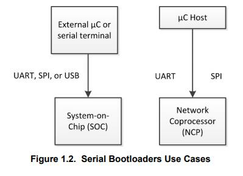

# **UG103.6：Bootloading Fundamentals** <!-- omit in toc -->

本文档介绍了 Silicon Labs 网络设备的 bootloading。总结了 Silicon Labs Gecko Bootloader 与 legacy Ember Bootloader 之间的差异，并讨论了它们对平台的适用性。描述了 standalone 和 application bootloading 的概念，并讨论了它们的相对优势和劣势。此外，还介绍了每种方法的设计和实现细节。最后，描述了 bootloader 文件格式。

Silicon Labs 的基础系列涵盖了项目经理，应用程序设计人员和开发人员在开始使用 Silicon Labs 芯片，EmberZNet PRO 或 Silicon Labs Bluetooth Smart 等网络栈以及相关开发工具的嵌入式网络解决方案之前应该了解的主题。这些文档可以作为任何需要介绍开发无线网络应用程序的人或者是 Silicon Labs 开发环境的新手的起点。

关键点：
* 介绍 Gecko Bootloader 和 legacy Ember bootloaders
* 总结 bootloaders 支持的关键特性和选择 bootloader 的相关设计决策
* 描述 bootloader 文件格式

--------------------------------------------------------------------------------

- [**1. 引言**](#1-引言)
    - [**1.1 Standalone Bootloading**](#11-standalone-bootloading)
    - [**1.2 Application Bootloading**](#12-application-bootloading)

--------------------------------------------------------------------------------

# **1. 引言**

bootloader 是一个存储在预留闪存中的程序，可以初始化设备，更新固件映像，并可能执行一些完整性检查。无论是通过串行通信还是无线，都可以根据需要进行固件映像更新。生产级编程通常在产品制造过程中完成，但有时会希望能够在生产完成后重新编程系统。更重要的是，这能够在设备部署后更新具有新特性和错误修复的固件。这使得更新固件映像成为可能。

Silicon Labs 支持不使用 bootloader 的设备，但这需要外部硬件（如 Debug Adapter（Silicon Labs ISA3 或 WSTK）或第三方的 SerialWire/JTAG 编程设备）来更新固件。没有 bootloader 的设备在部署后无法通过无线方式更新固件，这就是 Silicon Labs 强烈推荐实现 bootloader 的原因。

2017 年 3 月，Silicon Labs 推出了 Gecko Bootloader，这是一个可通过 Simplicity Studio IDE 配置的代码库，用于生成可与各种 Silicon Labs 协议栈一起使用的 bootloader。Gecko Bootloader 可以与 EFR32MG1/EFR32BG1（EFR32xG1）和 EFR32xG1 + Flash 一起使用，然而，从 EFR32MG12/EFR32BG12/EFR32FG12（EFR32xG12）开始，它和所有未来的 Mighty Gecko、Flex Gecko 和 Blue Gecko 版本将仅使用 Gecko Bootloader。用于特定协议（如EmberZNet PRO）和特定平台（EM3x）的 Legacy Ember bootloader 将继续提供。2017 年 12 月，从 Bluetooth SDK 的 2.7.0 版本中删除了对 legacy Bluetooth bootloaders 的支持。

Gecko Bootloader 和 legacy Ember bootloaders 使用自定义的更新映像文件格式，将在 [5. Bootload 文件格式]() 中进一步介绍。Gecko Bootloader 生成的 application bootloader 使用的更新映像文件是 GBL（Gecko BootLoader）文件，legacy Ember bootloaders 使用的是 EBL（Ember BootLoader）文件。

Bootloading 固件更新映像有两种方式。第一种是无线（OTA），即通过无线网络，如下图所示。

第二种是通过设备的硬连线链路。下图表示 SoC（使用 UART、SPI 或 USB ）和 NCP（使用 UART 或 SPI）的 serial bootloader 用例。

Silicon Labs 网络设备以两种不同的模式使用 bootloaders 执行固件更新：standalone（也称为 standalone bootloaders）和 application（也称为 application bootloaders）。Application bootloaders 进一步地划分为使用外部存储和使用本地存储，以用于下载更新映像。这两个 bootloader 类型将在接下来的两节中讨论。

本文档中描述的固件更新情况假定为源节点（通过 serial 或 OTA 链路将固件映像发送到目标的设备）通过其他方式获取新固件。例如，如果本地 Zigbee 网络上的设备已附着到以太网网关，则该设备可以通过 Internet 获取或接收这些固件更新。固件更新过程的这一必要部分取决于系统，这超出了本文档的范围。

## **1.1 Standalone Bootloading**

standalone bootloader 是使用外部通信接口（如 UART 或 SPI）获取应用程序映像的程序。Standalone 固件更新是一个单阶段过程，允许将应用程序映像放入闪存，覆盖现有的应用程序映像，而无需应用程序本身的参与。standalone bootloader 与在 Flash 中运行的应用程序之间几乎没有交互。通常，应用程序与 bootloader 交互的唯一时间是它请求 reboot 到 bootloader。一旦 bootloader 运行，它就会通过物理连接（如 UART 或 SPI）或无线电（无线）接收包含（新）固件映像的 bootload 包。

启动固件更新过程后，新代码将覆盖现有的协议栈和应用程序代码。如果在此过程中发生任何错误，则无法恢复代码并且必须重新开始该过程。有关 legacy standalone bootloaders 的更多信息，请参阅 **AN760: Using the Ember Standalone Bootloader**。有关将 Gecko Bootloader 配置为 standalone bootloader 的信息，请参阅 **UG266: Silicon Labs Gecko Bootloader User Guide**。

## **1.2 Application Bootloading**

application bootloader 在正在运行的应用程序完全下载更新映像文件后开始固件更新过程。application bootloader 期望映像存在于 bootloader 可访问的外部存储器中或主闪存的一部分中（如果芯片具有足够的内存来支持此本地存储模型）。

application bootloader 依赖于应用程序来获取新的固件映像。应用程序可以以任何便捷的方式（UART，OTA 等）下载该映像，但必须将其存储在称为下载空间（download space）的区域中。下载空间通常是外部存储器设备，如 EEPROM 或 dataflash，但在使用 application bootloader 的本地存储变体时，它也可以是芯片内部闪存的一部分。存储新映像后，将调用 application bootloader 以验证新映像并将其从下载空间复制到闪存中。

由于 application bootloader 不参与映像的获取，并且映像在固件更新过程开始之前下载，因此下载错误不会对运行映像产生负面影响。可以重新启动或暂停下载过程以随时获取映像。可以在启动固件更新过程之前验证所下载的更新映像的完整性，以防止损坏或无功能的映像被应用。

legacy Ember application bootloader 提供 UART standalone bootloading 能力以作为恢复机制，防止正在运行的应用程序映像和升级映像被损坏。可以将 Gecko Bootloader 配置为接受一个多升级映像的列表，以尝试验证和应用。这允许 Gecko Bootloader 存储更新映像的备份副本，如果第一个映像损坏，它可以访问该副本。

注意，EmberZNet 和 Silicon Labs Thread NCP 平台不使用 application bootloader，因为应用程序代码驻留在主机上而不是直接驻留在 NCP 上。相反，充当串行协处理器的设备将使用 standalone bootloader，该 bootloader 旨在通过与预期的 NCP 固件使用的相同串行接口接受代码。但是，主机应用程序（驻留在 NCP 的独立 MCU 上）可以使用任何合适的 bootloading 方案。Silicon Labs Bluetooth NCP 可以使用 legacy OTA DFU bootloader。

有关 application bootloaders 的详情，可以参阅 **UG266: Silicon Labs Gecko Bootloader User's Guide** 和 **AN772: Using the Ember Application Bootloader**。

--------------------------------------------------------------------------------
