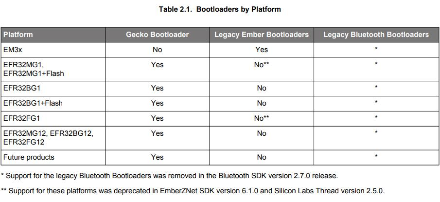
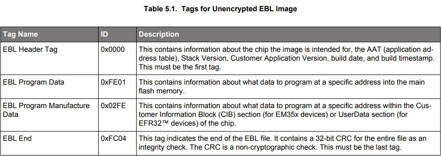

# **UG103.6：Bootloading Fundamentals** <!-- omit in toc -->

本文档介绍了 Silicon Labs 网络设备的 bootloading。总结了 Silicon Labs Gecko Bootloader 与 legacy Ember Bootloader 之间的差异，并讨论了它们对平台的适用性。描述了 standalone 和 application bootloading 的概念，并讨论了它们的相对优势和劣势。此外，还介绍了每种方法的设计和实现细节。最后，描述了 bootloader 文件格式。

Silicon Labs 的基础系列涵盖了项目经理，应用程序设计人员和开发人员在开始使用 Silicon Labs 芯片，EmberZNet PRO 或 Silicon Labs Bluetooth Smart 等网络栈以及相关开发工具的嵌入式网络解决方案之前应该了解的主题。这些文档可以作为任何需要介绍开发无线网络应用程序的人或者是 Silicon Labs 开发环境的新手的起点。

关键点：
* 介绍 Gecko Bootloader 和 legacy Ember bootloaders
* 总结 bootloaders 支持的关键特性和选择 bootloader 的相关设计决策
* 描述 bootloader 文件格式

--------------------------------------------------------------------------------

- [**1. 引言**](#1-引言)
    - [**1.1 Standalone Bootloading**](#11-standalone-bootloading)
    - [**1.2 Application Bootloading**](#12-application-bootloading)
- [**2. 关于 Gecko Bootloader**](#2-关于-gecko-bootloader)
    - [**2.1 特性**](#21-特性)
        - [**2.1.1 现场可更新**](#211-现场可更新)
        - [**2.1.2 安全启动**](#212-安全启动)
        - [**2.1.3 已签名的 GBL 固件更新映像文件**](#213-已签名的-gbl-固件更新映像文件)
        - [**2.1.4 已加密的 GBL 固件更新映像文件**](#214-已加密的-gbl-固件更新映像文件)
    - [**2.2 适用性**](#22-适用性)
- [**3. 用于 Bootloading 的内存空间**](#3-用于-bootloading-的内存空间)
    - [**3.1 Gecko Bootloader**](#31-gecko-bootloader)
    - [**3.2 Legacy Ember Bootloaders**](#32-legacy-ember-bootloaders)
- [**4. 设计决策**](#4-设计决策)
    - [**4.1 Gecko Bootloader**](#41-gecko-bootloader)
    - [**4.2 Legacy Ember Bootloaders**](#42-legacy-ember-bootloaders)
- [**5. Bootload 文件格式**](#5-bootload-文件格式)
    - [**5.1 Gecko Bootload (GBL) 文件**](#51-gecko-bootload-gbl-文件)
        - [**5.1.1 文件格式**](#511-文件格式)
            - [**5.1.1.1 文件结构**](#5111-文件结构)
            - [**5.1.1.2 明文标签描述**](#5112-明文标签描述)
            - [**5.1.1.3 已加密标签描述**](#5113-已加密标签描述)
        - [**5.1.2 映像验证**](#512-映像验证)
    - [**5.2 Ember Bootload (EBL) 文件**](#52-ember-bootload-ebl-文件)
        - [**5.2.1 基本的文件格式**](#521-基本的文件格式)
            - [**5.2.1.1 未加密标签描述**](#5211-未加密标签描述)
            - [**5.2.1.2 数据验证**](#5212-数据验证)
        - [**5.2.2 已加密 Ember Bootload 文件格式**](#522-已加密-ember-bootload-文件格式)
            - [**5.2.2.1 已加密标签描述**](#5221-已加密标签描述)
            - [**5.2.2.2 Nonce Generation**](#5222-nonce-generation)
            - [**5.2.2.3 映像验证**](#5223-映像验证)

--------------------------------------------------------------------------------

# **1. 引言**

bootloader 是一个存储在预留闪存中的程序，可以初始化设备，更新固件映像，并可能执行一些完整性检查。无论是通过串行通信还是无线，都可以根据需要进行固件映像更新。生产级编程通常在产品制造过程中完成，但有时会希望能够在生产完成后重新编程系统。更重要的是，这能够在设备部署后更新具有新特性和错误修复的固件。这使得更新固件映像成为可能。

Silicon Labs 支持不使用 bootloader 的设备，但这需要外部硬件（如 Debug Adapter（Silicon Labs ISA3 或 WSTK）或第三方的 SerialWire/JTAG 编程设备）来更新固件。没有 bootloader 的设备在部署后无法通过无线方式更新固件，这就是 Silicon Labs 强烈推荐实现 bootloader 的原因。

2017 年 3 月，Silicon Labs 推出了 Gecko Bootloader，这是一个可通过 Simplicity Studio IDE 配置的代码库，用于生成可与各种 Silicon Labs 协议栈一起使用的 bootloader。Gecko Bootloader 可以与 EFR32MG1/EFR32BG1（EFR32xG1）和 EFR32xG1 + Flash 一起使用，然而，从 EFR32MG12/EFR32BG12/EFR32FG12（EFR32xG12）开始，它和所有未来的 Mighty Gecko、Flex Gecko 和 Blue Gecko 版本将仅使用 Gecko Bootloader。用于特定协议（如EmberZNet PRO）和特定平台（EM3x）的 Legacy Ember bootloader 将继续提供。2017 年 12 月，从 Bluetooth SDK 的 2.7.0 版本中删除了对 legacy Bluetooth bootloaders 的支持。

Gecko Bootloader 和 legacy Ember bootloaders 使用自定义的更新映像文件格式，将在 [5. Bootload 文件格式]() 中进一步介绍。Gecko Bootloader 生成的 application bootloader 使用的更新映像文件是 GBL（Gecko BootLoader）文件，legacy Ember bootloaders 使用的是 EBL（Ember BootLoader）文件。

Bootloading 固件更新映像有两种方式。第一种是无线（OTA），即通过无线网络，如下图所示。

第二种是通过设备的硬连线链路。下图表示 SoC（使用 UART、SPI 或 USB ）和 NCP（使用 UART 或 SPI）的 serial bootloader 用例。

Silicon Labs 网络设备以两种不同的模式使用 bootloaders 执行固件更新：standalone（也称为 standalone bootloaders）和 application（也称为 application bootloaders）。Application bootloaders 进一步地划分为使用外部存储和使用本地存储，以用于下载更新映像。这两个 bootloader 类型将在接下来的两节中讨论。

本文档中描述的固件更新情况假定为源节点（通过 serial 或 OTA 链路将固件映像发送到目标的设备）通过其他方式获取新固件。例如，如果本地 Zigbee 网络上的设备已附着到以太网网关，则该设备可以通过 Internet 获取或接收这些固件更新。固件更新过程的这一必要部分取决于系统，这超出了本文档的范围。

## **1.1 Standalone Bootloading**

standalone bootloader 是使用外部通信接口（如 UART 或 SPI）获取应用程序映像的程序。Standalone 固件更新是一个 single-stage 过程，允许将应用程序映像放入闪存，覆盖现有的应用程序映像，而无需应用程序本身的参与。standalone bootloader 与在 Flash 中运行的应用程序之间几乎没有交互。通常，应用程序与 bootloader 交互的唯一时间是它请求 reboot 到 bootloader。一旦 bootloader 运行，它就会通过物理连接（如 UART 或 SPI）或无线电（无线）接收包含（新）固件映像的 bootload 包。

启动固件更新过程后，新代码将覆盖现有的协议栈和应用程序代码。如果在此过程中发生任何错误，则无法恢复代码并且必须重新开始该过程。有关 legacy standalone bootloaders 的更多信息，请参阅 **AN760: Using the Ember Standalone Bootloader**。有关将 Gecko Bootloader 配置为 standalone bootloader 的信息，请参阅 **UG266: Silicon Labs Gecko Bootloader User Guide**。

## **1.2 Application Bootloading**

application bootloader 在正在运行的应用程序完全下载更新映像文件后开始固件更新过程。application bootloader 期望映像存在于 bootloader 可访问的外部存储器中或主闪存的一部分中（如果芯片具有足够的内存来支持此本地存储模型）。

application bootloader 依赖于应用程序来获取新的固件映像。应用程序可以以任何便捷的方式（UART，OTA 等）下载该映像，但必须将其存储在称为下载空间（download space）的区域中。下载空间通常是外部存储器设备，如 EEPROM 或 dataflash，但在使用 application bootloader 的本地存储变体时，它也可以是芯片内部闪存的一部分。存储新映像后，将调用 application bootloader 以验证新映像并将其从下载空间复制到闪存中。

由于 application bootloader 不参与映像的获取，并且映像在固件更新过程开始之前下载，因此下载错误不会对运行映像产生负面影响。可以重新启动或暂停下载过程以随时获取映像。可以在启动固件更新过程之前验证所下载的更新映像的完整性，以防止损坏或无功能的映像被应用。

legacy Ember application bootloader 提供 UART standalone bootloading 能力以作为恢复机制，防止正在运行的应用程序映像和升级映像被损坏。可以将 Gecko Bootloader 配置为接受一个多升级映像的列表，以尝试验证和应用。这允许 Gecko Bootloader 存储更新映像的备份副本，如果第一个映像损坏，它可以访问该副本。

注意，EmberZNet 和 Silicon Labs Thread NCP 平台不使用 application bootloader，因为应用程序代码驻留在主机上而不是直接驻留在 NCP 上。相反，充当串行协处理器的设备将使用 standalone bootloader，该 bootloader 旨在通过与预期的 NCP 固件使用的相同串行接口接受代码。但是，主机应用程序（驻留在 NCP 的独立 MCU 上）可以使用任何合适的 bootloading 方案。Silicon Labs Bluetooth NCP 可以使用 legacy OTA DFU bootloader。

有关 application bootloaders 的详情，可以参阅 **UG266: Silicon Labs Gecko Bootloader User's Guide** 和 **AN772: Using the Ember Application Bootloader**。

--------------------------------------------------------------------------------

# **2. 关于 Gecko Bootloader**

Silicon Labs Gecko Bootloader 是一个可配置的代码库，可以与所有较新的 Silicon Labs Gecko MCU 和无线 MCU 一起使用。它使用称为 GBL 文件的特殊格式的更新映像文件。Gecko Bootloader 采用 two-stage 设计，其中最小的 first stage bootloader 用于更新 main bootloader。这允许 main bootloader 的现场更新，包括添加新能力、更改通信协议、添加新安全特性和修复程序等。Gecko Bootloader 由三个组件组成：

* Core：bootloader core 包含两个 bootloader stages 的主要功能。它还包含写入内部主闪存、执行 bootloader 更新和重置到应用程序中（以标记适用的重置原因）的功能。
* Driver：不同的 bootloading 应用程序需要不同的硬件驱动程序以供 bootloader 的其他组件使用。
* Plugin：main bootloader 的所有可选项或用于不同配置的选择被实现为 plugin。每个 plugin 都有一个通用的头文件和一个或多个实现。当前版本包含 UART 和 SPI 通信协议、SPI 闪存存储、内部闪存存储和不同加密操作等功能插件。

## **2.1 特性**

Gecko Bootloader 特性包括：

* 现场可更新（Field-updateable）
* 安全启动（Secure boot）
* 已签名的 GBL 固件更新映像文件（Signed GBL firmware update image file）
* 已加密的 GBL 固件更新映像文件（Encrypted GBL firmware update image file）

这些特性在随后的小节中进行了总结，并在 **UG266: Silicon Labs Gecko Bootloader User Guide** 中详细地描述。有关使用 Gecko Bootloader 的协议特定的信息可在以下文档中找到：

* **AN1084: Using the Gecko Bootloader with EmberZNet and Silicon Labs Thread**
* **AN1085: Using the Gecko Bootloader with Silicon Labs Connect**
* **AN1086: Using the Gecko Bootloader with Silicon Labs Bluetooth Applications**

### **2.1.1 现场可更新**

Bootloader 固件现场更新能力由一个 two-stage 设计（first stage 和 main stage）提供。bootloader 的最小 first stage（不可现场更新）只能通过读写内部闪存中的固定地址来更新 main bootloader。要执行 main bootloader 更新，正在运行的 main bootloader 将验证 bootloader 更新映像的完整性和真实性，将 bootloader 更新映像写入内部闪存中的固定位置，并发出重置到 first stage bootloader 中。在将更新映像复制到 main bootloader 位置之前，first stage bootloader 会验证 main bootloader 更新映像的完整性。

### **2.1.2 安全启动**

安全启动旨在防止不受信任的映像在设备上运行。启用安全启动后，bootloader 会使用非对称加密技术在每次启动时强制执行应用程序映像的加密签名验证。使用的签名算法是 ECDSA-P256-SHA256。公钥在制造期间写入设备，而私钥保密。这确保了应用程序是由可信方创建和签名的。

### **2.1.3 已签名的 GBL 固件更新映像文件**

除了安全启动之外，Gecko Bootloader 还支持强制执行更新映像文件的加密签名验证。这允许 bootloader 和应用程序在开始更新过程之前验证应用程序或 bootloader 的更新是否来自受信任的源。使用的签名算法是 ECDSA-P256-SHA256。公钥与安全引导的密钥相同，在制造期间写入设备，而私钥不分发。这可确保 GBL 文件由受信任方创建和签名。

### **2.1.4 已加密的 GBL 固件更新映像文件**

GBL 更新文件也可以加密，以防止窃听者获取明文固件映像。使用的加密算法是 AES-CTR-128，加密密钥在制造期间写入设备。

## **2.2 适用性**

下表展示了可以与不同平台一起使用的 bootloaders。

--------------------------------------------------------------------------------

# **3. 用于 Bootloading 的内存空间**

## **3.1 Gecko Bootloader**

bootloader 的 first stage 占用单个闪存页。在使用 2kB 闪存页的设备上，如 EFR32MG1，这意味着 first stage 需要 2kB。

main bootloader 的大小取决于所需的功能。典型的 bootloader 配置为，main bootloader 占用 14kB 闪存，使总 bootloader 大小达到 16kB。

Silicon Labs 建议为 bootloader 保留至少 16kB。

在 EFR32xG1 设备（Mighty Gecko、Flex Gecko 和 Blue Gecko 系列）上，bootloader 位于主闪存中。

* First stage bootloader @ 0x0
* Main bootloader @ 0x800
* Application @ 0x4000

在较新的设备（EFR32xG12 和更高版本）上，bootloader 位于信息块的 bootloader 区域中。

* Application @ 0x0
* First stage bootloader @ 0x0FE10000
* Main bootloader @ 0x0FE10800

## **3.2 Legacy Ember Bootloaders**

下图展示了典型 Silicon Labs 网状网络 SOC 或 NCP 的存储器映射。

对于每个 Silicon Labs 网状网络平台（在 SOC 或 NCP 使用情况下），在主闪存的起始处保留一个闪存块（通常为 8kB 或 16kB，具体取决于所使用的 IC 变体）以保存 bootloader，以及在闪存的末尾保留一个闪存块（在 4kB 和 36kB 之间，具体取决于实现），用于模拟 EEPROM。除了 Local Storage Application Bootloader，其他所有情况下内存空间的余额都是非保留的，可用于保存网络协议栈和应用程序代码。

--------------------------------------------------------------------------------

# **4. 设计决策**

部署哪种 bootloader 类型取决于许多因素。注意，平台类型和可用闪存可能会限制 bootloader 的选择。

与此相关的一些问题是：

* 设备从何处获得新的更新映像？通过网络协议进行的无线传输？使用连接到 Internet 的独立接口？
* 设备是否有外部存储器芯片来存储新的更新映像？如果没有，是否有足够的内部闪存来存储最大的预期应用程序映像（当前的和新下载的副本）？
* If the device receives the new image over-the-air, will it be multiple hops away from the server holding the download image ?
* 需要什么样的映像安全性？
* 将使用哪种通信驱动程序（在单协议的情况下）？
* 用例是否需要多个协议？

## **4.1 Gecko Bootloader**

Gecko Bootloader 平台的可配置设计意味着开发人员可以创建 bootloaders 以适应几乎全部的设计选择。有关详细信息，请参阅 **UG266: Silicon Labs Gecko Bootloader User's Guide**。

## **4.2 Legacy Ember Bootloaders**

下表展示了 legacy Ember bootloaders，不同类型以及 bootloaders 支持的特性。

--------------------------------------------------------------------------------

# **5. Bootload 文件格式**

本节中描述的 bootload 文件格式由 Simplicity Commander 命令生成。有关更多信息，请参阅 **UG162: Simplicity Commander Reference Guide**。

## **5.1 Gecko Bootload (GBL) 文件**

Gecko Bootloader 使用 GBL 文件格式。

### **5.1.1 文件格式**

#### **5.1.1.1 文件结构**

GBL 文件格式由许多标签组成，这些标签指示后续数据的格式和整个标签的长度。标签的格式如下：

| Tag ID | Tag Length | Tag Payload |
| :----: | :--------: | :---------: |
| 4 bytes | 4 bytes | Variable (according to tag length) |

#### **5.1.1.2 明文标签描述**

| Tag Name |  ID  | Description |
| :------- | :--: | :---------- |
| GBL Header Tag | 0x03A617EB | This must be the first tag in the file. The header tag contains the version number of the GBL file specification, and flags indicating the type of GBL file – whether it is signed or encrypted. |
| GBL Application Info Tag | 0xF40A0AF4 | This tag contains information about the application update image that is contained in this GBL file. |
| GBL Bootloader Tag | 0xF50909F5 | This tag contains a complete bootloader update image. |
| GBL Program Data Tag | 0xFE0101FE or 0xFD0303FD | This tag contains information about what application data to program at a specific address into the main flash memory. |
| GBL Metadata Tag | 0xF60808F6 | This tag contains metadata that the bootloader does not parse, but can be returned to the application through a callback. |
| GBL Signature Tag | 0xF70A0AF7 | This tag contains the ECDSA-P256 signature of all preceding data in the file. |
| GBL End Tag | 0xFC0404FC | This tag indicates the end of the GBL file. It contains a 32-bit CRC for the entire file as an integrity check. The CRC is a non-cryptographic check. This must be the last tag. |

GBL 文件中允许的 GBL 标签序列如下图所示。

#### **5.1.1.3 已加密标签描述**

已加密的 GBL 文件格式类似于未加密的版本。它引入了许多新标签。

| Tag Name |  ID  | Description |
| :------- | :--: | :---------- |
| GBL Header Tag | 0x03A617EB | The GBL header is the same as for a plaintext GBL file, but the flag indicating that the GBL file is encrypted must be set. |
| GBL Encryption Init Header | 0xFA0606FA | This contains information about the image encryption such as the Nonce and the amount of encrypted data. |
| GBL Encrypted Program Data | 0xF90707F9 | This contains an encrypted payload containing a plaintext GBL tag, one of Application Info, Bootoader, Metadata or Program Data. The data is encrypted using AESCTR-128. |

已加密的 GBL 文件中允许的 GBL 标签序列如下图所示。

### **5.1.2 映像验证**

可选的 GBL 签名标签可用于确保 GBL 文件的真实性。Silicon Labs 强烈建议将 bootloader 配置为仅接受已签名的 GBL 文件。

## **5.2 Ember Bootload (EBL) 文件**

所有 Ember bootloaders 都要求它们正在处理的映像采用 EBL（Ember Bootload）文件格式。

### **5.2.1 基本的文件格式**

EBL 文件格式由许多标签组成，这些标签指示后续数据的格式和整个标签的长度。标签的格式如下：

| Tag ID | Tag Length | Tag Payload |
| :----: | :--------: | :---------: |
| 2 bytes | 2 bytes | Variable (according to tag length) |

标签格式的详细信息可以在这些头文件中找到：

| Platform | Header Filename |
| :------- | :-------------- |
| EM3x Series | \<hal\>/micro/cortexm3/bootloader/ebl.h |
| EFR32 Series | Not supported. |

#### **5.2.1.1 未加密标签描述**

下表列出了未加密的 EBL 映像的标签。

完整的 EBL 映像如下图所示。

#### **5.2.1.2 数据验证**

EBL 文件格式包括三个 32bit CRC 值，用于验证文件的完整性。这些值是使用 **halCommonCrc32()** 函数计算的，该函数可以在 **hal/micro/generic/crc.c** 中找到。计算中使用的 CRC 的初始值是 **0xFFFFFFFF**。

下表描述了\.EBL下载格式中内置的数据完整性检查。

### **5.2.2 已加密 Ember Bootload 文件格式**

Ember 已加密 bootloader 文件格式类似于未加密的版本。它引入了许多新标签。如果 bootloader 仅接受已加密的 EBL 映像，则称其为 “secure” bootloader。

#### **5.2.2.1 已加密标签描述**

下表列出了加密标签及其说明。

An encrypted image will wrap normal, unsecured, EBL tags inside EBL Encrypted Program Data tags. The contents of each tag are encrypted but the encrypted data tag ID and tag length fields are not. For each tag that exists in the unencrypted EBL a corresponding Encrypted Program Data tag will be created.

加密文件格式如下图所示：

#### **5.2.2.2 Nonce Generation**

The nonce for the encrypted image is a 12-byte value contained within the EBL Encryption Init tag. The em3xx_convert or Simplicity Commander tool will generate a random nonce value during encryption and store this in the EBL Encryption Init tag.

It is important that a nonce value is not used twice to encrypt two different images with the same encryption key. This is because CCM relies on using XOR with a block of pseudo-random noise to encrypt the contents of a file. However with a 12-byte random nonce the chances of this are roughly 1 in 2\^96.

#### **5.2.2.3 映像验证**

已加密的 EBL 映像受到消息认证码（MAC）的保护，该消息认证码是通过每个标签的未加密内容计算的。MAC 存储在 EBL MAC 标签中，安全 bootloader 将在加载映像中的任何数据之前计算并验证存储的 MAC。

--------------------------------------------------------------------------------
