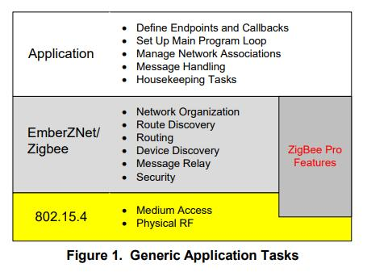
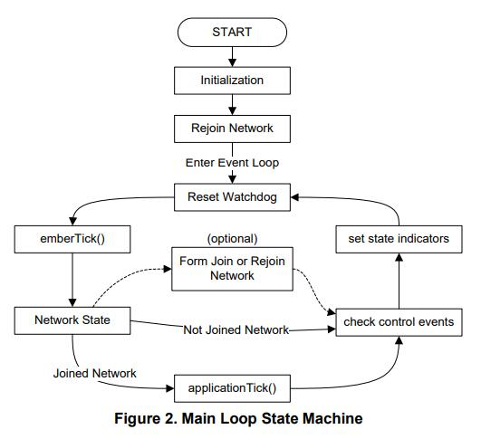
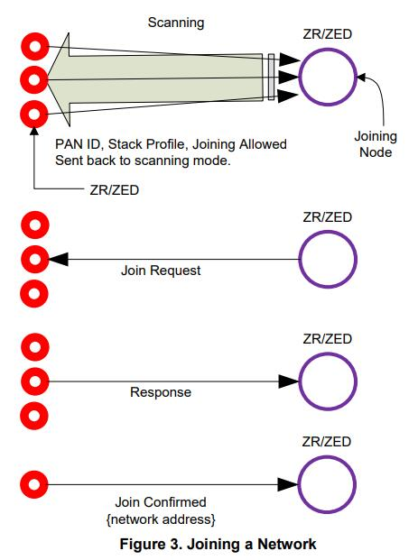

# UG102: ADVANCED APPLICATION PROGRAMMING WITH THE STACK AND HAL APIS <!-- omit in toc -->

## 新增内容 <!-- omit in toc -->

文档重新编号。

## 目录 <!-- omit in toc -->
- [1. 引言](#1-引言)
  - [1.1 目的](#11-目的)
  - [1.2 获取帮助](#12-获取帮助)
- [2. EmberZNet PRO API 引介](#2-emberznet-pro-api-引介)
  - [2.1 API 组织](#21-api-组织)
  - [2.2 命名约定](#22-命名约定)
  - [2.3 API 文件和目录结构](#23-api-文件和目录结构)
  - [2.4 网络形成](#24-网络形成)
    - [2.4.1 栈的初始化](#241-栈的初始化)
    - [2.4.2 网络运行](#242-网络运行)
    - [2.4.3 网络形成](#243-网络形成)
    - [2.4.4 加入网络](#244-加入网络)
  - [2.5 包缓冲区](#25-包缓冲区)
    - [2.5.1 地址表或绑定表管理](#251-地址表或绑定表管理)
  - [2.6 发送和接收消息](#26-发送和接收消息)
    - [2.6.1 发送消息](#261-发送消息)
    - [2.6.2 接收消息](#262-接收消息)
    - [2.6.3 源路由与大型网络](#263-源路由与大型网络)
    - [2.6.4 与聚合相关的 API 的关键](#264-与聚合相关的-api-的关键)
  - [2.7 终端设备](#27-终端设备)
  - [2.8 安全与信任中心](#28-安全与信任中心)
  - [2.9 事件调度](#29-事件调度)
- [3. 应用设计](#3-应用设计)
  - [3.1 应用设计基础](#31-应用设计基础)
  - [3.2 基本的应用设计要求](#32-基本的应用设计要求)
  - [3.3 基本的应用任务要求（Scratch-Built）](#33-基本的应用任务要求scratch-built)
    - [3.3.1 定义端点、回调和全局变量](#331-定义端点回调和全局变量)
    - [3.3.2 建立主程序循环](#332-建立主程序循环)
      - [3.3.2.1 初始化](#3321-初始化)
      - [3.3.2.2 事件循环](#3322-事件循环)
    - [3.3.3 管理网络关联](#333-管理网络关联)
      - [3.3.3.1 Extended PAN IDs](#3331-extended-pan-ids)
      - [3.3.3.2 检测网络](#3332-检测网络)
      - [3.3.3.3 加入网络](#3333-加入网络)
      - [3.3.3.4 创建网络](#3334-创建网络)
    - [3.3.4 消息处理](#334-消息处理)
      - [3.3.4.1 发送消息](#3341-发送消息)
      - [3.3.4.2 接收消息](#3342-接收消息)
      - [3.3.4.3 消息确认](#3343-消息确认)

# 1. 引言

## 1.1 目的

本手册为哪些需要使用某些功能（无法通过 Ember® AppBuilder 和 Ember 应用框架提供）或喜欢使用 API 的开发者提供支持。

在着手开发基于 API 的开发之前，您可能希望探究 Ember AppBuilder 和应用框架。Ember AppBuilder 是一个用于生成符合 ZigBee 规范的应用程序的工具，它还提供了一个用于打开或关闭代码中的嵌入式簇和特性的图形界面。Ember 应用框架是开发任何符合 ZigBee 规范的设备所需的所有源代码的超集。详情请参阅 Ember Desktop 在线帮助和文档 **UG102: Application Framework Developer Guide**。

本手册是 **document 120-3022-000, EmberZNet API Reference for the EM35x SoC Platform** 的配套文件。类似的 API 参考可用于其他 Ember 平台。这些 API 参考手册包含了对 EmberZNet PRO stack API、hardware abstraction layer (HAL) API 和 application utilities API 的参考。

该手册涵盖了以下主题：

* EmberZNet PRO stack API 引介。
* 讨论使用 API 开发应用时要考虑的几个高级设计问题。
* 在开始开发时可以利用的一个示例应用。

## 1.2 获取帮助

开发套件客户有资格获得培训和技术支持。您可以通过 Silicon Labs 网站 [www.silabs.com/zigbee](www.silabs.com/zigbee) 获取有关 Ember 产品和服务的信息，并注册产品支持。您也可以通过 [www.silabs.com/zigbee-support](www.silabs.com/zigbee-support) 联系客户支持。

# 2. EmberZNet PRO API 引介

EmberZNet PRO API 控制 EmberZNet PRO 栈库，并提供与网络形成、发现、加入和消息传递功能相关的函数调用和回调。可以通过参阅 **document 120-3022-000, EmberZNet API Reference for the EM35x SoC Platform** 来获取这些函数及参数的完整参考。类似的参考可用于其他 Ember 平台。

这些参考手册包含了对 EmberZNet PRO stack API、hardware abstraction layer (HAL) API 和 application utilities API 的参考。

Silicon Labs 建议新的 EmberZNet PRO 软件工程师或希望深入理解不同组件的 API 的人阅读本章。您将看到 API 如何帮助您快速地开发应用。

## 2.1 API 组织

EmberZNet PRO API 分成 16 个功能部分。本章详细介绍了 6 个基本的 API 部分：

* 网络形成（Network Formation）
* 包缓冲区（Packet Buffers）
* 发送和接收消息（Sending and Receiving Messages）
* 终端设备（End Devices）
* 安全与信任中心（Security and Trust Center）
* 事件调度（Event Scheduling）

其余的功能部分为：

* 栈信息（Stack Information）
* Ember 通用数据类型（Ember Common Data Types）
* 绑定表（Binding Table）
* 配置（Configuration）
* 状态码（Status Codes）
* 栈令牌（Stack Tokens）
* ZigBee 设备对象（ZigBee Device Object, ZDO）
* Bootloader
* 制造和功能测试库（Manufacturing and Functional Test Library）
* 调试工具（Debugging Utilities）

## 2.2 命名约定

作为公共 EmberZNet PRO API 部分的所有函数都以前缀 `ember` 开头。Silicon Labs 强烈建议您在编写自定义软件时遵守此约定，以便轻松查找与函数相关的信息和文档。

## 2.3 API 文件和目录结构

以下列表描述了栈中包含有用信息的文件。

* `<stack>/config/config.h`：此文件包含栈构建版本，可以在联系技术支持或验证所用的栈版本是否正确时使用。版本号的格式在文件中描述。
* `<stack>/config/ember-configuration-defaults.h`：此文件描述了影响 EmberZNet PRO 栈行为的编译时可配置选项。这些应在 `CONFIGURATION_HEADER` 或项目中设置，以便在所有文件中正确设置值。
* `<stack>/include`：此目录包含所有 API 的头文件。适合应用程序的 API 包含在 `ember.h` 中，因此应用程序通常只需要包含 `ember.h`。这些文件可供高级开发者参考。API 参考文档由这些头文件生成。

## 2.4 网络形成

Silicon Labs 提供了可用于发现、形成、加入和离开 ZigBee 网络的 API 集。

### 2.4.1 栈的初始化

通过在 `main()` 函数中调用 `emberInit()` 来初始化 EmberZNet PRO 栈。如果设备连接到带有 Ember Desktop 的调试适配器，则可以传递一个可用于调试的重置代码值。

```c
status = emberInit(reset);
```

> Note：必须在使用任何其他栈 API 之前调用 `emberInit()`，否则会产生未知的结果。有关调试的更多信息，请参阅文档 **UG104: Testing and Debugging Applications for the Ember EM2xx and Em3xx Platforms**。

调用 `emberNetworkInit()` 会导致设备重新加入它重启前所加入的网络。这使得尽可能多的前网络（previous network）设置（例如，保持网络地址）被保持下来。

```c
if (emberNetworkInit() == EMBER_SUCCESS)) {
    // Successfully rejoined previous network
} else {
    // No previous network or could not successfully rejoin
}
```

> Note：在更改设备类型（例如，ZR 和 ZED）的开发系统或系统上，应用程序应验证缓存的设备类型是否为所需的设备类型。此行为在本书后面的示例应用程序中展示。

> PS：ZC（ZigBee Coordinator，协调器）、ZR（ZigBee Router，路由器）、ZED（ZigBee End Device，终端设备）

### 2.4.2 网络运行

在程序循环中定期调用 `emberTick()` 有利于网络的正常运行。看门狗（watchdog）也应该被重置：

```c
while(TRUE) {
    halResetWatchdog();
    emberTick();

    // Application-specific functions here
}
```

### 2.4.3 网络形成

用于创建、加入和离开网络的函数：

* `emberFormNetwork()`
* `emberPermitJoining()`
* `emberJoinNetwork()`
* `emberFindAndRejoinNetwork()`
* `emberLeaveNetwork()`

用于发现网络或测定背景能量级别（background energy levels）的函数：

* `emberStartScan()`
* `emberStopScan()`
* `emberScanCompleteHandler()`
* `emberEnergyScanResultHandler()`
* `emberNetworkFoundHandler()`

Silicon Labs 提供了封装好的实用函数（utility functions），隐藏了标准网络形成的大部分细节：

```c
 // Use a function from app/util/common/form-and-join.h
 // that scans and selects a quiet channel to form on.
 // The short PAN ID is randomly picked and the Extended PAN ID is
 // either the one passed in by the app, or (if the app passes 0)
 // is also randomly picked.
 formZigbeeNetwork(EMBER_ALL_802_15_4_CHANNELS_MASK, -1, (int8u*) &extendedPanId);
```

此实用函数使用 `emberStartScan()`、`emberStopScan()`、`emberScanCompleteHandler()`、`emberEnergyScanResultHandler()` 和 `emberNetworkFoundHandler()` 来发现其他网络或测定背景噪声级别。然后，它使用 `emberFormNetwork()` 在低背景噪声的信道上使用唯一的 PAN-ID 创建一个新网络。有关实用函数的详情，请参阅 `/stack/include/network-formation.h`、`/app/utils/common/form-and-join.h` 和 `/app/utils/scan/scan-utils.h`。

> Note：因为 EmberZNet PRO 对 ZC 和 ZR 设备使用的是同一个栈库，因此任何调用 `emberFormNetwork()` 的设备都会创建网络并成为 ZC。因此，只有启动网络的设备才应调用 `emberFormNetwork()`，其他设备应调用 `emberJoinNetwork()`，如下所述。

然后，ZC 可以使用 `emberPermitJoining()` 来允许（其它设备）加入，但必须符合所配置的安全设置。

```c
emberPermitJoining(60);    // Permit joining for 60 seconds
emberPermitJoining(0xFF);  // Permit joining until turned off
emberPermitJoining(0);     // Do not permit joining
```

有关安全设置和授权的详细信息，请参阅文档 **UG103.5, Ember Application Development Fundamentals: Security**。

### 2.4.4 加入网络

加入网络可以通过使用 `emberJoinNetwork()` 来完成：

```c
status = emberJoinNetwork(EMBER_ROUTER, &networkParams);            // To join as a ZR
status = emberJoinNetwork(EMBER_SLEEPY_END_DEVICE, &networkParams); // To join as a Sleepy ZED
status = emberJoinNetwork(EMBER_MOBILE_END_DEVICE, &networkParams); // To join as a Mobile ZED
```

`networkParams` 变量是一个 `EmberNetworkParameters` 类型的结构，它包含 PAN-ID、extended PAN-ID（或 0）、要加入的网络的信道和加入网络的期望 TX 功率。

Silicon Labs 还提供了一个实用函数，该函数使用 `emberStartScan()`、`emberStopScan()` 和 `emberScanCompleteHandler()` 来发现与所提供选项匹配的网络，并加入第一个发现的：

```c
// Use a function from app/util/common/form-and-join.c
// that scans and selects a beacon that has:
// 1) allow join=TRUE
// 2) matches the stack profile that the app is using
// 3) matches the extended PAN ID passed in unless "0" is passed
// Once a beacon match is found, emberJoinNetwork is called.
joinZigbeeNetwork(EMBER_ROUTER, EMBER_ALL_802_15_4_CHANNELS_MASK, -1, (int8u*) extendedPanId);
```

在与其网络失去联系并需要扫描和重新加入的设备上可以使用 `emberFindandRejoinNetwork()`。

## 2.5 包缓冲区

EmberZNet PRO 栈提供了一整套用于管理内存的函数。此内存在链接时静态分配，但在运行时动态使用。这是一种有价值的机制，因为它允许您为可变长消息使用静态链接的固定长度缓冲区。这也可以让您更好地了解软件在运行时需要多少 RAM。

常用的函数包含：分配带有预定义内容的缓冲区、从当前缓冲区拷贝/拷贝到当前缓冲区、释放已分配的缓冲区：

1. 为长字节分配一个足够大的新缓冲区，从 `dataArray` 中拷贝长字节，并检查分配是否成功：
    ```c
    buffer = emberFillLinkedBuffers(dataArray, length);
    if (buffer == EMBER_NULL_MESSAGE_BUFFER) {
        // the allocation failed! Do not proceed!
    }
    ```
2. 从索引 0 开始，从缓冲区拷贝长字节到 `dataArray`：
    ```c
    emberCopyFromLinkedBuffers(buffer, 0, dataArray, length); 
    ````
3. 归还缓冲区使用的所有内存，以便可以重新使用：
    ```c
    emberReleaseMessageBuffer(buffer);
    ```

许多函数可用于在包缓冲区和数组间拷贝或附加数据。栈缓冲区、链接缓冲区和消息缓冲区都涉及到相同类型的数据结构。各个函数根据预期的用途进行命名。完整的列表以及每个函数的详细信息，请参阅 `stack/include/packet-buffer.h` 中的包缓冲区 API 文档。

### 2.5.1 地址表或绑定表管理

地址表（address table）由网络栈维护，它包含网络中其他设备的 IEEE 地址和网络短地址。在诸如 `emberSendUnicast()` 之类的命令中通过将类型指定为 `EMBER_OUTGOING_VIA_ADDRESS_TABLE`，可以使用地址表发送消息。有关地址表的更多详细信息，请参阅 `message.h`。

绑定表也可以用于发送消息。绑定代码位于库内，因此如果应用不使用绑定，则不会消耗闪存空间。有关更多详细信息，请参阅 `binding-table.h`。

## 2.6 发送和接收消息

有关发送和接收消息的详情，请参阅 `message.h`。

### 2.6.1 发送消息

单播消息的方法：

```c
// To send to a device previously entered in the address table:
status = emberSendUnicast(EMBER_OUTGOING_VIA_ADDRESS_TABLE,
                          destinationAddressTableIndex,
                          &apsFrame,
                          buffer, &sequenceNum);

// To send to a device via its 16-bit address (if known):
status = emberSendUnicast(EMBER_OUTGOING_DIRECT,
                          destinationId,
                          &apsFrame,
                          buffer, &sequenceNum);
```

在这两种情况下，`apsFrame` 包含单播消息选项（如重试或启用路由发现）、`buffer` 包含消息，`sequenceNum` 提供指向 APS 序列号（当消息进入队列时通过栈返回）的指针。在 `EMBER_OUTGOING_VIA_ADDRESS_TABLE` 的情况下，`destinationAddressTableIndex` 应包含先前存储的地址表条目的索引。

广播消息使用类似的方法：

```c
// To send a broadcast message:
status = emberSendBroadcast(DESTINATION //one of 3 ZigBee broadcast addresses
                            &apsFrame,
                            radius, // 0 for EMBER_MAX_HOPS
                            buffer, &sequenceNum);
```

应总是检查返回的代码以查看栈是否将尝试传递。

> Note：返回 `EMBER_SUCCESS` 并不意味着消息已成功传递，它只表示 EmberZNet PRO 栈已接受消息的传递。如果在单播消息上指明为 `RETRY`，则将调用 `emberMessageSentHandler()` 以通知应用传递的结果。

### 2.6.2 接收消息

传入消息是通过 `emberIncomingMessageHandler()` 接收的，这是一个由 EmberZNet PRO 栈调用的并由应用实现的处理函数。传递给函数的参数是：

* 消息类型（Message Type）：如 `UNICAST`、`BROADCAST`
* APS 帧（APS Frame）
* 包含消息数据内容的消息缓冲区（Message buffer containing the data contents of the message）

仅在 `emberIncomingMessageHandler()` 函数的上下文内可用的几个函数：

* `emberGetLastHopLqi()`：返回此消息的最后一跳传输的传入 LQI
* `emberGetLastHopRssi()`：返回此消息的最后一跳传输的传入 RSSI
* `emberGetSender()`：获取发送方的 16-bit 网络地址
* `emberGetSenderEui64()`：获取发送方的 64-bit IEEE 地址
    > Note：这仅在发送方包含 64-bit 地址时才可用 - 参阅 API 参考以获取更多信息。
* `emberSendReply()`：允许发送消息以应答传入的单播消息

### 2.6.3 源路由与大型网络

聚合路由（也称为 “多对一路由”）用于创建到网关设备的高效全网路由。这些网关设备随后可使用源路由将消息发回网络中的设备。源路由在消息的网络报头中指定，其降低了中间设备的内存（与路由相关）需求。下列函数可在源路由期间使用：

* `emberSendManyToOneRouteRequest()`
* `emberAppendSourceRouteHandler()`
* `emberIncomingRouteRecordHandler()`
* `emberIncomingManyToOneRouteRequestHandler()`
* `emberIncomingRouteErrorHandler()`

### 2.6.4 与聚合相关的 API 的关键

集中器（concentrator）的应用程序使用以下的 API 来建立入站（inbound）路由，这通常是定期的：

```c
EmberStatus emberSendManyToOneRouteRequest(int16u concentratorType, int8u radius);
```

`concentratorType` 为 `EMBER_HIGH_RAM_CONCENTRATOR` 或 `EMBER_LOW_RAM_CONCENTRATOR`。

* 对于高内存集中器（High Ram Concentrator），节点仅在其听到来自集中器的源路由消息或发生新的多对一发现（many-to-one discovery）时才发送路由记录（route records）。
* 对于低内存集中器（Low Ram Concentrator），将在每个 APS 消息前发送路由记录。

希望与集中器通信的设备应创建一个地址表条目（包括集中器的短地址）。为了可扩展性，应用程序应避免对集中器发起地址发现或其他类型的广播。相反，必须从集中器的广播或多播中获得必要的信息。此外，当向集中器发送 APS 单播时，应该关闭发现路由选项。如果使用的是绑定表而不是地址表，则绑定的类型应为 `EMBER_AGGREGATION_BINDING`，这将告诉栈不要为该绑定发起路由或地址发现。

从应用程序的角度来看，API 的一个关键是需要管理集中器上的源路由信息。通过在配置头文件中定义 `EMBER_APPLICATION_USES_SOURCE_ROUTING`，将向应用程序公开以下两个回调（通常在缺少此定义时作为存根）：

```c
/** @description Reports the arrival of a route record command frame
* to the application. The application must
* define EMBER_APPLICATION_USES_SOURCE_ROUTING in its
* configuration header to use this.
*/
void emberIncomingRouteRecordHandler(EmberNodeId source,
                                     int8u relayCount,
                                     EmberMessageBuffer header,
                                     int8u relayListIndex);

/** @description The application can implement this callback to
* supply source routes to outgoing messages. The application
* must define EMBER_APPLICATION_USES_SOURCE_ROUTING in its
* configuration header to use this. It uses the supplied
* destination to look up a source route. If available, it
* appends the source route to the supplied header using the
* proper frame format, as described in section 3.4.1.9
* "Source Route Subframe Field" of the ZigBee specification.
*
* @param destination: The network destination of the message.
* @param header: The message buffer containing the partially
* complete packet header. The application appends the source
* route frame to this header.
*/
void emberAppendSourceRouteHandler(EmberNodeId destination, EmberMessageBuffer header);
```

第一个回调提供记录的路由，可以存储在表中。对于每个传出的单播（包括 APS 确认），网络层将调用第二个回调，并由应用决定是否提供源路由。源路由将 `(#relays + 1) * 2` 个字节添加到网络报头帧，因此将减少该包可用的最大应用程序有效载荷。

文件 `app/util/source-route.c` 和 `app/util/source-route.h` 实现了这些回调，并且可以被希望成为集中器的节点应用程序使用。

对于 EZSP 主机应用，EZSP 库调用通过 `incomingRouteRecordHandler` 帧将传入的路由记录传递给主机。为传出消息提供源路由的工作方式略有不同。主机需要在发送单播之前立即调用 `setSourceRoute` 命令。

## 2.7 终端设备

EmberZNet PRO 提供两种类型的终端设备，嗜睡终端设备（Sleepy End Devices，SZED）和移动终端设备（Mobile End Devices，MZED）。MZED 是会移动的，因此这些设备上的信息不会保存在父设备中。SZED 应保持相同的父设备，除非父设备丢失。

对于 ZED，API 提供睡眠和唤醒、父轮询和父状态功能。对于父路由器（包括协调器），API 提供子轮询事件通知和子管理功能。有关这些功能的更多详细信息，请参阅 `child.h`。

## 2.8 安全与信任中心

当网络形成时，信任中心建立网络的安全策略。加入网络的设备必须使用现有的安全策略，否则将无法加入。文档 **UG103.2, Ember Application Development Fundamentals: ZigBee** 和 **UG103.5, Ember Application Development Fundamentals: Security** 分别讨论了 ZigBee 和 EmberZNet PRO 的安全设置。详情还包含在 `/stack/include/security.h` 中。

## 2.9 事件调度

事件调度宏（Event Scheduling macros）实现了一个事件抽象，以允许应用调度代码在某个指定的时间间隔后运行。当 ISR 需要发起在 ISR 上下文外运行的操作时，事件也很有用。

虽然可以通过应用程序来编写自定义的事件处理代码，但 Silicon Labs 建议开发者在使用额外的闪存和 RAM 之前优先考虑使用此系统。有关更多详细信息，请参阅 `event.h`。

# 3. 应用设计

本章讨论了几个高级设计问题，这些问题将在不使用 Ember AppBuilder 和应用框架开发应用时对 EmberZNet PRO 的使用产生影响。在回顾了应用设计基础和应用设计要求之后，本章讨论了基本应用任务要求，并详细介绍了 ZigBee 网络重新加入策略以及如何实现 ZigBee 消息传递。

## 3.1 应用设计基础

在开始编写应用代码之前，您必须完成一些重要的预备任务。这些任务包括网络设计和系统设计。然而，在了解基本节点应用中的要求范围和功能之前，您无法设计您的系统或网络。本节介绍应用必须包含的基于任务的特性（task-based features）。

设计是一个迭代的过程。每次迭代都会在整个系统和网络设计中产生连锁反应。在这个迭代过程中，网络设计是第一步。不同的网络拓扑有各自的优缺点。某些拓扑可能完全不适合您的产品，而某些拓扑可能因某种原因可勉强接受。只有了解产品的最佳网络拓扑结构，才能继续下一步：系统设计。

您的系统设计必须包含最终产品所需的所有功能要求。这必须包括基于硬件的要求、网络功能、安全性和其他问题。您是否需要为产品进行 ZigBee 认证是系统设计中的另一个重要因素，因为它会对您的应用代码进行特定的功能和设计要求。只有在您具有完全定义的要求集和实现这些要求的系统设计之后，才能继续下一步：应用编码。

**黄金准则（Golden Rules）**

* 您的网络可能是传感类（sensor-type）或控制类（control-type）网络，也可能都包含。
* 网络带宽和延迟取决于拓扑（topology-dependent）。
* 针对每个人遇到的某些挑战的最佳解决方案可能是应用特定的（application-specific）。

您的应用软件实现您的系统设计。它还将使用 EmberZNet PRO 栈软件所提供的创建 ZigBee 无线个域网（WPAN）产品所需的基本功能。在完成应用软件后应进行测试，以确认其是否按预期运行。并且，与大多数设计环境一样，在完成产品设计之前，您将多次重复 设计/测试 过程。

## 3.2 基本的应用设计要求

标准的 EmberZNet PRO 嵌入式网络应用必须完成某些通用任务（generic tasks）。Figure 1 展示了这些任务，这些任务与栈本身管理的其他职责相关。



> Note：虽然 EmberZNet PRO 栈履行上述 “EmberZNet/ZigBee” 层中所述的职责，但您的应用可能仍需要提供有关如何处理其中某些任务的配置或其他引导。

## 3.3 基本的应用任务要求（Scratch-Built）

如果您选择从零开始开发自己的应用，那么以下部分将为您提供一般的设计指南。Figure 1 描述了通用网络应用在 ZigBee 环境中必须执行的五个主要任务。在本节中，我们将更详细地研究这些任务。

### 3.3.1 定义端点、回调和全局变量

应用程序的主源文件（main source file）必须先定义一些重要参数。这些参数涉及端点（endpoints）、回调（callbacks）和一些特定的全局变量（global variables）。

端点是发送和接收消息所必需的，因此任何设备（除了基本网络中继设备）都至少需要一个。具体取决于您的应用。下表列出了必须在应用中定义的与端点相关的全局变量。文档 **UG103.2, Ember Application Development Fundamentals: ZigBee**，包含了有关端点、端点描述符（endpoint descriptors）、簇 ID（cluster IDs）、配置文件（profiles）及相关概念的信息。

| Endpoint | Description |
| :------- | :---------- |
| `int8u` `emberEndpointCount` | Variable that defines how many user endpoints we have on this node. |
| `EmberEndpointDescription` `PGM` `endpointDescription` | Typical endpoint descriptor; can be named anything. Note that the `PGM` keyword is just used to inform the compiler that these descriptions live in flash because they don’t change over the life of the device and aren’t accessed much. |
| `EmberEndpoint` `emberEndpoints[]` | A global array accessed by the EmberZNet PRO stack that defines how these endpoints are enumerated; each entry in the array is made up of the `identifier` field of each `EmberEndpoint` struct. |

> Note：上述全局变量不适用于基于 EZSP 的主机架构。相反，端点配置应由主机在网络协处理器（NCP）的配置阶段期间使用 `AddEndpoint` EZSP 命令（`ezspAddEndpoint()` 在 EZSP 驱动代码中提供）进行设置。

下表列出了必需的回调处理程序。每个函数的完整描述可以在 **document 120-3022-000, EmberZNet API Reference: For the EM35x SoC Platform** 或其他 Ember 平台的类似参考中找到。

| Callback Handler (SoC function/EZSP host function if different) | Description |
| :-------------------------------------------------------------- | :---------- |
| `emberMessageSentHandler()`/`ezspMessageSentHandler()` | Called when a message has completed transmission. A `status` argument indicates whether the transmission was successful (acknowledged within the expected timeout) or not. |
| `emberIncomingMessageHandler()`/`ezspIncomingMessageHandler()` | Called whenever an incoming ZigBee message arrives for the application. (Not called for incoming Ember Standalone Bootloader frames or ZigBee frames that are dropped or relayed.) |
| `emberStackStatusHandler()`/`ezspStackStatusHandler()` | Called whenever the stack status changes. A switch structure is usually used to initiate the appropriate response to the new stack status. The application can also utilize the `emberStackIsUp()` and `emberNetworkState()` functions to inquire about the current stack state at will. |
| `emberScanCompleteHandler()`/`ezspScanCompleteHandler()` | Not required if linking in the Form & Join utilities library (from `app/util/common/form-and-join.c`) for use in network search and setup. Called when a network scan has been completed. |
| `emberNetworkFoundHandler()`/`ezspNetworkFoundHandler()` | Not required if linking in the Form & Join utilities library (from `app/util/common/form-and-join.c`) for use in network search and setup. Called when a network is found during an active networks scan (initiated by `emberStartScan()` with `scanType` of `EMBER_ACTIVE_SCAN`/`EZSP_ACTIVE_SCAN`). |

下表列出了（可选）推荐的回调处理程序。

| Callback Handler | Description |
| :--------------- | :---------- |
| `bootloadUtilQueryResponseHandler()` | Only required if linking in the bootloader utilities library (from `app/util/bootload/bootload-utils.c`) for use with the Ember Standalone Bootloader. When a device sends out a bootloader query, the bootloader query response messages are parsed by the bootload-utils library and handed to this function. The application reacts as appropriate and sends a query response. |
| `emberUnusedPanIdFoundHandler()` | Only required if linking in the Form & Join utilities library (from `app/util/common/form-and-join.c`) for use in network search and setup. Use with `emberScanForUnusedPanId()`. Notifies the application of the PAN ID and channel returned from the scan. |
| `emberJoinableNetworkFoundHandler()` | Only required if linking in the Form & Join utilities library (from `app/util/common/form-and-join.c`) for use in network search and setup. Used with `emberScanForJoinableNetwork`. Once a network matching the arguments is found, this function notifies the application about the network identified. |
| `appBootloadUtilGetAppVersionHandler()` | Returns the application version (in the LSB) and ID (in the MSB). |
| `emberScanErrorHandler()` | Used with `emberScanXXX` functions. If an error occurs while scanning, the function returns information about the error in a `status` parameter. |
| `emberFragmentMessageSentHandler()`/`ezspFragmentMessageSentHandler()` | Only required if linking in the Fragmentation utilities library (from `app/util/zigbee-framework/fragment.c` or `fragment-host.c`) for use in network search and setup. Used when sending a long message that must be broken up in fragments. A `status` parameter indicates either that the message has been sent, or that a network problem has been detected. |
| `nmUtilWarningHandler()` | Only required if linking in Network Manager utilities library (from `app/util/zigbee-framework/network-manager.c` or `network-managerlite.c`) for use in network management including frequency agility. This function is used in conjunction with `nmUtilProcessIncoming()`. Called when more than the number of `NM_WARNING_LIMIT` of unsolicited messages are received within `NM_WINDOW_SIZE`. |

### 3.3.2 建立主程序循环

主程序循环（main program loop）是应用程序执行的中心。Figure 2 展示了标准的 EmberZNet PRO 应用程序主循环。



#### 3.3.2.1 初始化

Among the initialization tasks, any serial ports (SPI, UART, debug or virtual) must be initialized. It is also important to call emberInit()/ezspInit() before any other stack functions (except initializing the serial port so that any errors have a way to be reported). Additional tasks include the following. 

Prior to calling emberInit()/ezspInit():

在初始化任务中，必须初始化任何串行端口（SPI, UART, debug or virtual）。同样地，必须在任何其他栈函数（except initializing the serial port so that any errors have a way to be reported）之前调用 `emberInit()`/`ezspInit()`。其他任务包括以下内容。

在调用 `emberInit()`/`ezspInit()` 之前：

* 初始化硬件抽象层（Initialize the HAL）
* 打开中断（Turn on interrupts）

在调用 `emberInit()`/`ezspInit()` 之后：

* 根据需要初始化串行端口，以打印与重置（reset info）和 `emberInit()`/`ezspInit()` 结果相关的诊断信息。
* 初始化任何与实用库（utility libraries）相关的状态机，如 `securityAddressCacheInit()`、`emberCommandReaderInit()`、`bootloadUtilInit()`。
* 如果先前已连接（previously connected），则尝试重新关联到网络。（请参阅 **document 120-3022-000, EmberZNet API Reference: For the EM35x SoC Platform** 中的 `emberNetworkInit()`，或其他 Ember 平台的类似参考）
* 初始化应用程序状态。（在本例中为传感器接口）
* 将任何状态或状态指示器设置为初始状态。

#### 3.3.2.2 事件循环

Figure 2 中的示例基于 `sensor.c` 示例应用。在该应用中，需要按下按钮才能启动加入网络过程（您的应用可以使用调度事件来代替）。在事件循环的每个回路（circuit）期间检查一次网络状态。如果状态指示 “已加入（joined）”，则执行 `applicationTick()` 函数。否则，执行流程将跳到检查控制事件。

此应用程序将按钮用作控制事件处理的数据输入。状态指示器在此应用中为 LED（也可以是字母数字显示器或其他一些状态指示器）。

`applicationTick()` 函数在此应用中提供服务，以检查超时、检查控制输入以及更改任何指示器（如心跳 LED）。注意，只有在已加入网络时才会在此处执行 `applicationTick()`。

函数 `emberTick()`/`ezspTick()` 是 EmberZNet PRO 的一部分。这是一个周期滴答程序（periodic tick routine），应该在下列位置中调用：

* 在应用的主事件循环中
* 在 `emberInit()`/`ezspInit()` 之后

单芯片（SoC）平台具有看门狗定时器，它应在事件循环的每个回路期间复位一次。如果超时，将触发重置。默认情况下，看门狗定时器设置为 2 秒。

### 3.3.3 管理网络关联

应用程序负责管理网络关联。涉及的任务包括：

* 检测网络（Detecting a network）
* 加入网络（Joining a network）
* 形成新网络（Forming a new network）

#### 3.3.3.1 Extended PAN IDs

除了 2-byte 的 PAN ID 之外，`EmberNetworkParameters` 结构体还包含一个 8-byte 的 extended PAN ID。

> CAUTION：您的应用必须设置此值，或将其归零。否则，它可能会被随机初始化，这将导致未知行为。

`emberFormNetwork()` 将 extended PAN ID 存储到节点数据令牌（node data token）。如果传递的是全零值，则将使用随机值。在产品应用中，Silicon Labs 建议使用随机的 extended PAN ID。如果运行相同应用的另一个网络在附近，或者如果协调器被用于调试（commission）两个不同的相邻网络，那么使用固定值（如协调器的 EUI64）将很容易导致 extended PAN ID 冲突。

`emberJoinNetwork()` 将加入到一个网络（基于所提供的 Extended PAN ID）。如果提供的 Extended PAN ID 为全零，则它根据 PAN ID 进行加入，并且从信标中检索网络的 Extended PAN ID 然后将其存储到节点数据令牌。

`emberJoinNetwork()` 的 API 调用如下：

```c
EmberStatus emberJoinNetwork(EmberNodeType nodeType, EmberNetworkParameters *parameters) 
```

检索 Extended PAN ID 的新 API 函数为：

```c
void emberGetExtendedPanId(int8u *resultLocation);
```

#### 3.3.3.2 检测网络

检测网络通过栈软件使用活跃扫描（Active Scan）过程来处理，但只有在应用程序请求时才执行。因此，应用程序必须使用函数 `emberStartScan()`（`scantype` 参数为 `EMBER_ACTIVE_SCAN`）来请求执行。此函数将开始扫描，并返回 `EMBER_SUCCESS` 以指示扫描已成功开始。它也可能返回在线 API 文档中列出的几个错误值之一。

活跃扫描将遍历可用信道并检测是否存在任何网络。函数 `emberScanCompleteHandler()`/`ezspScanCompleteHandler()` 将被调用以指示扫描结果。可以通过函数 `emberNetworkFoundHandler()`/`ezspNetworkFoundHandler()` 来访问成功的结果，该函数将报告下表中展示的信息。

| Function Parameter | Description |
| :----------------- | :---------- |
| `channel` | The 802.15.4 channel on which the network was found. |
| `panId` | The PAN ID of the network. |
| `extendedPanId` | The Extended PAN ID of the network. |
| `expectingJoin` | Whether the node that generated this beacon is allowing additional children to join to its network. |
| `stackProfile` | The ZigBee stack profile number of the network. 0=private. 1=ZigBee. 2=ZigBeePro. |

To obtain a subset of these results filtered down to just the networks that allow for joining, the application can use the emberScanForJoinableNetwork() function provided in app/util/common/form-and-join.h. This triggers callbacks to the emberJoinableNetworkFoundHandler() / ezspJoinableNetworkFoundHandler() as each joinable network result is found.

要获得这些结果的子集，仅过滤出允许加入的网络，应用程序可以使用 `app/util/common/form-and-join.h` 中提供的 `emberScanForJoinableNetwork()` 函数。这会在找到每个可加入的网络结果时触发对 `emberJoinableNetworkFoundHandler()`/`ezspJoinableNetworkFoundHandler()` 的回调。

#### 3.3.3.3 加入网络

要加入网络，节点通常必须遵循 Figure 3 中所示的过程。



1. 新的 ZR 或 ZED 扫描信道以发现所有本地（1-hop）ZR 或 ZC 节点（加入候选）。
2. 扫描设备选择一个响应设备并提交加入请求。
3. 如果被接受，则新设备将收到包含网络地址的确认（confirmation）。
4. 一旦加入，节点就必须通过网络的信任中心进行身份验证，并且必须等待信任中心交付网络密钥，然后才能将栈视为 “在线（up）”。

加入网络涉及 `emberJoinNetwork()` 函数的调用。该函数使用指定的网络参数使栈与网络关联起来。栈与本地网络关联可能需要约 200ms 的时间，尽管安全身份验证可以扩展这一点。

> CAUTION：在调用 `emberStackStatusHandler()`/`ezspStackStatusHandler()` 回调以通知您栈状态为已在线（up）之前，请勿发送消息。

重新加入网络使用的函数为 `emberFindAndRejoinNetwork()`。当与网络失去联系时（可能是由于父与子之间的连接 弱/丢失、PAN ID 变更、网络密钥变更或信道变更），应用程序可以调用此函数。最常见的用例是终端设备无法再与其父设备通信并希望寻找新的父设备。

栈调用 `emberStackStatusHandler()`/`ezspStackStatusHandler()` 来指示网络已断开（down），然后尝试通过执行活跃扫描、选择父节点和发送 ZigBee 网络重新加入请求来重新建立与网络的联系。再次调用 `emberStackStatusHandler()`/`ezspStackStatusHandler()` 回调以指示尝试成功或失败。该过程大约需要 150ms 才能完成。

如果设备错过了网络密钥更新，即设备不具有当前网络密钥，则也可以使用此函数。

#### 3.3.3.4 创建网络

要创建一个网络，节点必须充当一个协调器（ZC），随后将其他设备收集到网络中。该过程一般如 Figure 4 中所示。


1. ZC 将选择一个信道，并使用唯一的 PAN-ID 和 extended PAN-ID 来创建网络。该过程首先使用参数 `EMBER_ENERGY_SCAN` 来调用 `emberStartScan()` 以扫描安静的信道，该操作会标识嘈杂的信道，从而使 ZC 可以避免它们。然后使用 `EMBER_ACTIVE_SCAN` 参数再次调用 `emberStartScan()`，该操作将提供有关已使用 PAN ID 及运行冲突网络的任何协调器的信息。（如果找到另一个协调器，则应用程序可以让两个协调器协商冲突，通常允许第二个协调器作为路由器加入网络）。ZC 应用程序应尽量避免 PAN ID 冲突。因此，ZC 应选择一个安静的信道和未被使用的 PAN ID，并通过调用 `emberFormNetwork()` 来启动网络。可以使用 `emberScanForUnusedPanId()`（在 `app/util/common/form-and-join.h` 中的 Form & Join utilities API 中）来简化应用程序在给定信道上选择未被使用的 PAN ID 的过程。
    > Note：ZC 的应用程序软件必须在编译时为实现的端点指定所需的栈配置文件和应用配置文件。通过 `EMBER_STACK_PROFILE` 全局定义来选择栈。这可能会对互操作性产生影响。EmberZNet PRO 库支持栈配置文件 2（ZigBee PRO 特性集）和 0（专用的非标准栈变体）。
2. ZR 或 ZED 加入 ZC。
3. ZR 或 ZED 加入 ZR。
4. 网络中的终端设备与其所加入的 路由器/协调器 之间建立了 父/子 关系。（注意，路由器不会与其他路由器或协调器建立 父/子 关系，但可以将相邻路由器放置在本地设备的邻居表中，以便在将来的路由创建中使用）。

一旦新网络已形成，就必须指导栈来允许其他设备加入网络。这通过函数 `emberPermitJoining()` 来定义。该函数同样可以用于关闭加入网络。

### 3.3.4 消息处理

消息处理（message handling）涉及许多细节和决策，但它们都分成两个主要的任务：

* 创建消息（Create a message）
* 处理传入消息（Process incoming messages）

EmberZNet PRO 栈软件负责处理消息处理所需的大部分低级工作。Figure 5 展示了应用程序在消息处理中与系统交互的位置。然而，当 APS 层处理 APS 帧结构时，应用程序需要负责在出站消息上设置 APS 报头，并在入站消息上解析 APS 报头。


#### 3.3.4.1 发送消息

可以发送三种基本类型的消息：

* 单播（Unicast） — 基于地址表条目发送到特定节点 ID（如果需要，还可以由应用程序手动提供节点 ID）。
* 广播（Broadcast） — 发送到所有设备、所有非嗜睡（non-sleepy）设备或所有非终端设备（non-ZED）。
* 多播（Multicast） — 发送到共享相同 Group ID 的所有设备。

在发送消息之前，您必须构造消息。消息帧根据消息类型和安全级别而异。由于大部分消息帧是在应用程序之外生成的，因此必须考虑的关键因素是消息的有效载荷（源自应用程序）的最大大小。

下面展示一些消息函数的结构：

```c
/*
 * Sends a unicast message as per the ZigBee specification.
 * Parameters:
 * type                  Specifies the outgoing message type. Must be one of
 *                       EMBER_OUTGOING_DIRECT,
 *                       EMBER_OUTGOING_VIA_ADDRESS_TABLE, or
 *                       EMBER_OUTGOING_VIA_BINDING.
 * indexOrDestination    Depending on the type of addressing used, this is either the
 *                       EmberNodeId of the destination, an index into the address table,
 *                       or an index into the binding table.
 * apsFrame              The APS frame which is to be added to the message.
 * message               Contents of the message. 
 */
emberSendUnicast(EmberOutgoingMessageType type, int16u indexOrDestination,
                 EmberApsFrame * apsFrame, EmberMessageBuffer message)
```

```c
/*
 * Sends a unicast message as per the ZigBee specification.
 * Parameters:
 * type                  Specifies the outgoing message type. Must be one of
 *                       EMBER_OUTGOING_DIRECT,
 *                       EMBER_OUTGOING_VIA_ADDRESS_TABLE, or
 *                       EMBER_OUTGOING_VIA_BINDING.
 * indexOrDestination    Depending on the type of addressing used, this is either the
 *                       EmberNodeId of the destination, an index into the address table,
 *                       or an index into the binding table.
 * messageTag            A host-specified value used to refer to the message.
 * messageLength         The length of the messageContents parameter in bytes.
 * messageContents       Content of the message.
 * sequence              Sequence number to be used when the message is transmitted.
 */
ezspSendUnicast(EmberOutgoingMessageType type, int16u indexOrDestination,
                EmberApsFrame *apsFrame, int8u messageTag,
                int8u messageLength, int8u *messageContents,
                int8u *sequence) 
```

```c
/* Sends a broadcast message as per the ZigBee specification. 
 * The message will be delivered to all nodes within radius hops of the sender. 
 * A radius of zero is converted to EMBER_MAX_HOPS.
 * Parameters:
 * destination    The destination to which to send the broadcast. 
 *                This must be one of three ZigBee broadcast addresses.
 * apsFrame       The APS frame data to be included in the message.
 * radius         The maximum number of hops the message will be relayed.
 * message        The actual message to be sent.
 */
emberSendBroadcast(EmberNodeId destination, EmberApsFrame * apsFrame,
                    int8u radius, EmberMessageBuffer message)
```

```c
/* Sends a broadcast message as per the ZigBee specification. 
 * The message will be delivered to all nodes within radius hops of the sender. 
 * A radius of zero is converted to EMBER_MAX_HOPS.
 * Parameters:
 * destination        The destination to which to send the broadcast. 
 *                    This must be one of three ZigBee broadcast addresses.
 * apsFrame           The APS frame data to be included in the message.
 * radius             The maximum number of hops the message will be relayed.
 * messageTag         A host-specified value used to refer to the message.
 * messageLength      The length of the messageContents parameter in bytes.
 * messageContents    The message to be sent.
 * sequence          Sequence number to be used when the message is transmitted.
 */
ezspSendBroadcast(EmberNodeId destination, EmberApsFrame * apsFrame, 
                  int8u radius, int8u messageTag, 
                  int8u messageLength, int8u *messageContents,
                  in8u *sequence)
```

```c
/* Sends a multicast message to all endpoints that share a specific multicast ID and are
 * within a specified number of hops of the sender.
 * Parameters:
 * apsFrame           The APS frame for the message. 
 *                    The multicast will be sent to the groupId in this frame.
 * radius             The message will be delivered to all nodes within this number of hops of the sender. 
 *                    A value of zero is converted to EMBER_MAX_HOPS.
 * nonmemberRadius    The number of hops that the message will be forwarded by 
 *                    devices that are not members of the group. 
 *                    A value of 7 or greater is treated as infinite.
 * message            A message. 
 */
emberSendMulticast (EmberApsFrame * apsFrame, int8u radius,
                    int8u nonmemberRadius, EmberMessageBuffer message)
```

```c
/* Sends a multicast message to all endpoints that share a specific multicast ID and are
 * within a specified number of hops of the sender.
 * Parameters:
 * apsFrame           The APS frame for the message. 
 *                    The multicast will be sent to the groupId in this frame.
 * radius             The message will be delivered to all nodes within this number of hops of the sender. 
 *                    A value of zero is converted to EMBER_MAX_HOPS.
 * nonmemberRadius    The number of hops that the message will be forwarded by 
 *                    devices that are not members of the group. 
 *                    A value of 7 or greater is treated as infinite.
 * messageTag         A host-specified value used to refer to the message.
 * messageLength      The length of the messageContents parameter in bytes.
 * messageContents    The message to be sent.
 * sequence           Sequence number to be used when the message is transmitted. 
 */
ezspSendMulticast (EmberApsFrame * apsFrame, int8u hops,
                   int8u nonmemberRadius, int8u messageTag,
                   int8u messageLength, int8u *messageContents, 
                   in8u *sequence)
```

> Note：最终的函数原型描述应参考在线 API 文档。

在上述情况下，消息缓冲区包含消息。通常，应用程序为此缓冲区分配内存（32 字节的倍数）。您可以动态地找到该缓冲区的大小或可发送消息的大小。函数 `emberMaximumApsPayloadLength(void)` 返回应用支持子层将接受的有效载荷的最大大小，具体取决于所使用的安全级别。这意味着：

1. 构造消息涉及为适当消息类型的 `emberSend/ezspSend ...` 函数提供参数。
2. 您可以使用 `emberMaximumApsPayloadLength(void)` 来确定消息的大小。
3. 执行 `emberSend/ezspSend ...` 函数会导致您的消息被发送。

通常，`emberSend/ezspSend ...` 函数会返回一个值。详情请查看在线 API 文档。

应该清楚的是，发送消息的任务有点复杂，但它也非常一致。设计应用程序的挑战是跟踪参数值和要发送的消息。某些消息可能必须分段发送，而某些消息可能必须在发生错误时重新发送。应用程序必须处理这些可能的结果。

#### 3.3.4.2 接收消息

与发送消息不同，接收消息是一个更开放的（open-ended）过程。收到消息后，应用程序将被通知，应用程序必须决定如何处理消息以及如何响应消息。

> Note：栈不会检测或过滤 APS 层中的重复包。它也不确保消息传递的顺序。这些机制需要由应用程序实现。

在 SoC 平台的情况下，栈处理接收和存储消息的机制。在 EZSP 主机平台下，消息将直接传递给主机。除了对消息内容作出反应外，主机还必须（处理）接收和存储消息。

在所有情况下，应用程序必须解析消息的组成部分，并决定如何处理信息。因为这取决于系统的设计，所以我们只能用一般情况来讨论。

消息通常可以分为两大类：命令或数据消息。命令消息涉及作为网络功能成员的目标的操作（包括内务命令（housekeeping command））。数据消息是给应用程序的信息，尽管它们可以处理设备的功能（作为节点接口），例如温度传感器。

收到消息时，EmberZNet PRO 栈将调用回调函数 `emberIncomingMessageHandler()`/`ezspIncomingMessageHandler()`。该函数包含以下参数：

```c
/* type        The type of the incoming message. One of the following:
 *             EMBER_INCOMING_UNICAST
 *             EMBER_INCOMING_UNICAST_REPLY
 *             EMBER_INCOMING_MULTICAST
 *             EMBER_INCOMING_MULTICAST_LOOPBACK
 *             EMBER_INCOMING_BROADCAST
 *             EMBER_INCOMING_BROADCAST_LOOPBACK
 *             EMBER_INCOMING_MANY_TO_ONE_ROUTE_REQUEST
 * apsFrame    The APS frame from the incoming message.
 * message     The message that was sent. 
 */
emberIncomingMessageHandler(EmberIncomingMessageType type, EmberApsFrame * apsFrame,
                            EmberMessageBuffer message)
```

```c
/* 
 * type               EMBER_INCOMING_UNICAST
 *                    EMBER_INCOMING_UNICAST_REPLY
 *                    EMBER_INCOMING_MULTICAST
 *                    EMBER_INCOMING_MULTICAST_LOOPBACK
 *                    EMBER_INCOMING_BROADCAST
 *                    EMBER_INCOMING_BROADCAST_LOOPBACK
 * apsFrame           The APS frame from the incoming message.
 * lastHopLqi         The link quality from the node that last relayed the message.
 * lastHopRssi        The energy level (in units of dBm) observed during the reception.
 * sender             The sender of the message.
 * bindingIndex       The index of a binding that matches the message or 0xFF if 
 *                    there is no matching binding.
 * addressIndex       The index of the entry in the address table that matches the sender of 
 *                    the message or 0xFF if there is no matching entry.
 * messageLength      The length of the messageContents parameter in bytes.
 * messageContents    The incoming message.
 */
ezspIncomingMessageHandler(EmberIncomingMessageType type, EmberApsFrame *apsFrame,
                           int8u lastHopLqi, int8s lastHopRssi,
                           EmberNodeId sender, int8u bindingIndex,
                           int8u addressIndex, int8u messageLength,
                           int8u *messageContents)
```

虽然可以返回三种以上的消息类型，但这些消息类型只是三种基本类型的专用变体。

应用消息处理代码必须处理 `emberIncomingMessageHandler()`/`ezspIncomingMessageHandler()` 的所有三个参数。某些消息类型可能具有特殊的处理选项。必须解析消息的组成部分，并且对每个部分作出相应的反应。这通常涉及 `switch` 语句，并且每个应用都有不同的细节。示例应用程序（在 `<install-dir>/app` 中）是查找传入消息处理程序的详细示例的好地方。

对于传入广播，目标广播 ID 将位于 APS 结构的 `groupId` 字段中。

下面的额外函数只能从 `emberIncomingMessageHandler()` 中调用。仅在设置了 `EMBER_APS_OPTION_SOURCE_EUI64` 时,才会从消息的网络帧中提取源 EUI64。

```c
EmberStatus emberGetSenderEui64(EmberEUI64 senderEui64);
ezspIncomingSenderEui64Handler();
```

> Note：对于 EZSP 主机应用程序，在触发 `ezspIncomingMessageHandler()` 回调时，NCP 会将有关传入消息的所有相关信息传递给主机。如果传入消息提供源 EUI64 数据，则在 `ezspIncomingMessageHandler()` 之前提供 `ezspIncomingSenderEui64Handler(senderEui64)` 的额外回调。

#### 3.3.4.3 消息确认

收到消息时，确认收到消息是一种很好的网络协议。这是在栈软件中的 MAC 层使用链路 ACK 自动完成的，不需要应用程序执行操作。这在 Figure 6 (1) 中展示，其中节点A向节点D发送消息。但是，如果发送方请求端到端确认，则应用可能想要将某些东西作为有效载荷添加到端到端 ACK 消息中（见 Figure 6 (1)）。虽然可以添加有效载荷，但是这不符合 ZigBee 规范。如果您对此感兴趣，请通过 [http://www.silabs.com/zigbee-support](http://www.silabs.com/zigbee-support) 联系技术支持以获取更多信息。


> Note：有关消息处理的更多信息，请参阅第 3.5 节，ZigBee 消息传递。

